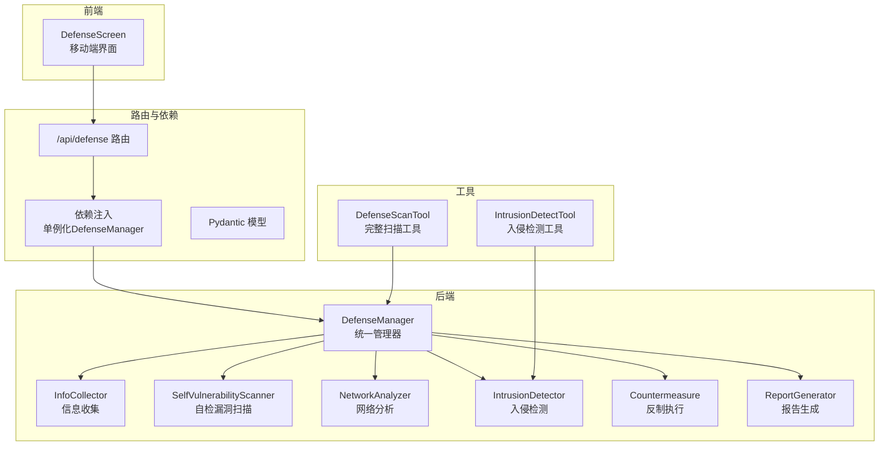
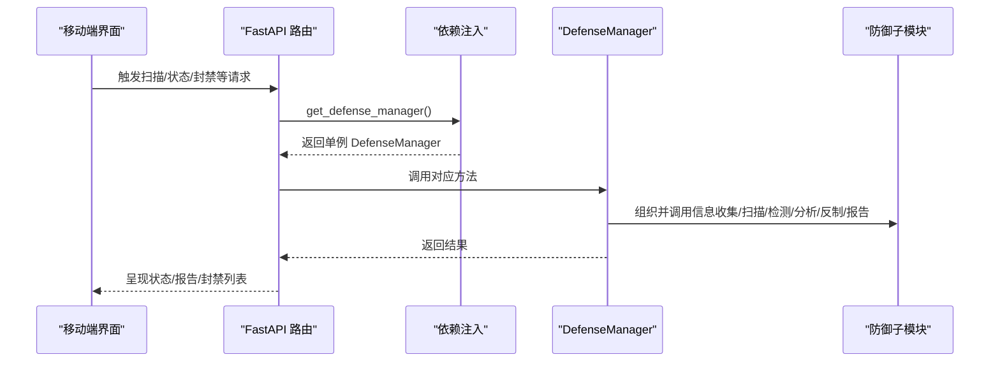
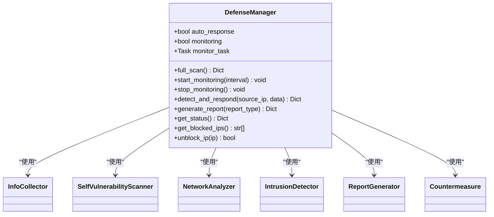
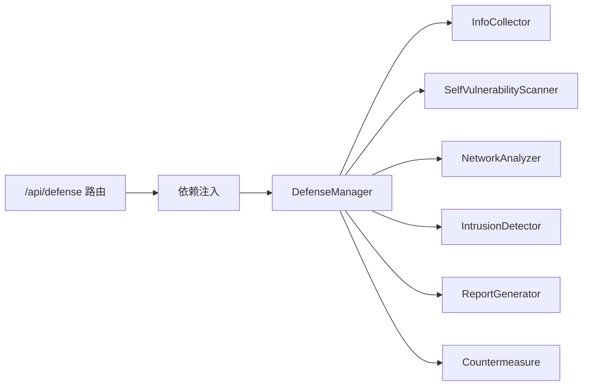

# 防护措施与响应

<cite>
**本文引用的文件**
- [defense/__init__.py](file://defense/__init__.py)
- [defense/defense_manager.py](file://defense/defense_manager.py)
- [defense/countermeasure.py](file://defense/countermeasure.py)
- [defense/intrusion_detector.py](file://defense/intrusion_detector.py)
- [defense/vulnerability_scanner.py](file://defense/vulnerability_scanner.py)
- [defense/info_collector.py](file://defense/info_collector.py)
- [defense/network_analyzer.py](file://defense/network_analyzer.py)
- [defense/report_generator.py](file://defense/report_generator.py)
- [router/defense.py](file://router/defense.py)
- [router/dependencies.py](file://router/dependencies.py)
- [router/schemas.py](file://router/schemas.py)
- [app/src/screens/DefenseScreen.tsx](file://app/src/screens/DefenseScreen.tsx)
- [tools/defense/defense_scan_tool.py](file://tools/defense/defense_scan_tool.py)
- [tools/defense/intrusion_detect_tool.py](file://tools/defense/intrusion_detect_tool.py)
</cite>

## 目录
1. [简介](#简介)
2. [项目结构](#项目结构)
3. [核心组件](#核心组件)
4. [架构总览](#架构总览)
5. [详细组件分析](#详细组件分析)
6. [依赖关系分析](#依赖关系分析)
7. [性能考量](#性能考量)
8. [故障排查指南](#故障排查指南)
9. [结论](#结论)
10. [附录](#附录)

## 简介
本章节面向Secbot的“防护措施与响应”能力，系统性阐述其“自动响应策略、手动干预流程、应急处置预案”的设计与实现。文档覆盖从信息采集、漏洞扫描、入侵检测、网络分析到反制执行与报告生成的完整闭环，并提供配置与管理方法、不同威胁场景下的响应策略与最佳实践，帮助用户建立快速有效的安全响应体系。

## 项目结构
围绕“防御”主题，Secbot在Python后端的defense目录下实现了统一的防御管理器与各功能模块；在FastAPI路由层提供REST接口；在移动端TUI前端提供可视化界面；在工具层提供可被智能体调用的扫描与检测工具。

图表来源
- [defense/defense_manager.py](file://defense/defense_manager.py#L17-L160)
- [router/defense.py](file://router/defense.py#L19-L96)
- [router/dependencies.py](file://router/dependencies.py#L109-L114)
- [app/src/screens/DefenseScreen.tsx](file://app/src/screens/DefenseScreen.tsx#L28-L184)
- [tools/defense/defense_scan_tool.py](file://tools/defense/defense_scan_tool.py#L6-L52)
- [tools/defense/intrusion_detect_tool.py](file://tools/defense/intrusion_detect_tool.py#L6-L65)

章节来源
- [defense/__init__.py](file://defense/__init__.py#L1-L21)
- [router/defense.py](file://router/defense.py#L1-L96)
- [router/dependencies.py](file://router/dependencies.py#L109-L114)
- [app/src/screens/DefenseScreen.tsx](file://app/src/screens/DefenseScreen.tsx#L28-L184)
- [tools/defense/defense_scan_tool.py](file://tools/defense/defense_scan_tool.py#L6-L52)
- [tools/defense/intrusion_detect_tool.py](file://tools/defense/intrusion_detect_tool.py#L6-L65)

## 核心组件
- 防御管理器：统一编排信息收集、漏洞扫描、网络分析、入侵检测、报告生成与反制执行。
- 信息收集：系统、网络、进程、开放端口、用户等多维信息采集。
- 自检漏洞扫描：系统更新、弱密码策略、不必要服务、文件权限、开放不安全端口、防火墙状态、SSH配置等。
- 网络分析：连接状态与分布、监听端口、可疑连接与异常流量检测。
- 入侵检测：基于正则与统计的攻击识别（端口扫描、暴力破解、SQL注入、XSS、DoS、恶意软件）。
- 反制执行：封禁IP、速率限制、关闭连接、告警通知、自动响应策略。
- 报告生成：漏洞报告、攻击报告、综合安全报告与推荐建议。
- 路由与依赖：提供REST接口、单例化防御管理器、前端交互。
- 工具：可被智能体调用的扫描与检测工具。

章节来源
- [defense/defense_manager.py](file://defense/defense_manager.py#L17-L160)
- [defense/info_collector.py](file://defense/info_collector.py#L23-L250)
- [defense/vulnerability_scanner.py](file://defense/vulnerability_scanner.py#L12-L314)
- [defense/network_analyzer.py](file://defense/network_analyzer.py#L12-L226)
- [defense/intrusion_detector.py](file://defense/intrusion_detector.py#L11-L235)
- [defense/countermeasure.py](file://defense/countermeasure.py#L11-L235)
- [defense/report_generator.py](file://defense/report_generator.py#L11-L290)
- [router/defense.py](file://router/defense.py#L19-L96)
- [router/dependencies.py](file://router/dependencies.py#L109-L114)
- [tools/defense/defense_scan_tool.py](file://tools/defense/defense_scan_tool.py#L6-L52)
- [tools/defense/intrusion_detect_tool.py](file://tools/defense/intrusion_detect_tool.py#L6-L65)

## 架构总览
下图展示从路由到管理器、再到各防御子模块的调用链路，以及前端如何通过路由与管理器交互。

图表来源
- [router/defense.py](file://router/defense.py#L22-L96)
- [router/dependencies.py](file://router/dependencies.py#L176-L177)
- [defense/defense_manager.py](file://defense/defense_manager.py#L34-L160)

章节来源
- [router/defense.py](file://router/defense.py#L19-L96)
- [router/dependencies.py](file://router/dependencies.py#L109-L114)
- [defense/defense_manager.py](file://defense/defense_manager.py#L17-L160)

## 详细组件分析

### 防御管理器（DefenseManager）
- 职责：统一编排信息收集、漏洞扫描、网络分析、入侵检测、报告生成与反制执行；支持实时监控与自动响应开关。
- 关键流程：
  - 完整扫描：依次执行信息收集、漏洞扫描、网络分析、入侵检测，生成综合报告。
  - 实时监控：周期性分析连接与流量，检测可疑行为并触发自动反制。
  - 手动干预：提供封禁/解封、状态查询、报告生成等接口。
- 状态与指标：监控状态、自动响应开关、封禁IP数、漏洞数、检测攻击数、恶意IP数、统计信息。

图表来源
- [defense/defense_manager.py](file://defense/defense_manager.py#L17-L160)

章节来源
- [defense/defense_manager.py](file://defense/defense_manager.py#L17-L160)

### 信息收集（InfoCollector）
- 功能：系统信息、网络接口与连接、进程、开放端口、用户信息等。
- 设计要点：逐项采集并容错，避免单点异常影响整体；限制返回数量以控制开销。

章节来源
- [defense/info_collector.py](file://defense/info_collector.py#L23-L250)

### 自检漏洞扫描（SelfVulnerabilityScanner）
- 功能：系统更新、弱密码策略、不必要服务、文件权限、开放不安全端口、防火墙状态、SSH配置等。
- 设计要点：跨平台命令调用与解析；对关键文件权限进行检查；对常见不安全端口进行识别与建议。

章节来源
- [defense/vulnerability_scanner.py](file://defense/vulnerability_scanner.py#L12-L314)

### 网络分析（NetworkAnalyzer）
- 功能：连接分析（状态、远端IP、端口分布）、监听端口、可疑连接检测、流量统计与异常检测。
- 设计要点：基于阈值与已知特征识别可疑行为；提供连接与流量摘要。

章节来源
- [defense/network_analyzer.py](file://defense/network_analyzer.py#L12-L226)

### 入侵检测（IntrusionDetector）
- 功能：基于正则的攻击模式识别（端口扫描、暴力破解、SQL注入、XSS、DoS、恶意软件）；统计攻击次数、维护IP信誉；提供近期攻击列表与统计。
- 设计要点：攻击类型与严重度映射；IP信誉随时间衰减与升级；支持按时间窗口统计。

章节来源
- [defense/intrusion_detector.py](file://defense/intrusion_detector.py#L11-L235)

### 反制执行（Countermeasure）
- 功能：封禁IP、解封IP、速率限制、关闭连接、告警通知；根据攻击类型与严重度自动选择反制策略。
- 设计要点：跨平台（Windows/类Unix）规则下发；记录反制历史；支持查询被封禁IP列表与历史记录。

章节来源
- [defense/countermeasure.py](file://defense/countermeasure.py#L11-L235)

### 报告生成（ReportGenerator）
- 功能：生成综合安全报告、漏洞报告、攻击报告；包含摘要、统计、推荐建议；支持JSON与文本导出。
- 设计要点：风险等级计算；推荐建议基于漏洞与攻击类型聚合。

章节来源
- [defense/report_generator.py](file://defense/report_generator.py#L11-L290)

### 路由与依赖（/api/defense）
- 功能：提供扫描、状态查询、封禁列表、解封、报告生成等接口；通过依赖注入获取单例化的DefenseManager。
- 设计要点：Pydantic模型定义请求/响应；错误处理与HTTP异常转换。

章节来源
- [router/defense.py](file://router/defense.py#L19-L96)
- [router/dependencies.py](file://router/dependencies.py#L176-L177)
- [router/schemas.py](file://router/schemas.py#L166-L197)

### 前端界面（DefenseScreen）
- 功能：执行扫描、刷新状态、查看封禁IP、解封操作；与后端路由交互。
- 设计要点：状态卡片展示关键指标；解封按钮触发后端unblock接口。

章节来源
- [app/src/screens/DefenseScreen.tsx](file://app/src/screens/DefenseScreen.tsx#L28-L184)

### 工具（DefenseScanTool / IntrusionDetectTool）
- 功能：为智能体提供“完整扫描”和“入侵检测”的可调用工具；自动裁剪结果以避免过大。
- 设计要点：低敏感度工具；参数化执行；返回结构化结果。

章节来源
- [tools/defense/defense_scan_tool.py](file://tools/defense/defense_scan_tool.py#L6-L52)
- [tools/defense/intrusion_detect_tool.py](file://tools/defense/intrusion_detect_tool.py#L6-L65)

## 依赖关系分析
- 组件耦合：DefenseManager聚合各子模块，形成高内聚、低耦合的统一入口；子模块职责单一，便于扩展与替换。
- 外部依赖：跨平台命令（Windows netsh/advfirewall、Linux iptables/ufw/psutil）、系统信息采集（psutil、subprocess）。
- 接口契约：路由层通过依赖注入获取单例DefenseManager，保证全局一致性与资源复用。

图表来源
- [router/defense.py](file://router/defense.py#L19-L96)
- [router/dependencies.py](file://router/dependencies.py#L109-L114)
- [defense/defense_manager.py](file://defense/defense_manager.py#L17-L160)

章节来源
- [router/dependencies.py](file://router/dependencies.py#L109-L114)
- [router/defense.py](file://router/defense.py#L19-L96)
- [defense/defense_manager.py](file://defense/defense_manager.py#L17-L160)

## 性能考量
- 采样与限制：信息收集与网络连接列表均限制返回数量，避免大体量数据影响性能。
- 异步监控：监控循环采用异步等待与异常捕获，降低阻塞风险。
- 跨平台命令超时：对外部命令设置超时，防止阻塞与资源占用。
- 建议：在高并发场景下，可考虑将扫描任务队列化、缓存热点统计、优化正则匹配与阈值判断。

## 故障排查指南
- 封禁/解封失败：检查平台命令（Windows防火墙规则、Linux iptables）是否可用，确认权限与超时设置。
- 扫描无结果：确认跨平台命令可用性（如Windows更新查询、Linux包管理器），检查子进程返回与异常日志。
- 监控不生效：检查监控开关状态、异常捕获与循环间隔；确认网络连接与IO统计接口可用。
- 报告生成异常：检查报告字段完整性与文件写入权限；确认输出格式支持。
- 前端无法解封：核对路由unblock接口返回与错误信息；确认IP格式与封禁状态。

章节来源
- [defense/countermeasure.py](file://defense/countermeasure.py#L24-L96)
- [defense/vulnerability_scanner.py](file://defense/vulnerability_scanner.py#L95-L120)
- [router/defense.py](file://router/defense.py#L63-L74)
- [app/src/screens/DefenseScreen.tsx](file://app/src/screens/DefenseScreen.tsx#L55-L62)

## 结论
Secbot的“防护措施与响应”体系以DefenseManager为核心，串联信息收集、漏洞扫描、网络分析、入侵检测与反制执行，配合报告生成与REST接口，形成可配置、可观测、可干预的闭环。通过自动响应策略与手动干预流程，用户可在不同威胁场景下快速定位风险、采取行动并持续评估效果，构建稳健的安全响应体系。

## 附录

### 配置与管理方法
- 自动响应开关：通过DefenseManager构造参数控制；路由层提供状态查询与切换能力。
- 执行条件配置：反制策略依据攻击类型与严重度自动选择；网络分析与入侵检测的阈值可按需调整。
- 效果评估：通过报告生成模块的风险等级、统计信息与推荐建议进行评估；结合封禁IP与攻击趋势分析。

章节来源
- [defense/defense_manager.py](file://defense/defense_manager.py#L20-L32)
- [defense/countermeasure.py](file://defense/countermeasure.py#L185-L223)
- [defense/network_analyzer.py](file://defense/network_analyzer.py#L101-L146)
- [defense/intrusion_detector.py](file://defense/intrusion_detector.py#L161-L182)
- [defense/report_generator.py](file://defense/report_generator.py#L168-L182)

### 不同威胁场景下的响应策略与最佳实践
- 端口扫描：识别可疑端口连接与异常外联，必要时关闭连接或封禁IP；结合速率限制与告警。
- 暴力破解：高严重度场景直接封禁IP；结合账户锁定与双因子认证；记录攻击者统计。
- DoS/DDoS：速率限制与告警；必要时封禁来源IP；结合流量异常检测。
- SQL注入/XSS：基于检测结果强化输入校验与输出编码；提升WAF策略。
- 恶意软件：封禁来源IP并关闭相关连接；检查系统与网络配置，加固SSH与防火墙。

章节来源
- [defense/intrusion_detector.py](file://defense/intrusion_detector.py#L15-L50)
- [defense/countermeasure.py](file://defense/countermeasure.py#L185-L223)
- [defense/network_analyzer.py](file://defense/network_analyzer.py#L101-L146)
- [defense/report_generator.py](file://defense/report_generator.py#L223-L244)