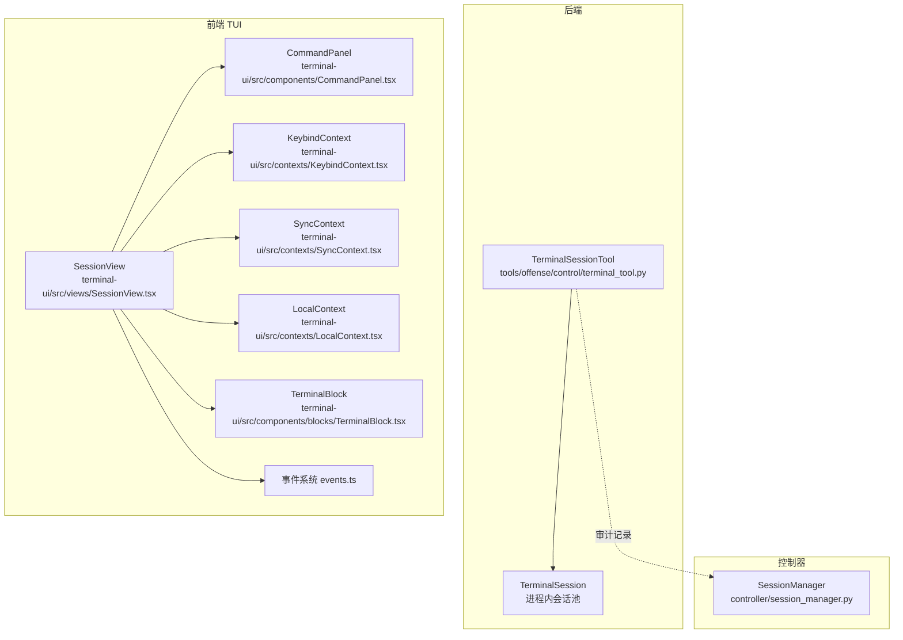
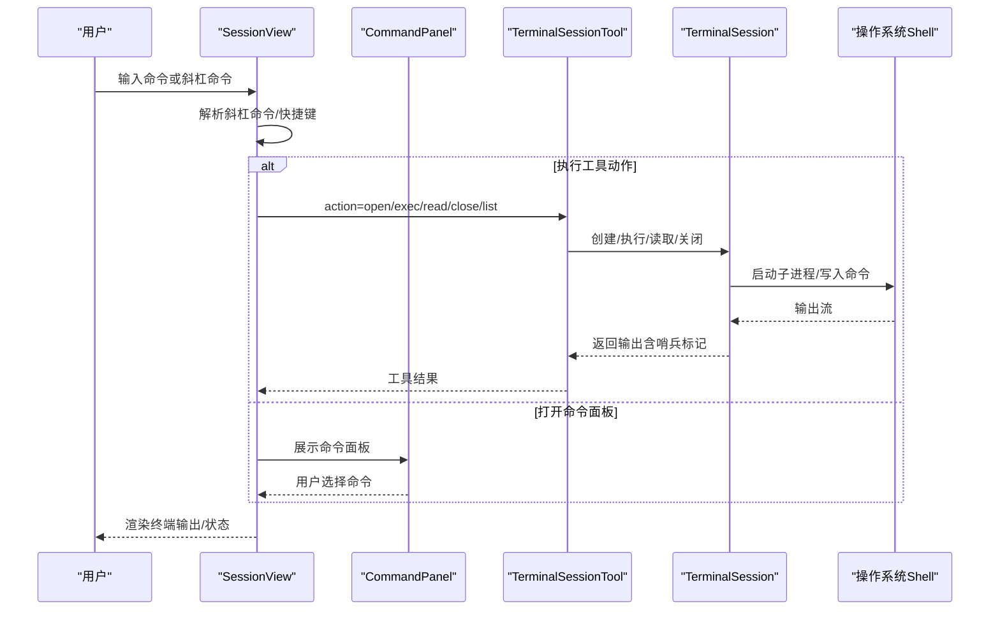
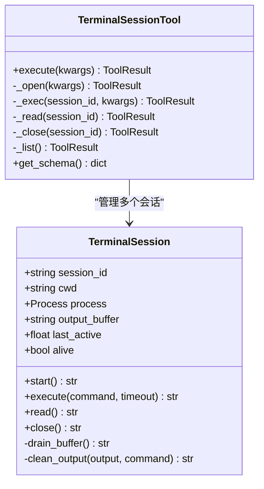
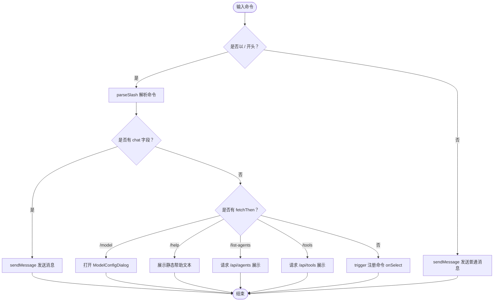
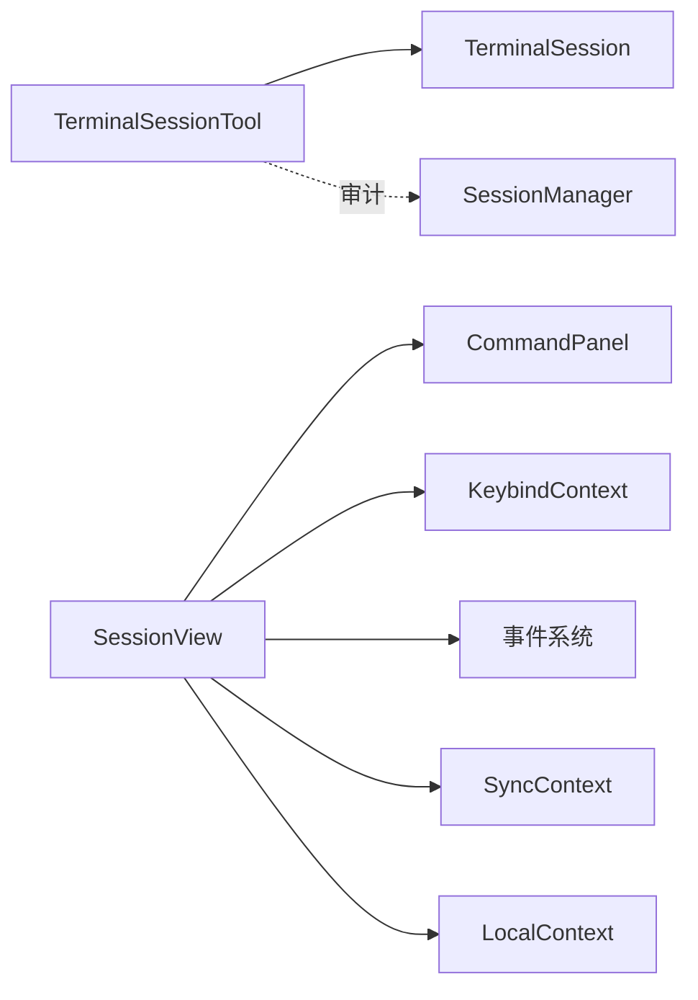

# 持久化终端会话

<cite>
**本文引用的文件**
- [terminal_tool.py](file://tools/offense/control/terminal_tool.py)
- [SessionView.tsx](file://terminal-ui/src/views/SessionView.tsx)
- [TerminalBlock.tsx](file://terminal-ui/src/components/blocks/TerminalBlock.tsx)
- [events.ts](file://terminal-ui/src/events.ts)
- [KeybindContext.tsx](file://terminal-ui/src/contexts/KeybindContext.tsx)
- [CommandContext.tsx](file://terminal-ui/src/contexts/CommandContext.tsx)
- [CommandPanel.tsx](file://terminal-ui/src/components/CommandPanel.tsx)
- [slash.ts](file://terminal-ui/src/slash.ts)
- [ThemeContext.tsx](file://terminal-ui/src/contexts/ThemeContext.tsx)
- [SyncContext.tsx](file://terminal-ui/src/contexts/SyncContext.tsx)
- [LocalContext.tsx](file://terminal-ui/src/contexts/LocalContext.tsx)
- [config.ts](file://terminal-ui/src/config.ts)
- [session_manager.py](file://controller/session_manager.py)
- [SKILL.md](file://skills/base/terminal-session/SKILL.md)
</cite>

## 目录
1. [简介](#简介)
2. [项目结构](#项目结构)
3. [核心组件](#核心组件)
4. [架构总览](#架构总览)
5. [组件详解](#组件详解)
6. [依赖关系分析](#依赖关系分析)
7. [性能与并发特性](#性能与并发特性)
8. [故障排查指南](#故障排查指南)
9. [结论](#结论)
10. [附录：使用指南与配置](#附录使用指南与配置)

## 简介
本篇文档围绕 Secbot 的“持久化终端会话”能力进行系统性梳理，涵盖后端会话管理与命令执行、前端 TUI 交互与事件体系、以及会话状态与 UI 的协同机制。重点包括：
- 会话状态管理：工作目录、环境变量、命令历史与输出缓冲的维持
- 命令执行与输出解析：基于 sentinel 的输出边界检测与清理
- 系统信息收集：结合系统命令与工具链进行安全评估
- 终端 UI 组件：会话视图、命令面板、快捷键绑定与主题定制
- 会话持久化与恢复：进程内会话池、空闲回收与并发控制
- 使用指南：快捷键、斜杠命令、主题与配置

## 项目结构
与“持久化终端会话”直接相关的代码分布在以下位置：
- 后端工具层：tools/offense/control/terminal_tool.py（会话生命周期、命令执行、输出缓冲）
- 前端 TUI：terminal-ui/src 下的视图、上下文、组件与事件系统
- 控制器会话管理：controller/session_manager.py（通用会话状态与审计）
- 技能文档：skills/base/terminal-session/SKILL.md（动作与参数规范）

**图表来源**
- [terminal_tool.py](file://tools/offense/control/terminal_tool.py#L225-L455)
- [SessionView.tsx](file://terminal-ui/src/views/SessionView.tsx#L1-L474)
- [CommandPanel.tsx](file://terminal-ui/src/components/CommandPanel.tsx#L1-L92)
- [KeybindContext.tsx](file://terminal-ui/src/contexts/KeybindContext.tsx#L1-L136)
- [SyncContext.tsx](file://terminal-ui/src/contexts/SyncContext.tsx#L1-L45)
- [LocalContext.tsx](file://terminal-ui/src/contexts/LocalContext.tsx#L1-L33)
- [TerminalBlock.tsx](file://terminal-ui/src/components/blocks/TerminalBlock.tsx#L1-L28)
- [events.ts](file://terminal-ui/src/events.ts#L1-L91)
- [session_manager.py](file://controller/session_manager.py#L1-L74)

**章节来源**
- [terminal_tool.py](file://tools/offense/control/terminal_tool.py#L1-L455)
- [SessionView.tsx](file://terminal-ui/src/views/SessionView.tsx#L1-L474)
- [CommandPanel.tsx](file://terminal-ui/src/components/CommandPanel.tsx#L1-L92)
- [KeybindContext.tsx](file://terminal-ui/src/contexts/KeybindContext.tsx#L1-L136)
- [SyncContext.tsx](file://terminal-ui/src/contexts/SyncContext.tsx#L1-L45)
- [LocalContext.tsx](file://terminal-ui/src/contexts/LocalContext.tsx#L1-L33)
- [TerminalBlock.tsx](file://terminal-ui/src/components/blocks/TerminalBlock.tsx#L1-L28)
- [events.ts](file://terminal-ui/src/events.ts#L1-L91)
- [session_manager.py](file://controller/session_manager.py#L1-L74)

## 核心组件
- 后端会话工具：TerminalSessionTool 提供 open/exec/read/close/list 动作，内部维护 TerminalSession 进程与输出缓冲
- 前端会话视图：SessionView 负责渲染消息流、输入与状态栏，处理键盘与斜杠命令
- 命令系统：CommandContext/CommandPanel 提供命令注册、过滤与选择
- 快捷键系统：KeybindContext 定义与匹配键位，支持覆盖
- 事件系统：events.ts 提供类型安全的事件总线
- 主题系统：ThemeContext 提供赛博朋克风格主题
- 同步与本地状态：SyncContext/LocalContext 管理流式状态与 UI 模式
- 控制器会话管理：SessionManager 记录命令执行与文件传输等审计信息

**章节来源**
- [terminal_tool.py](file://tools/offense/control/terminal_tool.py#L225-L455)
- [SessionView.tsx](file://terminal-ui/src/views/SessionView.tsx#L1-L474)
- [CommandContext.tsx](file://terminal-ui/src/contexts/CommandContext.tsx#L1-L50)
- [CommandPanel.tsx](file://terminal-ui/src/components/CommandPanel.tsx#L1-L92)
- [KeybindContext.tsx](file://terminal-ui/src/contexts/KeybindContext.tsx#L1-L136)
- [events.ts](file://terminal-ui/src/events.ts#L1-L91)
- [ThemeContext.tsx](file://terminal-ui/src/contexts/ThemeContext.tsx#L1-L59)
- [SyncContext.tsx](file://terminal-ui/src/contexts/SyncContext.tsx#L1-L45)
- [LocalContext.tsx](file://terminal-ui/src/contexts/LocalContext.tsx#L1-L33)
- [session_manager.py](file://controller/session_manager.py#L1-L74)

## 架构总览
后端通过 TerminalSessionTool 管理持久化会话，前端通过 SessionView 与命令系统进行交互，事件系统贯穿前后端通信。

**图表来源**
- [terminal_tool.py](file://tools/offense/control/terminal_tool.py#L225-L455)
- [SessionView.tsx](file://terminal-ui/src/views/SessionView.tsx#L228-L373)
- [CommandPanel.tsx](file://terminal-ui/src/components/CommandPanel.tsx#L1-L92)

## 组件详解

### 后端：TerminalSession 与 TerminalSessionTool
- 会话生命周期：start 启动子进程，后台读取 stdout 至缓冲；execute 通过哨兵标记判断命令完成；close 正确终止子进程
- 并发控制：每个会话内部使用 asyncio.Lock 串行化命令写入，避免竞态
- 空闲回收：定期清理 last_active 超过阈值或已非存活的会话
- 输出缓冲：限制最大长度，超出时仅保留尾部，防止内存膨胀
- 动作接口：open/exec/read/close/list，参数与错误处理清晰

**图表来源**
- [terminal_tool.py](file://tools/offense/control/terminal_tool.py#L26-L219)
- [terminal_tool.py](file://tools/offense/control/terminal_tool.py#L225-L455)

**章节来源**
- [terminal_tool.py](file://tools/offense/control/terminal_tool.py#L26-L219)
- [terminal_tool.py](file://tools/offense/control/terminal_tool.py#L225-L455)

### 前端：SessionView 与命令系统
- SessionView 负责：
  - 渲染消息流与终端块
  - 处理键盘输入与快捷键（翻页、滚动、展开块等）
  - 解析斜杠命令（/ask、/task、/agent、/help、/list-agents、/tools、/model 等）
  - 与后端通过 SyncContext/LocalContext 协同
- CommandPanel 提供命令过滤与选择，支持模糊搜索与分类展示
- KeybindContext 提供键位匹配与标签打印，支持覆盖默认键位
- TerminalBlock 以等宽字体渲染终端输出，适配主题

**图表来源**
- [SessionView.tsx](file://terminal-ui/src/views/SessionView.tsx#L297-L373)
- [slash.ts](file://terminal-ui/src/slash.ts#L42-L144)
- [CommandPanel.tsx](file://terminal-ui/src/components/CommandPanel.tsx#L1-L92)

**章节来源**
- [SessionView.tsx](file://terminal-ui/src/views/SessionView.tsx#L1-L474)
- [CommandContext.tsx](file://terminal-ui/src/contexts/CommandContext.tsx#L1-L50)
- [CommandPanel.tsx](file://terminal-ui/src/components/CommandPanel.tsx#L1-L92)
- [KeybindContext.tsx](file://terminal-ui/src/contexts/KeybindContext.tsx#L1-L136)
- [slash.ts](file://terminal-ui/src/slash.ts#L1-L165)
- [TerminalBlock.tsx](file://terminal-ui/src/components/blocks/TerminalBlock.tsx#L1-L28)

### 事件系统与主题
- 事件系统：events.ts 定义类型安全事件（如 tui.command.execute、tui.toast.show），提供 on/emit 接口
- 主题系统：ThemeContext 提供赛博朋克风格配色方案，支持覆盖默认主题

**章节来源**
- [events.ts](file://terminal-ui/src/events.ts#L1-L91)
- [ThemeContext.tsx](file://terminal-ui/src/contexts/ThemeContext.tsx#L1-L59)

### 控制器会话管理
- SessionManager 记录会话创建、最后活动时间、命令执行历史与文件传输记录，便于审计与复盘

**章节来源**
- [session_manager.py](file://controller/session_manager.py#L1-L74)

## 依赖关系分析
- 后端 TerminalSessionTool 依赖 Python 异步子进程与锁，确保命令执行的原子性与输出稳定性
- 前端 SessionView 依赖命令系统、快捷键系统、事件系统与上下文，形成解耦的交互层
- 控制器 SessionManager 作为外部审计存储，与后端工具层通过会话 ID 关联

**图表来源**
- [terminal_tool.py](file://tools/offense/control/terminal_tool.py#L225-L455)
- [SessionView.tsx](file://terminal-ui/src/views/SessionView.tsx#L1-L474)
- [CommandPanel.tsx](file://terminal-ui/src/components/CommandPanel.tsx#L1-L92)
- [KeybindContext.tsx](file://terminal-ui/src/contexts/KeybindContext.tsx#L1-L136)
- [events.ts](file://terminal-ui/src/events.ts#L1-L91)
- [SyncContext.tsx](file://terminal-ui/src/contexts/SyncContext.tsx#L1-L45)
- [LocalContext.tsx](file://terminal-ui/src/contexts/LocalContext.tsx#L1-L33)
- [session_manager.py](file://controller/session_manager.py#L1-L74)

## 性能与并发特性
- 并发控制：TerminalSession 内部使用 asyncio.Lock 串行化命令写入，避免输出交错
- 输出缓冲上限：超过阈值仅保留尾部，降低内存占用
- 空闲回收：定期清理长时间未活跃或已退出的会话，释放资源
- 前端渲染优化：SessionView 使用滚动偏移与块索引，按需渲染，减少重绘
- 哨兵标记：通过统一的输出边界检测，避免轮询等待，提升响应速度

**章节来源**
- [terminal_tool.py](file://tools/offense/control/terminal_tool.py#L96-L131)
- [terminal_tool.py](file://tools/offense/control/terminal_tool.py#L208-L219)
- [SessionView.tsx](file://terminal-ui/src/views/SessionView.tsx#L120-L151)

## 故障排查指南
- 会话未启动或已关闭
  - 现象：执行命令时报错“会话不存在或已关闭”
  - 排查：先执行 open 获取 session_id，或使用 list 查看活跃会话
- 命令无输出或卡住
  - 现象：长时间无响应
  - 排查：检查 timeout 设置；使用 read 读取当前缓冲；确认后端 Shell 可用
- 输出包含哨兵标记
  - 现象：输出末尾出现特殊标记
  - 排查：属正常行为，工具已自动清理；如仍可见，请检查平台差异（Windows/CMD 与类 Unix）
- 会话泄漏或资源占用过高
  - 现象：内存增长或句柄未释放
  - 排查：确认空闲回收策略是否生效；手动 close 会话；检查子进程是否异常退出
- 前端命令面板无响应
  - 现象：输入过滤无效或选择无反应
  - 排查：检查 CommandContext 注册命令是否正确；确认 KeybindContext 键位冲突

**章节来源**
- [terminal_tool.py](file://tools/offense/control/terminal_tool.py#L304-L351)
- [terminal_tool.py](file://tools/offense/control/terminal_tool.py#L357-L377)
- [terminal_tool.py](file://tools/offense/control/terminal_tool.py#L383-L395)
- [CommandPanel.tsx](file://terminal-ui/src/components/CommandPanel.tsx#L1-L92)
- [KeybindContext.tsx](file://terminal-ui/src/contexts/KeybindContext.tsx#L1-L136)

## 结论
持久化终端会话在 Secbot 中通过“后端进程会话 + 前端交互视图”的双层架构实现，既保证了命令执行的连续性与可观测性，又提供了丰富的 UI 交互与可扩展的命令体系。通过哨兵标记与缓冲管理，系统在性能与可靠性之间取得平衡；通过上下文与事件系统，前端交互具备良好的可维护性与可扩展性。

## 附录：使用指南与配置

### 会话动作与参数
- open：创建新会话，可选 cwd 指定工作目录
- exec：在指定会话执行命令，支持 timeout
- read：读取当前会话输出缓冲（不发送命令）
- close：关闭指定会话
- list：列出当前活跃会话

参考技能文档中的动作定义与参数说明。

**章节来源**
- [SKILL.md](file://skills/base/terminal-session/SKILL.md#L23-L78)
- [terminal_tool.py](file://tools/offense/control/terminal_tool.py#L422-L454)

### 快捷键与命令面板
- 快捷键：支持翻页、滚动、展开块、切换滚动条等
- 命令面板：支持模糊搜索、分类展示与键位标注
- 斜杠命令：/ask、/task、/agent、/help、/list-agents、/tools、/model 等

**章节来源**
- [KeybindContext.tsx](file://terminal-ui/src/contexts/KeybindContext.tsx#L27-L42)
- [CommandPanel.tsx](file://terminal-ui/src/components/CommandPanel.tsx#L1-L92)
- [slash.ts](file://terminal-ui/src/slash.ts#L42-L144)
- [SessionView.tsx](file://terminal-ui/src/views/SessionView.tsx#L228-L373)

### 主题定制
- 默认主题采用赛博朋克风格（主色绿 + 霓虹七彩）
- 可通过 ThemeProvider 覆盖默认配色

**章节来源**
- [ThemeContext.tsx](file://terminal-ui/src/contexts/ThemeContext.tsx#L22-L37)

### 后端配置与连接
- 后端地址可通过环境变量或默认值配置
- 启动前可检查后端可达性

**章节来源**
- [config.ts](file://terminal-ui/src/config.ts#L6-L27)