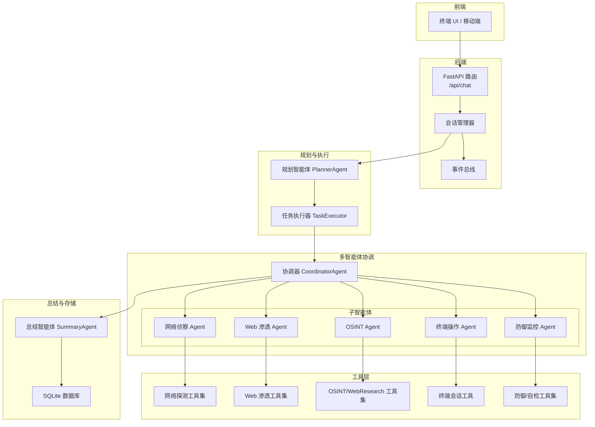
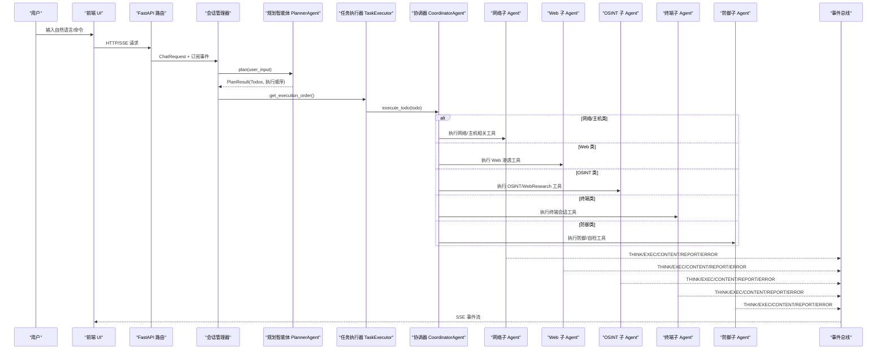
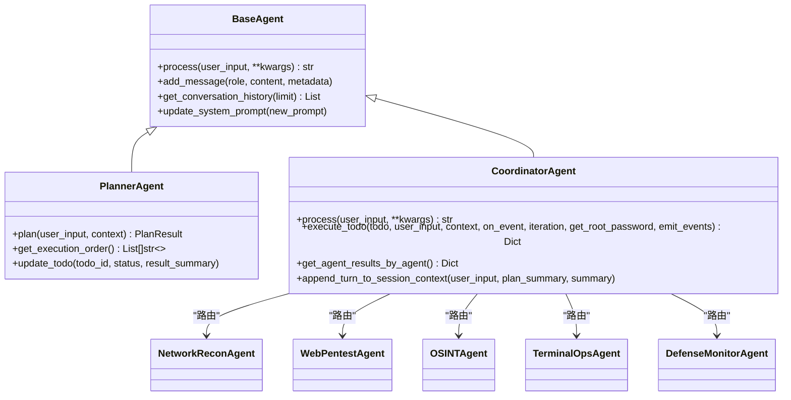
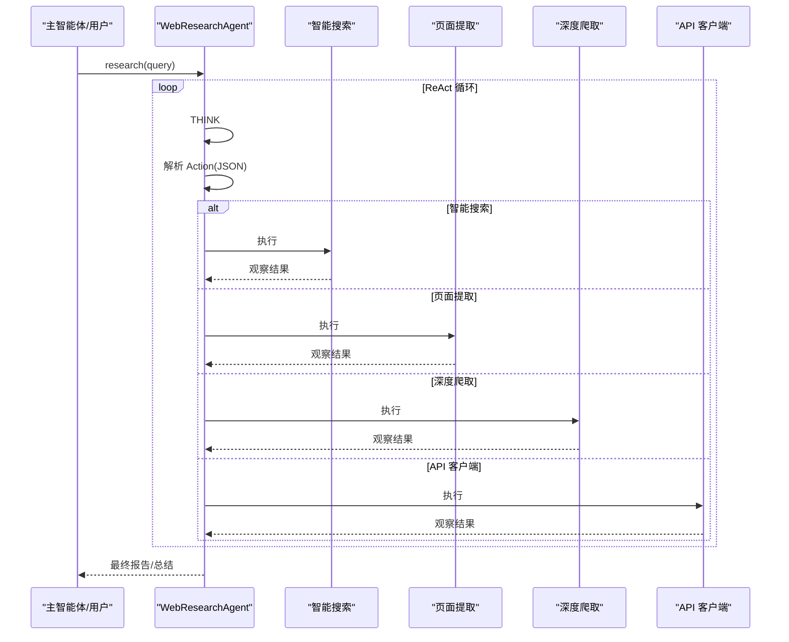
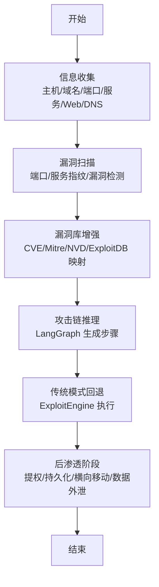
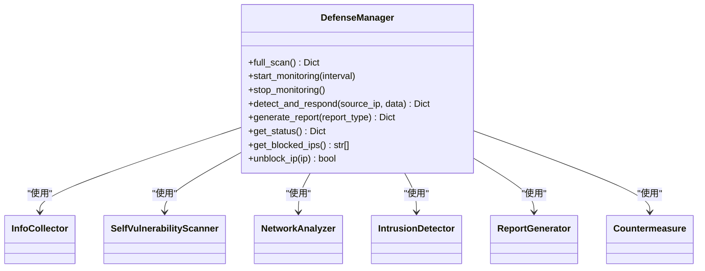
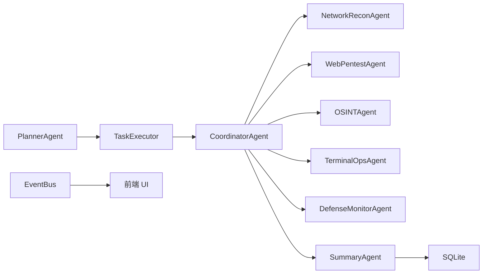

# 核心功能特性

<cite>
**本文引用的文件**
- [README_EN.md](file://README_EN.md)
- [README_CN.md](file://README_CN.md)
- [main.py](file://main.py)
- [hackbot/cli.py](file://hackbot/cli.py)
- [core/agents/base.py](file://core/agents/base.py)
- [core/agents/planner_agent.py](file://core/agents/planner_agent.py)
- [core/agents/coordinator_agent.py](file://core/agents/coordinator_agent.py)
- [core/agents/web_research_agent.py](file://core/agents/web_research_agent.py)
- [core/attack_chain/attack_chain.py](file://core/attack_chain/attack_chain.py)
- [core/attack_chain/reconnaissance.py](file://core/attack_chain/reconnaissance.py)
- [core/attack_chain/exploitation.py](file://core/attack_chain/exploitation.py)
- [defense/defense_manager.py](file://defense/defense_manager.py)
</cite>

## 目录
1. [引言](#引言)
2. [项目结构](#项目结构)
3. [核心组件](#核心组件)
4. [架构总览](#架构总览)
5. [详细组件分析](#详细组件分析)
6. [依赖分析](#依赖分析)
7. [性能考量](#性能考量)
8. [故障排查指南](#故障排查指南)
9. [结论](#结论)
10. [附录](#附录)

## 引言
本文件系统化梳理 Secbot 的核心功能特性，围绕多智能体模式（ReAct、Plan-Execute、多智能体协作）、AI Web 研究能力、自动化渗透测试流程、安全与防御功能展开，结合项目 README 与源码，解释各模块职责、协同关系、工作流程、技术实现要点与优势对比，并提供使用限制与最佳实践建议。

## 项目结构
Secbot 采用前后端分离与多智能体编排架构：前端（TUI/移动端）通过 HTTP/SSE 与后端 FastAPI 路由通信；后端以会话为中心，通过 PlannerAgent 生成结构化 Todo，TaskExecutor 按层并发执行，CoordinatorAgent 将具体 Todo 路由至网络/Web/OSINT/终端/防御等子 Agent；事件总线将 ReAct 思考/执行/内容/报告/错误事件以 SSE 推送至前端渲染。

图表来源
- [README_CN.md](file://README_CN.md#L77-L152)
- [README_EN.md](file://README_EN.md#L77-L152)

章节来源
- [README_CN.md](file://README_CN.md#L67-L152)
- [README_EN.md](file://README_EN.md#L67-L152)

## 核心组件
- 多智能体模式与编排
  - PlannerAgent：结构化任务规划，生成 Todo 列表与执行顺序，支持资源/风险感知的分层并行。
  - CoordinatorAgent：多子 Agent 协调入口，按 agent_hint/resource/tool_hint 将 Todo 路由到网络/Web/OSINT/终端/防御子 Agent。
  - 子 Agent：继承安全 ReAct 模式，各自维护领域工具集与会话摘要，支持事件流与结果聚合。
  - SummaryAgent：多 Agent 结果汇总，输出结构化报告。
- AI Web 研究能力
  - WebResearchAgent：独立 ReAct 子智能体，提供智能搜索、页面提取、深度爬取、API 客户端等联网研究能力。
- 自动化渗透测试流程
  - AttackChain：整合信息收集、漏洞扫描、漏洞库增强、攻击链推理与漏洞利用、后渗透阶段，支持回退传统模式。
- 安全与防御
  - DefenseManager：统一管理信息采集、自检扫描、网络分析、入侵检测、报告生成与自动反制。

章节来源
- [README_CN.md](file://README_CN.md#L154-L271)
- [README_EN.md](file://README_EN.md#L154-L196)

## 架构总览
后端通过路由与会话编排，将用户请求转化为结构化 Todo，TaskExecutor 按层并发执行，CoordinatorAgent 将具体任务委派给子 Agent，事件总线以 SSE 推送 THINK/EXEC/CONTENT/REPORT/ERROR 等事件，前端据此渲染不同来源的智能体输出。

图表来源
- [README_CN.md](file://README_CN.md#L154-L271)
- [README_EN.md](file://README_EN.md#L154-L196)

章节来源
- [README_CN.md](file://README_CN.md#L154-L271)
- [README_EN.md](file://README_EN.md#L154-L196)

## 详细组件分析

### 多智能体模式与编排
- PlannerAgent
  - 职责：请求类型判定（问候/闲聊/非技术/技术），技术请求结构化为 Todo，支持依赖编排与资源/风险感知的分层并行。
  - 关键点：拓扑分层 + 资源/风险约束（同一资源高危步骤强制串行）+ 并发上限控制。
- CoordinatorAgent
  - 职责：对外暴露 hackbot；在分层执行模式下按 agent_hint/resource/tool_hint 路由到子 Agent；按 Agent 维度聚合工具结果。
  - 关键点：默认兼容旧有 hackbot 行为；并发锁保障串行语义；按 agent 聚合结果供 SummaryAgent。
- 子 Agent（网络/Web/OSINT/终端/防御）
  - 职责：窄而深的 ReAct 循环，各自工具集限定在领域内；维护会话摘要并在每轮结束同步。
- SummaryAgent
  - 职责：汇总 Planner 结果、ReAct 历史与各 Agent 聚合结果，输出结构化报告。

图表来源
- [core/agents/base.py](file://core/agents/base.py#L17-L125)
- [core/agents/planner_agent.py](file://core/agents/planner_agent.py#L20-L837)
- [core/agents/coordinator_agent.py](file://core/agents/coordinator_agent.py#L40-L335)

章节来源
- [core/agents/base.py](file://core/agents/base.py#L17-L125)
- [core/agents/planner_agent.py](file://core/agents/planner_agent.py#L20-L837)
- [core/agents/coordinator_agent.py](file://core/agents/coordinator_agent.py#L40-L335)

### AI Web 研究能力
- WebResearchAgent
  - 独立 ReAct 循环，工具集：智能搜索、页面提取、深度爬取、API 客户端。
  - 工作流：思考 → 解析 Action → 调用工具 → 观察 → 最终答案/总结。
  - 价值：在授权范围内自主完成联网信息收集与整理，减少人工干预。
- 使用场景
  - 信息收集：对目标域名/站点进行搜索、提取、爬取与 API 查询。
  - 外部情报：跨站关联、技术栈识别、威胁情报交叉验证。
- 技术实现要点
  - LLM 推理与工具调用解耦，结果格式化与 Final Answer 提取。
  - 与主智能体协作：可通过 WebResearchTool 委托或直接调用。

图表来源
- [core/agents/web_research_agent.py](file://core/agents/web_research_agent.py#L52-L372)

章节来源
- [core/agents/web_research_agent.py](file://core/agents/web_research_agent.py#L52-L372)
- [README_CN.md](file://README_CN.md#L52-L58)
- [README_EN.md](file://README_EN.md#L52-L58)

### 自动化渗透测试流程
- AttackChain
  - 阶段：信息收集 → 漏洞扫描 → 漏洞库增强 → 攻击链推理与漏洞利用 → 后渗透。
  - 回退：LangGraph 推理失败时回退到传统 ExploitEngine。
- 信息收集（Reconnaissance）
  - 主机名/IP 解析、端口扫描、服务识别、Web 信息、DNS 信息。
- 漏洞扫描与利用（Exploitation）
  - 基于扫描结果与漏洞库增强，生成攻击链并逐步执行；支持传统模式回退。
- 使用场景
  - 信息收集：主机/域名/端口/服务/Web 技术栈。
  - 漏洞扫描：端口/服务指纹识别与漏洞检测。
  - 漏洞利用：SQL 注入/XSS/命令注入/文件上传/路径遍历/SSRF 等。
  - 后渗透：权限提升、持久化、横向移动、数据外泄。
- 技术实现要点
  - 以 Scan → Enrich → Graph/Engine → Post-Exploit 的流水线串联工具链。
  - 与 Planner/Coordinator 协同：Todo 描述与资源/风险元数据驱动执行。

图表来源
- [core/attack_chain/attack_chain.py](file://core/attack_chain/attack_chain.py#L11-L213)
- [core/attack_chain/reconnaissance.py](file://core/attack_chain/reconnaissance.py#L11-L150)
- [core/attack_chain/exploitation.py](file://core/attack_chain/exploitation.py#L8-L36)

章节来源
- [README_CN.md](file://README_CN.md#L33-L42)
- [README_EN.md](file://README_EN.md#L33-L42)
- [core/attack_chain/attack_chain.py](file://core/attack_chain/attack_chain.py#L11-L213)
- [core/attack_chain/reconnaissance.py](file://core/attack_chain/reconnaissance.py#L11-L150)
- [core/attack_chain/exploitation.py](file://core/attack_chain/exploitation.py#L8-L36)

### 安全与防御功能
- DefenseManager
  - 能力：系统信息采集、自检扫描、网络分析、入侵检测、报告生成、自动反制。
  - 实时监控：周期性分析连接与流量，检测可疑行为并自动响应。
- 使用场景
  - 主动防御：信息收集、漏洞扫描、网络分析、入侵检测。
  - 安全报告：自动化详细安全分析报告。
  - 授权管理：管理对目标主机的合法授权。
  - 远程控制：在授权主机上执行远程命令与文件传输。
- 技术实现要点
  - 模块化设计：InfoCollector/VulnScanner/NetworkAnalyzer/IntrusionDetector/ReportGenerator/Countermeasure。
  - 状态与统计：监控状态、阻断 IP 数、漏洞数、攻击数、恶意 IP 信誉等。

图表来源
- [defense/defense_manager.py](file://defense/defense_manager.py#L17-L160)

章节来源
- [README_CN.md](file://README_CN.md#L44-L50)
- [README_EN.md](file://README_EN.md#L44-L50)
- [defense/defense_manager.py](file://defense/defense_manager.py#L17-L160)

## 依赖分析
- 组件耦合与协作
  - PlannerAgent 与 TaskExecutor：规划与执行解耦，前者负责结构化计划，后者负责分层并发执行。
  - CoordinatorAgent 与子 Agent：路由与执行解耦，Coordinator 负责调度与结果聚合。
  - 事件总线：统一事件格式与前端渲染标签，保证 UI 与后端一致性。
- 外部依赖与集成点
  - LLM 推理：Planner/Coordinator/WebResearch 等模块通过统一 LLM 创建函数接入。
  - 工具链：网络/Web/OSINT/终端/防御工具通过子 Agent 的工具字典注入。
  - 存储：SQLite 持久化会话、历史与配置。

图表来源
- [README_CN.md](file://README_CN.md#L154-L271)
- [README_EN.md](file://README_EN.md#L154-L196)

章节来源
- [README_CN.md](file://README_CN.md#L154-L271)
- [README_EN.md](file://README_EN.md#L154-L196)

## 性能考量
- 并发与吞吐
  - Planner 的分层并行执行在满足依赖与资源/风险约束的前提下最大化并发，避免系统过载。
  - TaskExecutor 层内并发与层间串行结合，保证事件顺序与前端展示一致性。
- LLM 调用与稳定性
  - Planner/WebResearch 使用统一 LLM 创建函数，支持超时与回退策略，降低单次调用失败影响。
- I/O 与工具链
  - 网络/Web/OSINT 工具链异步执行，结合超时与错误处理，避免阻塞主线程。
- 存储与事件流
  - SQLite 与事件总线解耦，事件流以 SSE 推送，前端按 agent 标签渲染，降低后端压力。

## 故障排查指南
- 常见问题定位
  - LLM 连接失败：Planner/WebResearch 的 LLM 调用失败会触发回退计划或提示连接建议。
  - 工具执行异常：WebResearchAgent 对工具执行异常进行格式化反馈，便于定位。
  - 事件流异常：前端无法渲染或事件缺失时，检查 EventBus 事件映射与 SSE 通道。
- 建议排查步骤
  - 检查后端日志与错误文件，确认 LLM 与工具链可用性。
  - 在交互模式中使用斜杠命令查看系统/数据库/语音/提示词状态。
  - 使用终端 UI（TypeScript Ink）或 Python 交互模式进行最小化复现。

章节来源
- [core/agents/planner_agent.py](file://core/agents/planner_agent.py#L494-L502)
- [core/agents/web_research_agent.py](file://core/agents/web_research_agent.py#L98-L108)
- [README_CN.md](file://README_CN.md#L370-L386)

## 结论
Secbot 通过多智能体编排与 ReAct/Plan-Execute 模式，实现了从信息收集到漏洞利用再到后渗透的自动化渗透测试流程；借助 AI Web 研究能力与主动防御体系，扩展了联网情报与本机防护能力。其分层并发执行与事件驱动架构在保证安全性与可观测性的同时，兼顾了可扩展性与易用性。建议在授权范围内使用，并遵循安全与合规要求。

## 附录
- 入口与运行
  - 无参运行进入交互模式；支持 --backend/--tui 单独启动后端或 TUI。
- 快速开始
  - 启动后端服务与 TUI，或使用 Python 交互模式进行测试。

章节来源
- [main.py](file://main.py#L44-L62)
- [hackbot/cli.py](file://hackbot/cli.py#L32-L80)
- [README_CN.md](file://README_CN.md#L354-L386)
- [README_EN.md](file://README_EN.md#L266-L294)