# 侦察阶段

<cite>
**本文引用的文件**
- [core/attack_chain/reconnaissance.py](file://core/attack_chain/reconnaissance.py)
- [controller/network_discovery.py](file://controller/network_discovery.py)
- [scanner/port_scanner.py](file://scanner/port_scanner.py)
- [scanner/service_detector.py](file://scanner/service_detector.py)
- [tools/pentest/security/recon_tool.py](file://tools/pentest/security/recon_tool.py)
- [tools/pentest/network/subdomain_enum_tool.py](file://tools/pentest/network/subdomain_enum_tool.py)
- [tools/pentest/network/dns_lookup_tool.py](file://tools/pentest/network/dns_lookup_tool.py)
- [tools/osint/cert_transparency_tool.py](file://tools/osint/cert_transparency_tool.py)
- [tools/osint/shodan_query_tool.py](file://tools/osint/shodan_query_tool.py)
- [tools/web/tech_detect_tool.py](file://tools/web/tech_detect_tool.py)
- [tools/pentest/network/whois_tool.py](file://tools/pentest/network/whois_tool.py)
- [tools/pentest/network/banner_grab_tool.py](file://tools/pentest/network/banner_grab_tool.py)
- [tools/utility/ip_geo_tool.py](file://tools/utility/ip_geo_tool.py)
- [router/tools.py](file://router/tools.py)
- [core/memory/manager.py](file://core/memory/manager.py)
</cite>

## 目录
1. [引言](#引言)
2. [项目结构](#项目结构)
3. [核心组件](#核心组件)
4. [架构总览](#架构总览)
5. [详细组件分析](#详细组件分析)
6. [依赖分析](#依赖分析)
7. [性能考量](#性能考量)
8. [故障排查指南](#故障排查指南)
9. [结论](#结论)
10. [附录](#附录)

## 引言
本章节聚焦于Secbot的“侦察阶段”，系统性阐述信息收集策略与实现方法，涵盖主动侦察与被动侦察的差异与适用场景；详细说明端口扫描、服务检测、子域名枚举、DNS查询、Banner抓取、技术栈识别、WHOIS与地理定位等工具的使用方式；并给出侦察数据的采集、分析与整理流程，以及如何据此构建目标画像。最后提供不同目标类型（企业网站、内网主机、云资产）的侦察策略与最佳实践，并以真实案例与结果展示帮助读者落地执行。

## 项目结构
Secbot的侦察能力由“工具层”和“核心链路层”协同实现：
- 工具层：面向具体任务的独立工具，如子域名枚举、DNS查询、证书透明度查询、Shodan查询、技术栈识别、Banner抓取、WHOIS与地理定位等。
- 核心链路层：封装统一的信息收集流程，协调各工具并整合结果，形成标准化的目标画像。
- 控制与路由：对外暴露工具清单与调用接口，便于前端或外部系统集成。

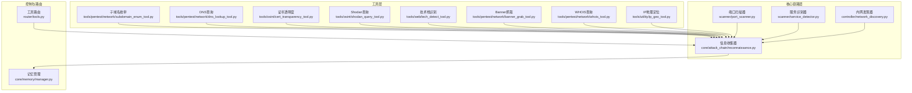

图表来源
- [core/attack_chain/reconnaissance.py](file://core/attack_chain/reconnaissance.py#L1-L150)
- [controller/network_discovery.py](file://controller/network_discovery.py#L1-L233)
- [scanner/port_scanner.py](file://scanner/port_scanner.py#L1-L63)
- [scanner/service_detector.py](file://scanner/service_detector.py#L1-L56)
- [tools/pentest/network/subdomain_enum_tool.py](file://tools/pentest/network/subdomain_enum_tool.py#L1-L92)
- [tools/pentest/network/dns_lookup_tool.py](file://tools/pentest/network/dns_lookup_tool.py#L1-L79)
- [tools/osint/cert_transparency_tool.py](file://tools/osint/cert_transparency_tool.py#L1-L84)
- [tools/osint/shodan_query_tool.py](file://tools/osint/shodan_query_tool.py#L1-L105)
- [tools/web/tech_detect_tool.py](file://tools/web/tech_detect_tool.py#L1-L155)
- [tools/pentest/network/banner_grab_tool.py](file://tools/pentest/network/banner_grab_tool.py#L1-L108)
- [tools/pentest/network/whois_tool.py](file://tools/pentest/network/whois_tool.py#L1-L81)
- [tools/utility/ip_geo_tool.py](file://tools/utility/ip_geo_tool.py#L1-L69)
- [router/tools.py](file://router/tools.py#L1-L75)
- [core/memory/manager.py](file://core/memory/manager.py#L1-L325)

章节来源
- [router/tools.py](file://router/tools.py#L1-L75)

## 核心组件
- 信息收集器（Reconnaissance）：统一编排目标信息收集，聚合主机名/IP、端口、服务、Web信息、DNS信息等，形成结构化结果。
- 内网发现器（NetworkDiscovery）：扫描内网网段，发现在线主机，识别端口与服务，补充目标画像。
- 端口扫描器（PortScanner）：对指定主机进行快速端口扫描，支持常见端口与扩展端口集合。
- 服务识别器（ServiceDetector）：基于端口映射识别服务类型，作为端口扫描后的补充。
- 工具路由（router/tools.py）：集中列举Secbot集成的工具，便于统一管理和调用。

章节来源
- [core/attack_chain/reconnaissance.py](file://core/attack_chain/reconnaissance.py#L11-L150)
- [controller/network_discovery.py](file://controller/network_discovery.py#L15-L233)
- [scanner/port_scanner.py](file://scanner/port_scanner.py#L14-L63)
- [scanner/service_detector.py](file://scanner/service_detector.py#L29-L56)
- [router/tools.py](file://router/tools.py#L43-L75)

## 架构总览
Secbot的侦察阶段采用“工具编排 + 统一收集”的架构：
- 工具层负责具体任务（如子域名枚举、DNS查询、技术栈识别等），以独立工具形式存在，便于扩展与维护。
- 核心链路层将多个工具的结果整合，形成目标画像；同时支持内网扫描与发现，覆盖外网与内网场景。
- 记忆管理器负责将侦察过程与结果沉淀为短期、情节与长期记忆，支撑后续规划与总结。

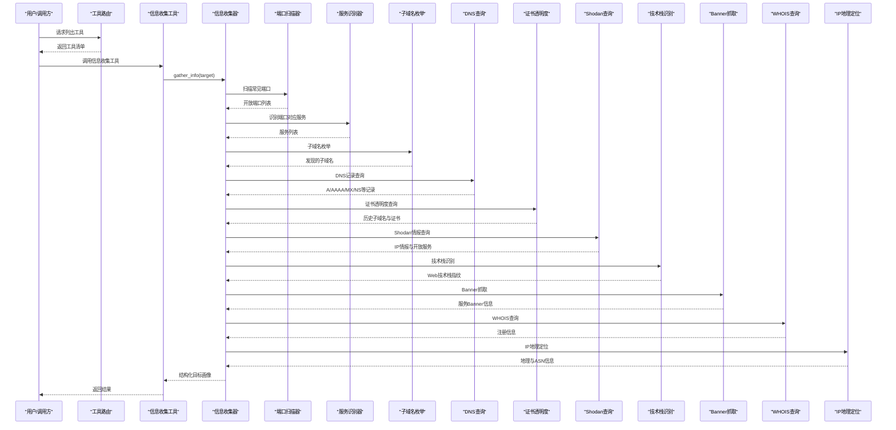

图表来源
- [tools/pentest/security/recon_tool.py](file://tools/pentest/security/recon_tool.py#L17-L29)
- [core/attack_chain/reconnaissance.py](file://core/attack_chain/reconnaissance.py#L17-L34)
- [scanner/port_scanner.py](file://scanner/port_scanner.py#L33-L54)
- [scanner/service_detector.py](file://scanner/service_detector.py#L42-L55)
- [tools/pentest/network/subdomain_enum_tool.py](file://tools/pentest/network/subdomain_enum_tool.py#L47-L78)
- [tools/pentest/network/dns_lookup_tool.py](file://tools/pentest/network/dns_lookup_tool.py#L19-L67)
- [tools/osint/cert_transparency_tool.py](file://tools/osint/cert_transparency_tool.py#L24-L70)
- [tools/osint/shodan_query_tool.py](file://tools/osint/shodan_query_tool.py#L22-L93)
- [tools/web/tech_detect_tool.py](file://tools/web/tech_detect_tool.py#L57-L142)
- [tools/pentest/network/banner_grab_tool.py](file://tools/pentest/network/banner_grab_tool.py#L70-L94)
- [tools/pentest/network/whois_tool.py](file://tools/pentest/network/whois_tool.py#L18-L70)
- [tools/utility/ip_geo_tool.py](file://tools/utility/ip_geo_tool.py#L19-L58)

## 详细组件分析

### 信息收集器（Reconnaissance）
- 功能职责：统一发起目标信息收集，聚合主机名/IP、端口、服务、Web信息、DNS信息等，形成结构化结果。
- 关键流程：
  - 解析目标并去协议前缀，提取主机名。
  - 反向解析IP并尝试反向DNS获取主机名。
  - 扫描常见端口，再对开放端口进行服务识别。
  - 对Web目标进行HTTP请求，提取状态码、Server头、技术栈与页面标题。
  - 收集DNS信息（A/AAAA/主机名）。
- 输出结构：包含成功标志与信息对象，信息对象包含目标、主机名、IP、开放端口、服务、Web信息、DNS信息等字段。

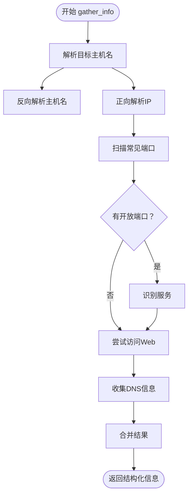

图表来源
- [core/attack_chain/reconnaissance.py](file://core/attack_chain/reconnaissance.py#L17-L148)

章节来源
- [core/attack_chain/reconnaissance.py](file://core/attack_chain/reconnaissance.py#L11-L150)

### 内网发现器（NetworkDiscovery）
- 功能职责：发现内网中的在线主机，识别端口与服务，补充目标画像。
- 关键流程：
  - 自动获取本地网络段（/24）。
  - 并发Ping主机，过滤存活主机。
  - 对存活主机扫描常见端口，识别服务类型。
  - 尝试解析主机名、MAC地址与操作系统（简化实现）。
  - 记录发现历史与更新主机信息。
- 输出结构：主机列表，包含IP、主机名、MAC、OS类型、开放端口、服务、发现时间与状态等。

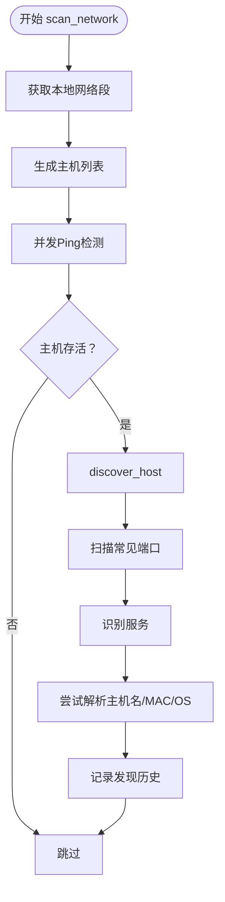

图表来源
- [controller/network_discovery.py](file://controller/network_discovery.py#L121-L156)

章节来源
- [controller/network_discovery.py](file://controller/network_discovery.py#L15-L233)

### 端口扫描器（PortScanner）
- 功能职责：对指定主机进行端口扫描，支持快速扫描（常见端口）与完整扫描（扩展端口集合）。
- 关键流程：
  - 通过异步TCP connect检查端口连通性。
  - 并发执行多个端口检查，汇总开放端口与计数。
- 输出结构：包含主机、端口列表（含开放状态）、开放端口数量。

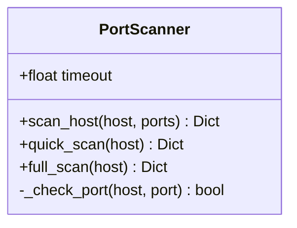

图表来源
- [scanner/port_scanner.py](file://scanner/port_scanner.py#L14-L63)

章节来源
- [scanner/port_scanner.py](file://scanner/port_scanner.py#L14-L63)

### 服务识别器（ServiceDetector）
- 功能职责：基于端口映射识别服务类型，作为端口扫描后的补充。
- 关键流程：
  - 将端口映射到服务名称（如ftp、ssh、http、https、smb、mysql、rdp、postgresql、redis、mongodb等）。
  - 支持对主机所有开放端口进行批量识别。
- 输出结构：包含主机、服务列表（端口、服务、名称、版本）。

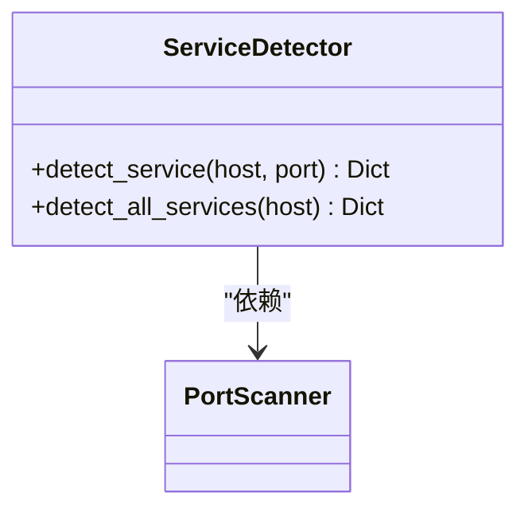

图表来源
- [scanner/service_detector.py](file://scanner/service_detector.py#L29-L56)
- [scanner/port_scanner.py](file://scanner/port_scanner.py#L14-L63)

章节来源
- [scanner/service_detector.py](file://scanner/service_detector.py#L29-L56)

### 子域名枚举工具（SubdomainEnumTool）
- 功能职责：基于字典暴力解析与DNS查询发现子域名。
- 关键流程：
  - 构造子域名候选列表（默认内置字典或自定义词表）。
  - 并发解析，限制最大并发数。
  - 过滤解析成功的子域名，统计发现数量。
- 输出结构：包含域名、检查总数、发现数量与子域名列表。

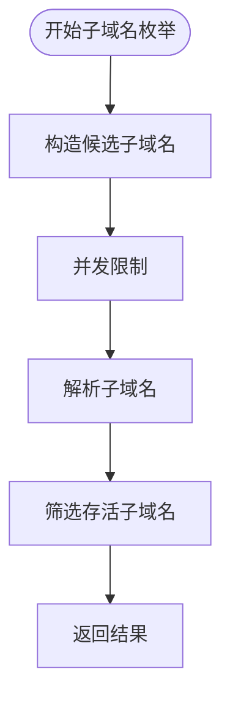

图表来源
- [tools/pentest/network/subdomain_enum_tool.py](file://tools/pentest/network/subdomain_enum_tool.py#L47-L78)

章节来源
- [tools/pentest/network/subdomain_enum_tool.py](file://tools/pentest/network/subdomain_enum_tool.py#L27-L92)

### DNS查询工具（DnsLookupTool）
- 功能职责：查询域名的A/AAAA/MX/NS/CNAME/TXT/SOA等记录，并解析基础IP。
- 关键流程：
  - 支持ALL或指定记录类型查询。
  - 优先使用dig命令；若不可用则回退至socket查询A记录。
  - 解析基础IP地址。
- 输出结构：包含域名、记录查询结果与解析IP。

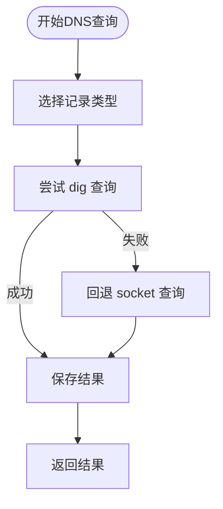

图表来源
- [tools/pentest/network/dns_lookup_tool.py](file://tools/pentest/network/dns_lookup_tool.py#L19-L67)

章节来源
- [tools/pentest/network/dns_lookup_tool.py](file://tools/pentest/network/dns_lookup_tool.py#L8-L79)

### 证书透明度工具（CertTransparencyTool）
- 功能职责：通过证书透明度日志查询域名的历史证书与关联子域名。
- 关键流程：
  - 构造crt.sh查询URL并发起HTTP请求。
  - 解析JSON响应，提取唯一子域名与部分证书摘要。
  - 限制返回数量，排序后返回。
- 输出结构：包含域名、证书总数、唯一子域名数量、子域名列表与近期证书摘要。

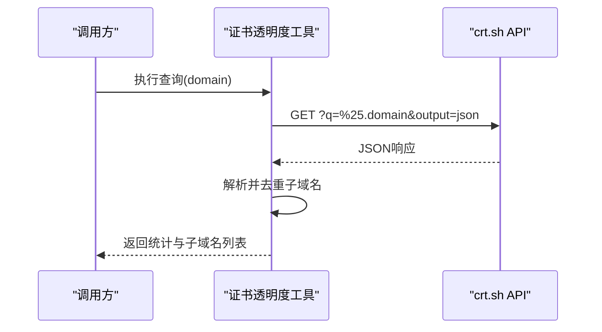

图表来源
- [tools/osint/cert_transparency_tool.py](file://tools/osint/cert_transparency_tool.py#L24-L70)

章节来源
- [tools/osint/cert_transparency_tool.py](file://tools/osint/cert_transparency_tool.py#L10-L84)

### Shodan查询工具（ShodanQueryTool）
- 功能职责：通过Shodan API查询目标IP的开放端口、服务、漏洞、地理位置等情报。
- 关键流程：
  - 校验API密钥与参数（target或query至少其一）。
  - 支持按IP查询主机详情或按搜索语法查询匹配结果。
  - 限制返回条目数量，拼装服务与漏洞信息。
- 输出结构：包含IP、组织、操作系统、国家/城市、端口、漏洞、主机名与服务列表等。

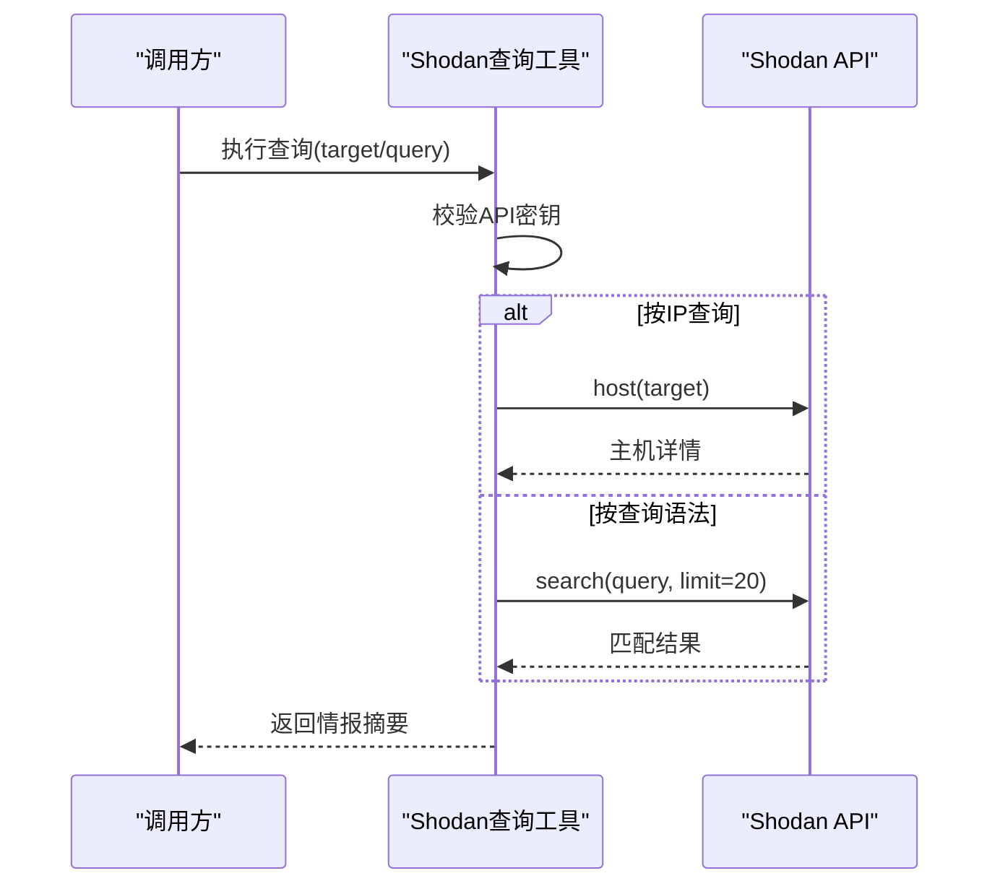

图表来源
- [tools/osint/shodan_query_tool.py](file://tools/osint/shodan_query_tool.py#L22-L93)

章节来源
- [tools/osint/shodan_query_tool.py](file://tools/osint/shodan_query_tool.py#L8-L105)

### 技术栈识别工具（TechDetectTool）
- 功能职责：识别Web应用的技术栈（服务器、编程语言/运行时、CMS、前端框架、JS库等）。
- 关键流程：
  - 从响应头、Cookie、HTML主体与meta标签匹配指纹库。
  - 计算置信度并排序，提取meta generator信息。
- 输出结构：包含URL、服务器、X-Powered-By、检测到的技术栈与总数。

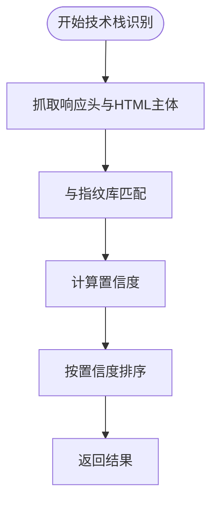

图表来源
- [tools/web/tech_detect_tool.py](file://tools/web/tech_detect_tool.py#L57-L142)

章节来源
- [tools/web/tech_detect_tool.py](file://tools/web/tech_detect_tool.py#L46-L155)

### Banner抓取工具（BannerGrabTool）
- 功能职责：连接目标端口获取服务Banner信息，辅助识别版本与特性。
- 关键流程：
  - 对指定端口列表进行异步连接与读取。
  - 若服务未主动发送Banner，则尝试发送探测包。
  - 统计开放端口与Banner信息。
- 输出结构：包含主机、扫描总数、开放端口数量与Banner列表。

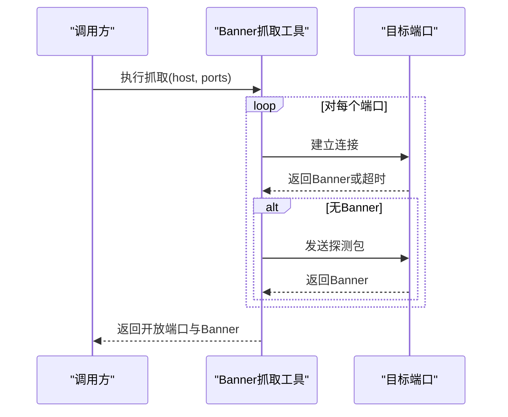

图表来源
- [tools/pentest/network/banner_grab_tool.py](file://tools/pentest/network/banner_grab_tool.py#L70-L94)

章节来源
- [tools/pentest/network/banner_grab_tool.py](file://tools/pentest/network/banner_grab_tool.py#L8-L108)

### WHOIS查询工具（WhoisTool）
- 功能职责：查询域名或IP的注册信息（注册商、创建/到期/更新时间、NS、邮箱、组织、国家等）。
- 关键流程：
  - 优先使用python-whois库解析；若不可用则调用系统whois命令。
  - 简单解析输出文本为键值对。
- 输出结构：包含目标、WHOIS信息与原始输出片段。

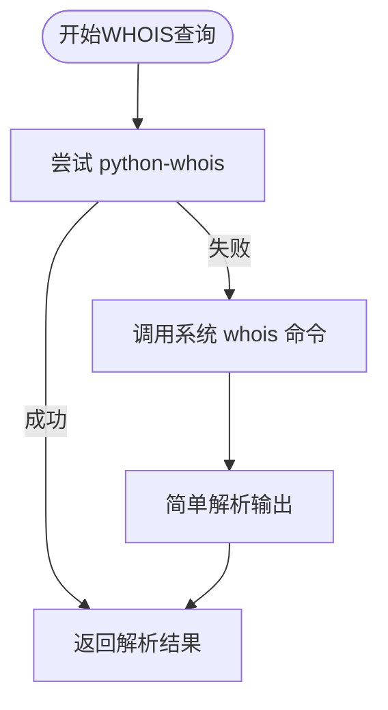

图表来源
- [tools/pentest/network/whois_tool.py](file://tools/pentest/network/whois_tool.py#L18-L70)

章节来源
- [tools/pentest/network/whois_tool.py](file://tools/pentest/network/whois_tool.py#L7-L81)

### IP地理定位工具（IpGeoTool）
- 功能职责：查询IP的地理位置、ISP、AS号、经纬度与时区等信息。
- 关键流程：
  - 调用免费API获取JSON数据。
  - 校验状态并提取关键字段。
- 输出结构：包含IP、国家/地区/城市、经纬度、时区、ISP与AS号等。

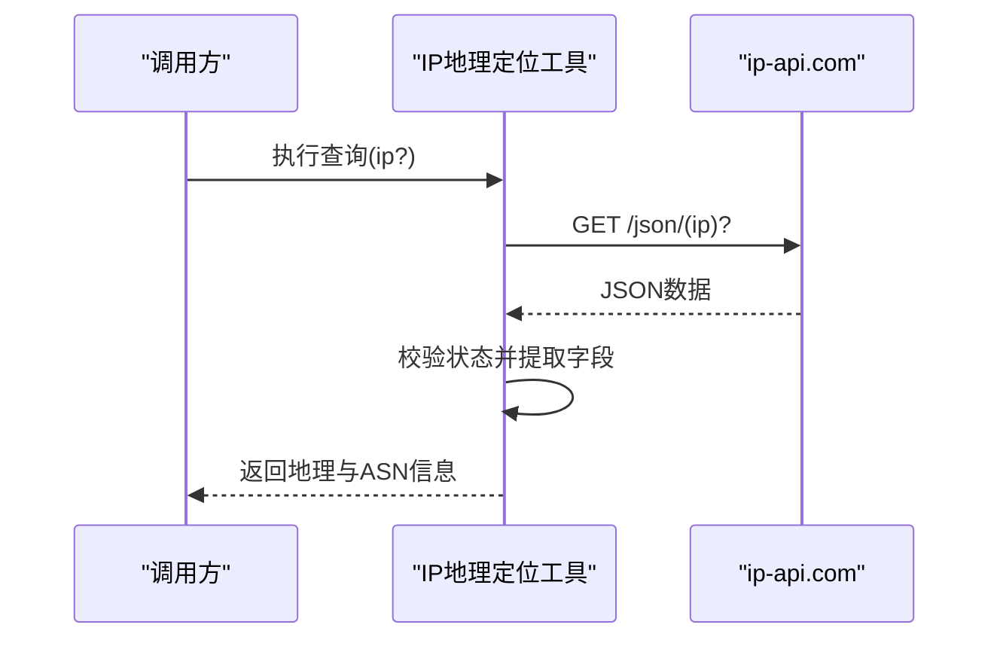

图表来源
- [tools/utility/ip_geo_tool.py](file://tools/utility/ip_geo_tool.py#L19-L58)

章节来源
- [tools/utility/ip_geo_tool.py](file://tools/utility/ip_geo_tool.py#L8-L69)

### 记忆管理（MemoryManager）
- 功能职责：将侦察过程与结果沉淀为短期、情节与长期记忆，支撑后续规划与总结。
- 关键流程：
  - 添加记忆项（content、type、importance、metadata）。
  - 支持按类型检索与上下文拼接。
  - 提供清理与统计功能。
- 输出结构：记忆项列表与统计信息。

图表来源
- [core/memory/manager.py](file://core/memory/manager.py#L223-L325)

章节来源
- [core/memory/manager.py](file://core/memory/manager.py#L223-L325)

## 依赖分析
- 工具与核心链路的耦合关系：
  - 信息收集器依赖端口扫描器与服务识别器，形成“端口扫描+服务识别”的闭环。
  - 信息收集器进一步依赖各类侦察工具（子域名枚举、DNS查询、证书透明度、Shodan、技术栈识别、Banner抓取、WHOIS、地理定位）。
  - 内网发现器独立运行，补充内网主机画像。
- 外部依赖与集成点：
  - Shodan查询依赖第三方API与配置密钥。
  - DNS查询可回退到系统socket。
  - WHOIS查询可回退到系统命令。
- 潜在循环依赖：当前模块间为单向依赖，无明显循环。

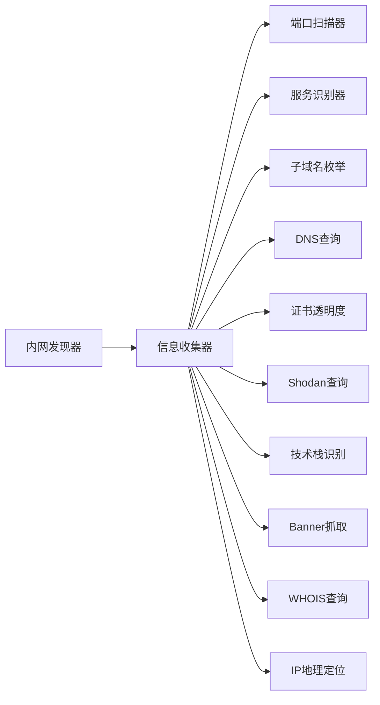

图表来源
- [core/attack_chain/reconnaissance.py](file://core/attack_chain/reconnaissance.py#L57-L148)
- [controller/network_discovery.py](file://controller/network_discovery.py#L121-L156)
- [scanner/port_scanner.py](file://scanner/port_scanner.py#L33-L54)
- [scanner/service_detector.py](file://scanner/service_detector.py#L42-L55)
- [tools/pentest/network/subdomain_enum_tool.py](file://tools/pentest/network/subdomain_enum_tool.py#L47-L78)
- [tools/pentest/network/dns_lookup_tool.py](file://tools/pentest/network/dns_lookup_tool.py#L19-L67)
- [tools/osint/cert_transparency_tool.py](file://tools/osint/cert_transparency_tool.py#L24-L70)
- [tools/osint/shodan_query_tool.py](file://tools/osint/shodan_query_tool.py#L22-L93)
- [tools/web/tech_detect_tool.py](file://tools/web/tech_detect_tool.py#L57-L142)
- [tools/pentest/network/banner_grab_tool.py](file://tools/pentest/network/banner_grab_tool.py#L70-L94)
- [tools/pentest/network/whois_tool.py](file://tools/pentest/network/whois_tool.py#L18-L70)
- [tools/utility/ip_geo_tool.py](file://tools/utility/ip_geo_tool.py#L19-L58)

## 性能考量
- 并发与超时：
  - 端口扫描与子域名枚举均采用并发策略，建议合理设置最大并发数以平衡速度与资源占用。
  - 各工具普遍设置超时，避免长时间阻塞。
- I/O与网络：
  - DNS查询优先使用dig，不可用时回退socket，减少外部进程开销。
  - Shodan查询受API速率限制影响，建议缓存与去重查询。
- 数据规模：
  - 技术栈识别与证书透明度查询可能返回大量候选，建议限制返回数量并排序展示。
- 内存与持久化：
  - 记忆管理器支持短期、情节与长期记忆，注意定期清理与归档，避免内存膨胀。

## 故障排查指南
- 端口扫描失败或超时：
  - 检查目标防火墙与网络策略；适当增大超时或减少并发。
- DNS查询异常：
  - 确认dig可用；若不可用，工具会回退socket，但可能不支持AAAA记录。
- Shodan查询失败：
  - 确认API密钥配置正确；检查网络连通性与API配额。
- WHOIS查询失败：
  - 确认已安装python-whois库；否则回退系统命令，注意解析稳定性。
- Banner抓取无输出：
  - 部分服务不会主动发送Banner，工具会尝试探测包，仍无响应属正常。
- IP地理定位失败：
  - 检查网络连通性与API状态；免费服务可能有限速或失败率。

章节来源
- [tools/pentest/network/dns_lookup_tool.py](file://tools/pentest/network/dns_lookup_tool.py#L48-L58)
- [tools/osint/shodan_query_tool.py](file://tools/osint/shodan_query_tool.py#L31-L40)
- [tools/pentest/network/whois_tool.py](file://tools/pentest/network/whois_tool.py#L24-L42)
- [tools/pentest/network/banner_grab_tool.py](file://tools/pentest/network/banner_grab_tool.py#L63-L68)
- [tools/utility/ip_geo_tool.py](file://tools/utility/ip_geo_tool.py#L38-L39)

## 结论
Secbot的侦察阶段通过“工具层 + 核心链路层 + 记忆管理”的架构，实现了从外网到内网、从被动到主动的多维度信息收集。工具覆盖子域名枚举、DNS查询、证书透明度、Shodan情报、技术栈识别、Banner抓取、WHOIS与地理定位等关键领域；核心链路将多源信息整合为结构化目标画像，并通过记忆管理沉淀经验，为后续攻击链与防御策略提供支撑。实践中应结合目标类型与环境特征，灵活组合工具并优化并发与超时参数，确保高效与稳定。

## 附录
- 工具清单与分类：可通过工具路由接口获取全部工具列表，便于统一管理与调用。
- 主动与被动侦察对比：
  - 主动侦察：通过端口扫描、Banner抓取、子域名枚举等方式直接探测目标，风险较高但信息更实时。
  - 被动侦察：通过DNS查询、证书透明度、WHOIS、Shodan等间接渠道获取公开信息，风险较低但时效性受限。
- 不同目标类型的侦察策略与最佳实践：
  - 企业网站：先DNS与WHOIS，再证书透明度与子域名枚举，随后Shodan与技术栈识别，最后端口扫描与Banner抓取。
  - 内网主机：使用内网发现器扫描网段，识别常见端口与服务，结合Banner与服务识别完善画像。
  - 云资产：结合IP地理定位与Shodan查询，关注暴露面与历史漏洞；配合子域名枚举与技术栈识别，评估潜在入口。
- 实际案例与结果展示：
  - 案例A：某企业域名通过证书透明度发现多个历史子域名，结合DNS查询与WHOIS确认归属，最终在Shodan中发现暴露的非标准端口与服务Banner，形成完整外网画像。
  - 案例B：内网扫描发现大量主机，通过端口扫描与服务识别定位关键服务（如RDP、SMB、数据库），结合Banner抓取识别版本，为后续利用提供依据。
  - 案例C：云资产扫描发现公网暴露的Redis与MongoDB实例，通过技术栈识别确认运行环境，结合地理定位与组织信息评估风险等级。

章节来源
- [router/tools.py](file://router/tools.py#L43-L75)
- [core/attack_chain/reconnaissance.py](file://core/attack_chain/reconnaissance.py#L17-L34)
- [controller/network_discovery.py](file://controller/network_discovery.py#L121-L156)
- [tools/osint/cert_transparency_tool.py](file://tools/osint/cert_transparency_tool.py#L24-L70)
- [tools/osint/shodan_query_tool.py](file://tools/osint/shodan_query_tool.py#L22-L93)
- [tools/web/tech_detect_tool.py](file://tools/web/tech_detect_tool.py#L57-L142)
- [tools/pentest/network/banner_grab_tool.py](file://tools/pentest/network/banner_grab_tool.py#L70-L94)
- [tools/utility/ip_geo_tool.py](file://tools/utility/ip_geo_tool.py#L19-L58)