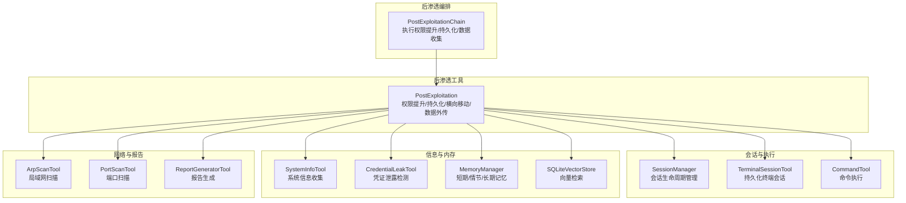
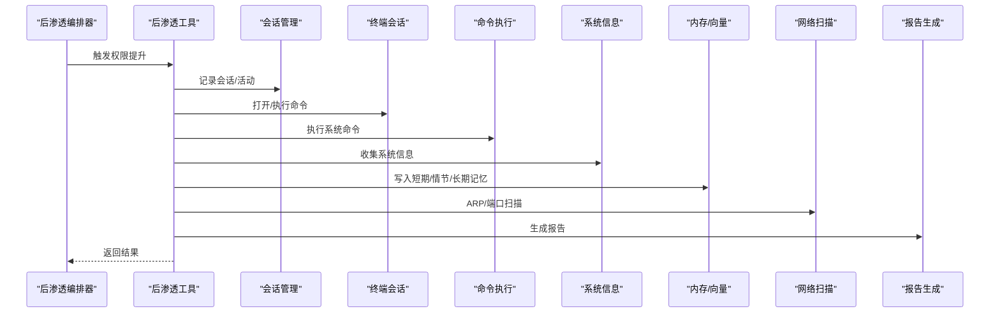
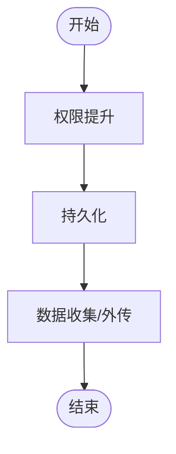
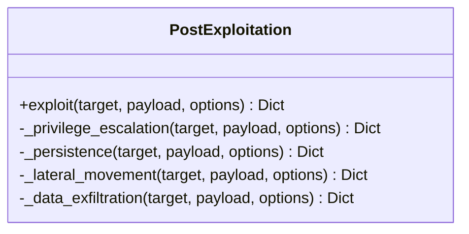
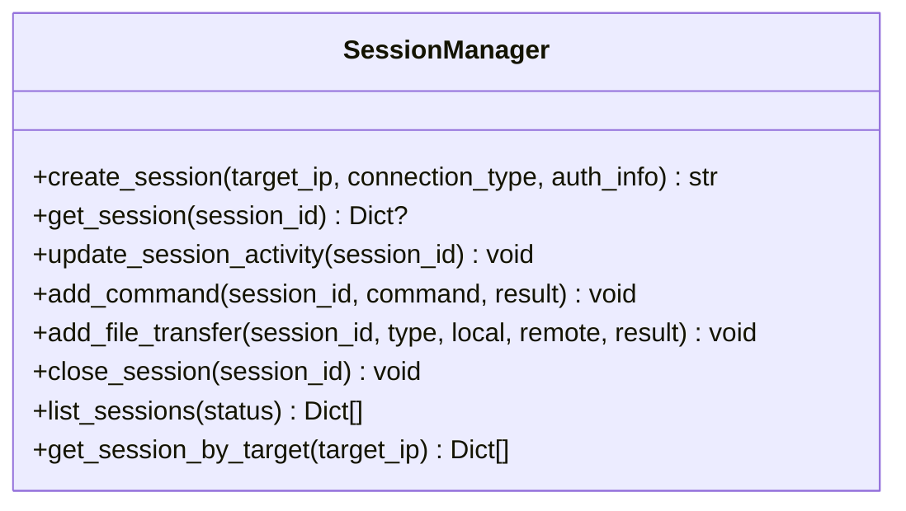
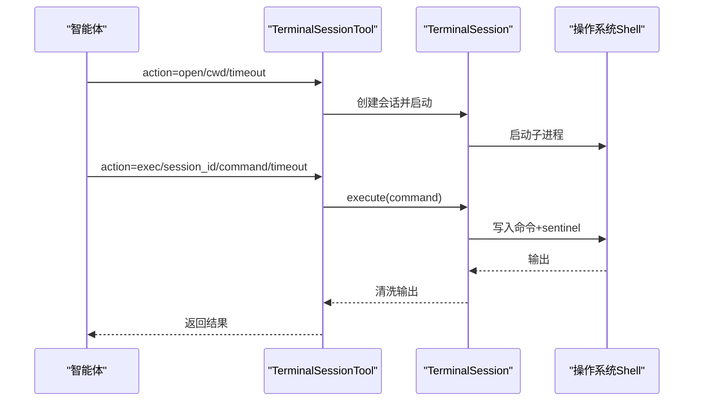
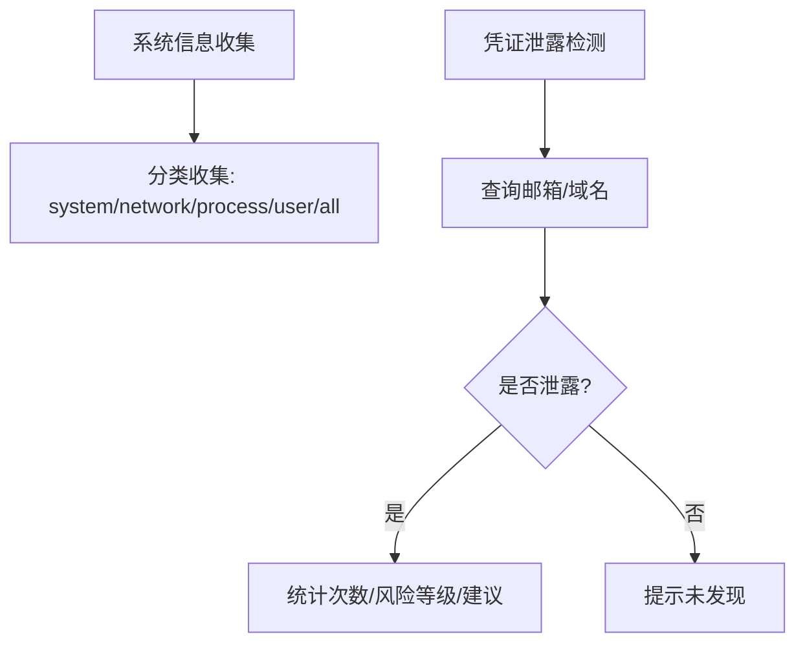
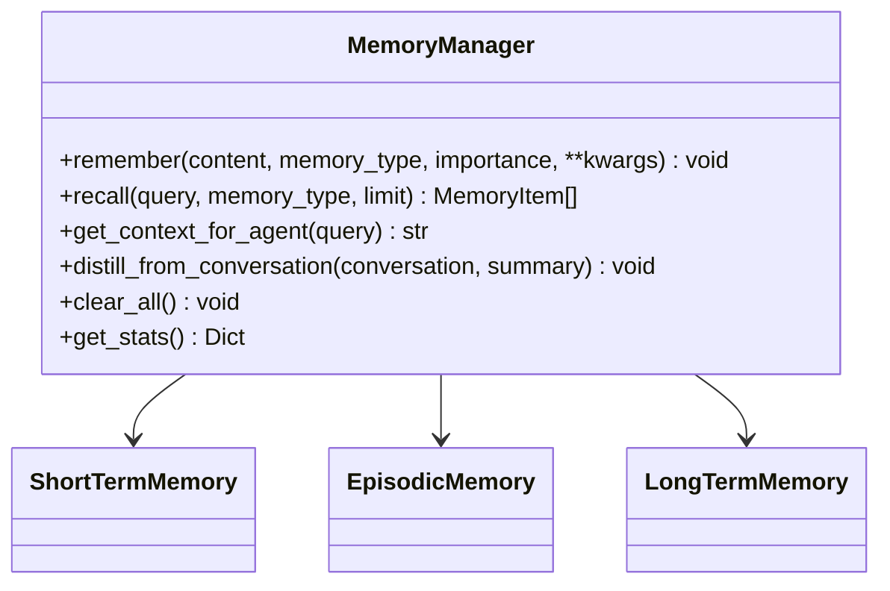
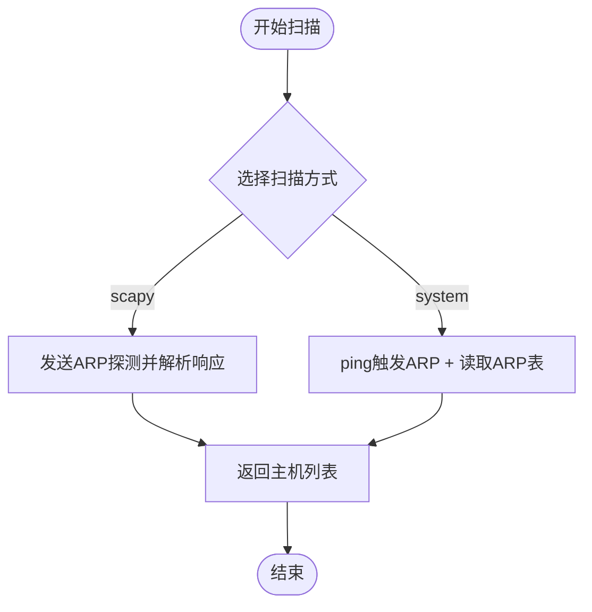
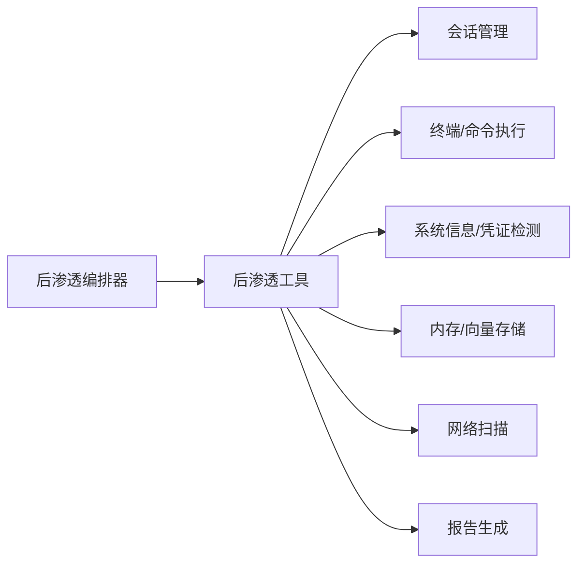

# 后渗透阶段

<cite>
**本文引用的文件**
- [post_exploitation.py](file://tools/offense/exploit/post_exploitation.py)
- [post_exploitation.py](file://core/attack_chain/post_exploitation.py)
- [session_manager.py](file://controller/session_manager.py)
- [command_tool.py](file://tools/offense/control/command_tool.py)
- [terminal_tool.py](file://tools/offense/control/terminal_tool.py)
- [credential_leak_tool.py](file://tools/osint/credential_leak_tool.py)
- [system_info_tool.py](file://tools/defense/system_info_tool.py)
- [manager.py](file://core/memory/manager.py)
- [vector_store.py](file://core/memory/vector_store.py)
- [root_policy.py](file://utils/root_policy.py)
- [arp_scan_tool.py](file://tools/pentest/network/arp_scan_tool.py)
- [port_scan_tool.py](file://tools/pentest/security/port_scan_tool.py)
- [report_generator_tool.py](file://tools/reporting/report_generator_tool.py)
</cite>

## 目录
1. [引言](#引言)
2. [项目结构](#项目结构)
3. [核心组件](#核心组件)
4. [架构总览](#架构总览)
5. [详细组件分析](#详细组件分析)
6. [依赖分析](#依赖分析)
7. [性能考虑](#性能考虑)
8. [故障排查指南](#故障排查指南)
9. [结论](#结论)
10. [附录](#附录)

## 引言
本章节聚焦Secbot在“后渗透阶段”的能力与实现，涵盖权限提升、持久化、横向移动、数据收集与外传、会话管理、凭证与系统信息收集、内存与向量存储、根权限策略、网络扫描与报告生成等主题。文档旨在帮助读者理解后渗透工具链的组织方式、调用流程与最佳实践，并提供面向实战的策略建议与案例分析。

## 项目结构
后渗透相关代码主要分布在以下模块：
- 攻击链与后渗透编排：core/attack_chain/post_exploitation.py
- 后渗透工具实现：tools/offense/exploit/post_exploitation.py
- 会话管理：controller/session_manager.py
- 终端与命令执行：tools/offense/control/terminal_tool.py、tools/offense/control/command_tool.py
- OSINT与凭证检测：tools/osint/credential_leak_tool.py
- 系统信息收集：tools/defense/system_info_tool.py
- 内存与向量存储：core/memory/manager.py、core/memory/vector_store.py
- 根权限策略：utils/root_policy.py
- 网络扫描：tools/pentest/network/arp_scan_tool.py、tools/pentest/security/port_scan_tool.py
- 报告生成：tools/reporting/report_generator_tool.py

图表来源
- [post_exploitation.py](file://core/attack_chain/post_exploitation.py#L14-L34)
- [post_exploitation.py](file://tools/offense/exploit/post_exploitation.py#L16-L37)
- [session_manager.py](file://controller/session_manager.py#L15-L38)
- [terminal_tool.py](file://tools/offense/control/terminal_tool.py#L225-L273)
- [command_tool.py](file://tools/offense/control/command_tool.py#L41-L116)
- [system_info_tool.py](file://tools/defense/system_info_tool.py#L35-L52)
- [credential_leak_tool.py](file://tools/osint/credential_leak_tool.py#L66-L102)
- [manager.py](file://core/memory/manager.py#L223-L297)
- [vector_store.py](file://core/memory/vector_store.py#L30-L78)
- [arp_scan_tool.py](file://tools/pentest/network/arp_scan_tool.py#L24-L48)
- [port_scan_tool.py](file://tools/pentest/security/port_scan_tool.py#L17-L37)
- [report_generator_tool.py](file://tools/reporting/report_generator_tool.py#L66-L102)

章节来源
- [post_exploitation.py](file://core/attack_chain/post_exploitation.py#L14-L34)
- [post_exploitation.py](file://tools/offense/exploit/post_exploitation.py#L16-L37)

## 核心组件
- 后渗透攻击链：负责编排权限提升、持久化与数据收集三大阶段，作为后渗透阶段的入口。
- 后渗透工具：封装具体策略（如SUID检查、sudo权限枚举、持久化方法清单、敏感路径收集等）。
- 会话管理：维护目标会话的创建、活动更新、命令与文件传输记录、关闭与查询。
- 终端与命令执行：提供跨平台命令执行与持久化终端会话，支持超时、缓冲与清理。
- 信息与内存：系统信息收集、凭证泄露检测、短期/情节/长期记忆与向量检索。
- 网络扫描：ARP扫描与端口扫描，支撑横向移动与内网拓扑发现。
- 报告生成：将后渗透过程与结果标准化输出为多种格式。

章节来源
- [post_exploitation.py](file://core/attack_chain/post_exploitation.py#L14-L34)
- [post_exploitation.py](file://tools/offense/exploit/post_exploitation.py#L16-L37)
- [session_manager.py](file://controller/session_manager.py#L15-L38)
- [terminal_tool.py](file://tools/offense/control/terminal_tool.py#L225-L273)
- [command_tool.py](file://tools/offense/control/command_tool.py#L41-L116)
- [system_info_tool.py](file://tools/defense/system_info_tool.py#L35-L52)
- [credential_leak_tool.py](file://tools/osint/credential_leak_tool.py#L66-L102)
- [manager.py](file://core/memory/manager.py#L223-L297)
- [vector_store.py](file://core/memory/vector_store.py#L30-L78)
- [arp_scan_tool.py](file://tools/pentest/network/arp_scan_tool.py#L24-L48)
- [port_scan_tool.py](file://tools/pentest/security/port_scan_tool.py#L17-L37)
- [report_generator_tool.py](file://tools/reporting/report_generator_tool.py#L66-L102)

## 架构总览
后渗透阶段采用“编排器-工具库-基础设施”的分层架构：
- 编排器负责按序触发权限提升、持久化与数据收集，并汇总结果。
- 工具库提供可插拔的策略实现，支持扩展新的后渗透手段。
- 基础设施提供会话、内存、向量存储、根权限策略与报告生成等通用能力。

图表来源
- [post_exploitation.py](file://core/attack_chain/post_exploitation.py#L14-L34)
- [post_exploitation.py](file://tools/offense/exploit/post_exploitation.py#L16-L37)
- [session_manager.py](file://controller/session_manager.py#L49-L68)
- [terminal_tool.py](file://tools/offense/control/terminal_tool.py#L251-L351)
- [command_tool.py](file://tools/offense/control/command_tool.py#L41-L116)
- [system_info_tool.py](file://tools/defense/system_info_tool.py#L35-L52)
- [manager.py](file://core/memory/manager.py#L231-L268)
- [arp_scan_tool.py](file://tools/pentest/network/arp_scan_tool.py#L24-L48)
- [port_scan_tool.py](file://tools/pentest/security/port_scan_tool.py#L17-L37)
- [report_generator_tool.py](file://tools/reporting/report_generator_tool.py#L66-L102)

## 详细组件分析

### 后渗透攻击链（编排）
- 职责：接收初始渗透结果，依次触发权限提升、持久化与数据收集，并聚合返回。
- 关键点：按顺序调用后渗透工具的不同策略类型；当前实现为异步串行编排。

图表来源
- [post_exploitation.py](file://core/attack_chain/post_exploitation.py#L14-L34)

章节来源
- [post_exploitation.py](file://core/attack_chain/post_exploitation.py#L14-L34)

### 后渗透工具（策略实现）
- 权限提升：提供SUID文件、sudo权限、用户与身份信息等检查命令模板，便于后续通过会话或远程通道执行。
- 持久化：列举crontab、systemd服务、启动脚本、SSH密钥等方法清单，便于后续选择合适方案。
- 横向移动：预留内网扫描与凭据传递等策略入口。
- 数据外传：定义敏感路径集合，便于后续采集与传输。

图表来源
- [post_exploitation.py](file://tools/offense/exploit/post_exploitation.py#L10-L107)

章节来源
- [post_exploitation.py](file://tools/offense/exploit/post_exploitation.py#L16-L107)

### 会话管理
- 能力：创建会话、记录命令与文件传输、更新活动时间、关闭会话、按状态/目标筛选。
- 用途：贯穿后渗透全过程，确保操作可追踪、可审计。

图表来源
- [session_manager.py](file://controller/session_manager.py#L9-L90)

章节来源
- [session_manager.py](file://controller/session_manager.py#L15-L90)

### 终端与命令执行
- 终端会话：支持跨平台启动子进程、后台读取输出、命令sentinel机制判定执行完成、空闲回收。
- 命令执行：适配macOS平台命令差异、超时控制、stdin安全传参、返回码与输出解析。

图表来源
- [terminal_tool.py](file://tools/offense/control/terminal_tool.py#L251-L351)

章节来源
- [terminal_tool.py](file://tools/offense/control/terminal_tool.py#L225-L454)
- [command_tool.py](file://tools/offense/control/command_tool.py#L41-L116)

### 系统信息与凭证泄露检测
- 系统信息：按类别收集系统、网络、进程、用户信息，支持部分失败降级。
- 凭证泄露：基于外部接口检测邮箱/域名是否出现在已知泄露源，给出风险等级与建议。

图表来源
- [system_info_tool.py](file://tools/defense/system_info_tool.py#L35-L52)
- [credential_leak_tool.py](file://tools/osint/credential_leak_tool.py#L66-L102)

章节来源
- [system_info_tool.py](file://tools/defense/system_info_tool.py#L35-L66)
- [credential_leak_tool.py](file://tools/osint/credential_leak_tool.py#L66-L186)

### 内存与向量存储
- 记忆管理：短期（会话上下文）、情节（跨会话事件）、长期（知识）三层记忆，支持召回与蒸馏。
- 向量存储：SQLite向量索引（sqlite-vec可用时），支持集合化管理与相似度检索。

图表来源
- [manager.py](file://core/memory/manager.py#L223-L324)

章节来源
- [manager.py](file://core/memory/manager.py#L223-L324)
- [vector_store.py](file://core/memory/vector_store.py#L30-L297)

### 根权限策略
- 功能：持久化root命令与策略（询问/始终允许），用于识别需要提权的命令并按策略处理。
- 用途：在后渗透过程中减少交互成本，提高自动化程度。

章节来源
- [root_policy.py](file://utils/root_policy.py#L18-L54)

### 网络扫描与横向移动
- ARP扫描：支持scapy与系统命令两种路径，解析ARP表提取存活主机。
- 端口扫描：快速/全量/指定端口扫描，支撑内网服务发现与横向移动。

图表来源
- [arp_scan_tool.py](file://tools/pentest/network/arp_scan_tool.py#L50-L78)
- [arp_scan_tool.py](file://tools/pentest/network/arp_scan_tool.py#L80-L155)

章节来源
- [arp_scan_tool.py](file://tools/pentest/network/arp_scan_tool.py#L24-L167)
- [port_scan_tool.py](file://tools/pentest/security/port_scan_tool.py#L17-L50)

### 报告生成
- 功能：将后渗透过程与结果标准化输出为Markdown/HTML/JSON等格式，支持附加攻击链与利用结果。
- 用途：形成可归档、可分享的后渗透证据链与总结。

章节来源
- [report_generator_tool.py](file://tools/reporting/report_generator_tool.py#L66-L102)

## 依赖分析
- 组件耦合：后渗透编排器依赖后渗透工具；后渗透工具依赖会话管理、终端/命令执行、系统信息、内存/向量存储、网络扫描与报告生成等基础设施。
- 外部依赖：终端会话依赖操作系统shell与子进程；ARP扫描依赖scapy或系统命令；向量存储依赖sqlite-vec功能可用性。
- 循环依赖：当前模块间无循环导入迹象，职责边界清晰。

图表来源
- [post_exploitation.py](file://core/attack_chain/post_exploitation.py#L14-L34)
- [post_exploitation.py](file://tools/offense/exploit/post_exploitation.py#L16-L37)
- [session_manager.py](file://controller/session_manager.py#L15-L38)
- [terminal_tool.py](file://tools/offense/control/terminal_tool.py#L225-L273)
- [command_tool.py](file://tools/offense/control/command_tool.py#L41-L116)
- [system_info_tool.py](file://tools/defense/system_info_tool.py#L35-L52)
- [credential_leak_tool.py](file://tools/osint/credential_leak_tool.py#L66-L102)
- [manager.py](file://core/memory/manager.py#L223-L297)
- [vector_store.py](file://core/memory/vector_store.py#L30-L78)
- [arp_scan_tool.py](file://tools/pentest/network/arp_scan_tool.py#L24-L48)
- [port_scan_tool.py](file://tools/pentest/security/port_scan_tool.py#L17-L37)
- [report_generator_tool.py](file://tools/reporting/report_generator_tool.py#L66-L102)

## 性能考虑
- 命令执行与会话：合理设置超时与缓冲上限，避免长时间阻塞；定期清理空闲会话，降低资源占用。
- 扫描效率：ARP扫描优先使用scapy以提升精度与速度；端口扫描按需选择快速/全量策略。
- 向量检索：在sqlite-vec可用时启用ANN索引；否则采用余弦相似度计算，注意阈值与返回限制。
- 记忆管理：短期记忆限制轮次，情节/长期记忆定期持久化，避免频繁IO。

## 故障排查指南
- 命令执行超时：检查超时参数与目标系统负载；必要时调整timeout或拆分子任务。
- 终端会话异常：确认会话是否存活、是否被意外关闭；检查sentinel机制与输出清洗逻辑。
- ARP扫描失败：确认scapy安装与权限；若不可用，使用系统命令方式但仅支持/24网段。
- 向量存储不可用：检查sqlite-vec扩展是否安装；在不可用时将退化为纯量计算。
- 报告生成失败：检查输出目录权限与文件名合法性；确保统计数据与归一化数据完整。

章节来源
- [terminal_tool.py](file://tools/offense/control/terminal_tool.py#L208-L218)
- [arp_scan_tool.py](file://tools/pentest/network/arp_scan_tool.py#L80-L91)
- [vector_store.py](file://core/memory/vector_store.py#L80-L88)
- [report_generator_tool.py](file://tools/reporting/report_generator_tool.py#L90-L96)

## 结论
Secbot的后渗透阶段通过编排器与工具库的协作，实现了从权限提升、持久化到数据收集与报告生成的闭环。结合会话管理、终端执行、系统信息与凭证检测、内存与向量存储、网络扫描与报告生成等基础设施，能够在尽量降低对目标系统影响的前提下，高效完成后渗透任务，并形成可追溯、可复盘的证据链。

## 附录
- 最佳实践
  - 权限提升：优先使用已知SUID与sudo策略，避免高风险操作；记录命令与结果以便回溯。
  - 持久化：选择与目标环境匹配的方法（crontab/systemd/SSH密钥），注意隐蔽性与稳定性。
  - 横向移动：先进行ARP/端口扫描，再结合凭证检测与凭据传递，逐步扩大范围。
  - 数据收集：限定敏感路径范围，避免大规模读取；必要时分批采集并加密传输。
  - 会话与日志：严格记录命令、文件传输与会话状态；定期清理与归档。
  - 报告：标准化输出，包含攻击链、利用结果与建议措施，便于复盘与审计。

- 实战案例（示例思路）
  - 案例A：Linux服务器本地提权后，通过systemd服务实现持久化，使用凭证泄露检测定位管理员账户，随后进行横向移动与数据收集，最后生成报告。
  - 案例B：Windows主机通过计划任务实现持久化，结合ARP扫描发现域控，使用凭证检测与凭据传递完成横向移动，最终输出HTML报告。