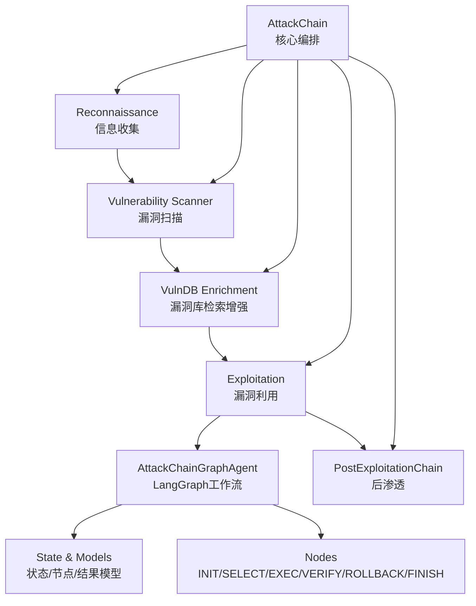
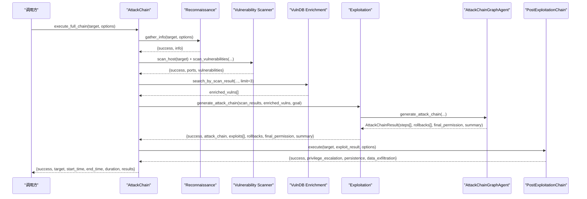
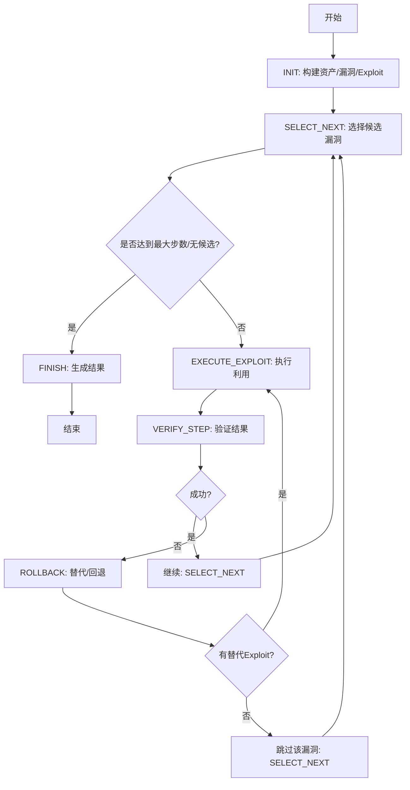
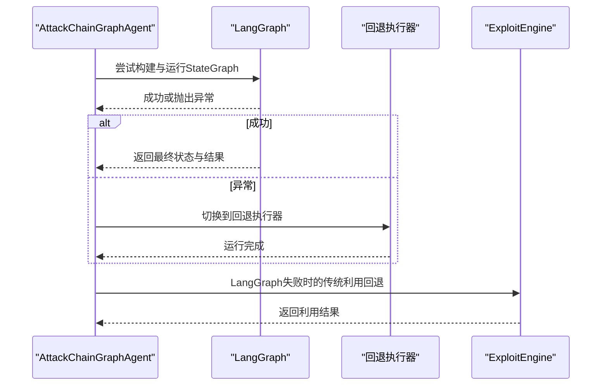
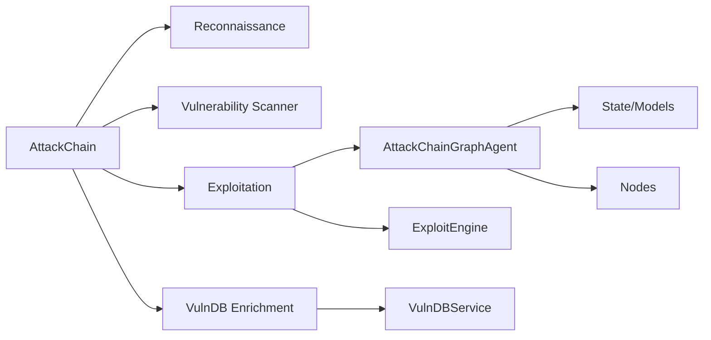

# 攻击链系统概览

<cite>
**本文引用的文件**
- [core/attack_chain/__init__.py](file://core/attack_chain/__init__.py)
- [core/attack_chain/attack_chain.py](file://core/attack_chain/attack_chain.py)
- [core/attack_chain/reconnaissance.py](file://core/attack_chain/reconnaissance.py)
- [core/attack_chain/exploitation.py](file://core/attack_chain/exploitation.py)
- [core/attack_chain/post_exploitation.py](file://core/attack_chain/post_exploitation.py)
- [core/attack_chain/graph/__init__.py](file://core/attack_chain/graph/__init__.py)
- [core/attack_chain/graph/workflow.py](file://core/attack_chain/graph/workflow.py)
- [core/attack_chain/graph/state.py](file://core/attack_chain/graph/state.py)
- [core/attack_chain/graph/nodes.py](file://core/attack_chain/graph/nodes.py)
- [prompts/chain.py](file://prompts/chain.py)
- [tools/pentest/security/attack_test_tool.py](file://tools/pentest/security/attack_test_tool.py)
</cite>

## 目录
1. [引言](#引言)
2. [项目结构](#项目结构)
3. [核心组件](#核心组件)
4. [架构总览](#架构总览)
5. [详细组件分析](#详细组件分析)
6. [依赖关系分析](#依赖关系分析)
7. [性能考量](#性能考量)
8. [故障排查指南](#故障排查指南)
9. [结论](#结论)
10. [附录](#附录)

## 引言
本文件面向Secbot的攻击链系统，提供从理念到实现的全景式说明。系统以“自动化渗透测试”为目标，围绕四大核心阶段设计：信息收集、漏洞扫描与库检索增强、基于LangGraph的智能推理与漏洞利用、后渗透阶段。LangGraph图推理作为智能中枢，负责在“选择下一目标—执行利用—验证—回退/替代—继续”的闭环中动态决策；当LangGraph不可用时，系统提供纯Python回退执行器，确保功能可用性与向后兼容。

## 项目结构
攻击链相关代码主要位于core/attack_chain及其子包，配合core/vuln_db、scanner、tools等模块协同工作。核心文件组织如下：
- 核心编排：attack_chain.py
- 阶段实现：reconnaissance.py、exploitation.py、post_exploitation.py
- LangGraph推理：graph/workflow.py、graph/state.py、graph/nodes.py
- 导出入口：graph/__init__.py、attack_chain/__init__.py
- 提示词链：prompts/chain.py（用于提示词组织与组合）
- 测试工具：tools/pentest/security/attack_test_tool.py（高敏感度测试）

图表来源
- [core/attack_chain/attack_chain.py](file://core/attack_chain/attack_chain.py#L18-L61)
- [core/attack_chain/graph/workflow.py](file://core/attack_chain/graph/workflow.py#L102-L149)
- [core/attack_chain/graph/state.py](file://core/attack_chain/graph/state.py#L101-L129)
- [core/attack_chain/graph/nodes.py](file://core/attack_chain/graph/nodes.py#L35-L119)

章节来源
- [core/attack_chain/__init__.py](file://core/attack_chain/__init__.py#L1-L16)
- [core/attack_chain/attack_chain.py](file://core/attack_chain/attack_chain.py#L11-L61)

## 核心组件
- AttackChain：贯穿四阶段的主控制器，负责顺序调度、结果聚合与异常回退。
- Reconnaissance：异步信息收集，解析主机名/IP、扫描端口、识别服务、抓取Web基础信息与DNS信息。
- Vulnerability Scanner：对开放端口进行漏洞扫描，产出漏洞清单。
- VulnDB Enrichment：将扫描结果映射到公开漏洞库，补充CVE/评分/利用信息/缓解措施等。
- Exploitation：LangGraph智能推理生成最优攻击链，或在LangGraph不可用时回退到传统引擎。
- PostExploitationChain：在成功利用后执行权限提升、持久化与数据收集等动作。
- AttackChainGraphAgent：LangGraph工作流代理，封装StateGraph构建、运行与回退逻辑。
- State/Models：定义资产、漏洞、权限、Exploit节点与攻击步骤、结果等数据模型。
- Nodes：各图节点函数，实现初始化、选择、执行、验证、回退与收尾逻辑。
- PromptChain：提示词链管理，便于组织角色、指令、上下文、约束与示例。

章节来源
- [core/attack_chain/attack_chain.py](file://core/attack_chain/attack_chain.py#L11-L213)
- [core/attack_chain/reconnaissance.py](file://core/attack_chain/reconnaissance.py#L11-L150)
- [core/attack_chain/exploitation.py](file://core/attack_chain/exploitation.py#L8-L36)
- [core/attack_chain/post_exploitation.py](file://core/attack_chain/post_exploitation.py#L8-L36)
- [core/attack_chain/graph/workflow.py](file://core/attack_chain/graph/workflow.py#L28-L206)
- [core/attack_chain/graph/state.py](file://core/attack_chain/graph/state.py#L18-L129)
- [core/attack_chain/graph/nodes.py](file://core/attack_chain/graph/nodes.py#L20-L376)
- [prompts/chain.py](file://prompts/chain.py#L23-L140)

## 架构总览
系统采用“阶段化流水线 + 智能图推理”的混合架构：
- 阶段化：信息收集→漏洞扫描→库检索增强→漏洞利用→后渗透，阶段间通过结果字典传递数据。
- 智能化：LangGraph工作流在“选择—执行—验证—回退/替代—继续”之间迭代，依据CVSS与可利用性排序候选漏洞，并记录回退历史。
- 容错：LangGraph不可用时自动切换至纯Python有限状态机回退执行器，保证最小可用能力。

图表来源
- [core/attack_chain/attack_chain.py](file://core/attack_chain/attack_chain.py#L18-L61)
- [core/attack_chain/graph/workflow.py](file://core/attack_chain/graph/workflow.py#L46-L96)
- [core/attack_chain/graph/nodes.py](file://core/attack_chain/graph/nodes.py#L35-L119)

## 详细组件分析

### 设计理念与四阶段职责
- 信息收集（Reconnaissance）：解析目标、发现开放端口与服务、抓取Web与DNS信息，为后续扫描与利用提供基础。
- 漏洞扫描（Vulnerability Scanner）：针对开放端口执行漏洞扫描，形成初始漏洞清单。
- 漏洞库检索增强（VulnDB Enrichment）：将扫描结果映射到公开漏洞库，补充CVE、CVSS、利用方式、缓解措施等，提升利用可行性与优先级。
- 智能漏洞利用（Exploitation + LangGraph）：根据候选漏洞与利用工具，生成最优攻击链；失败时回退到传统ExploitEngine。
- 后渗透（PostExploitationChain）：在获得一定权限后，执行权限提升、持久化与数据收集。

章节来源
- [core/attack_chain/attack_chain.py](file://core/attack_chain/attack_chain.py#L63-L213)
- [core/attack_chain/reconnaissance.py](file://core/attack_chain/reconnaissance.py#L17-L34)
- [core/attack_chain/graph/workflow.py](file://core/attack_chain/graph/workflow.py#L46-L96)

### LangGraph图推理在攻击链生成中的作用
- 图结构与状态：以资产、漏洞、权限、Exploit节点为核心，结合AttackChainState记录当前路径、回退历史、访问过的漏洞、最大步数、目标权限等。
- 节点职责：
  - INIT：从扫描与增强结果构建资产/漏洞/Exploit节点集合。
  - SELECT_NEXT：按可利用性与CVSS排序候选漏洞，选择最佳目标并绑定Exploit。
  - EXECUTE_EXPLOIT：调用ExploitEngine执行利用，记录结果与权限提升。
  - VERIFY_STEP：校验上一步是否成功，决定继续或回退。
  - ROLLBACK：尝试同一漏洞的替代Exploit，否则标记回退并跳过。
  - FINISH：汇总成功步骤、回退次数与最终权限，生成AttackChainResult。
- 动态路由：各节点根据状态返回“select/finish/verify/rollback/done”等动作，驱动状态机前进。
- LLM集成提示：节点内维护llm_reasoning字段，便于记录推理过程与决策依据。

图表来源
- [core/attack_chain/graph/workflow.py](file://core/attack_chain/graph/workflow.py#L102-L149)
- [core/attack_chain/graph/nodes.py](file://core/attack_chain/graph/nodes.py#L122-L353)

章节来源
- [core/attack_chain/graph/state.py](file://core/attack_chain/graph/state.py#L18-L129)
- [core/attack_chain/graph/nodes.py](file://core/attack_chain/graph/nodes.py#L35-L353)

### 传统模式与智能推理模式的切换机制
- 自动探测：启动时尝试导入LangGraph，若成功则构建StateGraph；否则记录日志并进入回退模式。
- 回退执行器：在无LangGraph时，以有限状态机循环执行INIT→SELECT→EXECUTE→VERIFY→ROLLBACK→FINISH，步数上限受max_steps控制。
- 异常回退：LangGraph执行过程中发生异常时，立即回退到纯Python执行器，保证任务不中断。
- 传统漏洞利用回退：当LangGraph生成失败时，直接调用ExploitEngine对扫描结果中的典型漏洞类型执行利用，保持向后兼容。

图表来源
- [core/attack_chain/graph/workflow.py](file://core/attack_chain/graph/workflow.py#L20-L26)
- [core/attack_chain/graph/workflow.py](file://core/attack_chain/graph/workflow.py#L151-L158)
- [core/attack_chain/attack_chain.py](file://core/attack_chain/attack_chain.py#L180-L182)
- [core/attack_chain/attack_chain.py](file://core/attack_chain/attack_chain.py#L184-L205)

章节来源
- [core/attack_chain/graph/workflow.py](file://core/attack_chain/graph/workflow.py#L20-L26)
- [core/attack_chain/graph/workflow.py](file://core/attack_chain/graph/workflow.py#L163-L188)
- [core/attack_chain/attack_chain.py](file://core/attack_chain/attack_chain.py#L180-L205)

### 攻击链执行生命周期与阶段间依赖
- 生命周期：从信息收集开始，依次经过扫描、增强、推理/利用、后渗透，最终汇总结果。
- 依赖关系：
  - 信息收集为扫描提供目标与端口信息；
  - 扫描结果驱动漏洞库检索增强；
  - 增强后的漏洞与Exploit信息驱动LangGraph推理；
  - 利用成功与否决定是否进入后渗透阶段；
  - 各阶段结果以字典形式写入AttackChain.results，便于后续报告与审计。
- 数据传递：阶段间通过字典键值传递，如“ports”、“vulnerabilities”、“enriched_vulns”、“exploits”、“final_permission”等。

章节来源
- [core/attack_chain/attack_chain.py](file://core/attack_chain/attack_chain.py#L18-L61)
- [core/attack_chain/graph/state.py](file://core/attack_chain/graph/state.py#L101-L129)

### 实际执行示例与结果分析
- 示例场景：对某目标执行完整攻击链，目标为“example.com”，选项包含最大步数与目标权限。
- 预期流程：
  - 信息收集：解析域名与IP，扫描常见端口，识别服务与Web信息。
  - 漏洞扫描：对开放端口逐一扫描，得到若干漏洞条目。
  - 漏洞库检索：将扫描结果映射到公开漏洞库，补充CVE与利用信息。
  - 智能推理：LangGraph根据CVSS与可利用性选择最优路径，执行利用并验证，必要时回退或替代。
  - 后渗透：在获得用户权限后，执行权限提升、持久化与数据收集。
- 结果结构要点：
  - 成功标志与时间戳、耗时；
  - 各阶段结果字典；
  - 利用步骤明细（含漏洞ID、目标、工具、状态、权限提升）；
  - 回退次数与最终权限；
  - 总结摘要。

章节来源
- [core/attack_chain/attack_chain.py](file://core/attack_chain/attack_chain.py#L54-L61)
- [core/attack_chain/graph/nodes.py](file://core/attack_chain/graph/nodes.py#L324-L353)

## 依赖关系分析
- 组件耦合：
  - AttackChain对各阶段模块存在直接依赖，但通过异步接口解耦具体实现细节。
  - Exploitation依赖ExploitEngine，LangGraph节点依赖ExploitEngine执行具体利用。
  - VulnDB Enrichment依赖VulnDBService，提供漏洞映射与增强。
- 外部依赖：
  - LangGraph：可选依赖，不可用时自动回退。
  - ExploitEngine：执行具体漏洞利用。
  - 各扫描器（PortScanner、ServiceDetector、VulnerabilityScanner）。
- 循环依赖：未见直接循环导入；模块间通过延迟导入避免循环。

图表来源
- [core/attack_chain/attack_chain.py](file://core/attack_chain/attack_chain.py#L63-L213)
- [core/attack_chain/graph/workflow.py](file://core/attack_chain/graph/workflow.py#L28-L41)
- [core/attack_chain/graph/nodes.py](file://core/attack_chain/graph/nodes.py#L192-L234)

章节来源
- [core/attack_chain/attack_chain.py](file://core/attack_chain/attack_chain.py#L63-L213)
- [core/attack_chain/graph/workflow.py](file://core/attack_chain/graph/workflow.py#L20-L26)

## 性能考量
- 并发与异步：信息收集、端口扫描、服务识别、Web请求均采用异步实现，减少I/O阻塞。
- 步数限制：LangGraph工作流设置最大步数，防止无限循环；回退执行器同样受步数上限约束。
- 代价排序：选择节点按可利用性与CVSS排序，优先处理高价值漏洞，提高整体收益。
- 回退策略：替代Exploit与回退历史记录有助于快速收敛到可行路径，降低整体尝试成本。

## 故障排查指南
- LangGraph不可用：检查依赖安装；系统会自动记录日志并切换回退执行器。
- 利用失败：查看验证节点日志与错误信息，确认替代Exploit是否可用；必要时调整目标权限或步数上限。
- 漏洞库检索失败：增强阶段会降级跳过并记录警告，不影响整体流程。
- 传统模式回退：LangGraph推理异常时自动回退到ExploitEngine，确保基本功能可用。

章节来源
- [core/attack_chain/graph/workflow.py](file://core/attack_chain/graph/workflow.py#L20-L26)
- [core/attack_chain/graph/workflow.py](file://core/attack_chain/graph/workflow.py#L151-L158)
- [core/attack_chain/attack_chain.py](file://core/attack_chain/attack_chain.py#L136-L138)
- [core/attack_chain/graph/nodes.py](file://core/attack_chain/graph/nodes.py#L248-L261)

## 结论
Secbot的攻击链系统以阶段化流水线为基础，融合LangGraph智能推理与传统回退机制，实现了从信息收集到后渗透的自动化闭环。通过明确的阶段职责、清晰的数据传递与完善的容错策略，系统在复杂网络环境下具备良好的鲁棒性与扩展性。建议在生产环境中结合提示词链（PromptChain）进一步增强推理过程的可控性与可观测性。

## 附录
- 提示词链（PromptChain）：支持角色、指令、上下文、约束与示例的分层组织，便于统一管理与复用。
- 攻击测试工具（AttackTestTool）：提供暴力破解、SQL注入、XSS、DoS等高敏感度测试能力，需用户确认方可执行。

章节来源
- [prompts/chain.py](file://prompts/chain.py#L23-L140)
- [tools/pentest/security/attack_test_tool.py](file://tools/pentest/security/attack_test_tool.py#L6-L68)