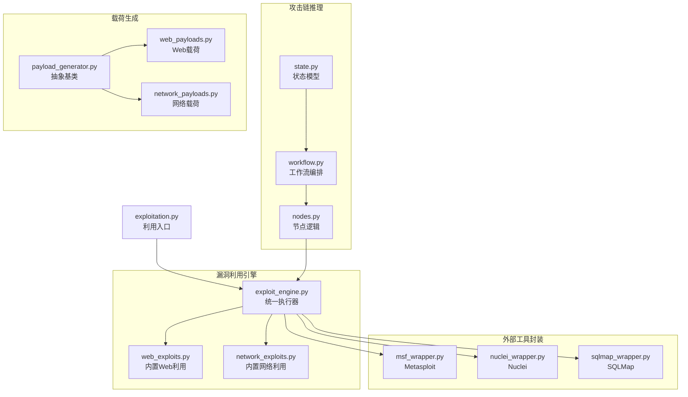
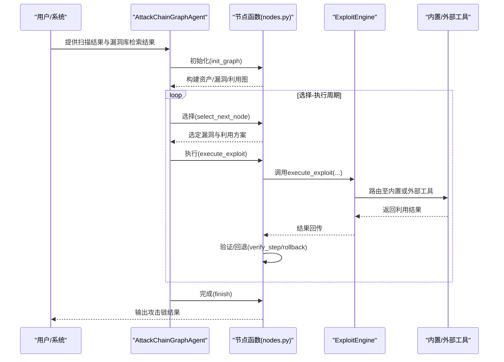
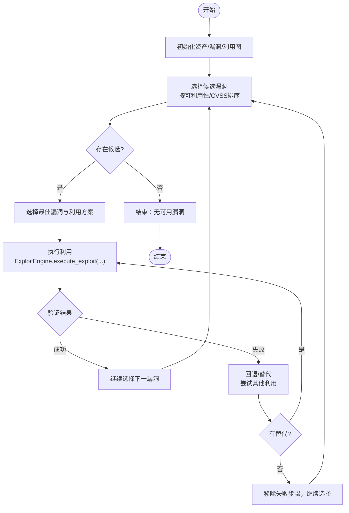
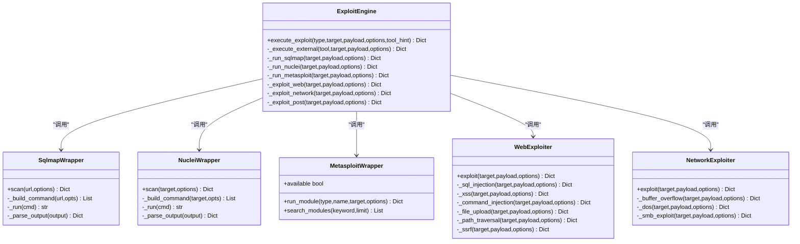
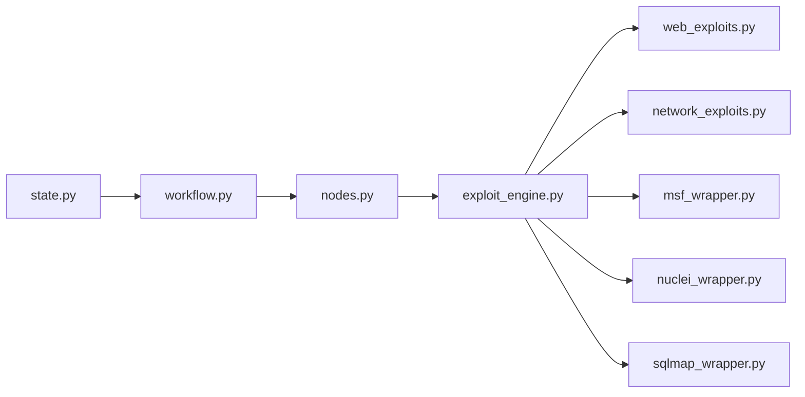

# 漏洞利用阶段

<cite>
**本文引用的文件**
- [exploitation.py](file://core/attack_chain/exploitation.py)
- [exploit_engine.py](file://tools/offense/exploit/exploit_engine.py)
- [msf_wrapper.py](file://tools/offense/exploit/msf_wrapper.py)
- [nuclei_wrapper.py](file://tools/offense/exploit/nuclei_wrapper.py)
- [sqlmap_wrapper.py](file://tools/offense/exploit/sqlmap_wrapper.py)
- [web_exploits.py](file://tools/offense/exploit/web_exploits.py)
- [network_exploits.py](file://tools/offense/exploit/network_exploits.py)
- [payload_generator.py](file://payloads/payload_generator.py)
- [web_payloads.py](file://payloads/web_payloads.py)
- [network_payloads.py](file://payloads/network_payloads.py)
- [workflow.py](file://core/attack_chain/graph/workflow.py)
- [nodes.py](file://core/attack_chain/graph/nodes.py)
- [state.py](file://core/attack_chain/graph/state.py)
</cite>

## 目录
1. [引言](#引言)
2. [项目结构](#项目结构)
3. [核心组件](#核心组件)
4. [架构总览](#架构总览)
5. [详细组件分析](#详细组件分析)
6. [依赖分析](#依赖分析)
7. [性能考虑](#性能考虑)
8. [故障排除指南](#故障排除指南)
9. [结论](#结论)
10. [附录](#附录)

## 引言
本章节聚焦Secbot“漏洞利用阶段”的设计与实现，系统阐述LangGraph攻击链推理机制与智能决策流程，覆盖攻击步骤的生成、选择与执行策略；详解Metasploit、Nuclei、SQLMap等外部工具的封装与调用方式；说明Web与网络攻击载荷的生成与定制方法；并给出针对不同漏洞类型的利用策略与最佳实践，辅以可复用的利用案例与结果呈现思路。

## 项目结构
围绕漏洞利用阶段的关键代码分布在以下模块：
- 攻击链推理与调度：core/attack_chain/graph
- 漏洞利用引擎与外部工具封装：tools/offense/exploit
- 内置Web/网络漏洞利用器：tools/offense/exploit/web_exploits.py、network_exploits.py
- 外部工具封装：msf_wrapper.py、nuclei_wrapper.py、sqlmap_wrapper.py
- 载荷生成器：payloads/web_payloads.py、network_payloads.py、payload_generator.py
- 漏洞利用入口：core/attack_chain/exploitation.py

图表来源
- [workflow.py](file://core/attack_chain/graph/workflow.py#L1-L206)
- [nodes.py](file://core/attack_chain/graph/nodes.py#L1-L376)
- [state.py](file://core/attack_chain/graph/state.py#L1-L129)
- [exploit_engine.py](file://tools/offense/exploit/exploit_engine.py#L1-L160)
- [web_exploits.py](file://tools/offense/exploit/web_exploits.py#L1-L304)
- [network_exploits.py](file://tools/offense/exploit/network_exploits.py#L1-L129)
- [msf_wrapper.py](file://tools/offense/exploit/msf_wrapper.py#L1-L251)
- [nuclei_wrapper.py](file://tools/offense/exploit/nuclei_wrapper.py#L1-L142)
- [sqlmap_wrapper.py](file://tools/offense/exploit/sqlmap_wrapper.py#L1-L121)
- [payload_generator.py](file://payloads/payload_generator.py#L1-L16)
- [web_payloads.py](file://payloads/web_payloads.py#L1-L125)
- [network_payloads.py](file://payloads/network_payloads.py#L1-L43)
- [exploitation.py](file://core/attack_chain/exploitation.py#L1-L36)

章节来源
- [exploitation.py](file://core/attack_chain/exploitation.py#L1-L36)
- [exploit_engine.py](file://tools/offense/exploit/exploit_engine.py#L1-L160)
- [workflow.py](file://core/attack_chain/graph/workflow.py#L1-L206)

## 核心组件
- 攻击链推理与调度
  - AttackChainGraphAgent：根据扫描结果与漏洞库检索结果构建资产-漏洞-利用图，驱动LangGraph或回退执行器，实现“选择-执行-验证-回退/替代-完成”的闭环。
  - 节点函数：init_graph、select_next_node、execute_exploit、verify_step、rollback_or_alternative、finish。
  - 状态模型：AttackChainState、AttackStep、AttackChainResult、VulnNode、ExploitNodeData等。
- 漏洞利用引擎
  - ExploitEngine：统一入口，支持内置Web/网络/后渗透利用与外部工具（Metasploit、Nuclei、SQLMap）调用，自动路由与回退。
- 外部工具封装
  - MetasploitWrapper：支持RPC与CLI两种模式，提供模块执行、搜索、RC脚本生成与超时控制。
  - NucleiWrapper：封装Nuclei CLI，解析JSON Lines输出，支持模板、严重性、标签与速率限制等参数。
  - SqlmapWrapper：封装SQLMap CLI，解析输出判断可注入性，支持等级、风险、技术与DBMS指定。
- 内置利用器
  - WebExploiter：内置SQL注入、XSS、命令注入、文件上传、路径遍历、SSRF等测试逻辑。
  - NetworkExploiter：内置缓冲区溢出、DoS、SMB利用框架（待扩展）。
- 载荷生成器
  - PayloadGenerator抽象基类，WebPayloadGenerator与NetworkPayloadGenerator分别生成Web与网络载荷集合。

章节来源
- [exploit_engine.py](file://tools/offense/exploit/exploit_engine.py#L1-L160)
- [msf_wrapper.py](file://tools/offense/exploit/msf_wrapper.py#L1-L251)
- [nuclei_wrapper.py](file://tools/offense/exploit/nuclei_wrapper.py#L1-L142)
- [sqlmap_wrapper.py](file://tools/offense/exploit/sqlmap_wrapper.py#L1-L121)
- [web_exploits.py](file://tools/offense/exploit/web_exploits.py#L1-L304)
- [network_exploits.py](file://tools/offense/exploit/network_exploits.py#L1-L129)
- [payload_generator.py](file://payloads/payload_generator.py#L1-L16)
- [web_payloads.py](file://payloads/web_payloads.py#L1-L125)
- [network_payloads.py](file://payloads/network_payloads.py#L1-L43)
- [workflow.py](file://core/attack_chain/graph/workflow.py#L1-L206)
- [nodes.py](file://core/attack_chain/graph/nodes.py#L1-L376)
- [state.py](file://core/attack_chain/graph/state.py#L1-L129)

## 架构总览
本阶段采用“图驱动+工具桥接”的架构：LangGraph负责高层决策与路径规划，ExploitEngine作为执行中枢，将具体漏洞类型映射到内置利用器或外部工具封装，形成“推理-路由-执行-反馈”的闭环。

图表来源
- [workflow.py](file://core/attack_chain/graph/workflow.py#L46-L96)
- [nodes.py](file://core/attack_chain/graph/nodes.py#L192-L353)
- [exploit_engine.py](file://tools/offense/exploit/exploit_engine.py#L18-L160)

## 详细组件分析

### LangGraph攻击链推理机制与智能决策
- 状态建模
  - 资产节点：记录主机、IP、端口、服务等。
  - 漏洞节点：记录漏洞ID、描述、可利用性、CVSS评分、漏洞类型、关联资产。
  - 权限节点：记录权限级别与访问类型。
  - 利用节点：记录漏洞ID、载荷类型、工具、前置条件、命令。
  - 攻击步骤：记录步骤ID、目标、漏洞ID、工具、载荷、状态、结果、错误、替代尝试次数、获得权限。
  - 攻击链结果：记录成功与否、目标、步骤、回退历史、最终权限、摘要。
- 决策流程
  - 初始化：从扫描结果与漏洞库构建资产、漏洞、利用图，若无可用利用则补全内置利用。
  - 选择：按可利用性与CVSS降序排序候选漏洞，跳过已访问漏洞，选择最佳目标与利用方案。
  - 执行：调用ExploitEngine执行利用，记录结果与权限提升。
  - 验证：根据结果判定成功或失败，成功则继续，失败则进入回退。
  - 回退/替代：查找同漏洞的替代利用，最多尝试限定次数；否则移除失败步骤，继续选择。
  - 完成：汇总成功步骤、回退次数与最终权限，生成摘要。
- 回退机制
  - 当LangGraph不可用时，使用纯Python有限状态机回退执行，保证功能可用性。

图表来源
- [nodes.py](file://core/attack_chain/graph/nodes.py#L122-L353)
- [state.py](file://core/attack_chain/graph/state.py#L18-L129)

章节来源
- [workflow.py](file://core/attack_chain/graph/workflow.py#L28-L188)
- [nodes.py](file://core/attack_chain/graph/nodes.py#L35-L376)
- [state.py](file://core/attack_chain/graph/state.py#L18-L129)

### 漏洞利用引擎与外部工具集成
- 统一入口
  - execute_exploit根据exploit_type与tool_hint路由到内置或外部工具；未指定工具时默认使用内置。
- 外部工具路由
  - sqlmap：调用SqlmapWrapper，支持超时、等级、风险、技术、DBMS、混淆脚本等参数。
  - nuclei：调用NucleiWrapper，支持模板、严重性、标签、速率限制等参数。
  - metasploit：调用MetasploitWrapper，支持RPC与CLI两种模式，模块类型与选项通过options传递。
- 内置利用器
  - WebExploiter：内置SQL注入、XSS、命令注入、文件上传、路径遍历、SSRF等测试。
  - NetworkExploiter：内置缓冲区溢出、DoS、SMB利用框架。

图表来源
- [exploit_engine.py](file://tools/offense/exploit/exploit_engine.py#L18-L160)
- [sqlmap_wrapper.py](file://tools/offense/exploit/sqlmap_wrapper.py#L29-L121)
- [nuclei_wrapper.py](file://tools/offense/exploit/nuclei_wrapper.py#L27-L142)
- [msf_wrapper.py](file://tools/offense/exploit/msf_wrapper.py#L75-L251)
- [web_exploits.py](file://tools/offense/exploit/web_exploits.py#L19-L304)
- [network_exploits.py](file://tools/offense/exploit/network_exploits.py#L17-L129)

章节来源
- [exploit_engine.py](file://tools/offense/exploit/exploit_engine.py#L18-L160)

### 攻击载荷生成与定制
- 抽象基类
  - PayloadGenerator定义generate接口，用于生成指定类型的载荷列表。
- Web载荷
  - SQL注入：包含通用与数据库特定payload集合。
  - XSS：包含多种触发方式与编码变体。
  - 命令注入：包含Unix与Windows常用命令注入payload。
  - 路径遍历：包含多种绕过形式。
- 网络载荷
  - 缓冲区溢出：按大小生成填充字节序列。
  - Shellcode：提供NOP sled示例，实际应结合目标平台生成。
- 使用建议
  - Web载荷：优先使用编码变体与多场景payload组合，提高命中率。
  - 网络载荷：根据协议与目标系统生成匹配的shellcode或溢出payload。

章节来源
- [payload_generator.py](file://payloads/payload_generator.py#L8-L16)
- [web_payloads.py](file://payloads/web_payloads.py#L11-L125)
- [network_payloads.py](file://payloads/network_payloads.py#L11-L43)

### 不同漏洞类型的利用策略与最佳实践
- Web漏洞
  - SQL注入：先用通用payload探测，再根据DB类型选择针对性payload；结合SQLMap进行深度检测。
  - XSS：多场景payload组合（DOM/XSS、反射XSS、存储XSS），关注编码与上下文。
  - 命令注入：区分Unix与Windows命令分隔符与系统差异，结合系统信息辅助payload选择。
  - 文件上传：构造WebShell并验证可访问性，注意上传路径与权限。
  - 路径遍历：多编码与路径分隔符组合，结合敏感文件特征识别。
  - SSRF：内网探测payload（127.0.0.1、localhost、file协议、gopher等）。
- 网络漏洞
  - 缓冲区溢出：根据目标服务协议构造溢出payload，结合调试信息优化。
  - DoS：模拟高并发连接，评估服务抗压能力。
  - SMB：结合漏洞库与目标版本，选择合适模块与payload。
- 工具选择
  - Metasploit：适合成熟漏洞与权限提升，需准备模块与会话管理。
  - Nuclei：适合快速扫描与模板化检测，支持标签与严重性筛选。
  - SQLMap：适合SQL注入深度挖掘，支持技术选择与DBMS指定。

章节来源
- [web_exploits.py](file://tools/offense/exploit/web_exploits.py#L46-L304)
- [network_exploits.py](file://tools/offense/exploit/network_exploits.py#L38-L129)
- [exploit_engine.py](file://tools/offense/exploit/exploit_engine.py#L105-L151)

### 利用案例与结果展示
- 案例1：Web SQL注入
  - 步骤：选择SQL注入漏洞→内置WebExploiter执行→检测响应中SQL错误关键词→记录可利用payload与状态码。
  - 结果：返回vulnerable标志、匹配payload与统计信息。
- 案例2：Nuclei模板扫描
  - 步骤：选择CVE/指纹类漏洞→NucleiWrapper执行→解析JSON Lines输出→按严重性与标签筛选。
  - 结果：返回findings列表与matched标志。
- 案例3：Metasploit模块执行
  - 步骤：选择MSF模块→MetasploitWrapper执行→RPC/CLI模式运行→收集会话信息。
  - 结果：返回success、sessions或错误信息。
- 案例4：SQLMap注入检测
  - 步骤：选择SQLMap→构建命令（等级、风险、技术、DBMS）→执行并解析输出。
  - 结果：返回injectable标志与细节列表。

章节来源
- [exploit_engine.py](file://tools/offense/exploit/exploit_engine.py#L105-L151)
- [nuclei_wrapper.py](file://tools/offense/exploit/nuclei_wrapper.py#L27-L142)
- [msf_wrapper.py](file://tools/offense/exploit/msf_wrapper.py#L75-L251)
- [sqlmap_wrapper.py](file://tools/offense/exploit/sqlmap_wrapper.py#L29-L121)
- [web_exploits.py](file://tools/offense/exploit/web_exploits.py#L46-L101)

## 依赖分析
- 组件耦合
  - ExploitEngine对内置利用器与外部工具封装存在直接依赖，便于统一调度与回退。
  - nodes.py依赖ExploitEngine执行利用，同时维护AttackChainState状态流转。
  - workflow.py在LangGraph可用时编译StateGraph，在不可用时回退到nodes.py的有限状态机。
- 外部依赖
  - MetasploitWrapper依赖msfrpc或msfconsole；NucleiWrapper依赖nuclei CLI；SqlmapWrapper依赖sqlmap。
- 循环与风险
  - 节点间通过状态字段next_action与current_path解耦，避免直接循环调用。
  - 外部工具封装提供available属性与超时控制，降低阻塞风险。

图表来源
- [workflow.py](file://core/attack_chain/graph/workflow.py#L102-L149)
- [nodes.py](file://core/attack_chain/graph/nodes.py#L192-L353)
- [exploit_engine.py](file://tools/offense/exploit/exploit_engine.py#L18-L160)

章节来源
- [workflow.py](file://core/attack_chain/graph/workflow.py#L1-L206)
- [nodes.py](file://core/attack_chain/graph/nodes.py#L1-L376)
- [exploit_engine.py](file://tools/offense/exploit/exploit_engine.py#L1-L160)

## 性能考虑
- 异步执行
  - ExploitEngine与各工具封装均采用异步I/O，减少阻塞，提升吞吐。
- 超时控制
  - MetasploitWrapper、NucleiWrapper、SqlmapWrapper均设置超时参数，避免长时间等待。
- 结果缓存与裁剪
  - ExploitEngine维护结果列表，支持limit裁剪；各工具封装返回结构化结果，便于后续聚合。
- 路由与回退
  - 当外部工具不可用时自动回退到内置利用器，保障执行连续性。

## 故障排除指南
- 外部工具不可用
  - 现象：工具返回不可用或超时。
  - 处理：检查PATH中工具是否存在；确认RPC配置或CLI可用性；查看日志与错误信息。
- 利用失败
  - 现象：步骤状态为FAILED，携带错误信息。
  - 处理：尝试替代利用；调整payload或参数；检查目标服务状态。
- LangGraph不可用
  - 现象：日志提示未安装langgraph，使用回退执行器。
  - 处理：安装langgraph以启用编译态图；或接受回退执行器的等价行为。

章节来源
- [msf_wrapper.py](file://tools/offense/exploit/msf_wrapper.py#L36-L104)
- [nuclei_wrapper.py](file://tools/offense/exploit/nuclei_wrapper.py#L46-L71)
- [sqlmap_wrapper.py](file://tools/offense/exploit/sqlmap_wrapper.py#L49-L72)
- [workflow.py](file://core/attack_chain/graph/workflow.py#L20-L26)
- [nodes.py](file://core/attack_chain/graph/nodes.py#L224-L227)

## 结论
本阶段通过LangGraph构建的攻击链推理与ExploitEngine的统一调度，实现了从漏洞发现到利用执行的闭环。内置Web/网络利用器与外部工具封装（Metasploit、Nuclei、SQLMap）协同工作，既保证了灵活性，又提供了稳健的回退机制。配合可扩展的载荷生成体系，能够针对不同漏洞类型制定高效、可验证的利用策略与最佳实践。

## 附录
- 利用入口
  - Exploitation.exploit_vulnerabilities：批量利用发现的漏洞，调用ExploitEngine执行并聚合结果。
- 参数与选项
  - ExploitEngine.execute_exploit支持tool_hint与options，用于指定工具与传递模块/扫描参数。
  - 各工具封装提供timeout、level、risk、technique、dbms、templates、severity、tags、rate_limit等参数。

章节来源
- [exploitation.py](file://core/attack_chain/exploitation.py#L14-L36)
- [exploit_engine.py](file://tools/offense/exploit/exploit_engine.py#L18-L69)
- [nuclei_wrapper.py](file://tools/offense/exploit/nuclei_wrapper.py#L32-L97)
- [sqlmap_wrapper.py](file://tools/offense/exploit/sqlmap_wrapper.py#L33-L88)
- [msf_wrapper.py](file://tools/offense/exploit/msf_wrapper.py#L75-L93)