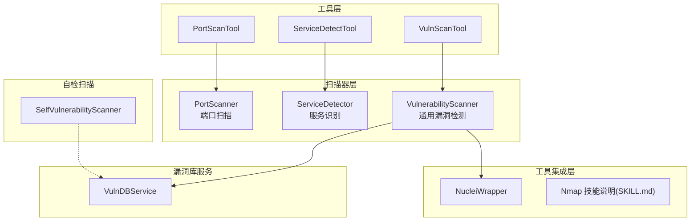
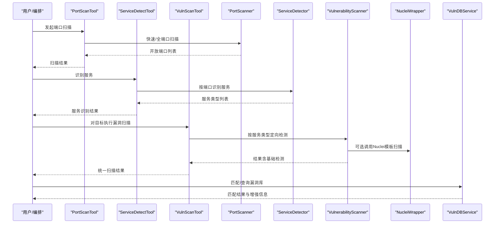
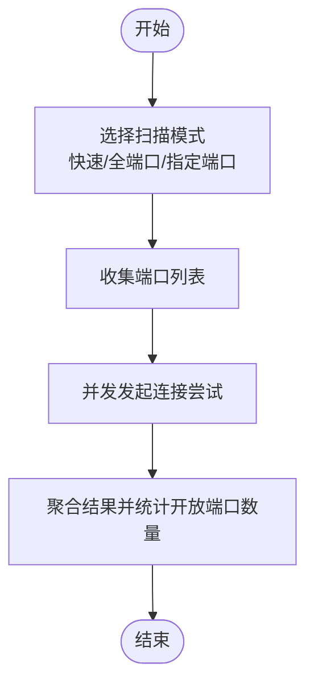
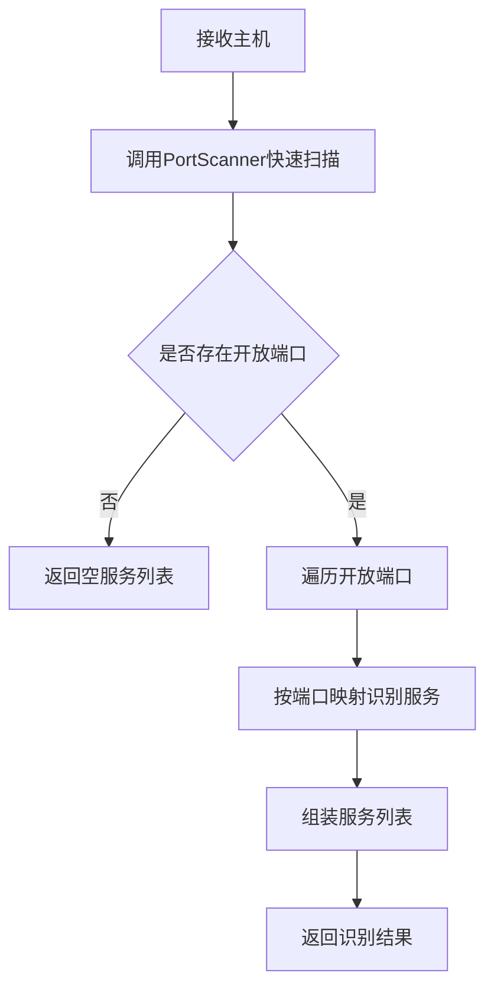
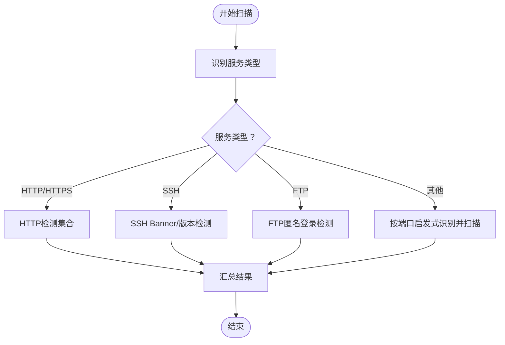
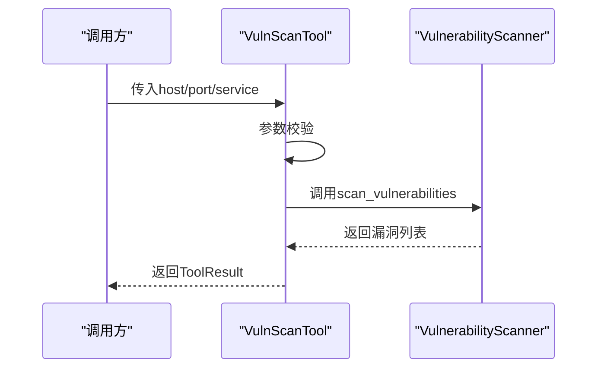
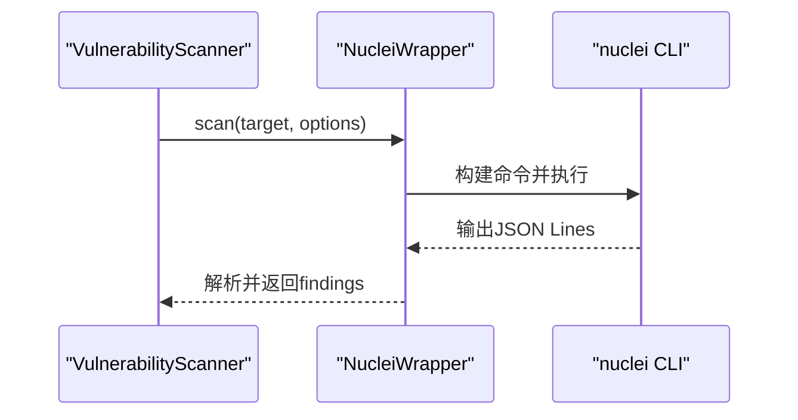
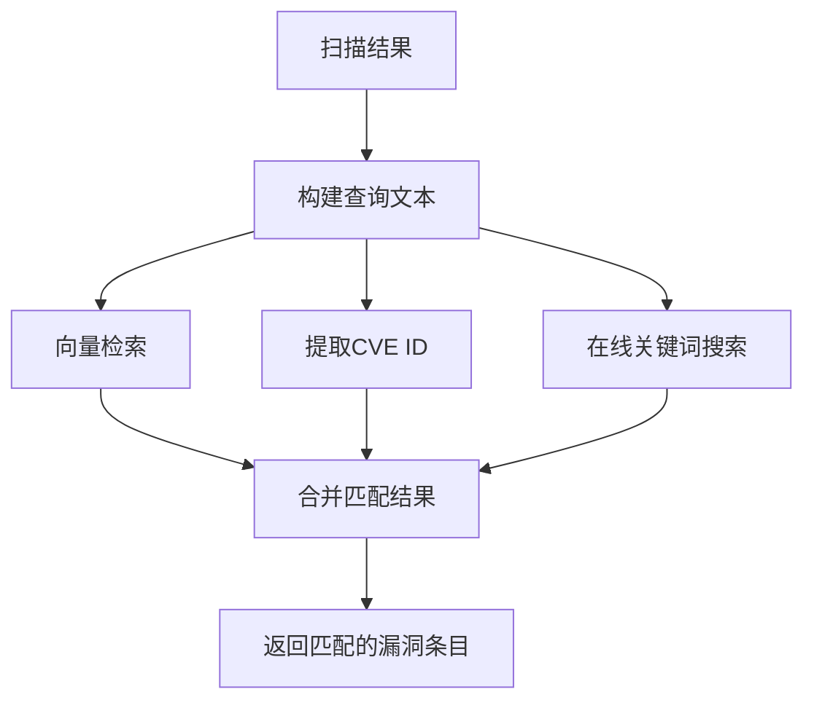
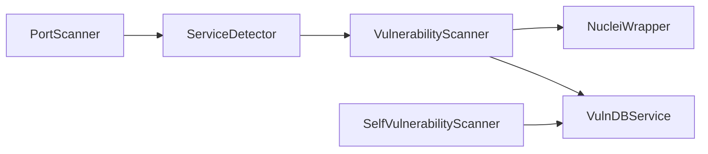

# 漏洞扫描阶段

<cite>
**本文引用的文件**
- [scanner/port_scanner.py](file://scanner/port_scanner.py)
- [scanner/service_detector.py](file://scanner/service_detector.py)
- [scanner/vulnerability_scanner.py](file://scanner/vulnerability_scanner.py)
- [tools/pentest/security/port_scan_tool.py](file://tools/pentest/security/port_scan_tool.py)
- [tools/pentest/security/service_detect_tool.py](file://tools/pentest/security/service_detect_tool.py)
- [tools/pentest/security/vuln_scan_tool.py](file://tools/pentest/security/vuln_scan_tool.py)
- [tools/offense/exploit/nuclei_wrapper.py](file://tools/offense/exploit/nuclei_wrapper.py)
- [skills/base/nmap-usage/SKILL.md](file://skills/base/nmap-usage/SKILL.md)
- [core/vuln_db/vuln_db_service.py](file://core/vuln_db/vuln_db_service.py)
- [defense/vulnerability_scanner.py](file://defense/vulnerability_scanner.py)
</cite>

## 目录
1. [引言](#引言)
2. [项目结构](#项目结构)
3. [核心组件](#核心组件)
4. [架构总览](#架构总览)
5. [详细组件分析](#详细组件分析)
6. [依赖关系分析](#依赖关系分析)
7. [性能考量](#性能考量)
8. [故障排查指南](#故障排查指南)
9. [结论](#结论)
10. [附录](#附录)

## 引言
本章节聚焦Secbot在“漏洞扫描阶段”的实现与使用，系统阐述端口扫描、服务识别、漏洞检测三者的协同工作机制；说明如何集成Nmap、Nuclei等专业工具；给出漏洞分类与严重性评估机制；并提供面向不同服务与协议的扫描策略、实际扫描案例与结果分析思路。文档同时覆盖扫描结果与漏洞库的匹配、验证与确认流程，帮助读者在真实环境中高效落地。

## 项目结构
围绕漏洞扫描阶段的关键代码分布在以下模块：
- 扫描器层：端口扫描、服务识别、通用漏洞检测
- 工具层：封装为可调用工具，供上层编排与自动化
- 工具集成层：Nmap、Nuclei等外部工具的封装与调用
- 漏洞库服务：统一漏洞数据源与向量检索，辅助结果匹配与增强
- 自检扫描：对部署主机自身的安全状况进行扫描

图表来源
- [scanner/port_scanner.py](file://scanner/port_scanner.py#L14-L63)
- [scanner/service_detector.py](file://scanner/service_detector.py#L29-L56)
- [scanner/vulnerability_scanner.py](file://scanner/vulnerability_scanner.py#L254-L289)
- [tools/pentest/security/port_scan_tool.py](file://tools/pentest/security/port_scan_tool.py#L6-L50)
- [tools/pentest/security/service_detect_tool.py](file://tools/pentest/security/service_detect_tool.py#L6-L50)
- [tools/pentest/security/vuln_scan_tool.py](file://tools/pentest/security/vuln_scan_tool.py#L6-L55)
- [tools/offense/exploit/nuclei_wrapper.py](file://tools/offense/exploit/nuclei_wrapper.py#L16-L142)
- [core/vuln_db/vuln_db_service.py](file://core/vuln_db/vuln_db_service.py#L27-L275)
- [defense/vulnerability_scanner.py](file://defense/vulnerability_scanner.py#L12-L314)

章节来源
- [scanner/port_scanner.py](file://scanner/port_scanner.py#L1-L63)
- [scanner/service_detector.py](file://scanner/service_detector.py#L1-L56)
- [scanner/vulnerability_scanner.py](file://scanner/vulnerability_scanner.py#L1-L289)
- [tools/pentest/security/port_scan_tool.py](file://tools/pentest/security/port_scan_tool.py#L1-L50)
- [tools/pentest/security/service_detect_tool.py](file://tools/pentest/security/service_detect_tool.py#L1-L50)
- [tools/pentest/security/vuln_scan_tool.py](file://tools/pentest/security/vuln_scan_tool.py#L1-L55)
- [tools/offense/exploit/nuclei_wrapper.py](file://tools/offense/exploit/nuclei_wrapper.py#L1-L142)
- [core/vuln_db/vuln_db_service.py](file://core/vuln_db/vuln_db_service.py#L1-L275)
- [defense/vulnerability_scanner.py](file://defense/vulnerability_scanner.py#L1-L314)

## 核心组件
- 端口扫描器：基于TCP connect的并发端口探测，支持快速扫描与全端口扫描，返回每个端口的开放状态与统计。
- 服务识别器：依据端口映射快速识别服务类型（如http/https/ssh/ftp等），作为后续定向漏洞检测的输入。
- 通用漏洞扫描器：针对HTTP/HTTPS/SSH/FTP等服务执行专项检测，包括敏感路径暴露、安全响应头缺失、目录列表、SSH版本风险、FTP匿名登录等。
- 工具封装：将上述能力封装为可调用工具，便于在工作流中组合使用。
- 外部工具集成：Nuclei封装用于Web类模板扫描；Nmap技能说明提供专业扫描技术参考。
- 漏洞库服务：统一多源漏洞数据，支持按扫描结果匹配、CVE精确查询、自然语言检索与向量索引。
- 自检扫描：对部署主机进行系统、网络与应用层面的安全扫描，辅助内控与合规。

章节来源
- [scanner/port_scanner.py](file://scanner/port_scanner.py#L14-L63)
- [scanner/service_detector.py](file://scanner/service_detector.py#L29-L56)
- [scanner/vulnerability_scanner.py](file://scanner/vulnerability_scanner.py#L254-L289)
- [tools/pentest/security/port_scan_tool.py](file://tools/pentest/security/port_scan_tool.py#L6-L50)
- [tools/pentest/security/service_detect_tool.py](file://tools/pentest/security/service_detect_tool.py#L6-L50)
- [tools/pentest/security/vuln_scan_tool.py](file://tools/pentest/security/vuln_scan_tool.py#L6-L55)
- [tools/offense/exploit/nuclei_wrapper.py](file://tools/offense/exploit/nuclei_wrapper.py#L16-L142)
- [core/vuln_db/vuln_db_service.py](file://core/vuln_db/vuln_db_service.py#L27-L275)
- [defense/vulnerability_scanner.py](file://defense/vulnerability_scanner.py#L12-L314)

## 架构总览
下图展示从“端口扫描—服务识别—漏洞检测—结果增强”的整体流程，以及与外部工具和漏洞库的交互。

图表来源
- [tools/pentest/security/port_scan_tool.py](file://tools/pentest/security/port_scan_tool.py#L17-L37)
- [tools/pentest/security/service_detect_tool.py](file://tools/pentest/security/service_detect_tool.py#L17-L36)
- [tools/pentest/security/vuln_scan_tool.py](file://tools/pentest/security/vuln_scan_tool.py#L17-L41)
- [scanner/port_scanner.py](file://scanner/port_scanner.py#L33-L54)
- [scanner/service_detector.py](file://scanner/service_detector.py#L42-L55)
- [scanner/vulnerability_scanner.py](file://scanner/vulnerability_scanner.py#L257-L288)
- [tools/offense/exploit/nuclei_wrapper.py](file://tools/offense/exploit/nuclei_wrapper.py#L27-L71)
- [core/vuln_db/vuln_db_service.py](file://core/vuln_db/vuln_db_service.py#L90-L145)

## 详细组件分析

### 端口扫描器（PortScanner）
- 功能要点
  - 支持快速扫描（常见端口集合）与全端口扫描（扩展端口范围）
  - 并发探测，返回每个端口的开放状态与统计
- 关键行为
  - 使用异步连接尝试判断端口连通性
  - 对异常进行容错，确保扫描稳定性
- 性能特性
  - 并发度高，适合大规模主机与端口的快速探测
  - 可通过调整超时时间平衡速度与准确性

图表来源
- [scanner/port_scanner.py](file://scanner/port_scanner.py#L33-L54)

章节来源
- [scanner/port_scanner.py](file://scanner/port_scanner.py#L14-L63)

### 服务识别器（ServiceDetector）
- 功能要点
  - 基于端口映射识别服务类型（如http/https/ssh/ftp/mysql/postgresql等）
  - 可对主机所有开放端口进行批量识别
- 与端口扫描联动
  - 依赖PortScanner的快速扫描结果，先发现开放端口，再识别服务类型
- 输出结构
  - 返回每个端口对应的服务名称、类型与版本占位

图表来源
- [scanner/service_detector.py](file://scanner/service_detector.py#L42-L55)
- [scanner/port_scanner.py](file://scanner/port_scanner.py#L56-L58)

章节来源
- [scanner/service_detector.py](file://scanner/service_detector.py#L29-L56)

### 通用漏洞扫描器（VulnerabilityScanner）
- 功能要点
  - 针对HTTP/HTTPS/SSH/FTP执行专项检测
  - HTTP检测：敏感路径暴露、安全响应头缺失、目录列表
  - SSH检测：Banner解析与版本判定
  - FTP检测：匿名登录试探
  - 对未知服务类型按端口进行启发式识别与扫描
- 关键算法与逻辑
  - HTTP敏感路径检测：对预定义路径发起GET请求，依据状态码判断风险等级
  - 安全响应头检测：检查缺失项并给出建议
  - 目录列表检测：基于响应体特征进行启发式判断
  - SSH版本判定：正则提取版本号并与阈值比较
  - FTP匿名登录：USER/PASS流程试探
- 并发与异步
  - 使用事件循环与线程池执行阻塞IO，提升吞吐
- 错误处理
  - 对异常进行捕获与降级，保证扫描链路稳定

图表来源
- [scanner/vulnerability_scanner.py](file://scanner/vulnerability_scanner.py#L257-L288)

章节来源
- [scanner/vulnerability_scanner.py](file://scanner/vulnerability_scanner.py#L1-L289)

### 工具封装（PortScanTool/ServiceDetectTool/VulnScanTool）
- 功能要点
  - 将扫描器能力封装为可调用工具，支持参数校验与结构化返回
  - VulnScanTool支持host/target、port、service等参数
- 适用场景
  - 编排自动化扫描流程，组合端口扫描与服务识别，再执行漏洞检测
  - 作为Agent工作流中的原子能力节点

图表来源
- [tools/pentest/security/vuln_scan_tool.py](file://tools/pentest/security/vuln_scan_tool.py#L17-L41)
- [scanner/vulnerability_scanner.py](file://scanner/vulnerability_scanner.py#L257-L288)

章节来源
- [tools/pentest/security/port_scan_tool.py](file://tools/pentest/security/port_scan_tool.py#L1-L50)
- [tools/pentest/security/service_detect_tool.py](file://tools/pentest/security/service_detect_tool.py#L1-L50)
- [tools/pentest/security/vuln_scan_tool.py](file://tools/pentest/security/vuln_scan_tool.py#L1-L55)

### 外部工具集成（NucleiWrapper 与 Nmap 技能）
- NucleiWrapper
  - 通过子进程调用nuclei，解析JSON Lines输出，返回结构化结果
  - 支持模板选择、严重性过滤、标签过滤、速率限制等参数
  - 超时控制与异常处理，保障稳定性
- Nmap 技能说明
  - 提供Nmap专业扫描技术与优化策略，涵盖计时、端口选择、服务检测、OS检测、输出格式与NSE脚本等
  - 适用于授权环境下的网络侦察与服务枚举

图表来源
- [tools/offense/exploit/nuclei_wrapper.py](file://tools/offense/exploit/nuclei_wrapper.py#L27-L71)
- [scanner/vulnerability_scanner.py](file://scanner/vulnerability_scanner.py#L257-L288)

章节来源
- [tools/offense/exploit/nuclei_wrapper.py](file://tools/offense/exploit/nuclei_wrapper.py#L1-L142)
- [skills/base/nmap-usage/SKILL.md](file://skills/base/nmap-usage/SKILL.md#L1-L102)

### 漏洞库服务（VulnDBService）
- 功能要点
  - 整合多数据源适配器（CVE/NVD/ExploitDB/Mitre）
  - 提供向量检索与关键词在线搜索，支持按扫描结果匹配、CVE精确查询、自然语言检索
  - 将扫描结果与漏洞库进行关联，提升结果可信度与可追溯性
- 匹配流程
  - 以“漏洞类型+描述+严重性”构建查询文本
  - 向量检索优先，其次提取CVE ID直接查询，最后在线关键词搜索补充
- 应用价值
  - 为扫描结果提供权威背景信息与缓解建议
  - 支持后续验证与确认流程

图表来源
- [core/vuln_db/vuln_db_service.py](file://core/vuln_db/vuln_db_service.py#L90-L145)

章节来源
- [core/vuln_db/vuln_db_service.py](file://core/vuln_db/vuln_db_service.py#L27-L275)

### 自检扫描（SelfVulnerabilityScanner）
- 功能要点
  - 对部署主机进行系统、网络与应用层面的安全扫描
  - 检查系统更新、不必要的服务、文件权限、开放不安全端口、防火墙状态、SSH配置等
- 适用场景
  - 安全基线检查、合规审计、内控自检
- 与漏洞库结合
  - 可将自检结果纳入漏洞库匹配，形成闭环

章节来源
- [defense/vulnerability_scanner.py](file://defense/vulnerability_scanner.py#L12-L314)

## 依赖关系分析
- 组件耦合
  - ServiceDetector依赖PortScanner的快速扫描结果
  - VulnScanTool依赖VulnerabilityScanner的定向检测能力
  - VulnerabilityScanner可选调用NucleiWrapper进行Web模板扫描
  - VulnDBService为扫描结果提供匹配与增强
- 外部依赖
  - NucleiWrapper依赖系统已安装nuclei
  - Nmap技能说明提供专业扫描策略参考
- 循环依赖
  - 当前模块间无明显循环依赖，职责清晰

图表来源
- [scanner/port_scanner.py](file://scanner/port_scanner.py#L44-L47)
- [scanner/service_detector.py](file://scanner/service_detector.py#L42-L55)
- [scanner/vulnerability_scanner.py](file://scanner/vulnerability_scanner.py#L257-L288)
- [tools/offense/exploit/nuclei_wrapper.py](file://tools/offense/exploit/nuclei_wrapper.py#L16-L25)
- [core/vuln_db/vuln_db_service.py](file://core/vuln_db/vuln_db_service.py#L27-L44)

章节来源
- [scanner/port_scanner.py](file://scanner/port_scanner.py#L1-L63)
- [scanner/service_detector.py](file://scanner/service_detector.py#L1-L56)
- [scanner/vulnerability_scanner.py](file://scanner/vulnerability_scanner.py#L1-L289)
- [tools/offense/exploit/nuclei_wrapper.py](file://tools/offense/exploit/nuclei_wrapper.py#L1-L142)
- [core/vuln_db/vuln_db_service.py](file://core/vuln_db/vuln_db_service.py#L1-L275)

## 性能考量
- 并发与超时
  - 端口扫描采用并发连接，合理设置超时避免长时间阻塞
  - HTTP检测使用线程池执行阻塞IO，提高吞吐
- 扫描粒度
  - 快速扫描优先，全端口扫描仅在需要时启用
  - 服务识别后按类型定向检测，减少无效探测
- 外部工具效率
  - Nuclei扫描可通过模板过滤与速率限制控制资源占用
  - Nmap技能说明中的计时与并行策略有助于在授权环境下高效完成侦察
- 存储与检索
  - 漏洞库向量检索阈值与维度需权衡准确率与性能

[本节为通用指导，无需特定文件引用]

## 故障排查指南
- 端口扫描
  - 现象：大量端口显示closed或超时
  - 排查：检查防火墙、网络策略、超时设置；尝试降低并发或增大超时
- 服务识别
  - 现象：识别结果为空或不准确
  - 排查：确认端口扫描结果；核对端口映射是否覆盖目标服务
- 漏洞检测
  - HTTP敏感路径检测无结果
  - 排查：确认目标URL构造与协议（http/https）；检查目标站点是否返回2xx/403等状态
  - SSH版本检测未命中
  - 排查：确认Banner格式与版本号提取规则；核对阈值设定
  - FTP匿名登录误报
  - 排查：确认服务器对USER/PASS流程的响应；避免对写操作的误判
- 外部工具
  - Nuclei未安装或不可用
  - 排查：确认nuclei在PATH中；检查命令构建与输出解析
- 漏洞库匹配
  - 匹配结果为空
  - 排查：检查查询文本构建；确认向量库是否已索引；尝试在线关键词搜索补充

章节来源
- [scanner/port_scanner.py](file://scanner/port_scanner.py#L20-L31)
- [scanner/vulnerability_scanner.py](file://scanner/vulnerability_scanner.py#L43-L54)
- [tools/offense/exploit/nuclei_wrapper.py](file://tools/offense/exploit/nuclei_wrapper.py#L46-L70)
- [core/vuln_db/vuln_db_service.py](file://core/vuln_db/vuln_db_service.py#L109-L145)

## 结论
Secbot的漏洞扫描阶段通过“端口扫描—服务识别—漏洞检测—结果增强”的流水线化设计，实现了对多协议与多服务类型的高效覆盖。内置的通用漏洞检测与外部工具（Nmap、Nuclei）集成，既满足快速发现，又具备深度验证能力。结合漏洞库服务，扫描结果得以结构化匹配与溯源，为后续验证与确认提供了坚实基础。建议在实际部署中根据目标网络与合规要求，灵活选择扫描策略与参数，并持续完善服务映射与检测规则。

[本节为总结性内容，无需特定文件引用]

## 附录

### 漏洞分类与严重性评估机制
- 分类维度
  - 服务类型（HTTP/HTTPS/SSH/FTP等）
  - 风险类别（信息泄露、未授权访问、配置缺陷等）
- 严重性分级
  - High/Medium/Low：依据影响面与利用难度综合判定
- 建议流程
  - 初筛：通用漏洞检测快速定位高危项
  - 深入：结合Nuclei模板与Nmap服务/OS检测
  - 匹配：通过漏洞库服务进行CVE与背景信息匹配
  - 验证：人工复核与最小化验证，排除误报

章节来源
- [scanner/vulnerability_scanner.py](file://scanner/vulnerability_scanner.py#L13-L32)
- [scanner/vulnerability_scanner.py](file://scanner/vulnerability_scanner.py#L67-L85)
- [scanner/vulnerability_scanner.py](file://scanner/vulnerability_scanner.py#L106-L112)
- [scanner/vulnerability_scanner.py](file://scanner/vulnerability_scanner.py#L128-L133)
- [scanner/vulnerability_scanner.py](file://scanner/vulnerability_scanner.py#L200-L207)
- [scanner/vulnerability_scanner.py](file://scanner/vulnerability_scanner.py#L244-L250)
- [core/vuln_db/vuln_db_service.py](file://core/vuln_db/vuln_db_service.py#L90-L145)

### 扫描策略与实际案例
- 策略要点
  - 先端口后服务，再定向漏洞检测
  - 对Web服务优先进行敏感路径与安全头检查
  - 对SSH/FTP等服务重点检查版本与认证配置
  - 使用Nuclei模板进行标准化漏洞验证
- 实际案例（步骤示意）
  - 步骤1：端口扫描（快速/全端口）
  - 步骤2：服务识别（按开放端口）
  - 步骤3：漏洞检测（按服务类型）
  - 步骤4：结果匹配（CVE/背景信息）
  - 步骤5：验证与确认（最小化验证/人工复核）
- 结果分析
  - 对高危项优先处置，中危项纳入整改计划，低危项持续监控
  - 结合自检扫描与合规基线，形成闭环

[本节为概念性内容，无需特定文件引用]