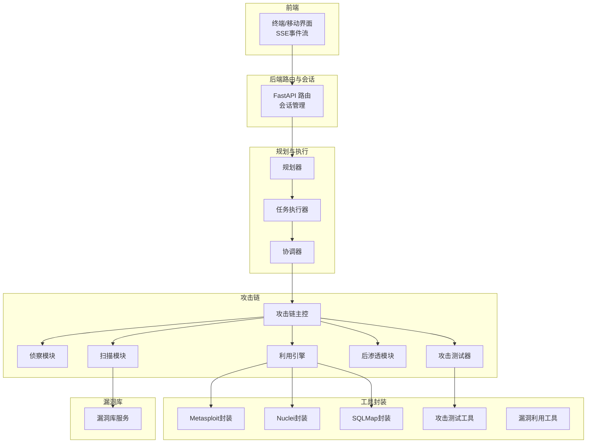
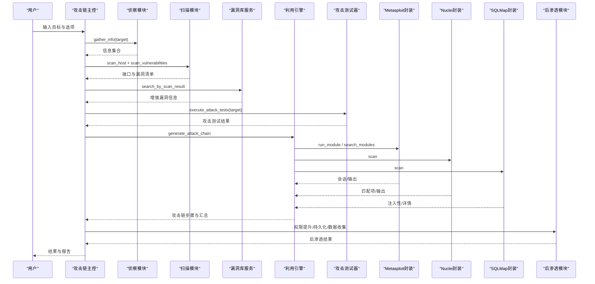
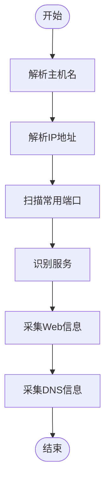
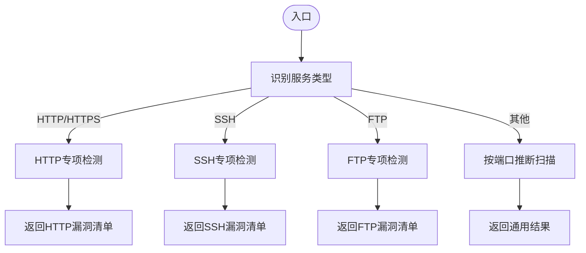
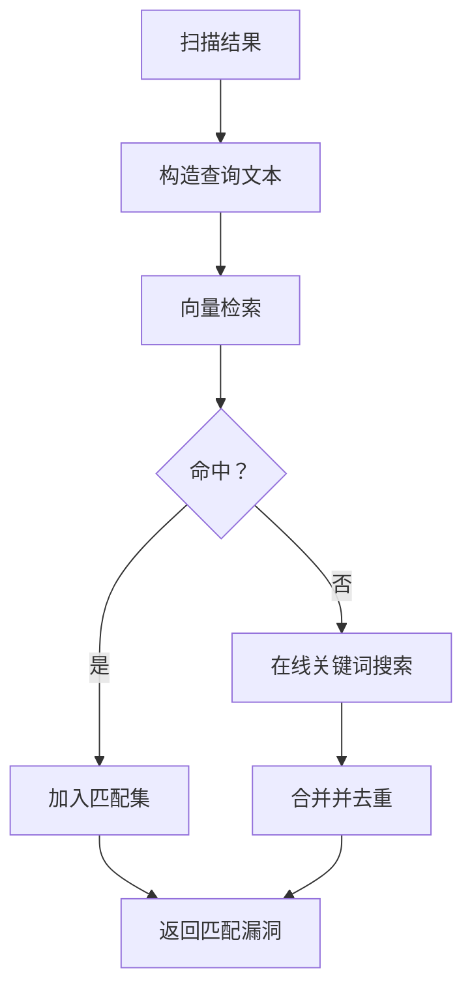
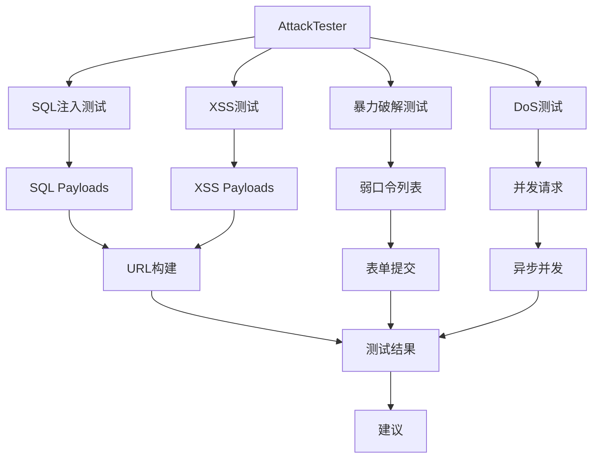
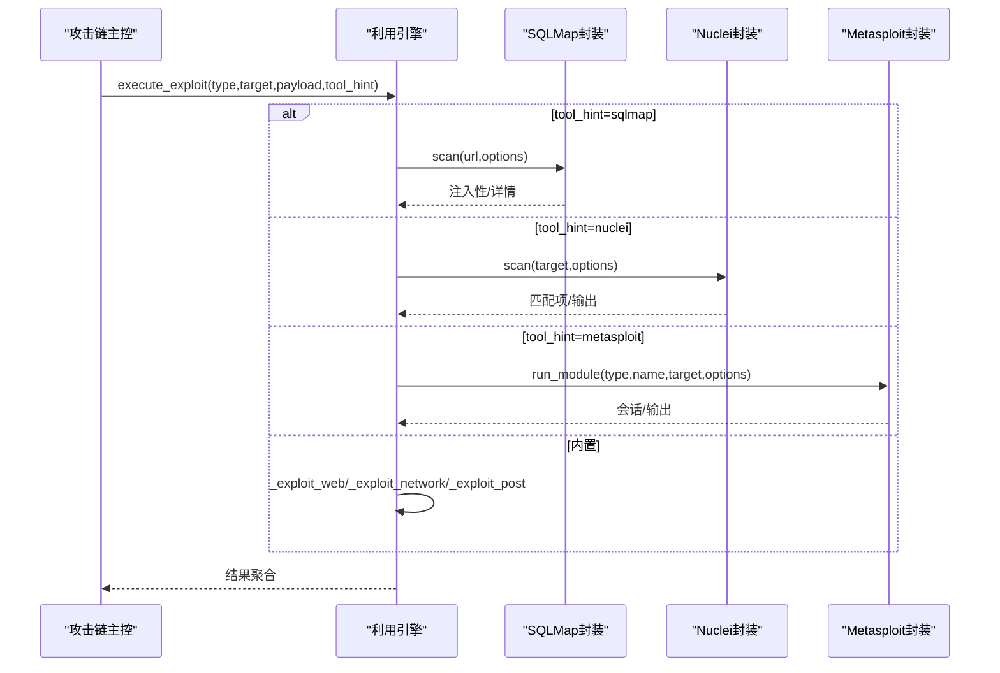
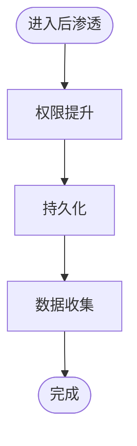
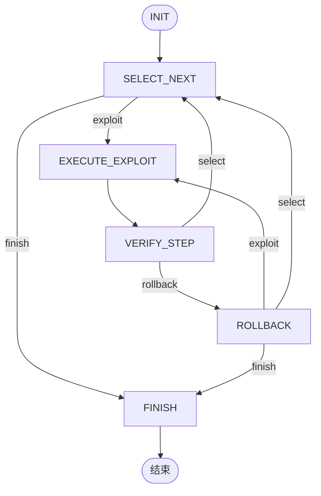
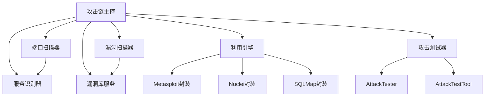

# 自动化渗透测试能力

<cite>
**本文引用的文件**
- [core/attack_chain/attack_chain.py](file://core/attack_chain/attack_chain.py)
- [core/attack_chain/reconnaissance.py](file://core/attack_chain/reconnaissance.py)
- [core/attack_chain/exploitation.py](file://core/attack_chain/exploitation.py)
- [core/attack_chain/post_exploitation.py](file://core/attack_chain/post_exploitation.py)
- [core/attack_chain/graph/workflow.py](file://core/attack_chain/graph/workflow.py)
- [scanner/port_scanner.py](file://scanner/port_scanner.py)
- [scanner/service_detector.py](file://scanner/service_detector.py)
- [scanner/vulnerability_scanner.py](file://scanner/vulnerability_scanner.py)
- [scanner/attack_tester.py](file://scanner/attack_tester.py)
- [tools/offense/exploit/exploit_engine.py](file://tools/offense/exploit/exploit_engine.py)
- [tools/offense/exploit/msf_wrapper.py](file://tools/offense/exploit/msf_wrapper.py)
- [tools/offense/exploit/nuclei_wrapper.py](file://tools/offense/exploit/nuclei_wrapper.py)
- [tools/offense/exploit/sqlmap_wrapper.py](file://tools/offense/exploit/sqlmap_wrapper.py)
- [tools/pentest/security/attack_test_tool.py](file://tools/pentest/security/attack_test_tool.py)
- [tools/pentest/security/exploit_tool.py](file://tools/pentest/security/exploit_tool.py)
- [tools/pentest/security/__init__.py](file://tools/pentest/security/__init__.py)
- [tools/base.py](file://tools/base.py)
- [core/vuln_db/vuln_db_service.py](file://core/vuln_db/vuln_db_service.py)
- [skills/base/nmap-usage/README.md](file://skills/base/nmap-usage/README.md)
- [README_EN.md](file://README_EN.md)
</cite>

## 目录
1. [简介](#简介)
2. [项目结构](#项目结构)
3. [核心组件](#核心组件)
4. [架构总览](#架构总览)
5. [详细组件分析](#详细组件分析)
6. [依赖关系分析](#依赖关系分析)
7. [性能考量](#性能考量)
8. [故障排查指南](#故障排查指南)
9. [结论](#结论)
10. [附录](#附录)

## 简介
本文件面向Secbot的自动化渗透测试能力，系统化阐述从信息收集、漏洞扫描、漏洞利用到后渗透阶段的完整流程与实现方式。文档聚焦攻击链系统的三大核心阶段：
- 侦察阶段：信息收集策略与网络/服务识别
- 漏洞扫描阶段：检测算法与规则引擎
- 后渗透阶段：权限提升、持久化与数据收集

**新增功能**：本次更新重点介绍了新增的攻击测试器功能，支持SQL注入、XSS、暴力破解等自动化渗透测试能力，以及高敏感度工具的安全机制。

同时，文档提供对Nmap、Metasploit、Nuclei、SQLMap等工具的集成与使用说明，并给出实际渗透测试案例与最佳实践建议。

## 项目结构
Secbot采用分层架构，前端通过HTTP/SSE与后端交互，后端以会话为中心编排规划、执行与工具层，形成"计划-执行-工具"闭环。渗透测试能力主要分布在以下模块：
- 攻击链主控：core/attack_chain
- 扫描器：scanner
- 攻击测试器：scanner/attack_tester.py
- 工具封装：tools/offense/exploit
- 安全工具包：tools/pentest/security
- 漏洞库服务：core/vuln_db
- 基础工具类：tools/base.py

**图表来源**
- [README_EN.md](file://README_EN.md#L67-L152)
- [tools/pentest/security/__init__.py](file://tools/pentest/security/__init__.py#L30-L85)

**章节来源**
- [README_EN.md](file://README_EN.md#L33-L51)

## 核心组件
- 攻击链主控：负责串联侦察、扫描、利用、后渗透全流程，支持LangGraph推理与回退执行。
- 侦察模块：收集主机名、IP、开放端口、服务、Web信息与DNS信息。
- 扫描模块：端口扫描与服务识别，结合HTTP/SSH/FTP专项检测。
- 利用引擎：统一调度内置与外部工具（SQLMap、Nuclei、Metasploit）。
- **攻击测试器**：提供SQL注入、XSS、暴力破解、DoS等攻击测试能力。
- **安全工具包**：封装核心安全工具，支持基础工具和高敏感度工具分类。
- 漏洞库服务：多源适配与向量检索，增强扫描结果。
- 工具封装：Nuclei、SQLMap、Metasploit的CLI封装与结果解析。

**章节来源**
- [core/attack_chain/attack_chain.py](file://core/attack_chain/attack_chain.py#L18-L61)
- [core/attack_chain/reconnaissance.py](file://core/attack_chain/reconnaissance.py#L17-L34)
- [scanner/port_scanner.py](file://scanner/port_scanner.py#L33-L54)
- [scanner/service_detector.py](file://scanner/service_detector.py#L32-L40)
- [scanner/vulnerability_scanner.py](file://scanner/vulnerability_scanner.py#L257-L288)
- [scanner/attack_tester.py](file://scanner/attack_tester.py#L12-L265)
- [tools/pentest/security/attack_test_tool.py](file://tools/pentest/security/attack_test_tool.py#L6-L68)
- [tools/pentest/security/exploit_tool.py](file://tools/pentest/security/exploit_tool.py#L6-L53)
- [tools/pentest/security/__init__.py](file://tools/pentest/security/__init__.py#L30-L85)
- [tools/base.py](file://tools/base.py#L9-L36)
- [tools/offense/exploit/exploit_engine.py](file://tools/offense/exploit/exploit_engine.py#L18-L79)
- [core/vuln_db/vuln_db_service.py](file://core/vuln_db/vuln_db_service.py#L90-L145)

## 架构总览
下图展示一次完整渗透测试的端到端流程，从目标输入到最终报告产出，包括新增的攻击测试能力。

**图表来源**
- [core/attack_chain/attack_chain.py](file://core/attack_chain/attack_chain.py#L18-L61)
- [core/attack_chain/graph/workflow.py](file://core/attack_chain/graph/workflow.py#L46-L96)
- [tools/offense/exploit/exploit_engine.py](file://tools/offense/exploit/exploit_engine.py#L85-L130)
- [tools/offense/exploit/msf_wrapper.py](file://tools/offense/exploit/msf_wrapper.py#L75-L104)
- [tools/offense/exploit/nuclei_wrapper.py](file://tools/offense/exploit/nuclei_wrapper.py#L27-L71)
- [tools/offense/exploit/sqlmap_wrapper.py](file://tools/offense/exploit/sqlmap_wrapper.py#L29-L72)
- [scanner/attack_tester.py](file://scanner/attack_tester.py#L18-L265)
- [core/vuln_db/vuln_db_service.py](file://core/vuln_db/vuln_db_service.py#L90-L145)

## 详细组件分析

### 侦察阶段：信息收集策略
- 主机名解析与反向解析
- 常用端口扫描（快速）
- 服务识别（基于端口映射）
- Web信息采集（状态码、Server头、技术栈、标题）
- DNS信息（IP与主机名）

**图表来源**
- [core/attack_chain/reconnaissance.py](file://core/attack_chain/reconnaissance.py#L17-L34)
- [scanner/port_scanner.py](file://scanner/port_scanner.py#L33-L54)
- [scanner/service_detector.py](file://scanner/service_detector.py#L32-L40)

**章节来源**
- [core/attack_chain/reconnaissance.py](file://core/attack_chain/reconnaissance.py#L17-L148)

### 漏洞扫描阶段：检测算法
- 端口扫描：TCP connect快速探测
- 服务识别：端口到服务映射
- HTTP专项检测：敏感路径、安全头缺失、目录列表
- SSH专项检测：Banner解析与版本判定
- FTP专项检测：匿名登录探测

**图表来源**
- [scanner/vulnerability_scanner.py](file://scanner/vulnerability_scanner.py#L257-L288)

**章节来源**
- [scanner/port_scanner.py](file://scanner/port_scanner.py#L14-L63)
- [scanner/service_detector.py](file://scanner/service_detector.py#L29-L56)
- [scanner/vulnerability_scanner.py](file://scanner/vulnerability_scanner.py#L139-L288)

### 漏洞库检索与增强
- 将扫描结果转换为查询文本
- 向量检索匹配CVE/公开漏洞
- 提取描述中的CVE编号直接查询
- 在线关键词搜索补充
- 结果去重与评分

**图表来源**
- [core/vuln_db/vuln_db_service.py](file://core/vuln_db/vuln_db_service.py#L90-L145)

**章节来源**
- [core/vuln_db/vuln_db_service.py](file://core/vuln_db/vuln_db_service.py#L90-L184)

### 攻击测试器：自动化渗透测试能力

**新增功能**：Secbot现在提供完整的攻击测试能力，支持多种常见的Web安全漏洞测试。

#### 攻击测试器核心功能
- **SQL注入测试**：使用多种payload测试SQL注入漏洞
- **XSS测试**：检测跨站脚本攻击漏洞
- **暴力破解测试**：测试弱口令和认证漏洞
- **DoS测试**：简单的拒绝服务攻击测试

#### 攻击测试器架构

**图表来源**
- [scanner/attack_tester.py](file://scanner/attack_tester.py#L12-L265)

**章节来源**
- [scanner/attack_tester.py](file://scanner/attack_tester.py#L12-L265)

### 攻击测试工具：安全执行机制

**新增功能**：AttackTestTool提供高敏感度的攻击测试能力，需要用户确认才能执行。

#### 工具特性
- **高敏感度**：sensitivity = "high"
- **用户确认**：仅SuperHackbot可用，需用户确认
- **多种攻击类型**：brute_force、sql_injection、xss、dos
- **参数化配置**：支持自定义参数和选项

#### 攻击类型详解
- **SQL注入**：测试数据库注入漏洞，支持自定义参数名
- **XSS攻击**：测试跨站脚本漏洞，支持自定义参数名
- **暴力破解**：测试弱口令，支持自定义用户名和密码列表
- **DoS测试**：简单的拒绝服务攻击测试，支持持续时间和并发数

**章节来源**
- [tools/pentest/security/attack_test_tool.py](file://tools/pentest/security/attack_test_tool.py#L6-L68)
- [tools/pentest/security/__init__.py](file://tools/pentest/security/__init__.py#L63-L67)

### 漏洞利用阶段：工具集成与回退
- 统一入口：ExploitEngine.execute_exploit
- 外部工具：SQLMap、Nuclei、Metasploit
- 内置利用：Web/网络/后渗透
- 回退机制：LangGraph不可用时的有限状态机

**图表来源**
- [tools/offense/exploit/exploit_engine.py](file://tools/offense/exploit/exploit_engine.py#L18-L79)
- [tools/offense/exploit/sqlmap_wrapper.py](file://tools/offense/exploit/sqlmap_wrapper.py#L29-L72)
- [tools/offense/exploit/nuclei_wrapper.py](file://tools/offense/exploit/nuclei_wrapper.py#L27-L71)
- [tools/offense/exploit/msf_wrapper.py](file://tools/offense/exploit/msf_wrapper.py#L75-L104)

**章节来源**
- [tools/offense/exploit/exploit_engine.py](file://tools/offense/exploit/exploit_engine.py#L85-L151)
- [tools/offense/exploit/sqlmap_wrapper.py](file://tools/offense/exploit/sqlmap_wrapper.py#L100-L121)
- [tools/offense/exploit/nuclei_wrapper.py](file://tools/offense/exploit/nuclei_wrapper.py#L109-L142)
- [tools/offense/exploit/msf_wrapper.py](file://tools/offense/exploit/msf_wrapper.py#L169-L225)

### 后渗透阶段：权限提升与持久化
- 权限提升：针对目标执行提权相关载荷
- 持久化：建立长期驻留通道
- 数据收集：提取敏感信息与凭证

**图表来源**
- [core/attack_chain/post_exploitation.py](file://core/attack_chain/post_exploitation.py#L14-L34)

**章节来源**
- [core/attack_chain/post_exploitation.py](file://core/attack_chain/post_exploitation.py#L14-L34)

### 攻击链推理与回退执行
- LangGraph实现：StateGraph节点驱动的条件边流转
- 回退执行器：无LangGraph时的有限状态机循环

**图表来源**
- [core/attack_chain/graph/workflow.py](file://core/attack_chain/graph/workflow.py#L102-L149)

**章节来源**
- [core/attack_chain/graph/workflow.py](file://core/attack_chain/graph/workflow.py#L46-L96)

### 安全工具包：工具分类与权限控制

**新增功能**：安全工具包提供完整的工具分类体系，支持基础工具和高敏感度工具的权限控制。

#### 工具分类
- **核心安全工具**：PortScanTool、ServiceDetectTool、VulnScanTool、ReconTool
- **基础安全工具**：包含所有内置工具 + 扩展工具
- **高级安全工具**：AttackTestTool、ExploitTool（需要用户确认）

#### 权限控制机制
- **低敏感度工具**：sensitivity = "low"，Hackbot自动执行
- **高敏感度工具**：sensitivity = "high"，仅SuperHackbot可用，需用户确认
- **扩展机制**：通过entry point或环境变量注册扩展工具

**章节来源**
- [tools/pentest/security/__init__.py](file://tools/pentest/security/__init__.py#L30-L85)
- [tools/base.py](file://tools/base.py#L9-L36)

## 依赖关系分析
- 攻击链主控依赖扫描器与漏洞库服务，用于生成可执行的攻击链。
- 利用引擎依赖外部工具封装，实现SQLMap、Nuclei、Metasploit的统一调用。
- **攻击测试器**依赖Python标准库进行HTTP请求和参数处理。
- **攻击测试工具**依赖攻击测试器实现具体的攻击测试功能。
- 侦察与扫描模块相互协作，前者提供资产清单，后者提供漏洞清单。
- 漏洞库服务整合多数据源，提供向量检索与在线搜索补充。

**图表来源**
- [core/attack_chain/attack_chain.py](file://core/attack_chain/attack_chain.py#L69-L95)
- [scanner/port_scanner.py](file://scanner/port_scanner.py#L33-L54)
- [scanner/service_detector.py](file://scanner/service_detector.py#L42-L55)
- [scanner/vulnerability_scanner.py](file://scanner/vulnerability_scanner.py#L257-L288)
- [scanner/attack_tester.py](file://scanner/attack_tester.py#L12-L265)
- [tools/pentest/security/attack_test_tool.py](file://tools/pentest/security/attack_test_tool.py#L21-L50)
- [core/vuln_db/vuln_db_service.py](file://core/vuln_db/vuln_db_service.py#L90-L145)
- [tools/offense/exploit/exploit_engine.py](file://tools/offense/exploit/exploit_engine.py#L85-L130)

**章节来源**
- [core/attack_chain/attack_chain.py](file://core/attack_chain/attack_chain.py#L63-L212)
- [tools/offense/exploit/exploit_engine.py](file://tools/offense/exploit/exploit_engine.py#L18-L79)
- [scanner/attack_tester.py](file://scanner/attack_tester.py#L12-L265)

## 性能考量
- 并发与超时：端口扫描与外部工具调用均采用异步与超时控制，避免阻塞。
- 降级与回退：LangGraph不可用时自动切换回退执行器；外部工具不可用时回退内置利用。
- **攻击测试并发**：攻击测试器使用异步并发处理多个测试请求，限制最大并发数。
- **向量检索阈值**：漏洞库服务在相似度低于阈值时不纳入匹配，减少噪声。
- **输出裁剪**：外部工具原始输出仅保留末尾片段，降低冗余。

**章节来源**
- [scanner/port_scanner.py](file://scanner/port_scanner.py#L20-L32)
- [scanner/attack_tester.py](file://scanner/attack_tester.py#L247-L258)
- [tools/offense/exploit/msf_wrapper.py](file://tools/offense/exploit/msf_wrapper.py#L193-L196)
- [tools/offense/exploit/nuclei_wrapper.py](file://tools/offense/exploit/nuclei_wrapper.py#L61-L70)
- [tools/offense/exploit/sqlmap_wrapper.py](file://tools/offense/exploit/sqlmap_wrapper.py#L63-L68)
- [core/vuln_db/vuln_db_service.py](file://core/vuln_db/vuln_db_service.py#L111-L113)

## 故障排查指南
- 外部工具不可用
  - 现象：返回"未安装或不在PATH中"或"未安装（需要...）"
  - 处理：确认工具已安装并加入PATH；检查封装类的available属性
- 扫描无结果
  - 现象：端口全部closed或服务识别为空
  - 处理：扩大扫描端口范围；检查网络连通性与防火墙
- 漏洞库检索失败
  - 现象：返回空匹配或警告日志
  - 处理：检查嵌入模型可用性；尝试在线关键词搜索补充
- 利用失败
  - 现象：注入性检测失败或会话未建立
  - 处理：调整SQLMap等级/风险/技术；核对Nuclei模板与标签；验证Metasploit模块与选项
- **攻击测试失败**
  - 现象：攻击测试无响应或报错
  - 处理：检查目标URL有效性；确认网络连通性；调整测试参数和超时设置
- **高敏感度工具无法执行**
  - 现象：AttackTestTool或ExploitTool执行时报权限错误
  - 处理：确认使用SuperHackbot；检查用户确认流程；验证工具权限设置

**章节来源**
- [tools/offense/exploit/nuclei_wrapper.py](file://tools/offense/exploit/nuclei_wrapper.py#L46-L52)
- [tools/offense/exploit/sqlmap_wrapper.py](file://tools/offense/exploit/sqlmap_wrapper.py#L49-L54)
- [tools/offense/exploit/msf_wrapper.py](file://tools/offense/exploit/msf_wrapper.py#L101-L104)
- [core/vuln_db/vuln_db_service.py](file://core/vuln_db/vuln_db_service.py#L62-L64)
- [scanner/attack_tester.py](file://scanner/attack_tester.py#L78-L87)
- [tools/pentest/security/attack_test_tool.py](file://tools/pentest/security/attack_test_tool.py#L26-L46)

## 结论
Secbot通过"侦察-扫描-利用-后渗透"的自动化流水线，结合LangGraph推理与工具封装，实现了从信息收集到权限提升的完整渗透测试闭环。**新增的攻击测试器功能**进一步增强了Secbot的自动化渗透测试能力，支持SQL注入、XSS、暴力破解等常见Web安全漏洞的自动化测试。**高敏感度工具的安全机制**确保了这些强大功能的安全使用。其模块化设计便于扩展与维护，同时具备完善的降级与回退机制，确保在不同环境下稳定运行。

## 附录

### 工具使用与配置要点
- Nmap专业扫描技巧
  - 计时优化：-T4（快速）、-T2（隐蔽）
  - 并行扫描：--min-parallelism
  - 端口选择：--top-ports、-p-、特定端口范围
  - 服务检测：-sV、--version-intensity、--version-light
  - OS检测：-O、-A
  - 输出格式：-oX、-oG、-oA
  - NSE脚本：--script vuln
- Metasploit封装
  - 支持RPC与CLI两种模式
  - 模块类型：exploit、auxiliary、post
  - 关键选项：RHOSTS、RPORT、PAYLOAD、LHOST/LPORT
- Nuclei封装
  - 模板选择：-t（单个或列表）
  - 严重性过滤：-severity
  - 标签过滤：-tags
  - 速率限制：-rl
- SQLMap封装
  - 等级与风险：--level、--risk
  - 注入技术：--technique
  - 数据库类型：--dbms
  - 混淆脚本：--tamper
- **攻击测试器配置**
  - SQL注入：支持自定义参数名，默认"id"
  - XSS测试：支持自定义参数名，默认"q"
  - 暴力破解：支持自定义用户名和密码列表
  - DoS测试：支持持续时间和并发数配置

**章节来源**
- [skills/base/nmap-usage/README.md](file://skills/base/nmap-usage/README.md#L14-L102)
- [tools/offense/exploit/msf_wrapper.py](file://tools/offense/exploit/msf_wrapper.py#L75-L104)
- [tools/offense/exploit/nuclei_wrapper.py](file://tools/offense/exploit/nuclei_wrapper.py#L72-L97)
- [tools/offense/exploit/sqlmap_wrapper.py](file://tools/offense/exploit/sqlmap_wrapper.py#L73-L88)
- [scanner/attack_tester.py](file://scanner/attack_tester.py#L18-L265)
- [tools/pentest/security/attack_test_tool.py](file://tools/pentest/security/attack_test_tool.py#L52-L67)

### 实际渗透测试案例与最佳实践
- 案例：Web应用渗透
  - 侦察：Nmap快速扫描+服务识别，识别HTTP/HTTPS端口
  - 扫描：HTTP专项检测（敏感路径、安全头、目录列表）
  - **攻击测试**：使用AttackTestTool执行SQL注入、XSS、暴力破解测试
  - 利用：SQLMap注入检测；Nuclei模板扫描；必要时使用Metasploit
  - 后渗透：权限提升、持久化、数据收集
- 最佳实践
  - 明确授权与范围，遵守法律与伦理
  - 分阶段记录与复盘，保留证据链
  - 合理设置超时与并发，避免对目标造成过大影响
  - 使用向量检索增强扫描结果，提高命中质量
  - **高敏感度工具使用**：严格遵循用户确认流程，确保合规性
  - **攻击测试范围控制**：合理设置测试参数，避免对生产环境造成影响

**章节来源**
- [README_EN.md](file://README_EN.md#L33-L51)
- [tools/pentest/security/README.md](file://tools/pentest/security/README.md#L33-L37)