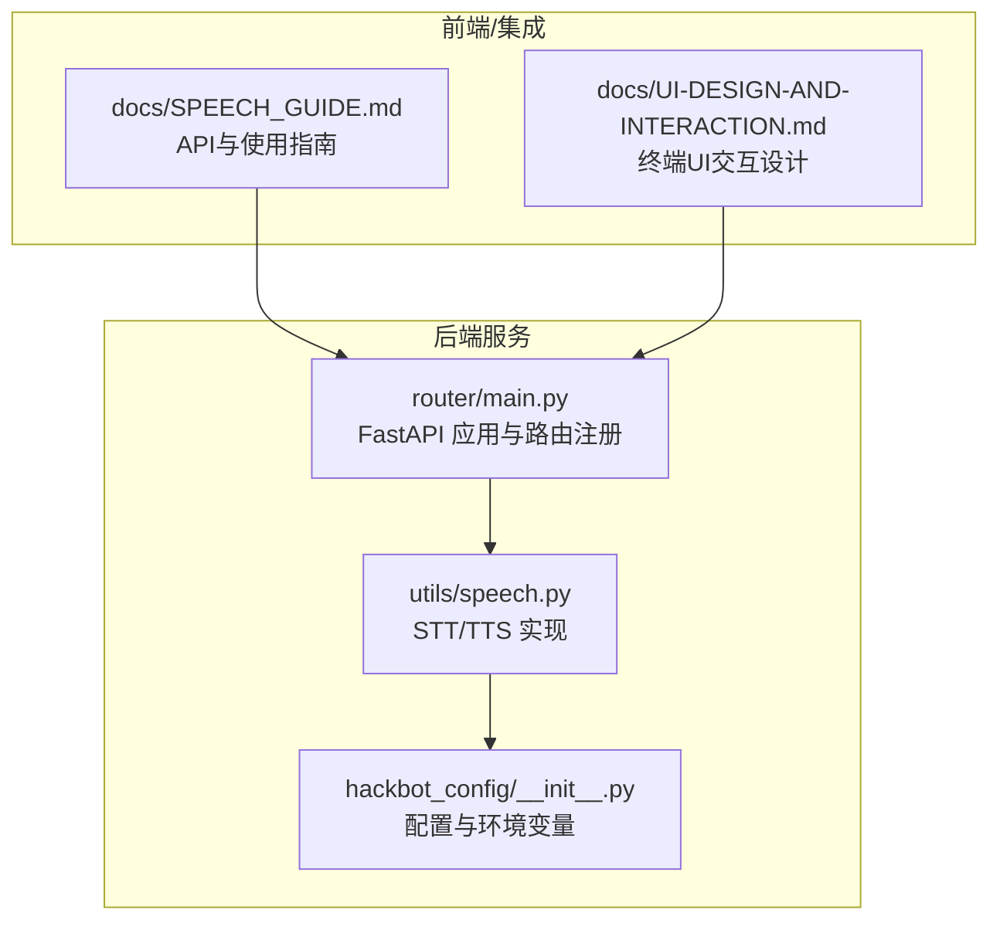
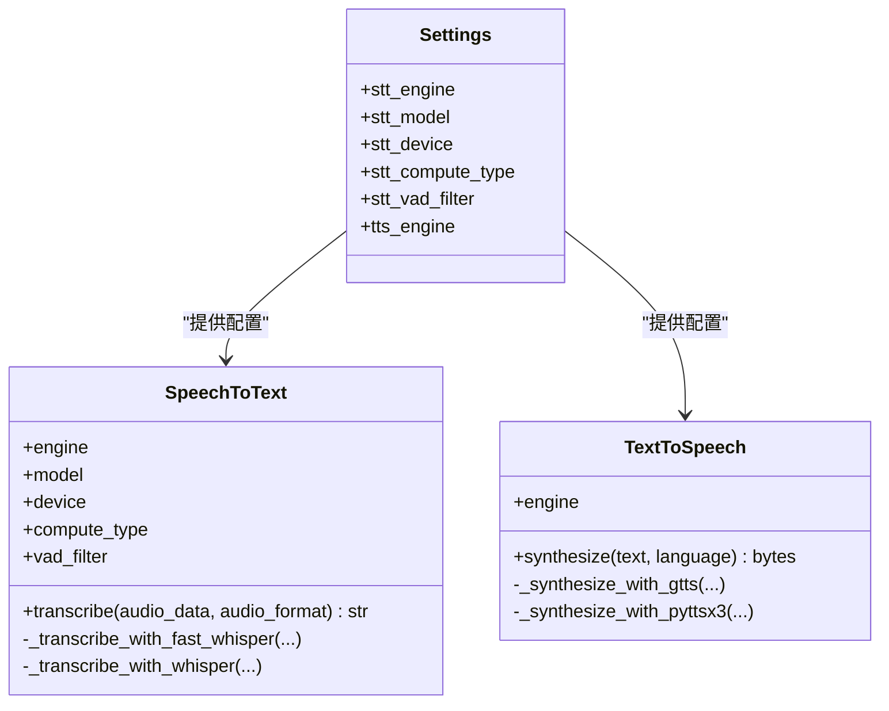
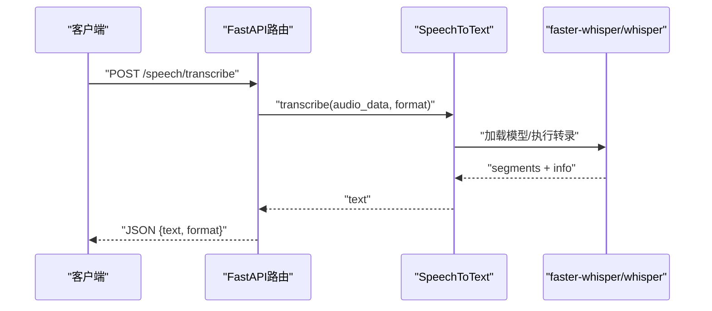
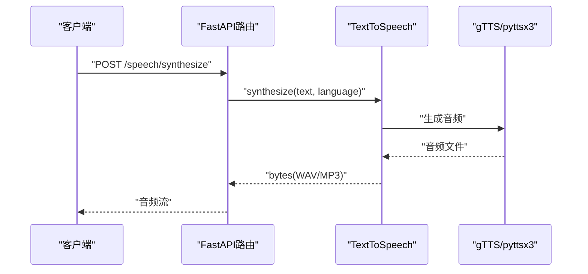
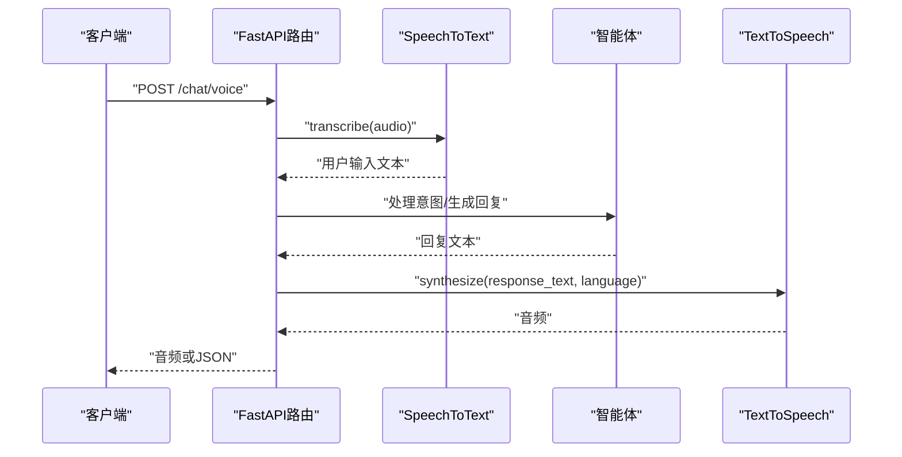
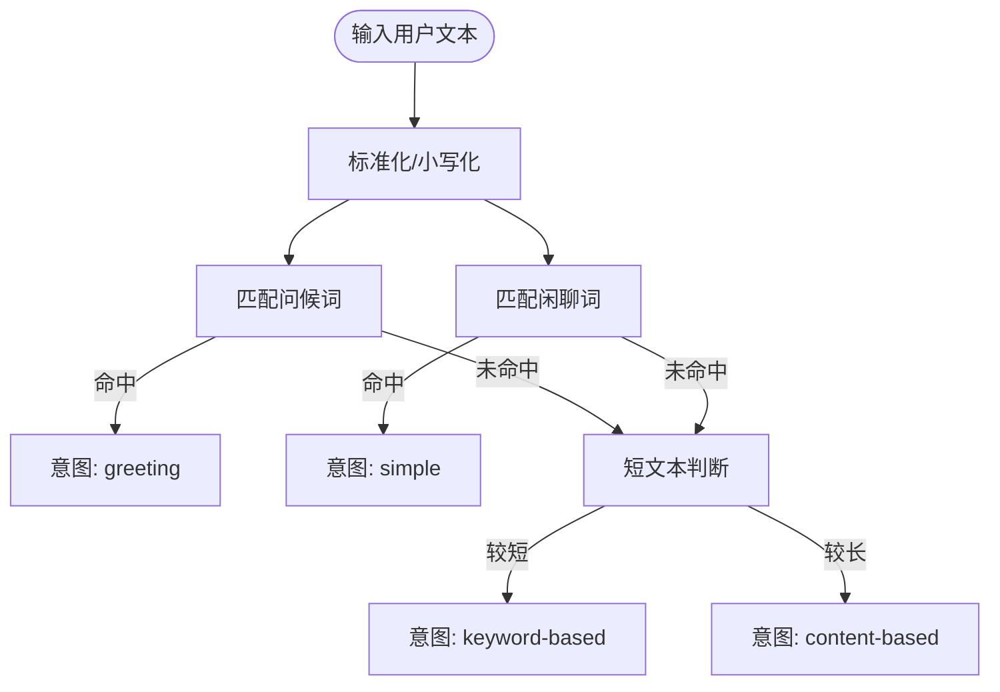
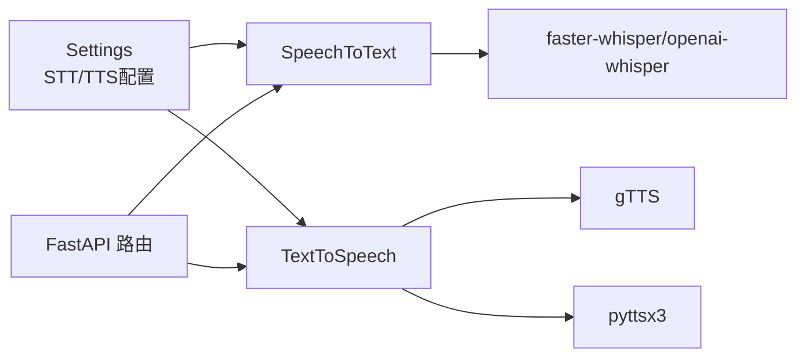

# 语音交互功能

<cite>
**本文引用的文件**
- [docs/SPEECH_GUIDE.md](file://docs/SPEECH_GUIDE.md)
- [utils/speech.py](file://utils/speech.py)
- [hackbot_config/__init__.py](file://hackbot_config/__init__.py)
- [router/main.py](file://router/main.py)
- [docs/UI-DESIGN-AND-INTERACTION.md](file://docs/UI-DESIGN-AND-INTERACTION.md)
</cite>

## 目录
1. [简介](#简介)
2. [项目结构](#项目结构)
3. [核心组件](#核心组件)
4. [架构总览](#架构总览)
5. [详细组件分析](#详细组件分析)
6. [依赖关系分析](#依赖关系分析)
7. [性能考量](#性能考量)
8. [故障排除指南](#故障排除指南)
9. [结论](#结论)
10. [附录](#附录)

## 简介
本文件面向Secbot的语音交互功能，系统性阐述语音转文字（STT）与文字转语音（TTS）的技术实现、音频处理与引擎集成、语音命令识别与处理机制（含自然语言理解与意图识别）、以及在不同界面（终端UI与移动应用）中的实现差异与优化策略。同时提供配置指南与使用技巧，涵盖麦克风设置、音量控制与语音助手个性化配置。

## 项目结构
语音功能主要分布在以下位置：
- 文档与使用指南：docs/SPEECH_GUIDE.md
- 语音处理核心模块：utils/speech.py
- 配置与环境变量：hackbot_config/__init__.py
- API服务入口与路由注册：router/main.py
- 终端UI交互设计与上下文：docs/UI-DESIGN-AND-INTERACTION.md

**图表来源**
- [router/main.py](file://router/main.py#L1-L101)
- [utils/speech.py](file://utils/speech.py#L1-L204)
- [hackbot_config/__init__.py](file://hackbot_config/__init__.py#L162-L207)
- [docs/SPEECH_GUIDE.md](file://docs/SPEECH_GUIDE.md#L1-L295)
- [docs/UI-DESIGN-AND-INTERACTION.md](file://docs/UI-DESIGN-AND-INTERACTION.md#L1-L242)

**章节来源**
- [router/main.py](file://router/main.py#L1-L101)
- [utils/speech.py](file://utils/speech.py#L1-L204)
- [hackbot_config/__init__.py](file://hackbot_config/__init__.py#L162-L207)
- [docs/SPEECH_GUIDE.md](file://docs/SPEECH_GUIDE.md#L1-L295)
- [docs/UI-DESIGN-AND-INTERACTION.md](file://docs/UI-DESIGN-AND-INTERACTION.md#L1-L242)

## 核心组件
- 语音转文字（STT）：支持faster-whisper与openai-whisper两种引擎，具备设备与计算精度配置、VAD过滤等能力。
- 文字转语音（TTS）：支持gTTS（在线）与pyttsx3（本地），具备语言参数与临时文件管理。
- 配置中心：通过环境变量与配置类集中管理STT/TTS引擎、模型、设备、计算类型与VAD开关。
- API服务：提供语音转写、语音合成与完整语音聊天接口，支持返回音频或文本。

**章节来源**
- [utils/speech.py](file://utils/speech.py#L13-L107)
- [utils/speech.py](file://utils/speech.py#L110-L202)
- [hackbot_config/__init__.py](file://hackbot_config/__init__.py#L194-L207)
- [docs/SPEECH_GUIDE.md](file://docs/SPEECH_GUIDE.md#L56-L166)

## 架构总览
语音交互在后端以异步协程执行，避免阻塞主线程；STT与TTS分别封装为独立类，便于替换与扩展；配置通过settings统一注入；API通过FastAPI路由暴露。

**图表来源**
- [hackbot_config/__init__.py](file://hackbot_config/__init__.py#L194-L207)
- [utils/speech.py](file://utils/speech.py#L13-L107)
- [utils/speech.py](file://utils/speech.py#L110-L202)

**章节来源**
- [utils/speech.py](file://utils/speech.py#L13-L107)
- [utils/speech.py](file://utils/speech.py#L110-L202)
- [hackbot_config/__init__.py](file://hackbot_config/__init__.py#L194-L207)

## 详细组件分析

### STT（语音转文字）
- 引擎选择：优先faster-whisper（基于CTranslate2，更快更省显存），也可回退至openai-whisper。
- 参数配置：模型大小、设备（cpu/cuda）、计算类型（int8/float32/float16）、VAD过滤。
- 执行流程：将二进制音频写入临时文件，调用对应模型进行转录，聚合片段文本并清理临时文件。
- 错误处理：缺失依赖时抛出导入异常；whisper模型首次下载需充足磁盘空间。

**图表来源**
- [utils/speech.py](file://utils/speech.py#L33-L107)
- [docs/SPEECH_GUIDE.md](file://docs/SPEECH_GUIDE.md#L56-L81)

**章节来源**
- [utils/speech.py](file://utils/speech.py#L33-L107)
- [docs/SPEECH_GUIDE.md](file://docs/SPEECH_GUIDE.md#L22-L81)

### TTS（文字转语音）
- 引擎选择：gTTS（需要网络，质量较好）或pyttsx3（完全本地，跨平台）。
- 参数配置：语言代码、语音属性（如中文语音选择）。
- 执行流程：生成音频到临时文件，读取二进制数据返回；清理临时文件。
- 平台差异：Windows通常自带TTS引擎；Linux需安装espeak或festival。

**图表来源**
- [utils/speech.py](file://utils/speech.py#L117-L202)
- [docs/SPEECH_GUIDE.md](file://docs/SPEECH_GUIDE.md#L102-L122)

**章节来源**
- [utils/speech.py](file://utils/speech.py#L117-L202)
- [docs/SPEECH_GUIDE.md](file://docs/SPEECH_GUIDE.md#L82-L122)

### 语音聊天（STT + TTS + 智能体）
- 接口：/chat/voice，支持返回音频或文本。
- 参数：audio（必填）、agent_type（可选）、conversation_id（可选）、return_audio（可选）。
- 响应：返回WAV音频或JSON文本；音频响应头携带转录文本与智能体响应文本。

**图表来源**
- [docs/SPEECH_GUIDE.md](file://docs/SPEECH_GUIDE.md#L123-L166)
- [utils/speech.py](file://utils/speech.py#L33-L107)
- [utils/speech.py](file://utils/speech.py#L117-L202)

**章节来源**
- [docs/SPEECH_GUIDE.md](file://docs/SPEECH_GUIDE.md#L123-L166)

### 自然语言理解与意图识别
- 项目中存在对问候与闲聊关键词的简单匹配逻辑，用于区分“greeting”、“simple”等意图类别，便于路由到不同处理分支。
- 该机制可作为基础NLU的起点，后续可结合更复杂的意图分类器或外部NLU服务。

**图表来源**
- [core/agents/planner_agent.py](file://core/agents/planner_agent.py#L289-L344)

**章节来源**
- [core/agents/planner_agent.py](file://core/agents/planner_agent.py#L289-L344)

### 不同界面的实现差异与优化策略
- 终端UI（TypeScript + Ink + React）：通过HTTP/SSE与后端通信，强调键盘快捷键、命令面板与对话框栈；语音交互可作为输入/输出通道之一，配合主题与Toast反馈。
- 移动应用（React Native）：开发环境通过CORS允许访问后端；前端可复用相同API，注意移动端录音权限与音频格式适配。
- 优化策略：
  - STT：优先faster-whisper，合理设置模型大小与设备；启用VAD减少静音段开销。
  - TTS：gTTS适合高质量在线播报；pyttsx3适合离线与低延迟场景。
  - 前端：移动端录音需考虑采样率与格式转换；播放音频时注意音量与焦点管理。

**章节来源**
- [docs/UI-DESIGN-AND-INTERACTION.md](file://docs/UI-DESIGN-AND-INTERACTION.md#L1-L242)
- [docs/SPEECH_GUIDE.md](file://docs/SPEECH_GUIDE.md#L168-L227)

## 依赖关系分析
- 配置依赖：settings集中读取STT/TTS相关环境变量，供STT/TTS类构造使用。
- 引擎依赖：faster-whisper与openai-whisper为STT引擎；gTTS与pyttsx3为TTS引擎；pydub用于格式转换。
- API依赖：FastAPI路由注册与健康检查；CORS中间件允许跨域访问。

**图表来源**
- [hackbot_config/__init__.py](file://hackbot_config/__init__.py#L194-L207)
- [utils/speech.py](file://utils/speech.py#L13-L107)
- [utils/speech.py](file://utils/speech.py#L110-L202)
- [router/main.py](file://router/main.py#L44-L51)

**章节来源**
- [hackbot_config/__init__.py](file://hackbot_config/__init__.py#L194-L207)
- [utils/speech.py](file://utils/speech.py#L13-L107)
- [utils/speech.py](file://utils/speech.py#L110-L202)
- [router/main.py](file://router/main.py#L44-L51)

## 性能考量
- 模型大小与设备：较大模型与GPU计算可提升准确度但增加资源消耗；小模型与CPU适合轻量部署。
- 计算类型：CPU推荐int8/float32，GPU推荐float16；合理选择可平衡速度与精度。
- VAD过滤：开启可减少静音段处理时间，降低I/O与推理成本。
- I/O与并发：STT/TTS采用临时文件与异步执行，避免阻塞；注意磁盘空间与文件清理。
- 网络与本地：gTTS需要网络，pyttsx3完全本地；根据部署环境选择合适引擎。

[本节为通用指导，无需列出章节来源]

## 故障排除指南
- Whisper安装问题：确保Python版本满足要求、磁盘空间充足；升级pip后重试安装。
- TTS引擎问题：Linux需安装espeak或festival；Windows通常自带TTS引擎。
- 音频格式问题：使用pydub转换为WAV等受支持格式。
- API访问：确认端口未被占用，CORS配置允许前端访问。

**章节来源**
- [docs/SPEECH_GUIDE.md](file://docs/SPEECH_GUIDE.md#L253-L294)

## 结论
Secbot的语音交互功能通过清晰的模块划分与配置中心实现了STT与TTS的灵活集成，并提供了完整的API接口与前端集成示例。结合终端UI与移动应用的差异化实现，可在不同平台上提供一致且高效的语音体验。建议优先采用faster-whisper与合理的资源配置以获得最佳性能，并根据部署环境选择合适的TTS引擎。

[本节为总结性内容，无需列出章节来源]

## 附录

### 配置指南与使用技巧
- 环境变量配置（示例）：
  - STT_ENGINE=fast_whisper
  - STT_MODEL=base
  - STT_DEVICE=cpu
  - STT_COMPUTE_TYPE=int8
  - STT_VAD_FILTER=true
  - TTS_ENGINE=gtts
- 使用技巧：
  - 麦克风设置：确保系统权限与采样率正确；移动端录音需处理权限弹窗。
  - 音量控制：前端播放音频时设置音量范围与焦点管理，避免干扰用户操作。
  - 个性化配置：可通过语言参数与语音属性定制TTS输出；STT可根据场景调整模型与设备。

**章节来源**
- [docs/SPEECH_GUIDE.md](file://docs/SPEECH_GUIDE.md#L229-L243)
- [hackbot_config/__init__.py](file://hackbot_config/__init__.py#L194-L207)