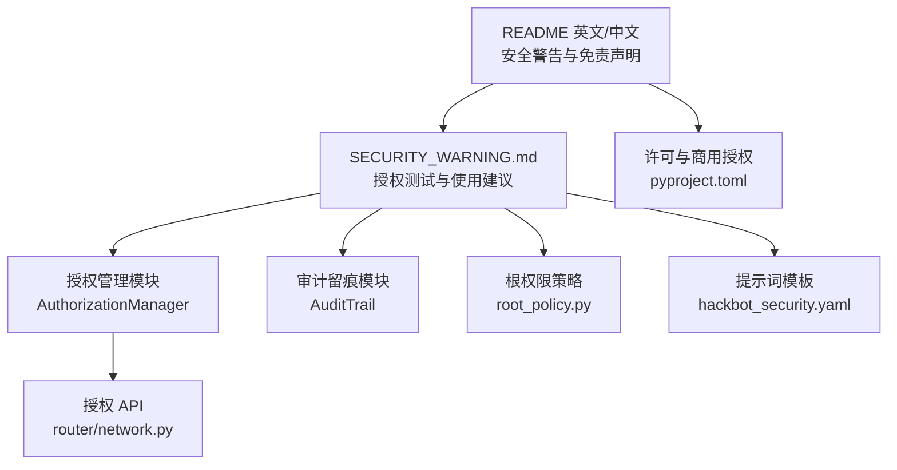
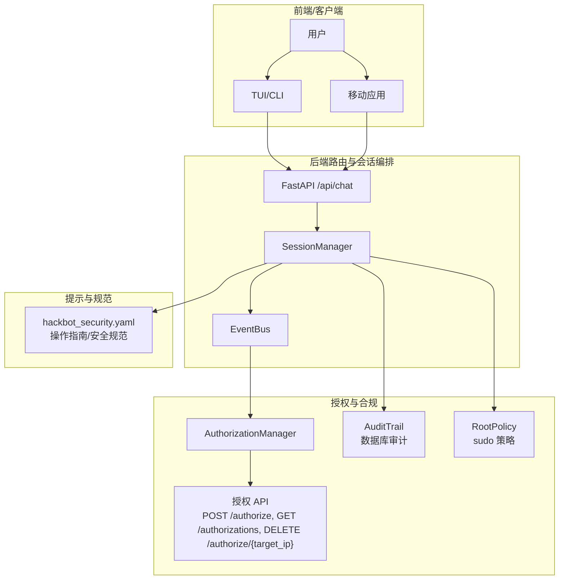
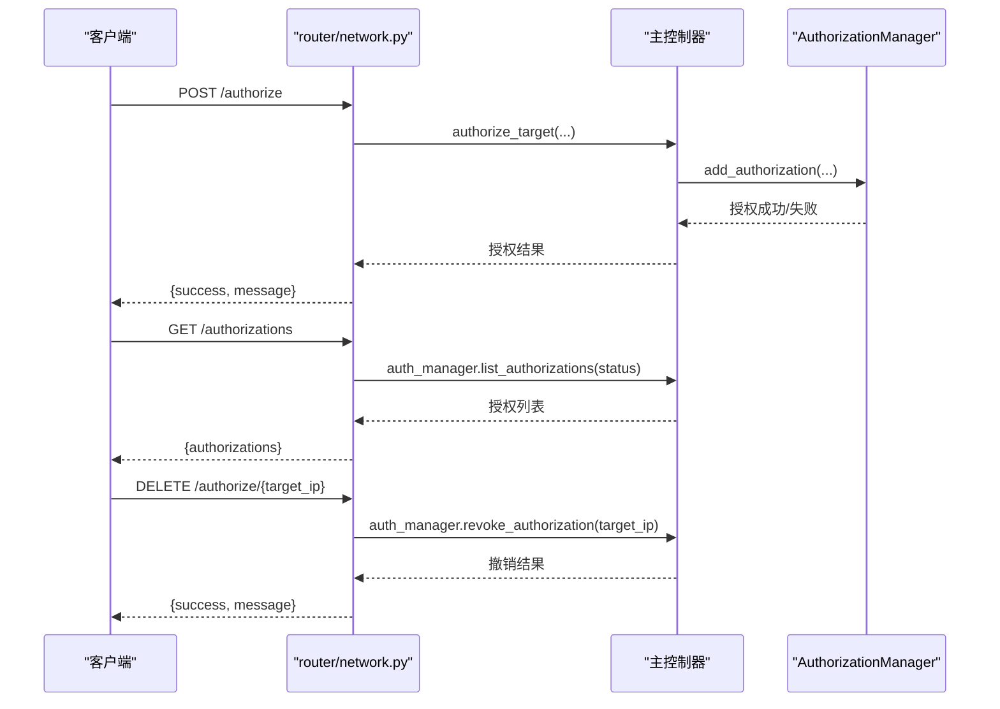
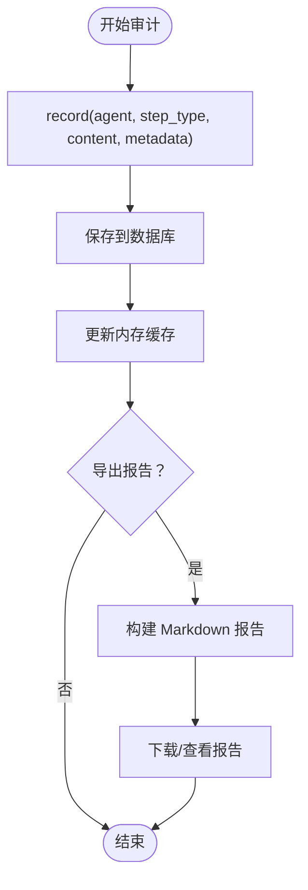
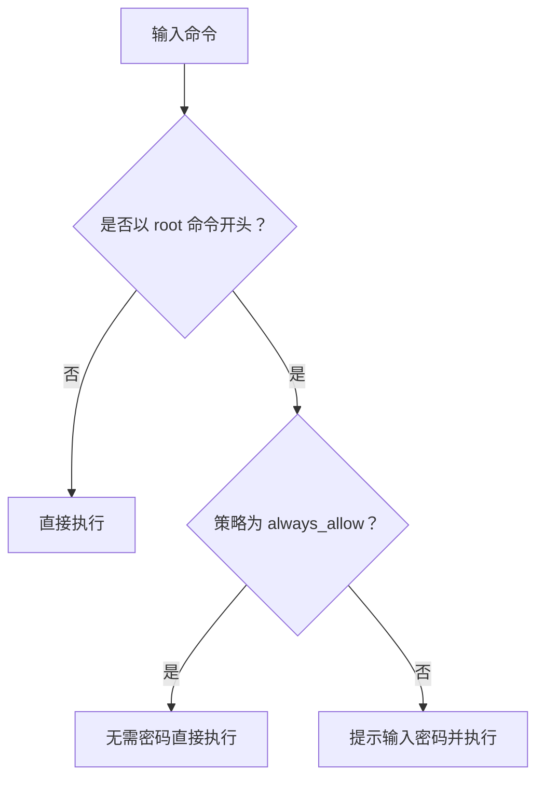
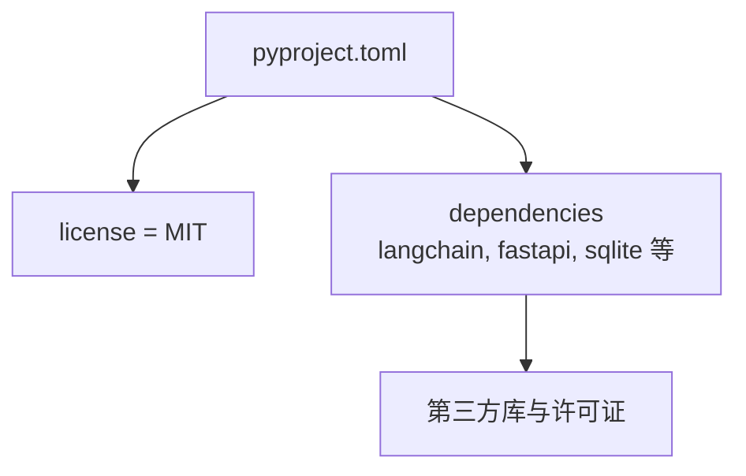

# 法律合规与安全警告

<cite>
**本文引用的文件**
- [README_EN.md](file://README_EN.md)
- [README_CN.md](file://README_CN.md)
- [SECURITY_WARNING.md](file://docs/SECURITY_WARNING.md)
- [authorization.py](file://controller/authorization.py)
- [router/network.py](file://router/network.py)
- [audit.py](file://utils/audit.py)
- [root_policy.py](file://utils/root_policy.py)
- [hackbot_security.yaml](file://prompts/templates/hackbot_security.yaml)
- [pyproject.toml](file://pyproject.toml)
</cite>

## 目录
1. [引言](#引言)
2. [项目结构](#项目结构)
3. [核心组件](#核心组件)
4. [架构总览](#架构总览)
5. [详细组件分析](#详细组件分析)
6. [依赖分析](#依赖分析)
7. [性能考量](#性能考量)
8. [故障排查指南](#故障排查指南)
9. [结论](#结论)
10. [附录](#附录)

## 引言
本文件旨在为 Secbot 项目提供全面的法律合规与安全警告内容，明确项目的使用限制、授权要求、道德使用原则与安全责任，并面向不同用户群体提供差异化合规指导。Secbot 提供 AI 驱动的自动化渗透测试能力，工具与功能强大，因此必须严格遵循“仅授权测试”的前提，确保在合法、合规、可控的前提下使用。

## 项目结构
围绕法律合规与安全警告相关内容，Secbot 在以下位置提供了权威说明与实现支撑：
- 顶层文档：英文与中文 README 中均包含安全警告与免责声明
- 专项文档：安全警告文档明确授权测试要求、使用建议、功能说明与责任条款
- 授权管理：后端提供授权 API 与本地授权管理器，保障“仅授权目标”的执行边界
- 审计留痕：对 ReAct 操作进行数据库级审计，确保可追溯性
- 道德与操作规范：提示词模板中包含操作指南与安全规范
- 许可与商业授权：项目许可与商用授权联系方式明确

**图表来源**
- [README_EN.md](file://README_EN.md#L13-L20)
- [README_CN.md](file://README_CN.md#L13-L20)
- [SECURITY_WARNING.md](file://docs/SECURITY_WARNING.md#L1-L73)
- [authorization.py](file://controller/authorization.py#L11-L120)
- [router/network.py](file://router/network.py#L78-L148)
- [audit.py](file://utils/audit.py#L12-L105)
- [root_policy.py](file://utils/root_policy.py#L1-L54)
- [hackbot_security.yaml](file://prompts/templates/hackbot_security.yaml#L76-L102)
- [pyproject.toml](file://pyproject.toml#L339-L346)

**章节来源**
- [README_EN.md](file://README_EN.md#L13-L20)
- [README_CN.md](file://README_CN.md#L13-L20)
- [SECURITY_WARNING.md](file://docs/SECURITY_WARNING.md#L1-L73)

## 核心组件
- 授权管理与 API：提供授权添加、查询、撤销与状态校验，确保仅对授权目标执行操作
- 审计留痕：记录 ReAct 每一步操作（思考/行动/观察/确认/拒绝/结果），支持导出报告
- 根权限策略：对需要 root 的操作进行策略化管理，降低误执行风险
- 提示词模板中的操作指南：明确授权原则、安全规范与响应风格
- 许可与商用授权：开源许可与商用授权联系方式

**章节来源**
- [authorization.py](file://controller/authorization.py#L11-L120)
- [router/network.py](file://router/network.py#L78-L148)
- [audit.py](file://utils/audit.py#L12-L105)
- [root_policy.py](file://utils/root_policy.py#L1-L54)
- [hackbot_security.yaml](file://prompts/templates/hackbot_security.yaml#L76-L102)
- [pyproject.toml](file://pyproject.toml#L339-L346)

## 架构总览
下图展示了与法律合规相关的关键组件如何协同工作，确保“仅授权测试”与可追溯性：

**图表来源**
- [router/network.py](file://router/network.py#L78-L148)
- [authorization.py](file://controller/authorization.py#L11-L120)
- [audit.py](file://utils/audit.py#L12-L105)
- [root_policy.py](file://utils/root_policy.py#L1-L54)
- [hackbot_security.yaml](file://prompts/templates/hackbot_security.yaml#L76-L102)

## 详细组件分析

### 授权管理与 API
- 授权添加：支持指定目标 IP、授权类型（全量/受限/只读）、凭据、有效期与描述
- 授权状态校验：检查状态是否为 active，以及是否过期
- 授权撤销：将状态标记为 revoked，并记录撤销时间
- 授权列表：支持按状态筛选，便于审计与合规检查
- 授权 API：提供授权、查询与撤销的 HTTP 接口，便于前端与移动端调用

**图表来源**
- [router/network.py](file://router/network.py#L78-L148)
- [authorization.py](file://controller/authorization.py#L41-L110)

**章节来源**
- [authorization.py](file://controller/authorization.py#L11-L120)
- [router/network.py](file://router/network.py#L78-L148)

### 审计留痕与报告导出
- 记录内容：包含会话 ID、智能体、步骤类型（思考/行动/观察/确认/拒绝/结果）、内容与元数据
- 存储策略：内存缓存用于实时展示，持久化写入数据库
- 报告导出：支持导出 Markdown 格式审计报告，便于合规审查与溯源

**图表来源**
- [audit.py](file://utils/audit.py#L12-L105)

**章节来源**
- [audit.py](file://utils/audit.py#L12-L105)

### 根权限策略与安全责任
- 策略配置：支持“每次询问密码”或“始终允许”，并持久化到用户配置目录
- 命令识别：识别以 root 命令开头的命令，按策略处理密码输入
- 安全责任：对需要 root 的操作进行策略化管理，降低误执行风险

**图表来源**
- [root_policy.py](file://utils/root_policy.py#L1-L54)

**章节来源**
- [root_policy.py](file://utils/root_policy.py#L1-L54)

### 操作指南与安全规范（提示词模板）
- 授权原则：仅对授权资产与主机执行操作，未授权目标仅可进行信息收集
- 安全规范：记录所有操作日志，发现漏洞及时报告，生成标准化报告
- 响应风格：专业高效、主动建议、详细报告、强调安全最佳实践与授权边界

**章节来源**
- [hackbot_security.yaml](file://prompts/templates/hackbot_security.yaml#L76-L102)

### 许可与商用授权
- 开源许可：项目采用自定义开源协议，允许个人学习、学术研究与交流，但商业使用需事先获得书面授权
- 商用授权：任何商业用途须事先获得版权持有人书面授权，未经授权不得商用
- 联系方式：提供邮箱与 GitHub 联系方式

**章节来源**
- [pyproject.toml](file://pyproject.toml#L339-L346)

## 依赖分析
- 许可证与分类：项目许可证为 MIT，符合开源许可要求
- 依赖与工具：项目依赖众多第三方库，涉及 LLM、安全工具、网络与数据库等，需在使用时关注相应许可证兼容性

**图表来源**
- [pyproject.toml](file://pyproject.toml#L1-L165)

**章节来源**
- [pyproject.toml](file://pyproject.toml#L1-L165)

## 性能考量
- 审计留痕：内存缓存与数据库持久化结合，兼顾实时性与可靠性
- 授权校验：状态与过期时间检查在内存中进行，减少 IO 压力
- 日志管理：控制台与文件日志分离，避免初始化阶段噪声干扰

[本节为一般性指导，不直接分析具体文件]

## 故障排查指南
- 授权失败：检查目标 IP、凭据与授权类型，确认未过期且状态为 active
- 授权撤销：确认撤销接口调用成功，状态已更新为 revoked
- 审计报告为空：确认会话 ID 正确，数据库连接正常，且已执行相关操作
- 根权限策略异常：检查配置文件是否存在，策略值是否为 ask 或 always_allow

**章节来源**
- [authorization.py](file://controller/authorization.py#L66-L101)
- [audit.py](file://utils/audit.py#L52-L105)
- [root_policy.py](file://utils/root_policy.py#L18-L44)

## 结论
Secbot 在设计上充分体现了“仅授权测试”的核心原则，并通过授权管理、审计留痕、根权限策略与提示词模板中的安全规范，构建了完整的合规与安全体系。用户在使用前务必获得明确授权，严格遵守法律法规与道德准则，确保测试范围可控、过程可追溯、结果可报告。

[本节为总结性内容，不直接分析具体文件]

## 附录

### 法律合规与使用限制要点
- 仅授权测试：未经授权的使用属于违法行为
- 明确授权：需获得目标系统所有者的明确书面授权与合法渗透测试协议
- 合规使用：遵守适用法律法规，仅在测试环境中使用
- 数据保护：妥善保管测试过程中获取的敏感数据
- 漏洞报告：发现漏洞后及时向授权方报告，不得恶意利用
- 免责声明：开发者不对未经授权或违反法规的使用负责

**章节来源**
- [SECURITY_WARNING.md](file://docs/SECURITY_WARNING.md#L7-L71)
- [README_EN.md](file://README_EN.md#L13-L20)
- [README_CN.md](file://README_CN.md#L13-L20)

### 责任与道德使用原则
- 用户责任：确保已获得合法授权，遵守法律法规，保护数据，及时报告漏洞，不用于恶意目的
- 道德使用：负责任地使用工具，避免对非授权系统造成影响
- 安全责任：对自身行为负责，采取必要措施防范风险

**章节来源**
- [SECURITY_WARNING.md](file://docs/SECURITY_WARNING.md#L52-L71)
- [hackbot_security.yaml](file://prompts/templates/hackbot_security.yaml#L76-L102)

### 商业使用授权与联系方式
- 商业授权：任何商业用途须事先获得版权持有人书面授权
- 联系方式：邮箱与 GitHub 联系方式详见项目许可说明

**章节来源**
- [pyproject.toml](file://pyproject.toml#L339-L346)

### 常见法律问题与风险防范建议
- 未经授权使用：严格禁止，可能导致刑事责任与民事赔偿
- 测试范围：必须严格限定在授权范围内，超出范围即属非法
- 数据处理：对敏感数据进行最小化处理与加密存储
- 报告与留痕：保留完整的审计报告，便于合规审查
- 风险隔离：在隔离环境中进行测试，避免影响生产系统

**章节来源**
- [SECURITY_WARNING.md](file://docs/SECURITY_WARNING.md#L14-L31)
- [audit.py](file://utils/audit.py#L58-L105)