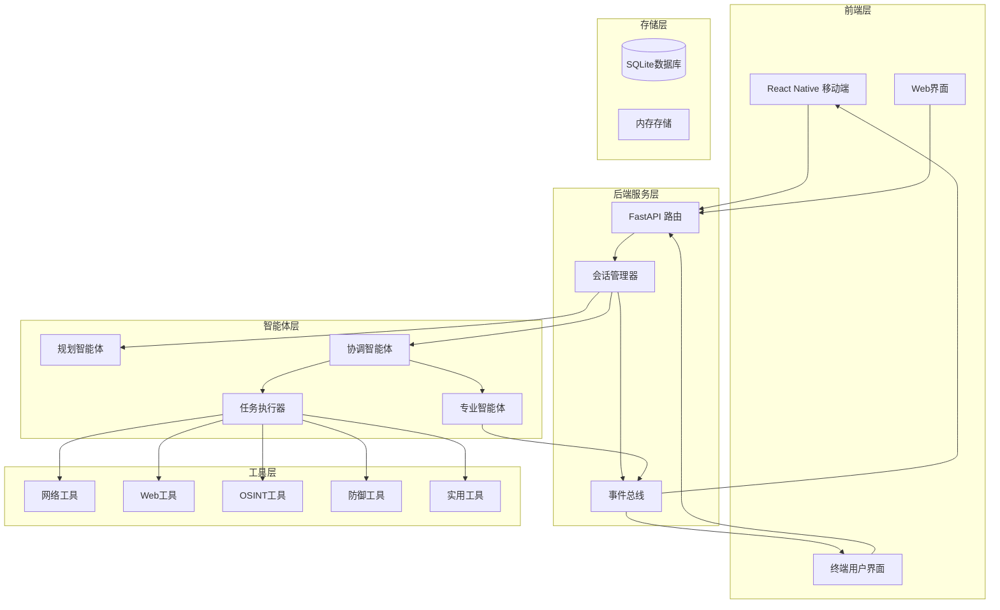
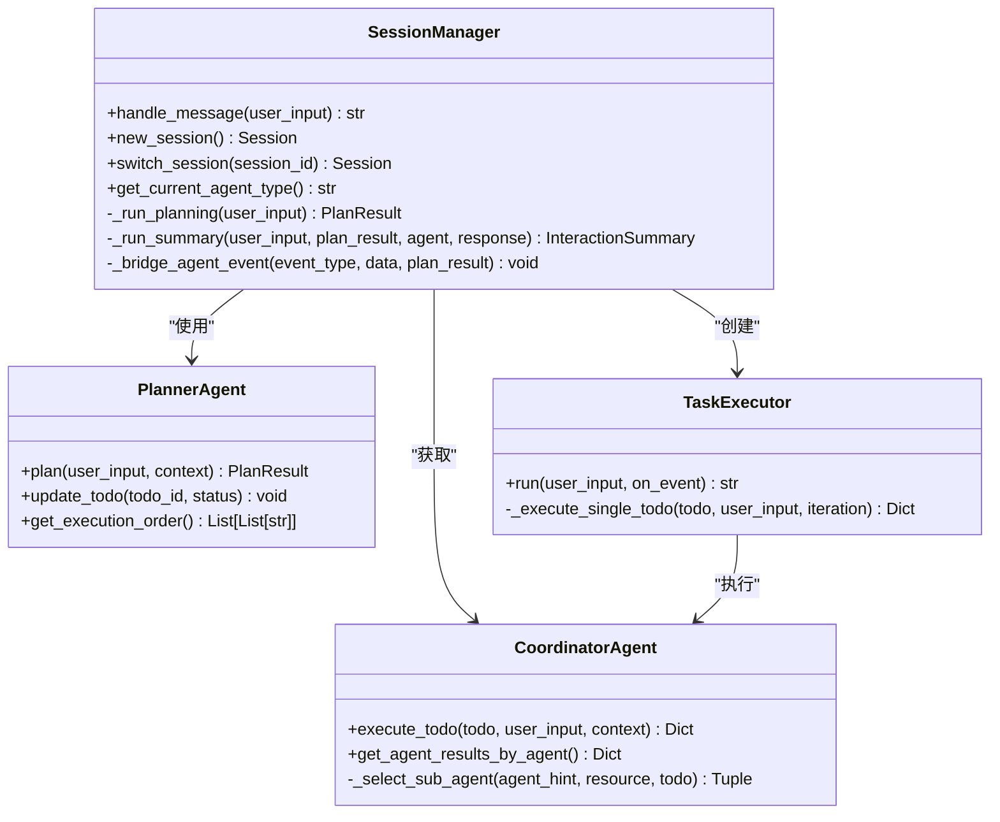
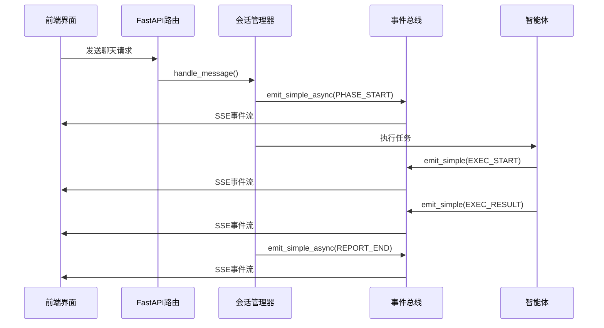
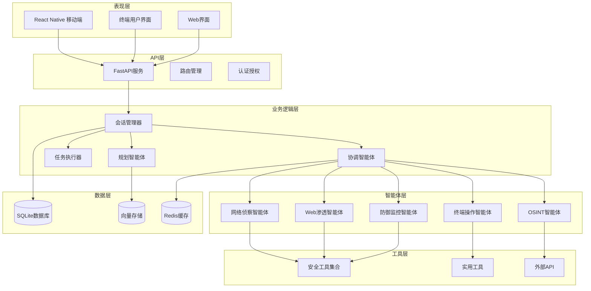
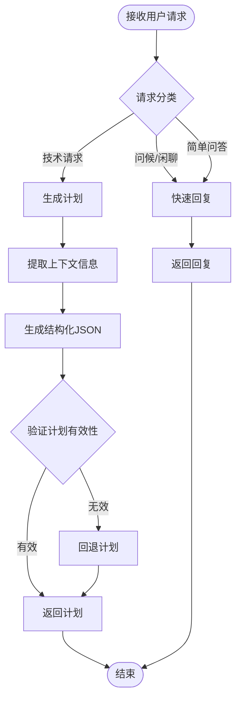
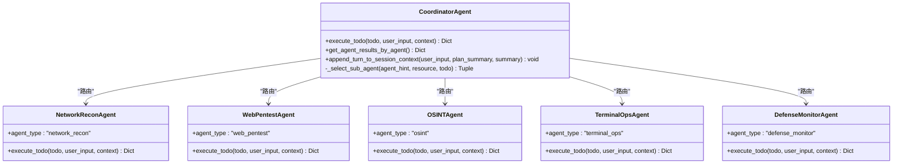
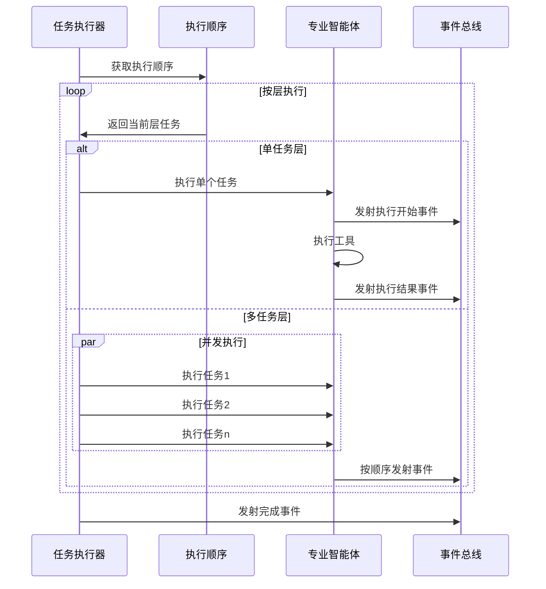
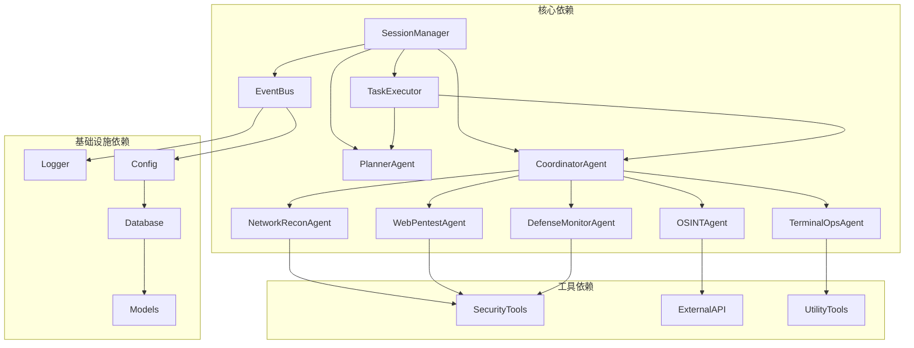

# 知识库系统

<cite>
**本文档引用的文件**
- [README.md](file://README.md)
- [main.py](file://main.py)
- [router/main.py](file://router/main.py)
- [router/chat.py](file://router/chat.py)
- [core/session.py](file://core/session.py)
- [core/agents/planner_agent.py](file://core/agents/planner_agent.py)
- [core/executor.py](file://core/executor.py)
- [core/agents/coordinator_agent.py](file://core/agents/coordinator_agent.py)
- [core/agents/specialist_agents.py](file://core/agents/specialist_agents.py)
- [utils/event_bus.py](file://utils/event_bus.py)
- [tools/base.py](file://tools/base.py)
- [database/models.py](file://database/models.py)
- [hackbot_config/__init__.py](file://hackbot_config/__init__.py)
- [app/App.tsx](file://app/App.tsx)
- [terminal-ui/src/App.tsx](file://terminal-ui/src/App.tsx)
</cite>

## 目录
1. [简介](#简介)
2. [项目结构](#项目结构)
3. [核心组件](#核心组件)
4. [架构概览](#架构概览)
5. [详细组件分析](#详细组件分析)
6. [依赖关系分析](#依赖关系分析)
7. [性能考虑](#性能考虑)
8. [故障排除指南](#故障排除指南)
9. [结论](#结论)

## 简介

Secbot是一个AI驱动的自动化渗透测试智能体系统，集成了多种先进的AI技术和安全工具。该系统采用多智能体架构，支持ReAct推理模式、工具调用、记忆增强等功能，能够执行完整的渗透测试工作流。

系统的主要特点包括：
- 多种智能体模式：ReAct、Plan-Execute、多智能体协作、工具调用、记忆增强
- AI Web研究子智能体，支持联网搜索、网页提取、多页爬取和API调用
- 本地控制界面，提供简单直观的命令行入口与配置工具
- 持久化终端会话，支持智能体专用终端和多步命令执行
- 操作系统控制，包括文件操作、进程管理和系统信息获取

## 项目结构

项目采用模块化设计，主要分为以下几个层次：

**图表来源**
- [README.md:86-170](file://README.md#L86-L170)
- [router/main.py:19-71](file://router/main.py#L19-L71)

**章节来源**
- [README.md:353-376](file://README.md#L353-L376)
- [router/main.py:19-71](file://router/main.py#L19-L71)

## 核心组件

### 会话管理器 (SessionManager)

会话管理器是系统的核心编排组件，负责管理整个交互流程：

**图表来源**
- [core/session.py:32-422](file://core/session.py#L32-L422)
- [core/agents/planner_agent.py:20-128](file://core/agents/planner_agent.py#L20-L128)
- [core/executor.py:17-179](file://core/executor.py#L17-L179)
- [core/agents/coordinator_agent.py:40-201](file://core/agents/coordinator_agent.py#L40-L201)

### 事件总线系统

事件总线提供了解耦的通信机制：

**图表来源**
- [utils/event_bus.py:68-187](file://utils/event_bus.py#L68-L187)
- [router/chat.py:134-263](file://router/chat.py#L134-L263)

**章节来源**
- [core/session.py:32-422](file://core/session.py#L32-L422)
- [utils/event_bus.py:15-53](file://utils/event_bus.py#L15-L53)

## 架构概览

系统采用分层架构设计，实现了高度模块化和可扩展性：

**图表来源**
- [README.md:86-170](file://README.md#L86-L170)
- [router/main.py:19-71](file://router/main.py#L19-L71)

## 详细组件分析

### 规划智能体 (PlannerAgent)

规划智能体负责将用户请求分解为结构化的任务计划：

**图表来源**
- [core/agents/planner_agent.py:86-128](file://core/agents/planner_agent.py#L86-L128)
- [core/agents/planner_agent.py:444-538](file://core/agents/planner_agent.py#L444-L538)

### 协调智能体 (CoordinatorAgent)

协调智能体负责将任务路由到合适的专业智能体：

**图表来源**
- [core/agents/coordinator_agent.py:130-201](file://core/agents/coordinator_agent.py#L130-L201)
- [core/agents/specialist_agents.py:81-237](file://core/agents/specialist_agents.py#L81-L237)

### 任务执行器 (TaskExecutor)

任务执行器负责按层级顺序执行任务：

**图表来源**
- [core/executor.py:46-133](file://core/executor.py#L46-L133)

**章节来源**
- [core/agents/planner_agent.py:158-276](file://core/agents/planner_agent.py#L158-L276)
- [core/agents/coordinator_agent.py:242-331](file://core/agents/coordinator_agent.py#L242-L331)
- [core/executor.py:46-179](file://core/executor.py#L46-L179)

## 依赖关系分析

系统采用松耦合的设计，通过接口和事件实现模块间的通信：

**图表来源**
- [core/session.py:14-61](file://core/session.py#L14-L61)
- [core/executor.py:24-36](file://core/executor.py#L24-L36)
- [core/agents/coordinator_agent.py:26-92](file://core/agents/coordinator_agent.py#L26-L92)

**章节来源**
- [core/session.py:14-61](file://core/session.py#L14-L61)
- [core/executor.py:24-36](file://core/executor.py#L24-L36)
- [core/agents/coordinator_agent.py:26-92](file://core/agents/coordinator_agent.py#L26-L92)

## 性能考虑

系统在设计时充分考虑了性能优化：

### 并发执行策略
- **分层并发**：根据任务依赖关系进行拓扑分层，同一层内的任务可以并发执行
- **资源隔离**：高风险任务在同一资源上强制串行，避免资源竞争
- **最大并发限制**：每层最多3个任务并发，防止资源耗尽

### 内存管理
- **事件流式处理**：使用SSE实现流式事件传输，减少内存占用
- **渐进式报告**：报告生成采用分阶段方式，逐步输出结果
- **工具结果聚合**：按智能体维度聚合执行结果，便于后续分析

### 缓存机制
- **配置缓存**：LLM配置和API密钥缓存在内存中
- **会话上下文**：智能体上下文在会话间共享，避免重复计算
- **向量存储**：使用嵌入向量进行快速相似性检索

## 故障排除指南

### 常见问题及解决方案

#### 1. LLM连接问题
**症状**：规划阶段超时或失败
**原因**：API密钥配置错误或网络连接问题
**解决方案**：
- 检查`.env`文件中的API密钥配置
- 验证网络连接和代理设置
- 尝试使用本地Ollama模型

#### 2. 任务执行失败
**症状**：某些工具执行失败
**原因**：权限不足或工具配置错误
**解决方案**：
- 检查系统权限设置
- 验证工具依赖项安装
- 查看详细错误日志

#### 3. 前端连接问题
**症状**：SSE连接中断或无法接收事件
**原因**：网络防火墙或代理问题
**解决方案**：
- 检查防火墙设置
- 验证CORS配置
- 确认代理服务器正常运行

**章节来源**
- [router/chat.py:172-188](file://router/chat.py#L172-L188)
- [hackbot_config/__init__.py:127-137](file://hackbot_config/__init__.py#L127-L137)

## 结论

Secbot知识库系统展现了现代AI安全工具的先进设计理念，通过模块化架构、事件驱动通信和智能体协作，实现了复杂安全任务的自动化处理。系统的主要优势包括：

1. **高度模块化**：清晰的分层架构便于维护和扩展
2. **事件驱动**：松耦合的通信机制提高了系统的灵活性
3. **智能体协作**：多智能体协同工作提升了任务执行效率
4. **工具集成**：丰富的工具集支持多样化的安全任务
5. **用户友好**：提供多种前端界面适应不同使用场景

该系统为安全研究人员和渗透测试人员提供了一个强大而灵活的自动化工具平台，能够有效提升安全测试的效率和质量。