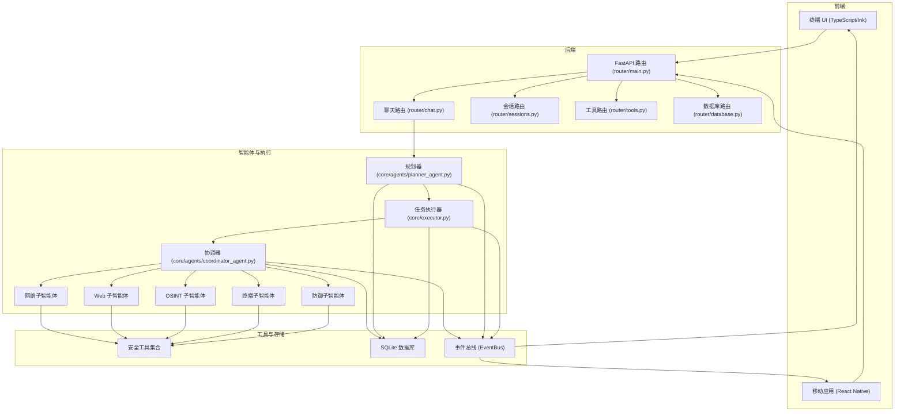
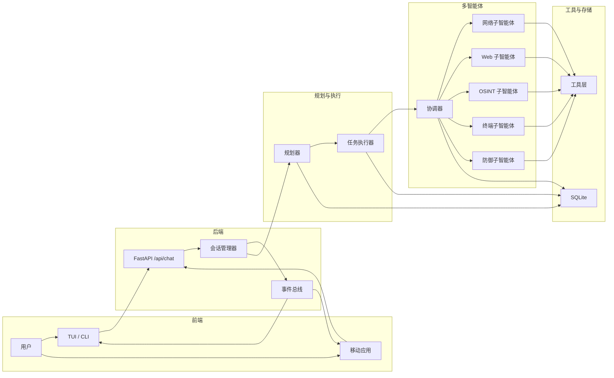
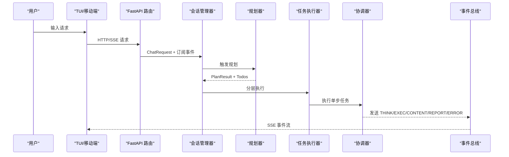
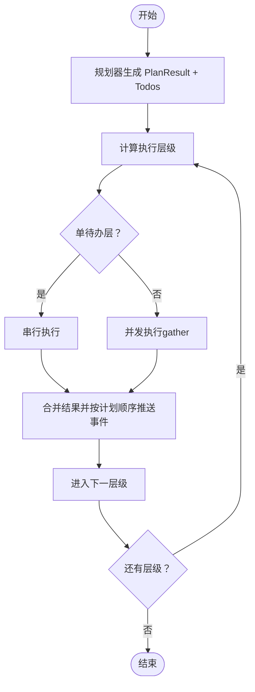
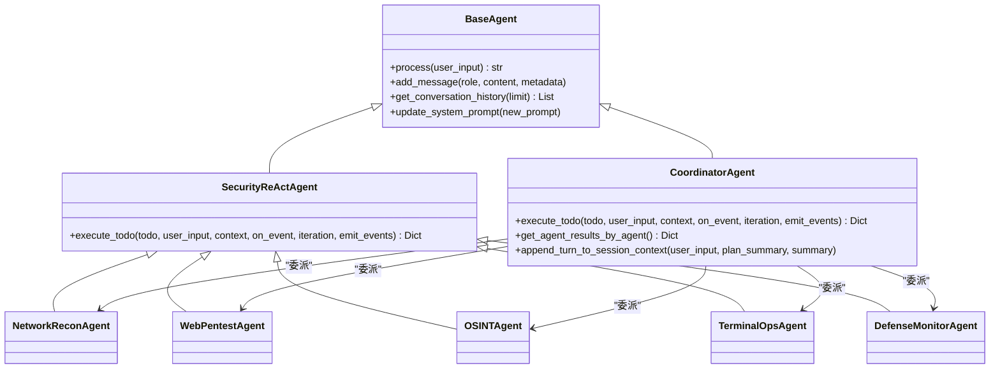
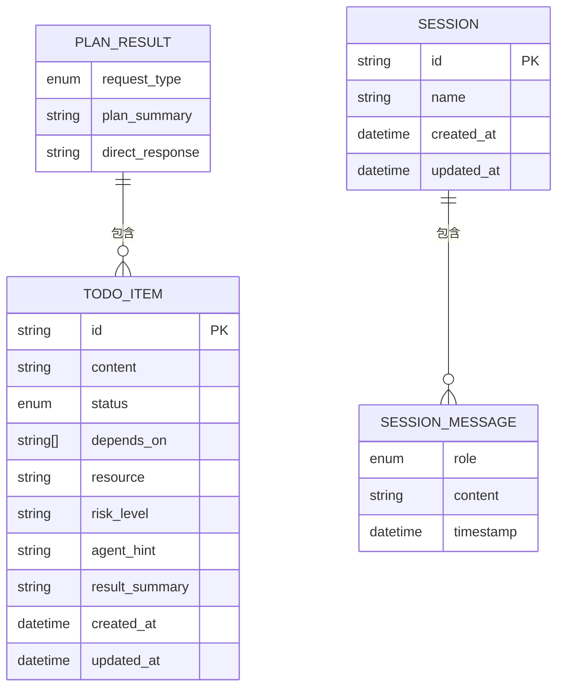
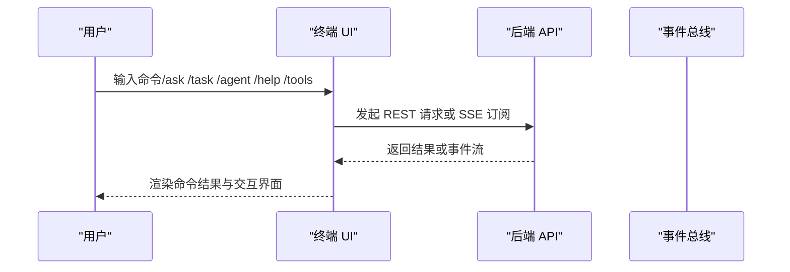
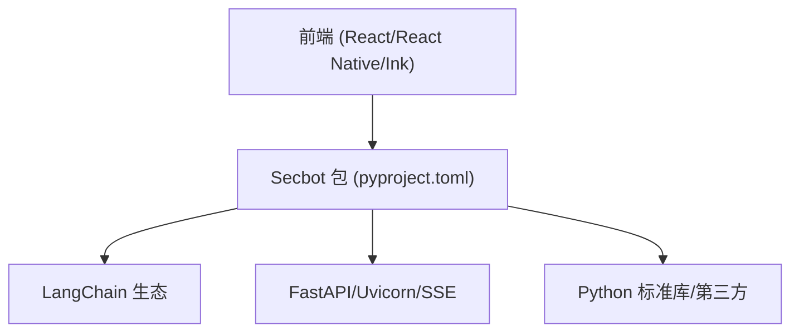

# 项目介绍

<cite>
**本文引用的文件**
- [README_EN.md](file://README_EN.md)
- [README_CN.md](file://README_CN.md)
- [main.py](file://main.py)
- [hackbot/__init__.py](file://hackbot/__init__.py)
- [pyproject.toml](file://pyproject.toml)
- [router/main.py](file://router/main.py)
- [core/models.py](file://core/models.py)
- [core/agents/base.py](file://core/agents/base.py)
- [core/agents/coordinator_agent.py](file://core/agents/coordinator_agent.py)
- [core/agents/specialist_agents.py](file://core/agents/specialist_agents.py)
- [core/executor.py](file://core/executor.py)
- [terminal-ui/src/App.tsx](file://terminal-ui/src/App.tsx)
</cite>

## 目录
1. [引言](#引言)
2. [项目结构](#项目结构)
3. [核心组件](#核心组件)
4. [架构总览](#架构总览)
5. [详细组件分析](#详细组件分析)
6. [依赖分析](#依赖分析)
7. [性能考量](#性能考量)
8. [故障排除指南](#故障排除指南)
9. [结论](#结论)
10. [附录](#附录)

## 引言
Secbot（原名 Hackbot）是一个由人工智能驱动的自动化安全测试平台，旨在为授权范围内的安全评估、渗透测试与威胁狩猎提供“智能体化”的自动化能力。项目从早期的 hackbot 演进而来，现已更名为 secbot，持续强化多智能体协作、自动化攻击链与 Web 研究能力，覆盖从信息收集、漏洞扫描、自动化利用到后渗透与报告生成的完整闭环。

- 项目定位与价值
  - 面向安全研究人员、渗透测试工程师与安全运营人员，提供可定制、可扩展、可审计的自动化安全测试能力。
  - 通过多智能体协同与分层执行，实现“规划-并行-聚合-报告”的闭环，显著提升测试效率与覆盖面。
  - 强调合规与授权：所有操作均需在合法授权范围内执行，项目文档与安全警告明确要求。

- 项目演进与命名
  - 仓库已统一命名为 secbot，早期名称为 hackbot；CLI 与入口点保留兼容，文档与示例逐步迁移为 secbot。
  - 版本号与作者信息可在包元数据中查看，体现项目稳定迭代与社区贡献。

- 主要应用场景
  - 自动化渗透测试：端口扫描、服务识别、漏洞识别、自动化利用、后渗透与报告生成。
  - 安全评估与威胁狩猎：网络攻击面发现、Web 资产安全评估、外部情报（OSINT）与 Web 研究、主动防御与自检。
  - 授权环境下的远程控制与系统运维：在授权主机上执行命令、文件操作与系统信息收集。

- 设计理念与核心优势
  - 多智能体协作：规划层、协调层、专业化子智能体与工具层解耦，支持按资源与风险安全并行。
  - 自动化攻击链：从信息收集到漏洞利用再到后渗透，形成可编排的自动化工作流。
  - Web 研究能力：智能搜索、页面提取、深度爬取与 API 客户端，支持联网情报与资产画像。
  - 事件驱动与可观测：通过事件总线与 SSE 流，前端可实时渲染各智能体的思考与执行过程。

- 用户群体差异化价值
  - 安全研究人员：借助 OSINT 与 Web 研究能力，快速建立目标画像与攻击面清单。
  - 渗透测试工程师：通过自动化攻击链与多智能体并行执行，缩短测试周期、降低重复劳动。
  - 安全运营人员：通过主动防御与巡检能力，持续监测与加固网络与主机安全。

- 开源协议与授权
  - 项目采用自定义开源协议，允许个人学习、学术研究与交流使用，商业使用需事先获得版权人书面许可。
  - 详细条款与联系方式见项目文档与许可证文件。

**章节来源**
- [README_EN.md](file://README_EN.md#L1-L379)
- [README_CN.md](file://README_CN.md#L1-L471)
- [hackbot/__init__.py](file://hackbot/__init__.py#L1-L8)

## 项目结构
Secbot 采用前后端分离与多层架构设计：
- 前端层：TypeScript/React Ink 终端 UI（TUI），通过 HTTP/SSE 与后端通信；同时提供移动端应用（React Native）。
- 后端层：FastAPI 提供 REST 与 SSE 接口，路由模块组织聊天、会话、系统、防御、网络、数据库与工具等子路由。
- 智能体与执行层：规划器（Planner）、协调器（Coordinator）、专业化子智能体（网络/Web/OSINT/终端/防御）与任务执行器（TaskExecutor）。
- 工具与存储层：安全工具集合、SQLite 数据库存储、事件总线（EventBus）与会话管理（SessionManager）。

**图表来源**
- [router/main.py](file://router/main.py#L1-L101)
- [core/agents/coordinator_agent.py](file://core/agents/coordinator_agent.py#L1-L335)
- [core/executor.py](file://core/executor.py#L1-L179)
- [terminal-ui/src/App.tsx](file://terminal-ui/src/App.tsx#L1-L202)

**章节来源**
- [router/main.py](file://router/main.py#L1-L101)
- [README_EN.md](file://README_EN.md#L75-L152)
- [README_CN.md](file://README_CN.md#L75-L152)

## 核心组件
- 会话与路由（SessionManager + Router）
  - 路由层接收前端请求，封装为聊天请求，订阅关键事件类型，调用会话管理器处理消息。
  - 会话管理器负责三阶段流程：路由（QA/技术流）、规划（生成计划与待办）、执行（分层并行或兼容模式）。
- 规划器（PlannerAgent）
  - 将用户请求拆解为带依赖、资源、风险与代理提示的待办项，按资源与风险构建“安全可控的并行计划”。
- 协调器（CoordinatorAgent）
  - 根据待办提示与资源选择专业化子智能体执行，聚合结果供总结智能体生成报告。
- 专业化子智能体
  - 网络侦察、Web 渗透、OSINT/网络研究、终端操作、防御监控，各自拥有专属工具集与系统提示词。
- 任务执行器（TaskExecutor）
  - 按规划的层级顺序执行，层内并发、层间串行，保证事件线性渲染与结果聚合。
- 事件总线与 SSE
  - 统一事件类型映射为前端可消费的 SSE 事件，UI 可按智能体来源区分输出。

**章节来源**
- [README_EN.md](file://README_EN.md#L154-L196)
- [README_CN.md](file://README_CN.md#L154-L271)
- [core/models.py](file://core/models.py#L1-L137)
- [core/agents/coordinator_agent.py](file://core/agents/coordinator_agent.py#L1-L335)
- [core/agents/specialist_agents.py](file://core/agents/specialist_agents.py#L1-L247)
- [core/executor.py](file://core/executor.py#L1-L179)

## 架构总览
Secbot 的整体架构围绕“前端客户端（TUI/移动端）—后端路由—会话编排—规划与执行—多智能体—工具—事件与存储”展开。前端通过 HTTP/SSE 与后端交互，后端将请求路由到会话管理器，后者触发规划与执行流程，协调器按资源与风险将任务委派给专业化子智能体，工具层提供安全能力，事件总线与 SQLite 存储贯穿全程。

**图表来源**
- [README_EN.md](file://README_EN.md#L77-L152)
- [router/main.py](file://router/main.py#L1-L101)
- [core/agents/coordinator_agent.py](file://core/agents/coordinator_agent.py#L1-L335)
- [core/executor.py](file://core/executor.py#L1-L179)

## 详细组件分析

### 组件A：会话与路由（SessionManager + Router）
- 路由与事件映射
  - 路由器将前端请求封装为聊天请求，订阅 PLAN_START/THINK_*/EXEC_*/CONTENT/REPORT_END/ERROR 等事件，调用会话管理器处理。
  - 事件总线事件映射为 SSE 帧，前端可按 agent 字段区分输出来源。
- 会话管理器
  - 三阶段流程：路由（QA/技术流）、规划（生成 PlanResult 与 Todos）、执行（分层并行或兼容模式）。
  - 统一桥接智能体回调，标准化事件类型并自动更新待办状态。

**图表来源**
- [README_EN.md](file://README_EN.md#L154-L196)
- [router/main.py](file://router/main.py#L1-L101)

**章节来源**
- [README_EN.md](file://README_EN.md#L154-L196)
- [router/main.py](file://router/main.py#L1-L101)

### 组件B：规划器与任务执行器（Planner + TaskExecutor）
- 规划器
  - 将用户请求拆解为带依赖、资源、风险与代理提示的待办项，按依赖拓扑与资源/风险构建“安全可控的并行计划”。
- 任务执行器
  - 按层级顺序执行：单待办层串行，多待办层并发；聚合上下文（按待办与按资源），保证事件线性渲染与结果一致性。

**图表来源**
- [README_EN.md](file://README_EN.md#L170-L186)
- [core/executor.py](file://core/executor.py#L1-L179)

**章节来源**
- [README_EN.md](file://README_EN.md#L170-L186)
- [core/executor.py](file://core/executor.py#L1-L179)

### 组件C：协调器与专业化子智能体（Coordinator + Specialist Agents）
- 协调器
  - 根据 agent_hint/resource/tool_hint 选择专业化子智能体；聚合各子智能体结果，供总结智能体生成报告。
- 专业化子智能体
  - 网络侦察、Web 渗透、OSINT/网络研究、终端操作、防御监控，各自专属工具集与系统提示词，统一继承 ReAct 能力。

**图表来源**
- [core/agents/base.py](file://core/agents/base.py#L1-L125)
- [core/agents/coordinator_agent.py](file://core/agents/coordinator_agent.py#L1-L335)
- [core/agents/specialist_agents.py](file://core/agents/specialist_agents.py#L1-L247)

**章节来源**
- [core/agents/coordinator_agent.py](file://core/agents/coordinator_agent.py#L1-L335)
- [core/agents/specialist_agents.py](file://core/agents/specialist_agents.py#L1-L247)

### 组件D：数据模型与会话（Models + Session）
- Todo 与 Plan
  - TodoItem 描述单步任务，包含依赖、资源、风险与代理提示；PlanResult 描述规划结果与待办集合。
- 会话与消息
  - Session 与 SessionMessage 支持角色（用户/助手/系统）与时间戳，便于审计与回放。

**图表来源**
- [core/models.py](file://core/models.py#L1-L137)

**章节来源**
- [core/models.py](file://core/models.py#L1-L137)

### 组件E：前端交互与命令体系（Terminal UI）
- 终端 UI（TypeScript/React Ink）
  - 提供命令面板、智能体选择、模型配置、REST 结果弹窗等交互；通过 API 路由与后端通信。
- 命令与路由
  - 支持 /ask、/task、/agent、/help、/list-agents、/model、/tools 等命令，覆盖问答、任务模式、智能体切换与工具列表。

**图表来源**
- [terminal-ui/src/App.tsx](file://terminal-ui/src/App.tsx#L1-L202)
- [README_EN.md](file://README_EN.md#L284-L294)

**章节来源**
- [terminal-ui/src/App.tsx](file://terminal-ui/src/App.tsx#L1-L202)
- [README_EN.md](file://README_EN.md#L284-L294)

## 依赖分析
- 后端依赖
  - FastAPI、Uvicorn、SSE-Starlette 提供 REST 与 SSE 能力；LangChain 生态（OpenAI/Anthropic/Google/Ollama）提供 LLM 能力；SQLite 用于持久化。
- 前端依赖
  - React、React Native、Ink、React Navigation 等构成跨平台前端生态。
- 工具与生态
  - requests/httpx、pydantic、sqlalchemy、loguru、pytest 等支撑开发与测试。
- 包与入口
  - 包名为 secbot，提供 hackbot 与 secbot 两个 CLI 入口，后端服务器入口为 secbot-server/hackbot-server。

**图表来源**
- [pyproject.toml](file://pyproject.toml#L1-L165)

**章节来源**
- [pyproject.toml](file://pyproject.toml#L1-L165)

## 性能考量
- 并行与串行的平衡
  - 任务执行器按层级并行，层间严格串行，避免系统过载；同一资源上的高风险步骤强制串行，保障安全性。
- 事件流与渲染
  - 通过事件总线与 SSE，前端可线性渲染事件，避免 UI 卡顿；并发结果按计划顺序推送，保证一致性。
- 资源聚合上下文
  - 执行器在上下文中聚合“按待办”与“按资源”的结果，减少重复查询，提升后续步骤推理效率。
- 模型与嵌入
  - Ollama 本地推理与嵌入模型（nomic-embed-text）支持向量化检索与摘要，降低外部 API 依赖。

**章节来源**
- [README_EN.md](file://README_EN.md#L170-L186)
- [core/executor.py](file://core/executor.py#L1-L179)

## 故障排除指南
- 后端端口占用
  - 启动后端服务器时若端口 8000 被占用，脚本会提示并指导如何查找占用进程与终止。
- 错误日志与退出
  - 主入口捕获异常并写入错误日志文件，打包运行时暂停以便查看；建议结合日志与错误堆栈定位问题。
- 事件流与 UI 渲染
  - 若前端未显示事件，检查 SSE 订阅与事件总线映射；确认智能体回调已通过桥接函数标准化事件类型。
- 依赖与环境
  - 确认 Ollama 模型已拉取，环境变量（如 OLLAMA_MODEL/OLLAMA_EMBEDDING_MODEL）已正确配置；使用 uv 管理依赖。

**章节来源**
- [router/main.py](file://router/main.py#L74-L98)
- [main.py](file://main.py#L1-L62)
- [README_EN.md](file://README_EN.md#L231-L241)

## 结论
Secbot 以多智能体协作与自动化攻击链为核心，结合规划-并行-聚合-报告的完整闭环，为安全研究人员、渗透测试工程师与安全运营人员提供了高效、合规、可观测的自动化安全测试平台。从 hackbot 到 secbot 的演进体现了项目在架构设计、工具集成与用户体验方面的持续优化。通过严格的授权与安全警告约束，Secbot 在保障合规的同时，最大化发挥 AI 驱动的安全测试能力。

## 附录
- 快速开始与交互模式
  - 交互模式支持自然语言与斜杠命令；终端 UI 通过 HTTP/SSE 连接后端，提供丰富的命令与弹窗交互。
- 文档与贡献
  - 项目提供多篇设计文档与使用指南，欢迎通过 Fork 与 Pull Request 参与贡献。

**章节来源**
- [README_EN.md](file://README_EN.md#L266-L294)
- [README_CN.md](file://README_CN.md#L354-L386)