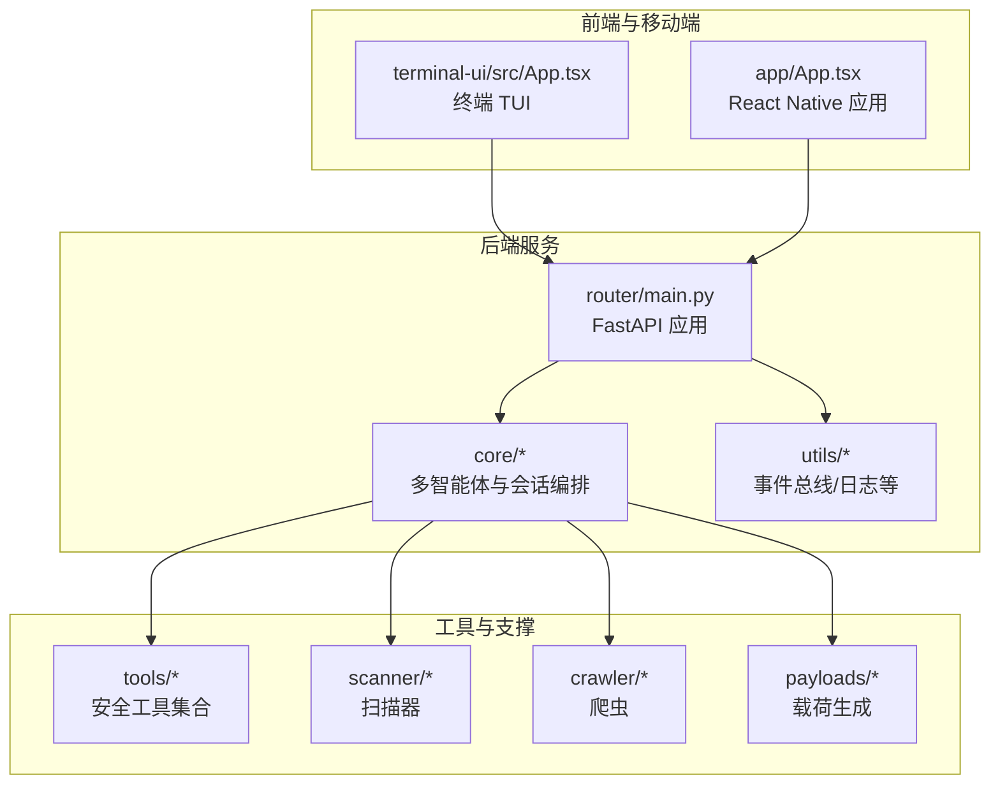
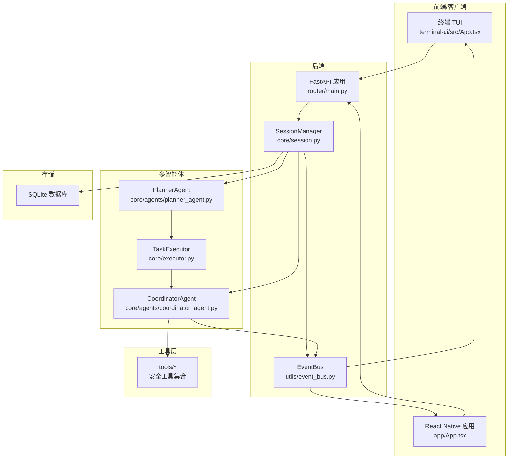
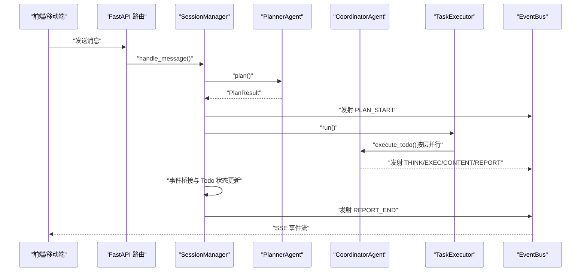
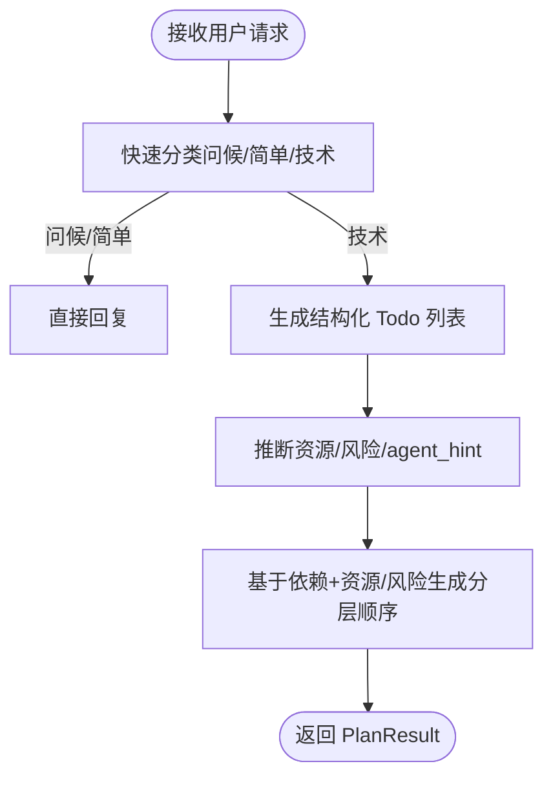
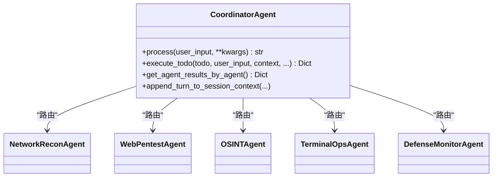
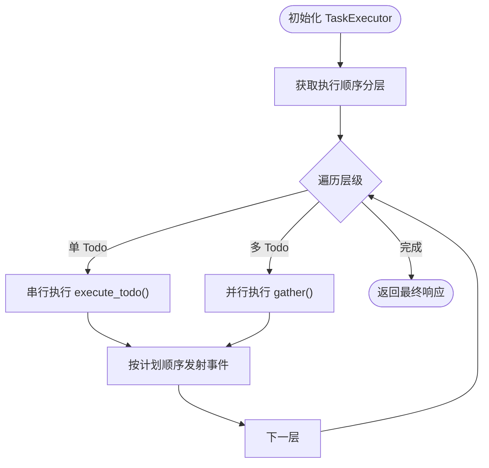
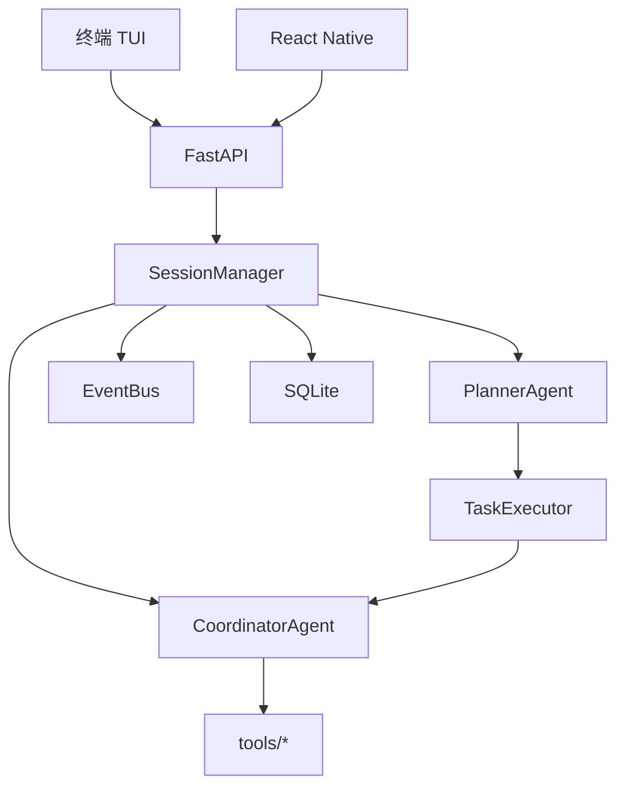

# 项目概述

<cite>
**本文引用的文件**
- [README_EN.md](file://README_EN.md)
- [README_CN.md](file://README_CN.md)
- [main.py](file://main.py)
- [hackbot\cli.py](file://hackbot/cli.py)
- [core\agents\base.py](file://core/agents/base.py)
- [core\agents\planner_agent.py](file://core/agents/planner_agent.py)
- [core\agents\coordinator_agent.py](file://core/agents/coordinator_agent.py)
- [core\executor.py](file://core/executor.py)
- [core\session.py](file://core/session.py)
- [router\main.py](file://router/main.py)
- [utils\event_bus.py](file://utils/event_bus.py)
- [core\models.py](file://core/models.py)
- [terminal-ui\src\App.tsx](file://terminal-ui/src/App.tsx)
- [app\App.tsx](file://app/App.tsx)
</cite>

## 目录
1. [引言](#引言)
2. [项目结构](#项目结构)
3. [核心组件](#核心组件)
4. [架构总览](#架构总览)
5. [详细组件分析](#详细组件分析)
6. [依赖关系分析](#依赖关系分析)
7. [性能考量](#性能考量)
8. [故障排查指南](#故障排查指南)
9. [结论](#结论)
10. [附录](#附录)

## 引言
Secbot（原名 hackbot）是一个由人工智能驱动的自动化安全测试机器人平台，旨在为授权环境下的安全测试与主动防御提供一体化解决方案。项目通过事件驱动的多智能体协作、结构化规划与执行、以及前后端分离的现代化架构，实现了从信息收集、漏洞扫描、自动化攻击链到报告生成的全链路自动化。

- 项目核心目标
  - 提供可授权、可审计、可扩展的自动化渗透测试与安全巡检能力
  - 以多智能体协同实现复杂安全任务的结构化分解与并行执行
  - 通过事件总线与 SSE 实时渲染，为用户提供沉浸式交互体验
  - 支持 CLI、终端 TUI、移动端 React Native 应用与 Web 前端的多入口接入

- 主要功能特性
  - 多智能体模式：ReAct、Plan-Execute、多智能体、工具使用、记忆增强
  - AI Web 研究子智能体：联网搜索、页面提取、多页爬取与 API 交互
  - 渗透测试全链路：信息收集 → 漏洞扫描 → 漏洞利用 → 后渗透 → 报告生成
  - 安全与防御：主动防御、入侵检测、网络分析、安全报告
  - 互联网能力：智能搜索、深度爬取、API 客户端、Web 研究工具
  - 附加能力：提示词链管理、SQLite 持久化、任务调度、终端输出优化

- 技术优势
  - 事件驱动架构：通过 EventBus 解耦智能体与 UI，支持 SSE 实时事件流
  - 多智能体系统：规划器、协调器、专用子智能体与摘要智能体各司其职
  - 分层并行执行：TaskExecutor 基于依赖拓扑与资源/风险约束进行安全并行
  - 前后端分离：FastAPI 后端 + TypeScript/React 前端 + React Native 移动端
  - 适配本地与云端推理：支持 Ollama 本地推理与多种云端大模型

- 法律合规与使用限制
  - 仅限授权环境使用，严禁未授权网络攻击
  - 使用前需确保遵守所在国家/地区的法律法规
  - 项目提供安全警告与免责声明，强调负责任使用

**章节来源**
- [README_EN.md](file://README_EN.md#L13-L51)
- [README_CN.md](file://README_CN.md#L13-L51)

## 项目结构
Secbot 采用模块化与分层组织方式，涵盖后端服务、多智能体核心、工具层、前端与移动端、以及文档与脚本等部分。核心目录与职责概览如下：

- 后端服务
  - router：FastAPI 路由与服务入口，注册各业务模块路由
  - core：多智能体核心、会话编排、执行器、模型定义
  - utils：事件总线、日志、模型选择等通用工具
- 多智能体与工具
  - core/agents：基础智能体、规划器、协调器、摘要、专用子智能体
  - tools：安全测试工具集合（网络、Web、OSINT、防御、实用工具等）
  - scanner、crawler、payloads：扫描、爬虫、载荷生成等支撑模块
- 前端与移动端
  - terminal-ui：TypeScript/Ink 终端 TUI，支持交互与命令面板
  - app：React Native 移动端应用，提供聊天、仪表盘、防御、网络、历史等功能
  - api/app：前端 API 客户端与类型定义
- 文档与脚本
  - docs：设计范式、API、数据库、Docker、Ollama、部署等文档
  - scripts：构建与启动脚本
  - tests：单元测试与集成测试

**图表来源**
- [router\main.py](file://router/main.py#L19-L71)
- [terminal-ui\src\App.tsx](file://terminal-ui/src/App.tsx#L26-L201)
- [app\App.tsx](file://app/App.tsx#L28-L108)

**章节来源**
- [router\main.py](file://router/main.py#L19-L71)
- [README_EN.md](file://README_EN.md#L73-L152)

## 核心组件
本节聚焦 Secbot 的核心组件与职责边界，帮助读者快速理解系统如何协作完成一次完整的自动化安全测试任务。

- SessionManager（会话编排器）
  - 负责会话生命周期管理、消息路由、规划与执行编排、事件桥接与摘要生成
  - 支持 Q&A 快速回复与技术任务的完整链路
  - 通过 EventBus 将事件分发给前端 UI，支持任务阶段、思考、执行、报告等事件类型

- PlannerAgent（规划器）
  - 将用户请求分类为问候、简单问答或技术任务
  - 技术任务生成结构化 Todo 列表，包含依赖关系、资源标记、风险等级与子智能体提示
  - 基于依赖拓扑与资源/风险约束生成分层并行执行顺序

- CoordinatorAgent（协调器）
  - 多子智能体的入口，根据 Todo 的 agent_hint/resource/tool_hint 将任务路由到专用子智能体
  - 聚合各子智能体的工具执行结果，供摘要智能体生成最终报告

- TaskExecutor（分层执行器）
  - 按规划器输出的层级顺序执行 Todo，支持单步串行与多步并行
  - 构造上下文（按 Todo 与按资源），向子智能体传递历史结果与资产视图

- EventBus（事件总线）
  - 定义统一事件类型（规划、思考、执行、内容、报告、任务阶段、错误等）
  - 支持同步与异步事件订阅与发射，解耦智能体与 UI

- 模型与数据结构
  - TodoItem、PlanResult、RequestType、Session、SessionMessage 等核心数据模型
  - 为规划、执行与摘要提供统一的数据契约

**章节来源**
- [core\session.py](file://core/session.py#L32-L422)
- [core\agents\planner_agent.py](file://core/agents/planner_agent.py#L20-L276)
- [core\agents\coordinator_agent.py](file://core/agents/coordinator_agent.py#L40-L237)
- [core\executor.py](file://core/executor.py#L17-L179)
- [utils\event_bus.py](file://utils/event_bus.py#L15-L187)
- [core\models.py](file://core/models.py#L23-L137)

## 架构总览
Secbot 采用事件驱动的多智能体架构，结合 FastAPI 后端与前端/移动端入口，形成“前端/移动端 → 后端 API → 会话编排 → 多智能体 → 工具层 → 摘要与存储”的完整链路。SSE 事件流将思考、执行与报告实时推送到前端，实现流畅的可视化反馈。

**图表来源**
- [router\main.py](file://router/main.py#L19-L71)
- [core\session.py](file://core/session.py#L139-L422)
- [core\agents\planner_agent.py](file://core/agents/planner_agent.py#L86-L276)
- [core\agents\coordinator_agent.py](file://core/agents/coordinator_agent.py#L130-L237)
- [core\executor.py](file://core/executor.py#L46-L179)
- [utils\event_bus.py](file://utils/event_bus.py#L68-L187)
- [terminal-ui\src\App.tsx](file://terminal-ui/src/App.tsx#L26-L201)
- [app\App.tsx](file://app/App.tsx#L28-L108)

**章节来源**
- [README_EN.md](file://README_EN.md#L67-L152)
- [README_CN.md](file://README_CN.md#L67-L152)

## 详细组件分析

### 会话编排与事件桥接（SessionManager）
- 路由与快速回复：对问候、闲聊与项目帮助类请求，直接走 QAAgent 快速回复
- 技术任务编排：规划 → 执行 → 摘要，全程通过 EventBus 发射任务阶段、思考、执行与报告事件
- 事件桥接：将智能体回调事件标准化为 EventBus 事件，自动更新 Todo 状态并发射 PLAN_TODO
- 摘要阶段：汇总 ReAct 历史、工具结果与多智能体聚合结果，生成结构化报告

**图表来源**
- [core\session.py](file://core/session.py#L139-L422)
- [core\agents\planner_agent.py](file://core/agents/planner_agent.py#L86-L276)
- [core\executor.py](file://core/executor.py#L46-L179)
- [utils\event_bus.py](file://utils/event_bus.py#L15-L187)

**章节来源**
- [core\session.py](file://core/session.py#L139-L422)

### 规划器（PlannerAgent）
- 请求分类：问候、简单问答、技术任务
- 结构化规划：生成 TodoItem 列表，包含依赖、资源标记、风险等级与 agent_hint
- 执行顺序：基于依赖拓扑与资源/风险约束生成分层并行执行序列，保障高风险在同一资源上串行

**图表来源**
- [core\agents\planner_agent.py](file://core/agents/planner_agent.py#L86-L276)

**章节来源**
- [core\agents\planner_agent.py](file://core/agents/planner_agent.py#L20-L276)
- [core\models.py](file://core/models.py#L23-L79)

### 协调器与专用子智能体（CoordinatorAgent）
- 路由策略：优先使用 Planner 提供的 agent_hint，其次依据 resource 前缀，最后根据 tool_hint 选择
- 结果聚合：按 agent 维度聚合工具执行结果，供摘要智能体生成多智能体报告
- 会话摘要：将本轮任务摘要写入各子智能体的会话上下文，支持连续任务的记忆复用

**图表来源**
- [core\agents\coordinator_agent.py](file://core/agents/coordinator_agent.py#L40-L335)

**章节来源**
- [core\agents\coordinator_agent.py](file://core/agents/coordinator_agent.py#L40-L237)

### 分层执行器（TaskExecutor）
- 层级遍历：按规划器输出的层级顺序执行，单 Todo 串行，多 Todo 并行
- 上下文聚合：按 Todo 与按资源的结果映射，供后续步骤复用
- 事件推送：按计划顺序向 EventBus 推送执行事件，保证前端线性渲染

**图表来源**
- [core\executor.py](file://core/executor.py#L46-L179)

**章节来源**
- [core\executor.py](file://core/executor.py#L17-L179)

### 事件总线（EventBus）
- 事件类型：规划、思考、执行、内容、报告、任务阶段、错误、会话更新等
- 订阅与发射：支持同步与异步处理器，提供便捷的 emit_simple/emit_simple_async 方法
- 解耦设计：智能体与 UI 通过事件总线通信，降低耦合度

**章节来源**
- [utils\event_bus.py](file://utils/event_bus.py#L15-L187)

### 前端与移动端入口
- 终端 TUI（TypeScript/Ink）：提供全屏终端交互，支持命令面板、模型配置、REST 结果弹窗等
- 移动端（React Native）：底部导航 Tab，覆盖聊天、仪表盘、防御、网络、历史等页面
- 后端 API：通过 FastAPI 提供 REST 与 SSE 接口，支持多入口接入

**章节来源**
- [terminal-ui\src\App.tsx](file://terminal-ui/src/App.tsx#L26-L201)
- [app\App.tsx](file://app/App.tsx#L28-L108)
- [router\main.py](file://router/main.py#L19-L71)

## 依赖关系分析
- 组件耦合与内聚
  - SessionManager 作为编排中枢，内聚路由、规划、执行与摘要逻辑，通过 EventBus 与智能体解耦
  - PlannerAgent 与 TaskExecutor 通过 PlanResult 与 TodoItem 数据契约耦合，保持清晰的职责边界
  - CoordinatorAgent 与专用子智能体通过 agent_hint/resource/tool_hint 路由策略耦合，便于扩展新的子智能体
- 外部依赖与集成点
  - FastAPI + uvicorn 提供高性能后端服务
  - SSE 事件流与前端/移动端实时渲染
  - SQLite 用于会话历史、提示词链与配置的持久化
  - LLM 推理（Ollama 或云端）用于规划与问答

**图表来源**
- [core\session.py](file://core/session.py#L139-L422)
- [core\agents\planner_agent.py](file://core/agents/planner_agent.py#L86-L276)
- [core\executor.py](file://core/executor.py#L46-L179)
- [core\agents\coordinator_agent.py](file://core/agents/coordinator_agent.py#L130-L237)
- [router\main.py](file://router/main.py#L19-L71)

**章节来源**
- [router\main.py](file://router/main.py#L19-L71)
- [core\session.py](file://core/session.py#L139-L422)

## 性能考量
- 并行与串行平衡
  - TaskExecutor 基于依赖拓扑与资源/风险约束进行分层并行，避免高风险在同一资源上并发
  - 单层内使用 asyncio.gather 并行执行，层间严格遵循依赖顺序，保证正确性与可观测性
- 事件流与渲染
  - EventBus 支持同步与异步处理器，前端通过 SSE 实时渲染，减少 UI 阻塞
  - 事件桥接在 SessionManager 中完成，统一标准化事件并自动更新 Todo 状态
- 资源与模型
  - Planner 在规划阶段预加载工具列表，提高 tool_hint 准确性，减少无效尝试
  - LLM 推理可通过 Ollama 或云端模型配置，按需调整温度与模型以平衡质量与速度

[本节为通用性能讨论，无需列出具体文件来源]

## 故障排查指南
- 后端服务启动
  - 端口占用：当端口 8000 被占用时，启动脚本会提示并退出；请先停止占用进程
  - CORS 配置：开发阶段允许全部来源，生产环境应限制来源
- 会话与事件
  - 事件类型缺失：检查 EventBus 事件类型定义与前端订阅是否一致
  - 事件桥接：确认 SessionManager 的事件桥接逻辑是否正确映射到 PLAN_TODO 与任务阶段
- 执行器与智能体
  - 执行异常：TaskExecutor 在并行执行时会记录异常并返回错误信息，检查工具参数与权限
  - 子智能体结果聚合：确认 CoordinatorAgent 的按 agent 维度聚合逻辑是否正常
- 前端交互
  - 终端 TUI：检查后端 API 地址与 SSE 连接状态
  - 移动端：确认路由与导航配置，检查各 Tab 页面的渲染与数据获取

**章节来源**
- [router\main.py](file://router/main.py#L74-L98)
- [core\session.py](file://core/session.py#L532-L780)
- [core\executor.py](file://core/executor.py#L90-L133)
- [terminal-ui\src\App.tsx](file://terminal-ui/src/App.tsx#L26-L201)

## 结论
Secbot 通过事件驱动的多智能体架构，将复杂的渗透测试任务分解为可规划、可执行、可观测的步骤，并以结构化报告呈现结果。项目在技术架构上强调解耦与可扩展性，支持本地与云端推理、多入口前端接入与持续演进的工具体系。对于初学者，项目提供了清晰的入门路径与命令面板；对于经验丰富的安全研究人员，项目提供了强大的自动化能力与可观测性，便于在授权环境中开展高效的自动化安全测试与主动防御。

[本节为总结性内容，无需列出具体文件来源]

## 附录
- 命名演进
  - 项目从 hackbot 迁移至 secbot，保留 hackbot 作为兼容入口，文档与示例逐步迁移为 secbot
- 快速入口
  - 交互模式：无参数运行 main.py 或 secbot 命令进入全屏 TUI
  - 后端服务：通过 hackbot-server 或 python -m router.main 启动
  - 终端 TUI：在 terminal-ui 目录下安装依赖并运行 tui 脚本
- 法律合规
  - 仅限授权环境使用，严禁未授权网络攻击
  - 使用前请确保遵守所在国家/地区的法律法规

**章节来源**
- [README_EN.md](file://README_EN.md#L197-L201)
- [README_CN.md](file://README_CN.md#L273-L276)
- [main.py](file://main.py#L44-L62)
- [hackbot\cli.py](file://hackbot/cli.py#L32-L80)
- [README_EN.md](file://README_EN.md#L266-L294)
- [README_CN.md](file://README_CN.md#L354-L386)