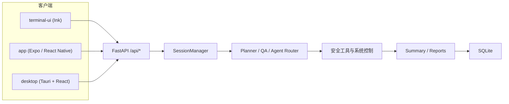

<div align="center">

<h1 style="font-size: 3em; font-weight: bold; margin-bottom: 10px;">
  Secbot
</h1>

<p style="font-size: 1.2em; color: #666; margin-bottom: 20px;">
  <strong>AI 驱动的自动化安全测试与多前端工作台</strong>
</p>

<p>
  <a href="https://www.python.org/downloads/">
    
  </a>
  <a href="pyproject.toml">
    
  </a>
  <a href="LICENSE">
    
  </a>
  <a href="https://github.com/iammm0/secbot/releases">
    
  </a>
</p>

<p>
  <a href="https://github.com/langchain-ai/langchain">
    
  </a>
  <a href="https://github.com/langchain-ai/langgraph">
    
  </a>
  <a href="https://fastapi.tiangolo.com/">
    
  </a>
  <a href="https://www.sqlite.org/">
    
  </a>
  <a href="https://github.com/astral-sh/uv">
    
  </a>
  <a href="https://github.com/vadimdemedes/ink">
    
  </a>
</p>

<p>
  <a href="README_EN.md">English</a> | 中文
</p>

</div>

---

> **安全警告**：本工具仅用于**获得明确授权**的安全测试、研究与教学。未经授权的网络攻击、渗透、爆破或控制行为可能违法。详见 [docs/SECURITY_WARNING.md](docs/SECURITY_WARNING.md)。

---


## 分支定位

- 当前分支：`debug-mobile`
- 前端形态：仅保留 `app/`（Expo / React Native）
- 已移除：`desktop/`（桌面端）与 `terminal-ui/`（TUI）

## 功能概览

- **统一后端**：基于 FastAPI 暴露 REST + SSE 接口，当前分支主要面向移动端调试。
- **多智能体执行**：支持 `secbot-cli` 自动模式与 `superhackbot` 专家模式，结合规划、执行、总结链路完成安全任务。
- **安全测试能力**：覆盖内网发现、端口与服务识别、Web 安全、OSINT、系统控制、防御扫描与报告生成。
- **多推理后端**：内置 Ollama、DeepSeek、OpenAI、Anthropic、Gemini、Groq、OpenRouter 及多家 OpenAI 兼容厂商。
- **前端形态**：当前分支仅保留 `app/`（Expo / React Native）工程。
- **SQLite 持久化**：对话历史、提示词链、用户偏好和 API Key 配置可持久化到 SQLite。

## 架构概览



更细的 UI 与事件流说明见 [docs/UI-DESIGN-AND-INTERACTION.md](docs/UI-DESIGN-AND-INTERACTION.md)，API 细节见 [docs/API.md](docs/API.md)。

## 环境要求

- Python `3.10+`
- [uv](https://github.com/astral-sh/uv)（推荐，用于同步 Python 依赖）
- Node.js `18+`
  说明：从源码运行 `terminal-ui/`、`app/`、`desktop/` 时需要；仅跑后端可不装
- Ollama（可选，本地模型时需要）

## 安装与启动

### 方式一：从源码运行（推荐）

```bash
git clone https://github.com/iammm0/secbot.git
cd secbot

# Python 依赖
uv sync

# 终端 TUI 依赖
cd terminal-ui
npm install
cd ..
```

创建 `.env`，至少填写一组可用推理后端配置。仓库当前**没有**根目录 `.env.example`，请直接手动新建：

```env
# 云端推理（默认推荐）
LLM_PROVIDER=deepseek
DEEPSEEK_API_KEY=sk-your-api-key
DEEPSEEK_MODEL=deepseek-reasoner

# 或改用本地 Ollama
# LLM_PROVIDER=ollama
# OLLAMA_BASE_URL=http://localhost:11434
# OLLAMA_MODEL=gemma3:1b
# OLLAMA_EMBEDDING_MODEL=nomic-embed-text
```

启动完整终端体验：

```bash
python main.py
# 或
uv run secbot
```

说明：

- `python main.py` / `uv run secbot` 会自动拉起本地后端，并进入全屏 `terminal-ui`
- 如果只想调试后端，用 `uv run secbot --backend`
- 如果后端已经在运行，也可以单独启动 `terminal-ui`

```bash
uv run secbot --backend

# 新开一个终端
cd terminal-ui
npm run tui
```

### 方式二：下载 GitHub Release

从 [Releases](https://github.com/iammm0/secbot/releases) 下载对应平台的 zip 包并解压。当前发布产物仍沿用历史命名，解压后可执行文件通常为：

- Windows：`hackbot.exe`
- Linux / macOS：`hackbot`

在可执行文件同目录创建 `.env` 后再运行，例如：

```env
LLM_PROVIDER=deepseek
DEEPSEEK_API_KEY=sk-your-api-key
```

更详细的发布包说明见 [docs/RELEASE.md](docs/RELEASE.md)。

### 方式三：安装 wheel / 本地包

如果你只需要命令入口和后端，也可以本地安装当前仓库：

```bash
uv pip install -e .
# 或
pip install .
```

可用命令包括：

```bash
secbot
secbot --backend
secbot --tui
hackbot
hackbot-server
secbot-server
```

注意：通过 wheel / pip 安装时，包内**不一定包含** `terminal-ui` 的 Node 前端资源。此时 `secbot` 会优先保证后端可启动，完整 TUI 请使用源码运行或 GitHub Release。

## 快速开始

### 1. 先跑起来

```bash
python main.py
```

### 2. 常见开发入口

```bash
# 仅后端
uv run secbot --backend

# 移动端
cd app && npm install && npm start
```

### 3. 常用环境变量

| 变量 | 用途 | 默认值 |
|------|------|--------|
| `LLM_PROVIDER` | 当前推理后端 | `deepseek` |
| `DEEPSEEK_API_KEY` | DeepSeek API Key | 无 |
| `DEEPSEEK_MODEL` | DeepSeek 默认模型 | `deepseek-reasoner` |
| `OLLAMA_BASE_URL` | Ollama 服务地址 | `http://localhost:11434` |
| `OLLAMA_MODEL` | Ollama 默认模型 | `gemma3:1b` |
| `OLLAMA_EMBEDDING_MODEL` | Ollama 嵌入模型 | `nomic-embed-text` |
| `DATABASE_URL` | SQLite 路径 | `sqlite:///./data/secbot.db` |
| `LOG_LEVEL` | 日志级别 | `INFO` |

### 4. 常见斜杠命令

| 命令 | 说明 |
|------|------|
| `/model` | 选择推理后端、模型、API Key、Base URL |
| `/agent` | 切换 `secbot-cli` / `superhackbot` |
| `/list-agents` | 查看当前可用智能体 |
| `/system-info` | 查看系统信息 |
| `/db-stats` | 查看 SQLite 统计 |
| `/logs` | 查看运行日志 |

## 目录结构

```text
secbot/
├── main.py                 # 一键启动入口（后端 + terminal-ui）
├── secbot_cli/             # 命令行入口与启动编排
├── router/                 # FastAPI 路由层
├── core/                   # 智能体、执行器、规划器、记忆等核心逻辑
├── tools/                  # 安全工具、Web 研究、协议、报告、云安全等
├── database/               # SQLite 模型与数据库管理
├── app/                    # Expo / React Native 客户端
├── hackbot_config/         # 配置、环境变量与持久化偏好
├── scripts/                # 启动与构建脚本
├── tests/                  # 测试
└── docs/                   # 项目文档
```

## 文档索引

| 文档 | 说明 |
|------|------|
| [docs/QUICKSTART.md](docs/QUICKSTART.md) | 从源码启动、前后端调试与常见入口 |
| [docs/API.md](docs/API.md) | FastAPI REST + SSE 接口说明 |
| [docs/APP.md](docs/APP.md) | Expo / React Native 移动端说明 |
| [docs/LLM_PROVIDERS.md](docs/LLM_PROVIDERS.md) | 多厂商模型后端与配置方式 |
| [docs/OLLAMA_SETUP.md](docs/OLLAMA_SETUP.md) | 本地 Ollama 配置与排障 |
| [docs/UI-DESIGN-AND-INTERACTION.md](docs/UI-DESIGN-AND-INTERACTION.md) | `terminal-ui` 的交互设计与上下文架构 |
| [docs/DEPLOYMENT.md](docs/DEPLOYMENT.md) | 后端部署与 systemd 示例 |
| [docs/DOCKER_SETUP.md](docs/DOCKER_SETUP.md) | Docker 当前策略说明 |
| [docs/RELEASE.md](docs/RELEASE.md) | Release 包使用与源码打包说明 |
| [docs/DATABASE_GUIDE.md](docs/DATABASE_GUIDE.md) | SQLite 结构与数据库操作 |
| [docs/CHANGELOG.md](docs/CHANGELOG.md) | 版本变更记录 |

## 贡献

欢迎提交 Issue 和 Pull Request。

1. Fork 本仓库
2. 创建分支：`git checkout -b feat/your-change`
3. 提交修改：`git commit -m "docs: update guides"`
4. 推送分支并发起 PR

## 许可证

本项目使用 [LICENSE](LICENSE) 中定义的 **Secbot Open Source License**：

- 允许个人学习、学术研究、教学与非营利技术交流
- 修改与分发时需保留版权与协议声明
- 商业用途需事先获得书面授权

商用授权联系：[wisewater5419@gmail.com](mailto:wisewater5419@gmail.com)

## 作者

赵明俊（Zhao Mingjun）

- GitHub: [@iammm0](https://github.com/iammm0)
- Email: [wisewater5419@gmail.com](mailto:wisewater5419@gmail.com)
