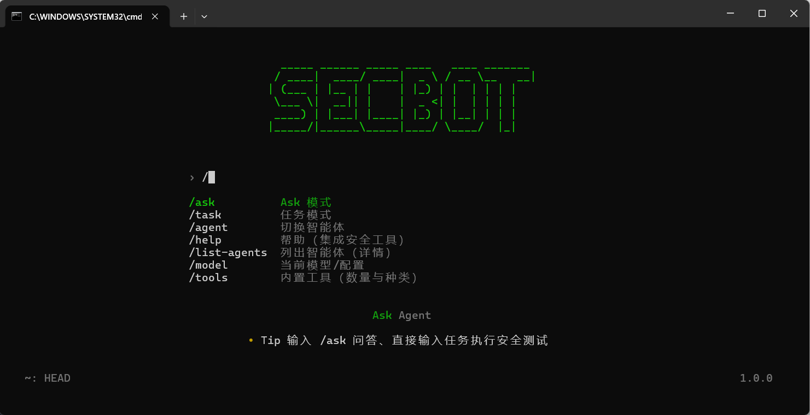

# Secbot Monorepo

<div align="center">



**AI-native security automation platform with ACP/MCP/Skills integration**

[中文](README_CN.md) | [English](README_EN.md)

</div>

---

## Security Notice

This project is for **authorized security testing and defense research only**.
Do not run against systems without explicit permission.

## What This Repo Now Contains

`secbot` is now organized as a monorepo and integrates `opencode` capabilities:

- `ACP`: protocol bridge between clients and secbot agent runtime
- `MCP`: local/remote tool ecosystem integration
- `Skills`: unified skill discovery + injection + on-demand skill loading
- `Plan/Edit`: plan mode + opencode-style file editing semantics

## Monorepo Structure

```text
apps/
  secbot-api/          # API and routing
  secbot-cli/          # CLI and TUI launcher
  opencode-gateway/    # ACP gateway (ND-JSON over stdio)

packages/
  secbot-core/         # session/planner/executor core
  secbot-tools/        # built-in tools and system actions
  secbot-skills/       # native skills
  shared-config/       # shared config + feature flags + MCP config loader
  opencode-adapters/   # MCP/skills/edit/permission adapters
```

## Core Capabilities

- Multi-agent orchestration with planner + layered executor
- ACP-compatible session lifecycle and streaming updates
- MCP server management (`local`/`remote`) and dynamic tool wrapping
- Unified skills from secbot + opencode-style directories
- Permission model (`allow` / `ask` / `deny`) for risky actions
- Plan mode (`plan`) and ask mode (`ask`) besides full agent mode

## Quick Start

### 1) Install

```bash
python -m pip install -e .
```

### 2) Start API / CLI

```bash
secbot-server
# or
python main.py --backend

secbot-cli
# or
python main.py
```

### 3) Start ACP Gateway

```bash
python -m opencode_gateway.main
# or (after install scripts)
secbot-acp
```

## Feature Flags (Gradual Rollout)

Set with environment variables:

- `SECBOT_ACP_ENABLED`
- `SECBOT_MCP_ENABLED`
- `SECBOT_UNIFIED_SKILLS`
- `SECBOT_EDIT_TOOLS`
- `SECBOT_PLAN_MODE`
- `SECBOT_PERMISSIONS`

Example:

```bash
export SECBOT_ACP_ENABLED=true
export SECBOT_MCP_ENABLED=true
export SECBOT_UNIFIED_SKILLS=true
export SECBOT_EDIT_TOOLS=true
export SECBOT_PLAN_MODE=true
export SECBOT_PERMISSIONS=true
```

## MCP Configuration

Create `opencode.json` in project root:

```json
{
  "mcp": {
    "my-local": {
      "type": "local",
      "command": ["node", "./path/to/server.js"]
    },
    "my-remote": {
      "type": "remote",
      "url": "https://example.com/mcp",
      "headers": {
        "Authorization": "Bearer xxx"
      }
    }
  }
}
```

## Testing

```bash
python -m pytest tests/test_monorepo_integration.py -v
```

## Docs

- Migration details: `docs/MONOREPO_MIGRATION.md`
- Chinese guide: `README_CN.md`
- English guide: `README_EN.md`
