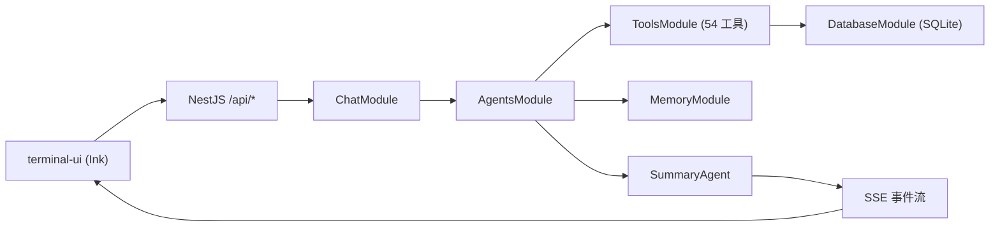

<div align="center">

<h1 style="font-size: 3em; font-weight: bold; margin-bottom: 10px;">
  Secbot
</h1>

<p style="font-size: 1.2em; color: #666; margin-bottom: 20px;">
  <strong>AI 驱动的自动化安全测试工作台</strong>
</p>

<p>
  <a href="https://nodejs.org/">
    
  </a>
  <a href="https://www.typescriptlang.org/">
    
  </a>
  <a href="package.json">
    
  </a>
  <a href="LICENSE">
    
  </a>
  <a href="https://github.com/iammm0/secbot/releases">
    
  </a>
</p>

<p>
  <a href="https://nestjs.com/">
    
  </a>
  <a href="https://www.sqlite.org/">
    
  </a>
  <a href="https://github.com/vadimdemedes/ink">
    
  </a>
</p>

<p>
  <a href="README_EN.md">English</a> | 中文
</p>

</div>

---

> **安全警告**：本工具仅用于**获得明确授权**的安全测试、研究与教学。未经授权的网络攻击、渗透、爆破或控制行为可能违法。详见 [docs/SECURITY_WARNING.md](docs/SECURITY_WARNING.md)。

---

## 功能概览

- **统一后端**：基于 NestJS 暴露 REST + SSE 接口，CLI/TUI 共用同一套编排与事件流。
- **多智能体执行**：支持 `secbot-cli` 自动模式与 `superhackbot` 专家模式，结合规划、执行、总结链路完成安全任务。
- **安全测试能力**：覆盖内网发现、端口与服务识别、Web 安全、OSINT、系统控制、防御扫描与报告生成，共 54 个工具。
- **多推理后端**：内置 Ollama、DeepSeek、OpenAI 及多家 OpenAI 兼容厂商支持。
- **终端 TUI**：基于 Ink + React 的全屏终端交互界面。
- **SQLite 持久化**：对话历史、提示词链、用户偏好和 API Key 配置可持久化到 SQLite。
- **记忆与知识**：短期/长期/情景记忆子系统，向量存储与语义检索。
- **漏洞数据库**：统一漏洞 schema，适配 CVE/NVD/Exploit-DB/MITRE ATT&CK。

## 架构概览



更细的 UI 与事件流说明见 [docs/UI-DESIGN-AND-INTERACTION.md](docs/UI-DESIGN-AND-INTERACTION.md)，API 细节见 [docs/API.md](docs/API.md)。

## 环境要求

- **Node.js** `18+`（后端与所有前端均需要）
- **npm**（随 Node.js 附带）
- **Ollama**（可选，本地模型时需要）

## 安装与启动

### 方式一：从 npm 安装

```bash
npm install -g @opensec/secbot
secbot
```

### 方式二：从源码运行（推荐开发使用）

```bash
git clone https://github.com/iammm0/secbot.git
cd secbot
npm install
```

创建 `.env`，至少填写一组可用推理后端配置：

```env
# 云端推理（默认推荐）
LLM_PROVIDER=deepseek
DEEPSEEK_API_KEY=sk-your-api-key
DEEPSEEK_MODEL=deepseek-reasoner

# 或改用本地 Ollama
# LLM_PROVIDER=ollama
# OLLAMA_BASE_URL=http://localhost:11434
# OLLAMA_MODEL=gemma3:1b
```

启动完整终端体验：

```bash
# 一键启动后端 + TUI
npm run start:stack

# 或分步启动
npm run dev          # 启动后端（开发模式，热重载）
npm run start:tui    # 在另一终端启动 TUI
```

### 方式三：下载 GitHub Release

从 [Releases](https://github.com/iammm0/secbot/releases) 下载 npm 打包产物（`.tgz`），解压后运行。

更详细的发布包说明见 [docs/RELEASE.md](docs/RELEASE.md)。

## 快速开始

### 1. 常见开发入口

```bash
# 开发模式（后端热重载）
npm run dev

# 生产构建
npm run build
npm start

# 终端 TUI
npm run start:tui
```

### 2. 常用环境变量

| 变量 | 用途 | 默认值 |
|------|------|--------|
| `LLM_PROVIDER` | 当前推理后端 | `deepseek` |
| `DEEPSEEK_API_KEY` | DeepSeek API Key | 无 |
| `DEEPSEEK_MODEL` | DeepSeek 默认模型 | `deepseek-reasoner` |
| `OLLAMA_BASE_URL` | Ollama 服务地址 | `http://localhost:11434` |
| `OLLAMA_MODEL` | Ollama 默认模型 | `gemma3:1b` |
| `PORT` | 后端监听端口 | `8000` |

### 3. 常见斜杠命令（TUI 内使用）

| 命令 | 说明 |
|------|------|
| `/model` | 选择推理后端、模型、API Key、Base URL |
| `/agent` | 切换 `secbot-cli` / `superhackbot` |
| `/list-agents` | 查看当前可用智能体 |
| `/system-info` | 查看系统信息 |
| `/db-stats` | 查看 SQLite 统计 |

## 目录结构

```text
secbot/
├── server/                 # NestJS 后端
│   └── src/
│       ├── main.ts         # 应用入口
│       ├── app.module.ts   # 根模块
│       ├── common/         # 公共基础设施（LLM 抽象、过滤器、拦截器）
│       └── modules/        # 业务模块
│           ├── agents/     # 多智能体（Planner/Hackbot/Coordinator/Summary）
│           ├── chat/       # SSE 聊天接口
│           ├── tools/      # 54 个安全工具（10 大类）
│           ├── database/   # SQLite 持久化
│           ├── memory/     # 记忆子系统
│           ├── vuln-db/    # 漏洞数据库
│           ├── network/    # 网络发现与远程控制
│           ├── defense/    # 防御扫描
│           ├── sessions/   # 会话管理
│           ├── system/     # 系统信息与配置
│           ├── crawler/    # 爬虫调度
│           └── health/     # 健康检查
├── npm-bin/                # npm CLI 入口包装
│   ├── secbot.js
│   └── secbot-server.js
├── terminal-ui/            # Ink 终端前端
├── scripts/                # 启动与构建脚本
├── tools/                  # 工具能力说明文档
└── docs/                   # 项目文档
```

## 开发

```bash
# 类型检查
npm run typecheck

# 代码检查
npm run lint

# 代码格式化
npm run format

# 运行测试
npm test

# 构建
npm run build
```

## 文档索引

| 文档 | 说明 |
|------|------|
| [docs/QUICKSTART.md](docs/QUICKSTART.md) | 快速启动指南 |
| [docs/API.md](docs/API.md) | REST + SSE 接口说明 |
| [docs/LLM_PROVIDERS.md](docs/LLM_PROVIDERS.md) | 多厂商模型后端与配置 |
| [docs/OLLAMA_SETUP.md](docs/OLLAMA_SETUP.md) | 本地 Ollama 配置 |
| [docs/UI-DESIGN-AND-INTERACTION.md](docs/UI-DESIGN-AND-INTERACTION.md) | TUI 交互设计 |
| [docs/DEPLOYMENT.md](docs/DEPLOYMENT.md) | 后端部署指南 |
| [docs/RELEASE.md](docs/RELEASE.md) | 发布与打包说明 |
| [docs/DATABASE_GUIDE.md](docs/DATABASE_GUIDE.md) | SQLite 结构与操作 |
| [docs/TOOL_EXTENSION.md](docs/TOOL_EXTENSION.md) | 工具扩展开发指南 |

## 贡献

欢迎提交 Issue 和 Pull Request。

1. Fork 本仓库
2. 创建分支：`git checkout -b feat/your-change`
3. 提交修改：`git commit -m "feat: 新增某功能"`
4. 推送分支并发起 PR

提交信息遵循 [Conventional Commits](https://www.conventionalcommits.org/) 规范。

## 许可证

本项目使用 [LICENSE](LICENSE) 中定义的 **Secbot Open Source License**：

- 允许个人学习、学术研究、教学与非营利技术交流
- 修改与分发时需保留版权与协议声明
- 商业用途需事先获得书面授权

商用授权联系：[wisewater5419@gmail.com](mailto:wisewater5419@gmail.com)

## 作者

赵明俊（Zhao Mingjun）

- GitHub: [@iammm0](https://github.com/iammm0)
- Email: [wisewater5419@gmail.com](mailto:wisewater5419@gmail.com)
