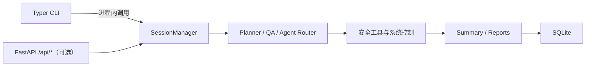

<div align="center">

<h1 style="font-size: 3em; font-weight: bold; margin-bottom: 10px;">
  Secbot
</h1>

<p style="font-size: 1.2em; color: #666; margin-bottom: 20px;">
  <strong>AI 驱动的自动化安全测试 CLI</strong>
</p>

<p>
  <a href="https://www.python.org/downloads/">
    
  </a>
  <a href="pyproject.toml">
    
  </a>
  <a href="LICENSE">
    
  </a>
  <a href="https://github.com/iammm0/secbot/releases">
    
  </a>
</p>

<p>
  <a href="https://github.com/langchain-ai/langchain">
    
  </a>
  <a href="https://github.com/langchain-ai/langgraph">
    
  </a>
  <a href="https://fastapi.tiangolo.com/">
    
  </a>
  <a href="https://www.sqlite.org/">
    
  </a>
  <a href="https://github.com/astral-sh/uv">
    
  </a>
</p>

<p>
  <a href="README_EN.md">English</a> | 中文
</p>

</div>

---

> **安全警告**：本工具仅用于**获得明确授权**的安全测试、研究与教学。未经授权的网络攻击、渗透、爆破或控制行为可能违法。详见 [docs/SECURITY_WARNING.md](docs/SECURITY_WARNING.md)。

---


## 功能概览

- **CLI 交互**：基于 Typer + Rich 的原生终端交互，直接在进程内调用核心逻辑，无需网络通信。
- **API 服务**：可选启动 FastAPI 后端，暴露 REST + SSE 接口供第三方集成。
- **多智能体执行**：支持 `secbot-cli` 自动模式与 `superhackbot` 专家模式，结合规划、执行、总结链路完成安全任务。
- **安全测试能力**：覆盖内网发现、端口与服务识别、Web 安全、OSINT、系统控制、防御扫描与报告生成。
- **多推理后端**：内置 Ollama、DeepSeek、OpenAI、Anthropic、Gemini、Groq、OpenRouter 及多家 OpenAI 兼容厂商。
- **SQLite 持久化**：对话历史、提示词链、用户偏好和 API Key 配置可持久化到 SQLite。

## 架构概览



## 环境要求

- Python `3.10+`
- [uv](https://github.com/astral-sh/uv)（推荐，用于同步 Python 依赖）
- Ollama（可选，本地模型时需要）

## 安装与启动

### 方式一：从源码运行（推荐）

```bash
git clone https://github.com/iammm0/secbot.git
cd secbot

# Python 依赖
uv sync
```

创建 `.env`，至少填写一组可用推理后端配置：

```env
# 云端推理（默认推荐）
LLM_PROVIDER=deepseek
DEEPSEEK_API_KEY=sk-your-api-key
DEEPSEEK_MODEL=deepseek-reasoner

# 或改用本地 Ollama
# LLM_PROVIDER=ollama
# OLLAMA_BASE_URL=http://localhost:11434
# OLLAMA_MODEL=gemma3:1b
# OLLAMA_EMBEDDING_MODEL=nomic-embed-text
```

启动：

```bash
# 交互模式
python main.py
# 或
uv run secbot

# 单次任务
uv run secbot "扫描 192.168.1.1 的开放端口"

# 问答模式
uv run secbot --ask "什么是 XSS 攻击？"

# 专家模式
uv run secbot --agent superhackbot

# 切换推理后端/模型
uv run secbot model

# 仅启动 API 服务
uv run secbot server
```

### 方式二：下载 GitHub Release

从 [Releases](https://github.com/iammm0/secbot/releases) 下载对应平台的 zip 包并解压，在可执行文件同目录创建 `.env` 后再运行。

### 方式三：安装 wheel / 本地包

```bash
uv pip install -e .
# 或
pip install .
```

安装后可使用 `secbot` / `hackbot` / `secbot-cli` 命令。

## 常用命令

| 命令 | 说明 |
|------|------|
| `secbot` | 进入交互模式 |
| `secbot "任务描述"` | 执行单次任务 |
| `secbot --ask "问题"` | 问答模式 |
| `secbot --agent superhackbot` | 使用专家智能体 |
| `secbot model` | 切换推理后端与模型 |
| `secbot server` | 启动 FastAPI 后端服务 |
| `secbot version` | 显示版本 |

### 交互模式内的斜杠命令

| 命令 | 说明 |
|------|------|
| `/model` | 选择推理后端、模型、API Key |
| `/help` | 查看帮助 |
| `exit` / `quit` | 退出 |

## 常见环境变量

| 变量 | 用途 | 默认值 |
|------|------|--------|
| `LLM_PROVIDER` | 当前推理后端 | `deepseek` |
| `DEEPSEEK_API_KEY` | DeepSeek API Key | 无 |
| `DEEPSEEK_MODEL` | DeepSeek 默认模型 | `deepseek-reasoner` |
| `OLLAMA_BASE_URL` | Ollama 服务地址 | `http://localhost:11434` |
| `OLLAMA_MODEL` | Ollama 默认模型 | `gemma3:1b` |
| `OLLAMA_EMBEDDING_MODEL` | Ollama 嵌入模型 | `nomic-embed-text` |
| `DATABASE_URL` | SQLite 路径 | `sqlite:///./data/secbot.db` |
| `LOG_LEVEL` | 日志级别 | `INFO` |

## 目录结构

```text
secbot/
├── main.py                 # 入口（调用 Typer CLI）
├── secbot_cli/             # CLI 入口与进程内运行器
├── router/                 # FastAPI 路由层（可选 API 服务）
├── core/                   # 智能体、执行器、规划器、记忆等核心逻辑
├── tools/                  # 安全工具、Web 研究、协议、报告、云安全等
├── database/               # SQLite 模型与数据库管理
├── hackbot_config/         # 配置、环境变量与持久化偏好
├── scripts/                # 启动与构建脚本
├── tests/                  # 测试
└── docs/                   # 项目文档
```

## 文档索引

| 文档 | 说明 |
|------|------|
| [docs/QUICKSTART.md](docs/QUICKSTART.md) | 从源码启动与常见入口 |
| [docs/API.md](docs/API.md) | FastAPI REST + SSE 接口说明 |
| [docs/LLM_PROVIDERS.md](docs/LLM_PROVIDERS.md) | 多厂商模型后端与配置方式 |
| [docs/OLLAMA_SETUP.md](docs/OLLAMA_SETUP.md) | 本地 Ollama 配置与排障 |
| [docs/DEPLOYMENT.md](docs/DEPLOYMENT.md) | 后端部署与 systemd 示例 |
| [docs/DOCKER_SETUP.md](docs/DOCKER_SETUP.md) | Docker 当前策略说明 |
| [docs/RELEASE.md](docs/RELEASE.md) | Release 包使用与源码打包说明 |
| [docs/DATABASE_GUIDE.md](docs/DATABASE_GUIDE.md) | SQLite 结构与数据库操作 |

## 贡献

欢迎提交 Issue 和 Pull Request。

1. Fork 本仓库
2. 创建分支：`git checkout -b feat/your-change`
3. 提交修改：`git commit -m "docs: update guides"`
4. 推送分支并发起 PR

## 许可证

本项目使用 [LICENSE](LICENSE) 中定义的 **Secbot Open Source License**：

- 允许个人学习、学术研究、教学与非营利技术交流
- 修改与分发时需保留版权与协议声明
- 商业用途需事先获得书面授权

商用授权联系：[wisewater5419@gmail.com](mailto:wisewater5419@gmail.com)

## 作者

赵明俊（Zhao Mingjun）

- GitHub: [@iammm0](https://github.com/iammm0)
- Email: [wisewater5419@gmail.com](mailto:wisewater5419@gmail.com)
