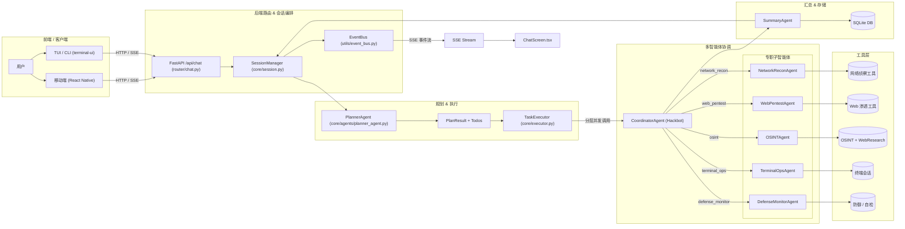

<div align="center">

<h1 style="font-size: 3em; font-weight: bold; margin-bottom: 10px;">
  Secbot
</h1>

<p style="font-size: 1.2em; color: #666; margin-bottom: 20px;">
  <strong>AI 驱动的自动化渗透测试智能体</strong>
</p>

<p>
  <a href="https://www.python.org/downloads/">
    
  </a>
  <a href="pyproject.toml">
    
  </a>
  <a href="LICENSE">
    
  </a>
  <a href="https://github.com/iammm0/secbot/releases">
    
  </a>
</p>

<p>
  <a href="https://github.com/langchain-ai/langchain">
    
  </a>
  <a href="https://github.com/langchain-ai/langgraph">
    
  </a>
  <a href="https://fastapi.tiangolo.com/">
    
  </a>
  <a href="https://www.sqlite.org/">
    
  </a>
  <a href="https://github.com/astral-sh/uv">
    
  </a>
  <a href="https://github.com/vadimdemedes/ink">
    
  </a>
</p>

<p>
  <a href="README_EN.md">English</a> | 中文
</p>

</div>

---

> **⚠️ 安全警告**：本工具**仅用于授权的安全测试**。未经授权使用本工具进行网络攻击是违法的。详见 [安全声明](docs/SECURITY_WARNING.md)。

---


---

## 📋 目录

- [✨ 功能特性](#功能特性)
- [🏗️ 系统架构](#系统架构)
- [📦 系统要求](#系统要求)
- [⚙️ 安装](#安装)
- [🚀 快速开始](#快速开始)
- [🔧 开发](#开发)
- [📚 文档](#文档)
- [🤝 贡献](#贡献)
- [📄 许可证](#许可证)
- [👤 作者](#作者)
- [🙏 致谢](#致谢)
- [⚖️ 免责声明](#免责声明)

---

## ✨ 功能特性

### 核心能力

- **多种智能体模式**：ReAct、Plan-Execute、多智能体协作、工具调用、记忆增强
- **AI Web 研究子智能体**：独立的 `WebResearchAgent`，基于 ReAct 自动完成联网搜索、网页提取、多页爬取和 API 调用
- **本地控制界面**：简单直观的命令行入口与配置工具
- **持久化终端会话**：智能体专用终端，支持会话内多步命令执行与系统信息收集
- **AI 网络爬虫**：实时网络信息捕获和监控
- **操作系统控制**：文件操作、进程管理、系统信息获取

### 渗透测试

- **信息收集**：自动化侦察（主机名、IP、端口、服务指纹）
- **漏洞扫描**：端口扫描、服务检测、漏洞识别
- **漏洞利用引擎**：自动化执行 SQL 注入、XSS、命令注入、文件上传、路径遍历、SSRF 等
- **自动化攻击链**：完整渗透测试工作流 — 信息收集 → 漏洞扫描 → 漏洞利用 → 后渗透
- **Payload 生成器**：按需生成各类攻击 payload
- **后渗透利用**：权限提升、持久化、横向移动、数据外传
- **网络攻击**：暴力破解、DoS 测试（仅限授权测试）

### 安全防御

- **主动防御**：信息收集、漏洞扫描、网络分析、入侵检测
- **安全报告**：自动生成详细的结构化安全分析报告
- **网络发现**：自动发现网络内所有主机
- **授权管理**：管理对目标主机的合法测试授权
- **远程控制**：在授权主机上执行远程命令与文件传输

### Web 研究能力（联网）

- **智能搜索**：DuckDuckGo 搜索 → 抓取结果页 → LLM 综合总结
- **网页提取**：纯文本、结构化（表格/列表）或自定义 AI Schema 三种提取模式
- **深度爬取**：BFS 多页爬取，支持深度/URL 过滤和可选 AI 提取
- **API 客户端**：通用 REST 客户端，内置天气、IP 信息、GitHub、汇率、DNS 等模板
- **Web Research 工具**：可委托 `WebResearchAgent` 自主研究，也可由主智能体直接调用

### 其他特性

- **提示词链管理**：灵活的智能体提示词配置
- **SQLite 持久化**：存储对话历史、提示词链、配置信息
- **任务调度**：支持定时执行渗透测试任务
- **彩色结构化输出**：便于阅读与排错的日志输出

---

## 🏗️ 系统架构


### 架构分层说明



### 各层职责

| 层级 | 模块 | 职责 |
|------|------|------|
| **会话编排** | `core/session.py` | 路由判断、调用 PlannerAgent、驱动 TaskExecutor |
| **结构化规划** | `core/agents/planner_agent.py` | 将请求拆解为 TodoItem DAG（含依赖、资源、风险等级） |
| **分层执行** | `core/executor.py` | 拓扑排序 + 层内并发，跨层严格顺序执行 |
| **多智能体协调** | `core/agents/coordinator_agent.py` | 按 `agent_hint` 路由到专职子智能体 |
| **专职子智能体** | `core/agents/specialist_agents.py` | 各自负责侦察/Web渗透/OSINT/终端/防御的 ReAct 推理 |
| **汇总报告** | `core/agents/summary_agent.py` | 汇总多智能体结果，生成结构化安全报告 |
| **事件流** | `utils/event_bus.py` + `router/chat.py` | 带 `agent` 标签的 SSE 事件流，供前端区分来源 |

> 详细架构说明参见 [docs/UI-DESIGN-AND-INTERACTION.md](docs/UI-DESIGN-AND-INTERACTION.md)

---

## 📦 系统要求

- **Python** 3.10+
- **[uv](https://github.com/astral-sh/uv)** — 快速 Python 包管理器（推荐）
- **Ollama** — 本地 LLM 推理服务（可选，默认使用 DeepSeek 云端）
- **Node.js** 18+ — 仅在使用 TUI 前端时需要

---

## ⚙️ 安装

### 方式一：通过 pip 安装（快速尝鲜）

> 💡 **推荐**：这是最简单的快速体验方式

```bash
pip install secbot
```

安装后即可使用 Typer CLI 命令行界面：

```bash
secbot          # 启动交互模式
secbot --help   # 查看帮助
```

配置 API Key（启动前必须）：创建 `.env` 文件或设置环境变量：

```bash
DEEPSEEK_API_KEY=sk-your-api-key-here
```

---

### 方式二：直接下载可执行文件（免 Python）

在 [Releases](https://github.com/iammm0/secbot/releases) 下载对应平台的压缩包，解压后即可运行：

```bash
# Windows
secbot.exe

# Linux / macOS
./secbot
```

配置 API Key（启动前唯一必须条件）：在目录内创建 `.env` 文件并写入：

```bash
DEEPSEEK_API_KEY=sk-your-api-key-here
```

详见 [发布版使用说明](docs/RELEASE.md)。

---

### 方式三：从源码安装

#### 1. 克隆仓库

```bash
git clone https://github.com/iammm0/secbot.git
cd secbot
```

#### 2. 安装 uv 并同步依赖

```bash
# 安装 uv（如未安装）
curl -LsSf https://astral.sh/uv/install.sh | sh   # Linux/macOS
# 或 Windows PowerShell:
powershell -c "irm https://astral.sh/uv/install.ps1 | iex"

# 同步所有依赖
uv sync
```

#### 3. 配置环境变量

```bash
cp .env.example .env  # 复制模板
```

编辑 `.env` 填写必要配置：

| 变量 | 说明 | 默认值 |
|------|------|--------|
| `DEEPSEEK_API_KEY` | DeepSeek API Key（推荐） | — |
| `OLLAMA_MODEL` | 本地推理模型 | `gemma3:1b` |
| `OLLAMA_EMBEDDING_MODEL` | 嵌入模型 | `nomic-embed-text` |

#### 4. （可选）本地 Ollama 模型

```bash
# 从 https://ollama.ai 安装 Ollama 后拉取模型
ollama pull gemma3:3b
ollama pull nomic-embed-text
```

#### 5. （可选）构建可安装包

```bash
uv run python -m build
uv pip install dist/secbot-*.whl
```

---

## 🚀 快速开始

### 启动交互模式

```bash
# 任选其一
python main.py
uv run secbot
secbot          # 安装包后可用
secbot-cli         # 兼容旧入口
```

### 启动 TUI 前端（推荐）

```bash
# 终端 1：启动后端 API
uv run secbot-cli-server
# 或
python -m router.main

# 终端 2：启动 TUI
cd terminal-ui
npm install && npm run tui
```

一键启动脚本：

```bash
# Windows
.\scripts\start-ts-tui.ps1

# Linux / macOS
./scripts/start-ts-tui.sh
```

### 常用斜杠命令

在交互模式内，输入 `/` 回车可查看全部命令，常用示例：

| 命令 | 说明 |
|------|------|
| `/list-targets` | 列出所有测试目标 |
| `/list-authorizations` | 列出已授权目标 |
| `/defense-scan` | 启动防御扫描 |
| `/system-info` | 查看系统信息 |
| `/db-stats` | 查看数据库统计 |
| `/prompt-list` | 列出提示词链 |

### 渗透测试示例

```
# 扫描目标端口（需先添加授权）
扫描 192.168.1.1 的开放端口和服务

# 切换到 SuperHackbot 模式（高风险操作需确认）
/mode superhackbot
对 192.168.1.7 执行完整渗透测试，包括端口扫描、漏洞扫描和 Web 漏洞检测
```

---

## 🔧 开发

### 运行测试

```bash
pytest tests/
# 或指定测试文件
pytest tests/test_agents.py -v
```

### 代码规范

```bash
# 格式化
uv run black .

# 类型检查
uv run mypy .

# Lint
uv run flake8 .
```

### 构建

```bash
# 使用 uv（推荐）
uv run python -m build

# 使用脚本
./build.sh           # Linux/macOS
.\build.bat          # Windows
```

### 项目结构

```
secbot/
├── core/                   # 核心智能体框架
│   ├── agents/             # 所有智能体实现
│   ├── attack_chain/       # LangGraph 攻击链图
│   ├── memory/             # 记忆管理
│   └── patterns/           # ReAct 推理模式
├── tools/                  # 工具集
│   ├── offense/            # 进攻性工具（漏洞利用、payload）
│   ├── defense/            # 防御性工具
│   ├── web/                # Web 渗透工具
│   ├── osint/              # 情报收集工具
│   ├── pentest/            # 渗透测试工具
│   └── web_research/       # 联网研究工具
├── scanner/                # 扫描引擎
├── router/                 # FastAPI 路由层
├── terminal-ui/            # TypeScript TUI 前端
├── app/                    # React Native 移动端
├── docs/                   # 项目文档
├── scripts/                # 启动与构建脚本
└── tests/                  # 测试套件
```

---

## 📚 文档

| 文档 | 描述 |
|------|------|
| [快速开始](docs/QUICKSTART.md) | 详细安装与入门指南 |
| [API 文档](docs/API.md) | REST API 接口说明 |
| [UI 设计与交互](docs/UI-DESIGN-AND-INTERACTION.md) | TUI 架构与组件说明 |
| [提示词指南](docs/PROMPT_GUIDE.md) | 提示词链配置与最佳实践 |
| [技能与记忆系统](docs/SKILLS_AND_MEMORY.md) | Skills 注入与记忆管理 |
| [工具扩展](docs/TOOL_EXTENSION.md) | 如何开发并注册自定义工具 |
| [数据库指南](docs/DATABASE_GUIDE.md) | SQLite 数据库结构与操作 |
| [部署指南](docs/DEPLOYMENT.md) | 生产环境部署方案 |
| [Docker 设置](docs/DOCKER_SETUP.md) | 容器化运行说明 |
| [Ollama 设置](docs/OLLAMA_SETUP.md) | 本地模型配置指南 |
| [语音指南](docs/SPEECH_GUIDE.md) | 语音交互配置 |
| [虚拟测试环境](docs/VIRTUAL_TEST_ENVIRONMENT.md) | VMware + Ubuntu 测试环境搭建 |
| [发布说明](docs/RELEASE.md) | 可执行文件发布与使用 |
| [安全警告](docs/SECURITY_WARNING.md) | 合法使用声明与法律说明 |
| [更新日志](docs/CHANGELOG.md) | 版本变更记录 |

---

## 🤝 贡献

欢迎提交 Issue 和 Pull Request！

1. Fork 本仓库
2. 创建特性分支：`git checkout -b feature/amazing-feature`
3. 提交更改：`git commit -m 'feat: add amazing feature'`
4. 推送分支：`git push origin feature/amazing-feature`
5. 发起 Pull Request

提交信息请遵循 [Conventional Commits](https://www.conventionalcommits.org/) 规范：
- `feat:` 新功能
- `fix:` Bug 修复
- `docs:` 文档更新
- `refactor:` 代码重构
- `test:` 测试相关

---

## 📄 许可证

本项目采用自定义开源协议，详见 [LICENSE](LICENSE) 文件。

- **允许**：个人学习、学术研究与交流（含教学、论文、非营利技术分享）可自由使用、修改与分发（须保留版权声明）
- **商用**：任何商业用途须事先获得书面授权

商用授权联系：[wisewater5419@gmail.com](mailto:wisewater5419@gmail.com)

---

## 👤 作者

**赵明俊 (Zhao Mingjun)**

- GitHub: [@iammm0](https://github.com/iammm0)
- Email: [wisewater5419@gmail.com](mailto:wisewater5419@gmail.com)

---

## 🙏 致谢

本项目基于以下优秀开源项目构建（排名不分先后）：

| 分类 | 项目 |
|------|------|
| **AI / LLM** | LangChain、LangGraph、DeepSeek、Ollama、OpenAI |
| **后端框架** | FastAPI、Starlette、sse-starlette、uvicorn |
| **前端** | React、React Native、Expo、Ink、React Navigation |
| **数据库** | SQLite、SQLAlchemy |
| **网络 / 安全** | httpx、requests、nmap、scapy、paramiko |
| **工具链** | uv、pydantic、loguru、pytest |

若有任何开源项目未在上文列出而已被本项目使用，属疏漏之处，在此一并致谢。

---

## ⚖️ 免责声明

本工具仅用于教育目的和授权的安全测试。作者与贡献者不对任何误用或由此造成的损害承担责任。**使用前请确保已获得目标系统的明确授权。**

---

<div align="center">

如果这个项目对您有帮助，请给它一个 ⭐ Star！

</div>
