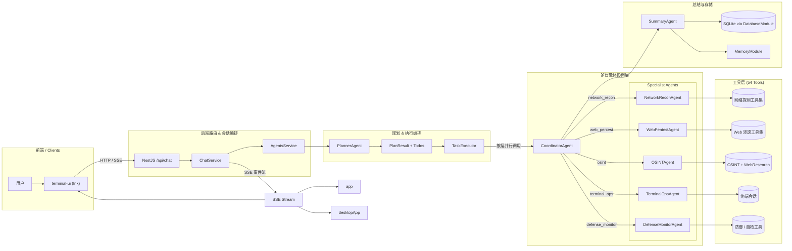

# Secbot：AI 驱动的自动化安全测试平台

<div align="center">

**基于 NestJS + TypeScript 的智能化自动渗透测试系统，具备多智能体协作**

[English](README_EN.md) | 中文

</div>

---

## 安全警告

**本工具仅用于授权的安全测试。未经授权使用本工具进行网络攻击是违法的。**

- 仅对您拥有或已获得明确书面授权的系统使用
- 确保遵守所有适用的法律法规
- 负责任和道德地使用

## 功能特性

### 核心能力

- **多种智能体模式**: ReAct、Plan-Execute、多智能体协调、工具调用、记忆增强
- **AI Web 研究子智能体**: 独立的 WebResearchAgent，基于 ReAct 自动完成联网搜索、网页提取、多页爬取和 API 调用
- **持久化终端会话**: 为智能体提供专用终端，会话内多步命令执行与系统信息收集
- **AI 网络爬虫**: 实时网络信息捕获和监控
- **记忆子系统**: 短期 / 情景 / 长期记忆管理，向量存储与语义检索
- **漏洞数据库**: 统一漏洞 schema，适配 CVE / NVD / Exploit-DB / MITRE ATT&CK

### 渗透测试

- **信息收集**: 自动化信息收集（主机名、IP、端口、服务）
- **漏洞扫描**: 端口扫描、服务检测、漏洞识别
- **漏洞利用引擎**: 自动化执行 SQL 注入、XSS、命令注入、文件上传、路径遍历、SSRF 等漏洞利用
- **自动化攻击链**: 完整的渗透测试工作流自动化
- **Payload 生成器**: 自动生成各种攻击 payload
- **后渗透利用**: 权限提升、持久化、横向移动

### 安全与防御

- **主动防御**: 信息收集、漏洞扫描、网络分析、入侵检测
- **安全报告**: 自动化详细安全分析报告
- **网络发现**: 自动发现网络中的所有主机
- **授权管理**: 管理对目标主机的合法授权
- **远程控制**: 在授权主机上执行远程命令和文件传输

### Web 研究能力

- **智能搜索**: 基于 DuckDuckGo 的智能搜索 + LLM 综合总结
- **网页提取**: 按模式提取网页内容——纯文本、结构化或自定义 AI schema
- **深度爬取**: 从起始 URL 进行 BFS 多页爬取，支持深度/URL 过滤
- **API 客户端**: 通用 REST API 客户端，内置天气、IP 信息、GitHub、DNS 等常用模板

## 架构与多智能体协作

### 整体架构一览



### 后端模块一览

| NestJS 模块 | 职责 |
|-------------|------|
| `ChatModule` | SSE 聊天接口，接收用户消息并返回事件流 |
| `AgentsModule` | 多智能体框架（Planner / Hackbot / Coordinator / Summary / QA） |
| `ToolsModule` | 54 个安全工具，分 10 大类（security / defense / utility / protocol / osint / cloud / reporting / control / crawler / web-research） |
| `DatabaseModule` | SQLite 持久化（对话、配置、提示词链） |
| `MemoryModule` | 短期 / 情景 / 长期记忆，向量存储与语义检索 |
| `VulnDbModule` | 漏洞数据库，适配 CVE / NVD / Exploit-DB / MITRE ATT&CK |
| `NetworkModule` | 网络发现、授权管理、远程控制 |
| `DefenseModule` | 防御扫描与安全状态 |
| `SessionsModule` | 终端会话管理 |
| `SystemModule` | 系统信息与 LLM 配置管理 |
| `CrawlerModule` | 爬虫任务队列与调度 |
| `HealthModule` | 健康检查端点 |

### 关键设计思路

#### 1. ChatModule & AgentsService（会话编排）

- `ChatController` 提供 `/api/chat` SSE 端点，将前端请求封装后交给 `ChatService`。
- `ChatService` 调用 `AgentsService`，后者负责路由决策（QA / 技术流）、调用 PlannerAgent 生成执行计划、驱动 TaskExecutor。

#### 2. PlannerAgent：结构化规划

- 将用户请求拆解为 `TodoItem` 列表，每个 Todo 带有 `depends_on`（依赖关系）、`resource`（目标资产）、`risk_level`（风险等级）和 `agent_hint`（推荐子 Agent）。
- `get_execution_order()` 基于依赖关系做拓扑排序，同一资源上的高危步骤强制串行。

#### 3. TaskExecutor：分层并发执行

- 逐层执行 Todo：层内可并行，层间严格按依赖拓扑前进。
- 上下文聚合按 `todo_id` 和 `resource` 双维度组织。

#### 4. CoordinatorAgent：多子 Agent 协同

- 根据 Todo 的 `agent_hint / resource / tool_hint` 将执行委派给对应的专职子 Agent。
- Coordinator 本身只负责路由与结果聚合。

#### 5. 专职子 Agent

- 继承自 `SecurityReActAgent`，各自拥有独立的系统提示词和专属工具集。
- 每个子 Agent 维护自己的会话摘要（短记忆），Coordinator 在每轮结束后同步摘要。

#### 6. SummaryAgent

- 从 Coordinator 聚合到的按 Agent 维度的工具执行结果中，生成分节式最终报告。

---

## 系统要求

- **Node.js** 18+
- **npm**（随 Node.js 附带）
- **Ollama**（可选，本地推理时需要）

## 安装（从源码运行）

### 1. 克隆仓库

```bash
git clone https://github.com/iammm0/secbot.git
cd secbot
```

### 2. 安装依赖

```bash
npm install
```

### 3. 配置环境变量

创建 `.env` 文件：

```env
# 云端推理（默认推荐）
LLM_PROVIDER=deepseek
DEEPSEEK_API_KEY=sk-your-api-key
DEEPSEEK_MODEL=deepseek-reasoner

# 或改用本地 Ollama
# LLM_PROVIDER=ollama
# OLLAMA_BASE_URL=http://localhost:11434
# OLLAMA_MODEL=gemma3:1b
```

### 4. 启动

```bash
# 一键启动后端 + TUI
npm run start:stack

# 或分步启动
npm run dev           # 后端开发模式（热重载）
npm run start:tui     # 另一终端启动 TUI
```

### 5.（可选）安装 Ollama 本地模型

```bash
ollama pull gemma3:3b
ollama pull nomic-embed-text
```

## 快速开始

### 常见开发入口

```bash
# 后端开发（热重载）
npm run dev

# 生产构建与启动
npm run build
npm start

# 终端 TUI
npm run start:tui

```

### 常用环境变量

| 变量 | 用途 | 默认值 |
|------|------|--------|
| `LLM_PROVIDER` | 当前推理后端 | `deepseek` |
| `DEEPSEEK_API_KEY` | DeepSeek API Key | 无 |
| `DEEPSEEK_MODEL` | DeepSeek 默认模型 | `deepseek-reasoner` |
| `OLLAMA_BASE_URL` | Ollama 服务地址 | `http://localhost:11434` |
| `OLLAMA_MODEL` | Ollama 默认模型 | `gemma3:1b` |
| `PORT` | 后端监听端口 | `8000` |

### 常见斜杠命令（TUI 内使用）

| 命令 | 说明 |
|------|------|
| `/model` | 选择推理后端、模型、API Key、Base URL |
| `/agent` | 切换 `secbot-cli` / `superhackbot` |
| `/list-agents` | 查看当前可用智能体 |
| `/system-info` | 查看系统信息 |
| `/db-stats` | 查看 SQLite 统计 |

## 目录结构

```text
secbot/
├── server/                 # NestJS 后端（TypeScript）
│   └── src/
│       ├── main.ts         # 应用入口
│       ├── app.module.ts   # 根模块（引入 12 个业务模块）
│       ├── common/         # 公共基础设施（LLM 抽象、过滤器、拦截器）
│       └── modules/        # 业务模块
│           ├── agents/     # 多智能体（含 core/ 子目录）
│           ├── chat/       # SSE 聊天接口
│           ├── tools/      # 54 个安全工具（10 大类）
│           ├── database/   # SQLite 持久化
│           ├── memory/     # 记忆子系统（含向量存储）
│           ├── vuln-db/    # 漏洞数据库（含适配器）
│           ├── network/    # 网络发现与远程控制
│           ├── defense/    # 防御扫描
│           ├── sessions/   # 会话管理
│           ├── system/     # 系统信息与配置
│           ├── crawler/    # 爬虫调度
│           └── health/     # 健康检查
├── npm-bin/                # npm CLI 入口
├── terminal-ui/            # Ink 终端前端（TypeScript）
├── scripts/                # 启动与构建脚本
├── tools/                  # 工具能力说明文档
├── skills/                 # Agent 技能定义
└── docs/                   # 项目文档
```

## 开发

```bash
# 类型检查
npm run typecheck

# 代码检查
npm run lint
npm run lint:fix

# 代码格式化
npm run format

# 运行测试
npm test

# 构建
npm run build

# 打包发布
npm run release:pack
```

## 文档

| 文档 | 说明 |
|------|------|
| [快速开始指南](docs/QUICKSTART.md) | 安装与启动 |
| [API 文档](docs/API.md) | REST + SSE 接口说明 |
| [LLM 厂商配置](docs/LLM_PROVIDERS.md) | 多厂商模型后端与配置 |
| [Ollama 设置](docs/OLLAMA_SETUP.md) | 本地模型配置 |
| [UI 设计与交互](docs/UI-DESIGN-AND-INTERACTION.md) | TUI 架构说明 |
| [部署指南](docs/DEPLOYMENT.md) | 后端部署 |
| [发布说明](docs/RELEASE.md) | 发布与打包 |
| [数据库指南](docs/DATABASE_GUIDE.md) | SQLite 结构与操作 |
| [工具扩展](docs/TOOL_EXTENSION.md) | 自定义工具开发 |
| [技能与记忆](docs/SKILLS_AND_MEMORY.md) | 技能注入与记忆管理 |
| [安全警告](docs/SECURITY_WARNING.md) | 法律与使用声明 |

## 贡献

欢迎贡献！请随时提交 Issue 和 Pull Request。

1. Fork 本仓库
2. 创建您的特性分支 (`git checkout -b feat/amazing-feature`)
3. 提交您的更改 (`git commit -m 'feat: 添加某功能'`)
4. 推送到分支 (`git push origin feat/amazing-feature`)
5. 打开一个 Pull Request

提交信息遵循 [Conventional Commits](https://www.conventionalcommits.org/) 规范。

## 许可证

本项目采用自定义开源协议，详见 [LICENSE](LICENSE) 文件。

- **允许**：个人学习、学术研究与交流（包括教学、论文、非营利技术分享等）可自由使用、修改与分发（须保留版权与协议声明）。
- **商用**：任何商业用途须事先获得版权持有人书面授权。

商用授权联系：[wisewater5419@gmail.com](mailto:wisewater5419@gmail.com)

## 作者

**赵明俊 (Zhao Mingjun)**

- GitHub: [@iammm0](https://github.com/iammm0)
- Email: [wisewater5419@gmail.com](mailto:wisewater5419@gmail.com)

## 致谢

本项目基于众多优秀的开源项目构建（排名不分先后）：

| 类别 | 项目 |
|------|------|
| **运行时与语言** | Node.js、TypeScript |
| **后端框架** | NestJS、Express |
| **数据库** | SQLite、better-sqlite3 |
| **前端** | React、Ink |
| **AI / LLM** | DeepSeek、Ollama、OpenAI |
| **安全工具** | nmap、sqlmap、Nuclei 等外部工具 |

## 免责声明

本工具仅用于教育和授权的安全测试目的。作者和贡献者不对因使用本工具造成的任何误用或损害负责。用户在使用本工具对任何系统进行测试之前，必须确保已获得适当的授权。

---

<div align="center">

**如果您觉得这个项目有用，请考虑给它一个 Star！**

</div>
