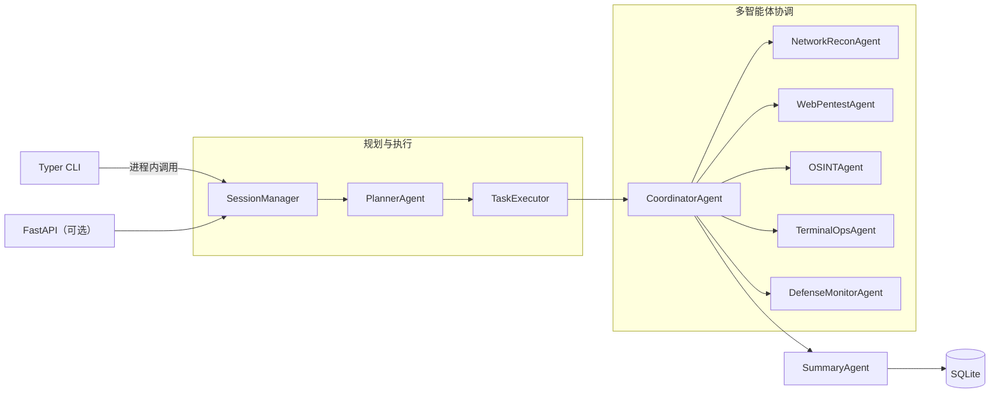

# Secbot: 自动化安全测试 CLI

<div align="center">

**AI 驱动的自动化渗透测试助手**

[English](README_EN.md) | [中文](#secbot-自动化安全测试-cli)

</div>

---

## 安全警告

**本工具仅用于授权的安全测试。未经授权使用本工具进行网络攻击是违法的。**

- 仅对您拥有或已获得明确书面授权的系统使用
- 确保遵守所有适用的法律法规
- 负责任和道德地使用

## 功能特性

### 核心能力

- **多种智能体模式**: ReAct、Plan-Execute、多智能体、工具使用、记忆增强
- **AI Web 研究子智能体**: 独立的 WebResearchAgent，基于 ReAct 自动完成联网搜索、网页提取、多页爬取和 API 调用
- **原生 CLI 交互**: 基于 Typer + Rich 的终端交互，直接在进程内调用核心逻辑
- **可选 API 服务**: FastAPI 后端提供 REST + SSE 接口，支持第三方集成
- **持久化终端会话**: 为智能体提供专用终端，会话内多步命令执行与系统信息收集
- **AI 网络爬虫**: 实时网络信息捕获和监控
- **操作系统控制**: 文件操作、进程管理、系统信息

### 渗透测试

- **信息收集**: 自动化信息收集（主机名、IP、端口、服务）
- **漏洞扫描**: 端口扫描、服务检测、漏洞识别
- **漏洞利用引擎**: 自动化执行 SQL 注入、XSS、命令注入、文件上传、路径遍历、SSRF 等漏洞利用
- **自动化攻击链**: 完整的渗透测试工作流自动化
- **Payload 生成器**: 自动生成各种攻击 payload
- **后渗透利用**: 权限提升、持久化、横向移动、数据 exfiltration

### 安全与防御

- **主动防御**: 信息收集、漏洞扫描、网络分析、入侵检测
- **安全报告**: 自动化详细安全分析报告
- **网络发现**: 自动发现网络中的所有主机

### Web 研究能力

- **智能搜索**: 基于 DuckDuckGo 的智能搜索 + LLM 综合总结
- **网页提取**: 纯文本、结构化或自定义 AI schema 提取
- **深度爬取**: BFS 多页爬取，支持深度/URL 过滤
- **API 客户端**: 通用 REST API 客户端，内置常用模板

## 架构概览



## 系统要求

- Python 3.10+
- [uv](https://github.com/astral-sh/uv) — 快速 Python 包管理器
- Ollama（可选，本地模型时需要）

## 安装

```bash
git clone https://github.com/iammm0/secbot.git
cd secbot
uv sync
```

配置 `.env`：

```env
LLM_PROVIDER=deepseek
DEEPSEEK_API_KEY=sk-your-api-key
```

## 快速开始

```bash
# 交互模式
python main.py
# 或
uv run secbot

# 单次任务
uv run secbot "扫描 192.168.1.1 的端口"

# 问答模式
uv run secbot --ask "什么是 SQL 注入？"

# 切换模型
uv run secbot model

# 启动 API 服务
uv run secbot server
```

## 文档

- [快速开始指南](docs/QUICKSTART.md)
- [API 文档](docs/API.md)
- [数据库指南](docs/DATABASE_GUIDE.md)
- [Ollama 设置](docs/OLLAMA_SETUP.md)
- [安全警告](docs/SECURITY_WARNING.md)
- [部署指南](docs/DEPLOYMENT.md)

## 贡献

欢迎提交 Issue 和 Pull Request。

## 许可证

本项目采用自定义开源协议，详见 [LICENSE](LICENSE) 文件。

## 作者

**赵明俊 (Zhao Mingjun)**

- GitHub: [@iammm0](https://github.com/iammm0)
- Email: wisewater5419@gmail.com

## 免责声明

本工具仅用于教育和授权的安全测试目的。作者和贡献者不对因使用本工具造成的任何误用或损害负责。
