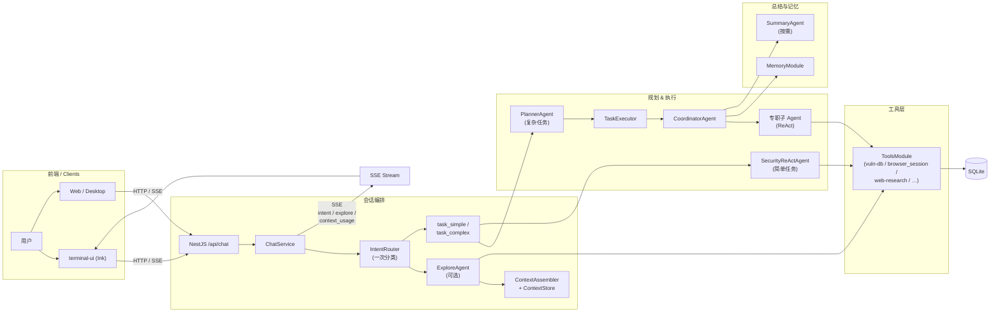

# Secbot：AI 驱动的自动化安全测试平台

<div align="center">

**基于 NestJS + TypeScript 的智能化自动渗透测试系统，具备多智能体协作**

[English](README_EN.md) | 中文

</div>

---

## 安全警告

**本工具仅用于授权的安全测试。未经授权使用本工具进行网络攻击是违法的。**

- 仅对您拥有或已获得明确书面授权的系统使用
- 确保遵守所有适用的法律法规
- 负责任和道德地使用

## 产品演示

当前有两套面向用户的客户端，共用同一 NestJS 后端与 SSE：

| 客户端 | 路径 | 说明 |
| --- | --- | --- |
| **Desktop** | `desktop/` + `web/` | Tauri 桌面端；主界面是 `web/`（后端托管 `web/dist`） |
| **TUI** | `terminal-ui/` | Ink 终端 UI；`secbot` / `npm run start:stack` 默认入口 |

产品能力与聊天体验应对齐：改 SSE 事件、会话块、模型/设置、HITL 等时，**Desktop（`web/`）与 TUI（`terminal-ui/`）应一并更新**（或明确只改一端并写进说明）。

桌面端演示（`release` 分支）：


| 首页 | 工具 |
| --- | --- |
|  |  |
| 设置 | 模型与主题 |
|  |  |

## 维护分支

**只维护 [`release`](https://github.com/iammm0/secbot/tree/release)。** 新功能、文档、CI 与 GitHub Releases 都落在这条分支（NestJS + Ink TUI + Web / 桌面端）。

| 分支 | 状态 |
| --- | --- |
| **[`release`](https://github.com/iammm0/secbot/tree/release)** | 当前产品，唯一活跃维护线 |
| [`pypi-release`](https://github.com/iammm0/secbot/tree/pypi-release) | **已冻结** 的 Python v1 归档（只读，不再加功能） |
| [`pure-go`](https://github.com/iammm0/secbot/tree/pure-go) | **已冻结** 的 Go 实验分支（只读，不再加功能） |

## 功能特性

### 核心能力

- **桌面端（Tauri）**: 带版本号的安装包（`desktop-app-v*`），设置 → 关于可查看版本并检查更新；界面源码在 `web/`
- **终端 TUI（Ink）**: `secbot` / `npm run start:stack`；与桌面端同一 Release 发布自包含包（`secbot-tui-*`），产品能力应对齐
- **发布平台**: macOS Apple Silicon、Windows x64、Ubuntu x64（不再支持 macOS Intel）
- **ExecGo 运行时**: 设置里启用后自动拉起/关闭本机 `execgo` / `execgo-runtime` 后台进程，可作为默认命令执行后端
- **操作审计**: 每个对话的阶段 / 模型调用 / 工具执行落库，设置 → 审计可按会话追溯
- **节点探测与攻击链预览**: 主机节点展示 IP、用户名、开放端口，并给出模拟入口面路径（仅预览，不执行攻击）
- **人机协同（HITL）**: Hackbot 敏感工具需确认；任务中途 `ask_user` 可暂停等待输入
- **多种智能体模式**: ReAct、Plan-Execute、多智能体协调、工具调用、记忆增强
- **AI Web 研究子智能体**: 独立的 WebResearchAgent，基于 ReAct 自动完成联网搜索、网页提取、多页爬取和 API 调用
- **持久化终端会话**: 为智能体提供专用终端，会话内多步命令执行与系统信息收集
- **AI 网络爬虫**: 实时网络信息捕获和监控
- **记忆子系统**: 短期 / 情景 / 长期记忆管理，向量存储与语义检索
- **漏洞数据库**: 统一漏洞 schema，适配 CVE / NVD / Exploit-DB / MITRE ATT&CK
- **意图路由与探索**: **`IntentRouter`** 单次分类用户意图；可选 **`ExploreAgent`** 在规划前用 **`vuln_db_query`**、**`browser_session`**（遵守 robots、可读性提取）补全上下文。
- **上下文预算**: **`ContextAssemblerService`** 按模型窗口装配历史与记忆；SSE **`context_usage`** 供底栏用量展示。

### 渗透测试

- **信息收集**: 自动化信息收集（主机名、IP、端口、服务）
- **漏洞扫描**: 端口扫描、服务检测、漏洞识别
- **漏洞利用引擎**: 自动化执行 SQL 注入、XSS、命令注入、文件上传、路径遍历、SSRF 等漏洞利用
- **自动化攻击链**: 完整的渗透测试工作流自动化
- **Payload 生成器**: 自动生成各种攻击 payload
- **后渗透利用**: 权限提升、持久化、横向移动

### 安全与防御

- **主动防御**: 信息收集、漏洞扫描、网络分析、入侵检测
- **安全报告**: 自动化详细安全分析报告
- **网络发现**: 自动发现网络中的所有主机
- **授权管理**: 管理对目标主机的合法授权
- **远程控制**: 在授权主机上执行远程命令和文件传输

### Web 研究能力

- **智能搜索**: 基于 DuckDuckGo 的智能搜索 + LLM 综合总结
- **网页提取**: 按模式提取网页内容——纯文本、结构化或自定义 AI schema
- **深度爬取**: 从起始 URL 进行 BFS 多页爬取，支持深度/URL 过滤
- **API 客户端**: 通用 REST API 客户端，内置天气、IP 信息、GitHub、DNS 等常用模板

## 架构与多智能体协作

### 整体架构一览


```mermaid
flowchart LR
  subgraph FrontendClients["前端 / Clients"]
    user[用户]
    tui["terminal-ui (Ink)"]
    web["Web / Desktop"]
  end

  user --> tui
  user --> web

  tui -->|HTTP / SSE| api["NestJS /api/chat"]
  web -->|HTTP / SSE| api

  subgraph BackendRouter["会话编排"]
    api --> chatSvc["ChatService"]
    chatSvc --> intent["IntentRouter\n(一次分类)"]
    intent --> explore["ExploreAgent\n(可选)"]
    explore --> ctx["ContextAssembler\n+ ContextStore"]
    intent --> taskPath["task_simple /\ntask_complex"]
  end

  subgraph PlanningExecution["规划 & 执行"]
    taskPath --> planner["PlannerAgent\n(复杂任务)"]
    planner --> executor["TaskExecutor"]
    taskPath --> react["SecurityReActAgent\n(简单任务)"]
    executor --> coord["CoordinatorAgent"]
    coord --> specialists["专职子 Agent\n(ReAct)"]
  end

  subgraph ToolsLayer["工具层"]
    specialists --> toolsMod["ToolsModule\n(vuln-db / browser_session /\nweb-research / …)"]
    explore --> toolsMod
    react --> toolsMod
  end

  toolsMod --> db[(SQLite)]

  subgraph SummaryStorage["总结与记忆"]
    coord --> memoryMod[MemoryModule]
    coord --> summary["SummaryAgent\n(按需)"]
  end

  chatSvc -->|SSE\nintent / explore /\ncontext_usage| sse[SSE Stream]
  sse --> tui
```

### 后端模块一览

| NestJS 模块 | 职责 |
|-------------|------|
| `ChatModule` | SSE 聊天；`ChatService` 串联 IntentRouter → 可选 Explore → 上下文装配 → 简单/复杂任务与按需总结 |
| `AgentsModule` | 多智能体（IntentRouter、ExploreAgent、Planner、Coordinator、Summary、QA、各 ReAct 子 Agent） |
| `ToolsModule` | 内置安全工具（含 **vuln-db**、`browser_session` 类人浏览、web-research、scanner 等分类） |
| `DatabaseModule` | SQLite 持久化（对话、配置、提示词链） |
| `MemoryModule` | 短期 / 情景 / 长期记忆，向量存储与语义检索 |
| `VulnDbModule` | 漏洞数据库，适配 CVE / NVD / Exploit-DB / MITRE ATT&CK |
| `NetworkModule` | 网络发现、授权管理、远程控制 |
| `DefenseModule` | 防御扫描与安全状态 |
| `SessionsModule` | 终端会话管理 |
| `SystemModule` | 系统信息与 LLM 配置管理 |
| `CrawlerModule` | 爬虫任务队列与调度 |
| `HealthModule` | 健康检查端点 |

### 关键设计思路

#### 1. ChatModule & ChatService（会话编排）

- `ChatController` 提供 `/api/chat` SSE 端点；`ChatService.handleMessage` 为编排核心。
- **`IntentRouter`**：对用户消息做一次意图分类（闲聊 / 元问题 / 纯问答 / 需澄清 / 简单任务 / 复杂任务），并给出 `needs_explore`、`needs_report`、`focus` 等信号。
- **可选 `ExploreAgent`**：在正式规划前用轻量 ReAct 补全上下文（`vuln_db_query`、`browser_session` 等）；探索阶段拒绝 `sensitive` 工具，结果写入 **`ContextStore`** 并由 **`ContextAssemblerService`** 按模型窗口预算拼进提示词；SSE 推送 `intent_decision`、`explore_*`、`context_usage`（TUI 右下角用量）、可选 `context_patch`。
- **`task_simple`**：跳过 Planner，直接 `SecurityReActAgent`；**`task_complex`**：`PlannerAgent` → `TaskExecutor`；**`SummaryAgent`** 仅在 `needs_report` 为真时生成最终报告，避免每轮冗长总结。

#### 2. PlannerAgent：结构化规划

- 将用户请求拆解为 `TodoItem` 列表，每个 Todo 带有 `depends_on`（依赖关系）、`resource`（目标资产）、`risk_level`（风险等级）和 `agent_hint`（推荐子 Agent）。
- `get_execution_order()` 基于依赖关系做拓扑排序，同一资源上的高危步骤强制串行。

#### 3. TaskExecutor：分层并发执行

- 逐层执行 Todo：层内可并行，层间严格按依赖拓扑前进。
- 上下文聚合按 `todo_id` 和 `resource` 双维度组织。

#### 4. CoordinatorAgent：多子 Agent 协同

- 根据 Todo 的 `agent_hint / resource / tool_hint` 将执行委派给对应的专职子 Agent。
- Coordinator 本身只负责路由与结果聚合。

#### 5. 专职子 Agent

- 继承自 `SecurityReActAgent`，各自拥有独立的系统提示词和专属工具集。
- 每个子 Agent 维护自己的会话摘要（短记忆），Coordinator 在每轮结束后同步摘要。

#### 6. SummaryAgent

- 从 Coordinator 聚合到的按 Agent 维度的工具执行结果中，生成分节式最终报告。

---

## 系统要求

- **Node.js** 24+
- **npm**（随 Node.js 附带）
- **Ollama**（可选，本地推理时需要）

## 安装（从源码运行）

### 1. 克隆仓库

```bash
git clone https://github.com/iammm0/secbot.git
cd secbot
# 默认分支即为唯一维护中的 `release`
```

### 2. 安装依赖

```bash
npm install
```

### 3. 配置环境变量

创建 `.env` 文件：

```env
# 云端推理（默认推荐）
LLM_PROVIDER=deepseek
DEEPSEEK_API_KEY=sk-your-api-key
DEEPSEEK_MODEL=deepseek-chat

# 或改用本地 Ollama
# LLM_PROVIDER=ollama
# OLLAMA_BASE_URL=http://localhost:11434
# OLLAMA_MODEL=llama3.2

# 可选：ReAct/探索上限、上下文调试 SSE、开启自适应重规划、NVD 速率
# SECBOT_REACT_MAX_ITERS=20
# SECBOT_EXPLORE_MAX_ITERS=6
# SECBOT_CONTEXT_DEBUG=1
# SECBOT_ADAPTIVE_REPLAN=1
# NVD_API_KEY=your-nvd-key

# 可选：Jev System One 判断层（默认全关；打开后高置信才采纳，失败回退原逻辑）
# SECBOT_JEV_ENABLED=1
# SECBOT_JEV_INTENT=1
# SECBOT_JEV_QA_LIVE=1
# SECBOT_JEV_ADAPTIVE=1
# SECBOT_JEV_REACT_STOP=1
# SECBOT_JEV_CONTEXT=1
# TYPESAFE_API_KEY=your-typesafe-key
# TYPESAFE_BASE_URL=https://api.typesafe.ai
# SECBOT_JEV_MODEL=jev-latest
# SECBOT_JEV_CONFIDENCE_MIN=0.85
# SECBOT_JEV_REACT_STOP_MIN=0.92
```

### 4. 启动

```bash
# 一键启动 TUI（默认自动拉起本地后端子进程）
npm run start:stack

# 或分步启动
npm run dev           # 后端开发模式（热重载）
npm run start:tui     # 另一终端启动 TUI（默认自动拉起本地后端子进程）
cd desktop && npm run dev   # 桌面端热开发（Vite + Nest + Tauri）

# 仅连接已有后端（服务模式，可选）
SECBOT_TUI_BACKEND=service SECBOT_API_URL=http://127.0.0.1:8000 npm run start:tui

# 兼容别名（remote 等同于 service）
SECBOT_TUI_BACKEND=remote SECBOT_API_URL=http://127.0.0.1:8000 npm run start:tui
```

桌面安装包与终端 TUI 自包含发行包都在 [GitHub Releases](https://github.com/iammm0/secbot/releases)（标签形如 `desktop-app-v0.0.3-beta`）。支持 **macOS Apple Silicon / Windows x64 / Ubuntu x64**，不含 macOS Intel。TUI 解压后运行 `./secbot` 或 `secbot.cmd`。详见 [`desktop/README.md`](desktop/README.md)、[`terminal-ui/README.md`](terminal-ui/README.md)。

### 5.（可选）安装 Ollama 本地模型

```bash
ollama pull llama3.2
ollama pull nomic-embed-text
```

## 快速开始

### 常见开发入口

```bash
# 后端开发（热重载）
npm run dev

# 生产构建与启动
npm run build
npm start

# 终端 TUI（默认子进程模式）
npm run start:tui

# 桌面端热开发
cd desktop && npm run dev
```

### 常用环境变量

| 变量 | 用途 | 默认值 |
|------|------|--------|
| `LLM_PROVIDER` | 当前推理后端 | `deepseek` |
| `DEEPSEEK_API_KEY` | DeepSeek API Key | 无 |
| `DEEPSEEK_MODEL` | DeepSeek 默认模型 | `deepseek-chat` |
| `OLLAMA_BASE_URL` | Ollama 服务地址 | `http://localhost:11434` |
| `OLLAMA_MODEL` | Ollama 默认模型 | `llama3.2` |
| `PORT` | 后端监听端口 | `8000` |
| `SECBOT_TUI_BACKEND` | TUI 后端模式：`spawn`/`service`/`remote`/`auto` | 默认优先 `spawn`，连接已有后端时请显式使用 `service`/`remote` |
| `SECBOT_JEV_ENABLED` | Jev 判断层主开关（默认关） | 关 |
| `TYPESAFE_API_KEY` | TypeSafe Jev API Key | 无 |

### 常见斜杠命令（TUI 内使用）

| 命令 | 说明 |
|------|------|
| `/model` | 选择推理后端、模型、API Key、Base URL |
| `/jev` | 配置 Jev 判断层（主开关、五个环节、API Key） |
| `/agent` | 切换 `secbot-cli` / `superhackbot` |
| `/list-agents` | 查看当前可用智能体 |
| `/system-info` | 查看系统信息 |
| `/db-stats` | 查看 SQLite 统计 |

## 目录结构

```text
secbot/
├── server/                 # NestJS 后端（TypeScript）
│   ├── skills/             # Agent 技能定义（base/ + custom/）
│   └── src/
│       ├── main.ts         # 应用入口
│       ├── app.module.ts   # 根模块（引入 12 个业务模块）
│       ├── common/         # 公共基础设施（LLM 抽象、过滤器、拦截器）
│       └── modules/        # 业务模块
│           ├── agents/     # 多智能体（含 core/ 子目录）
│           ├── chat/       # SSE 聊天接口
│           ├── tools/      # 54 个安全工具（10 大类）
│           ├── database/   # SQLite 持久化
│           ├── memory/     # 记忆子系统（含向量存储）
│           ├── vuln-db/    # 漏洞数据库（含适配器）
│           ├── network/    # 网络发现与远程控制
│           ├── defense/    # 防御扫描
│           ├── sessions/   # 会话管理
│           ├── system/     # 系统信息与配置
│           ├── crawler/    # 爬虫调度
│           └── health/     # 健康检查
├── bin/                    # npm CLI 入口
├── terminal-ui/            # Ink 终端前端（TUI）
├── web/                    # Web UI（桌面端实际界面）
├── desktop/                # Tauri 桌面壳（拉起后端并加载 web）
├── scripts/                # 启动与构建脚本
├── CLAUDE.md / AGENTS.md   # 贡献者 / AI agent 约定
└── SECURITY_WARNING.md     # 法律声明（随包分发）
```

## 开发

```bash
# 类型检查
npm run typecheck

# 代码检查
npm run lint
npm run lint:fix

# 代码格式化
npm run format

# 运行测试
npm test

# 构建
npm run build

# 打包发布
npm run release:pack
```

## 文档

| 文档 | 说明 |
|------|------|
| [https://secbot.site](https://secbot.site) | **用户文档官网**（安装、API、模型配置等） |
| [CLAUDE.md](CLAUDE.md) / [AGENTS.md](AGENTS.md) | 给 AI / 贡献者的编排说明、SSE、环境变量与目录索引 |
| [SECURITY_WARNING.md](SECURITY_WARNING.md) | 法律与使用声明（随 npm 包分发） |
| [desktop/README.md](desktop/README.md) | 桌面端开发与打包（TUI 与 Desktop/Web 应对齐更新） |

本仓库不再维护长篇用户手册；以官网为文档真源。

## 贡献

欢迎贡献！请随时提交 Issue 和 Pull Request。

1. Fork 本仓库
2. 创建您的特性分支 (`git checkout -b feat/amazing-feature`)
3. 提交您的更改 (`git commit -m 'feat: 添加某功能'`)
4. 推送到分支 (`git push origin feat/amazing-feature`)
5. 打开一个 Pull Request

提交信息遵循 [Conventional Commits](https://www.conventionalcommits.org/) 规范。

## 许可证

本项目采用自定义开源协议，详见 [LICENSE](LICENSE) 文件。

- **允许**：个人学习、学术研究与交流（包括教学、论文、非营利技术分享等）可自由使用、修改与分发（须保留版权与协议声明）。
- **商用**：任何商业用途须事先获得版权持有人书面授权。

商用授权联系：[wisewater5419@gmail.com](mailto:wisewater5419@gmail.com)

## 作者

**赵明俊 (Zhao Mingjun)**

- GitHub: [@iammm0](https://github.com/iammm0)
- Email: [wisewater5419@gmail.com](mailto:wisewater5419@gmail.com)

## 致谢

本项目基于众多优秀的开源项目构建（排名不分先后）：

| 类别 | 项目 |
|------|------|
| **运行时与语言** | Node.js、TypeScript |
| **后端框架** | NestJS、Express |
| **数据库** | SQLite、better-sqlite3 |
| **前端** | React、Ink |
| **AI / LLM** | DeepSeek、Ollama、OpenAI |
| **安全工具** | nmap、sqlmap、Nuclei 等外部工具 |

## 免责声明

本工具仅用于教育和授权的安全测试目的。作者和贡献者不对因使用本工具造成的任何误用或损害负责。用户在使用本工具对任何系统进行测试之前，必须确保已获得适当的授权。

---

<div align="center">

**如果您觉得这个项目有用，请考虑给它一个 Star！**

</div>
