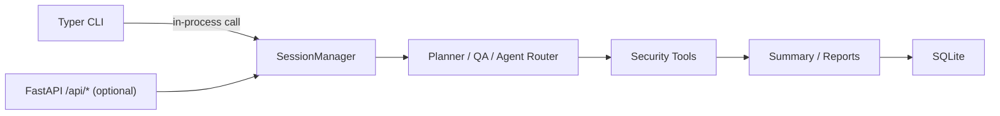

<div align="center">

# Secbot

**AI-Powered Automated Penetration Testing CLI**

[](https://www.python.org/downloads/)
[](pyproject.toml)
[](LICENSE)
[](https://github.com/iammm0/secbot/releases)
[](https://github.com/langchain-ai/langchain)

English | [中文](README.md)

</div>

---

> **Security Warning**: This tool is **for authorized security testing only**. Unauthorized use for network attacks is illegal. See [Security Warning](docs/SECURITY_WARNING.md).

---

## Features

### Core Capabilities

- **Multiple Agent Patterns**: ReAct, Plan-Execute, Multi-Agent, Tool-Using, Memory-Augmented
- **AI Web Research Agent**: Independent `WebResearchAgent` with ReAct loop for smart search, page extraction, multi-page crawling, and API interaction
- **Native CLI**: Typer + Rich terminal interface, directly invoking core logic in-process
- **Optional API Server**: FastAPI backend with REST + SSE for third-party integration
- **Persistent Terminal Session**: Agent-controlled dedicated shell for multi-step command execution
- **AI Web Crawler**: Real-time web information capture and monitoring
- **OS Control**: File operations, process management, system information

### Penetration Testing

- **Reconnaissance**: Automated information gathering (hostname, IP, ports, service fingerprinting)
- **Vulnerability Scanning**: Port scanning, service detection, vulnerability identification
- **Exploit Engine**: Automated exploitation of SQL injection, XSS, command injection, file upload, path traversal, SSRF
- **Automated Attack Chain**: Full pentest workflow — Recon, Scan, Exploit, Post-Exploitation
- **Payload Generator**: On-demand generation of various attack payloads
- **Post-Exploitation**: Privilege escalation, persistence, lateral movement, data exfiltration

### Security & Defense

- **Active Defense**: Vulnerability scanning, network analysis, intrusion detection
- **Security Reports**: Automated structured security analysis reports
- **Network Discovery**: Automatic host discovery across the network

### Web Research

- **Smart Search**: DuckDuckGo search + LLM summarization
- **Page Extract**: Plain text, structured, or custom AI Schema extraction
- **Deep Crawl**: BFS multi-page crawl with depth/URL filtering
- **API Client**: Generic REST client with presets for weather, IP info, GitHub, etc.

---

## Architecture



---

## Requirements

- **Python** 3.10+
- **[uv](https://github.com/astral-sh/uv)** — Fast Python package manager (recommended)
- **Ollama** — Local LLM inference (optional; defaults to DeepSeek cloud API)

---

## Installation

### Option A: Download Pre-built Binary

Download from [Releases](https://github.com/iammm0/secbot/releases), extract, set up `.env`, and run.

### Option B: Build from Source

```bash
git clone https://github.com/iammm0/secbot.git
cd secbot
uv sync
```

Configure `.env`:

```env
LLM_PROVIDER=deepseek
DEEPSEEK_API_KEY=sk-your-api-key
```

---

## Quick Start

```bash
# Interactive mode
python scripts/main.py
uv run secbot

# Single task
uv run secbot "Scan open ports on 192.168.1.1"

# Ask mode (Q&A only, no tool execution)
uv run secbot --ask "What is XSS?"

# Switch LLM provider/model
uv run secbot model

# Start API server only
uv run secbot server

# Show version
uv run secbot version
```

### CLI Commands

| Command | Description |
|---------|-------------|
| `secbot` | Enter interactive mode |
| `secbot "task"` | Execute a single task |
| `secbot --ask "question"` | Ask mode (Q&A) |
| `secbot --agent superhackbot` | Use expert agent |
| `secbot model` | Switch LLM provider/model |
| `secbot server` | Start FastAPI backend |
| `secbot version` | Show version |

### In-session Slash Commands

| Command | Description |
|---------|-------------|
| `/model` | Switch LLM provider and model |
| `/help` | Show help |
| `exit` / `quit` | Exit |

---

## Project Structure

```
secbot/
├── scripts/main.py         # Entry point (Typer CLI)
├── secbot_cli/             # CLI entry and in-process runner
├── router/                 # FastAPI routing layer (optional API)
├── core/                   # Agent framework, executor, planner, memory
├── tools/                  # Security tools, web research, protocols
├── database/               # SQLite models and management
├── hackbot_config/         # Configuration and persistence
├── scripts/                # Launch and build scripts
├── tests/                  # Test suite
└── docs/                   # Documentation
```

---

## Documentation

| Document | Description |
|----------|-------------|
| [Quick Start](docs/QUICKSTART.md) | Installation and getting started |
| [API Reference](docs/API.md) | REST API endpoint documentation |
| [Database Guide](docs/DATABASE_GUIDE.md) | SQLite structure and operations |
| [Deployment Guide](docs/DEPLOYMENT.md) | Production deployment |
| [Ollama Setup](docs/OLLAMA_SETUP.md) | Local model configuration |
| [Release Guide](docs/RELEASE.md) | Pre-built binary usage |
| [Security Warning](docs/SECURITY_WARNING.md) | Legal use declaration |

---

## Contributing

Contributions are welcome! Please follow [Conventional Commits](https://www.conventionalcommits.org/).

1. Fork the repository
2. Create a feature branch: `git checkout -b feature/amazing-feature`
3. Commit your changes: `git commit -m 'feat: add amazing feature'`
4. Push and open a Pull Request

---

## License

Custom open-source license. See [LICENSE](LICENSE).

- **Permitted**: Personal learning, academic research, non-commercial sharing
- **Commercial use**: Requires prior written authorization

Commercial licensing: [wisewater5419@gmail.com](mailto:wisewater5419@gmail.com)

---

## Author

**Zhao Mingjun**

- GitHub: [@iammm0](https://github.com/iammm0)
- Email: [wisewater5419@gmail.com](mailto:wisewater5419@gmail.com)

---

## Disclaimer

This tool is for educational and authorized security testing only. The authors are not responsible for any misuse or damage.
