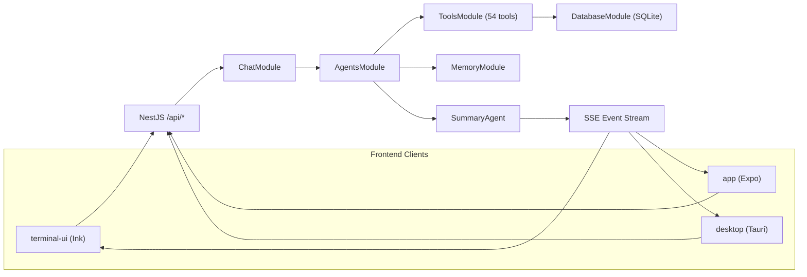

<div align="center">

# Secbot

**AI-Powered Automated Security Testing Platform**

[](https://nodejs.org/)
[](https://www.typescriptlang.org/)
[](package.json)
[](LICENSE)
[](https://github.com/iammm0/secbot/releases)
[](https://nestjs.com/)

English | [中文](README.md)

</div>

---

> **Security Warning**: This tool is **for authorized security testing only**. Unauthorized use for network attacks is illegal. See [Security Warning](docs/SECURITY_WARNING.md).

---

## Features

### Core Capabilities

- **Multiple Agent Patterns**: ReAct, Plan-Execute, Multi-Agent Coordination, Tool-Using, Memory-Augmented
- **AI Web Research Agent**: Independent WebResearchAgent with ReAct loop for smart search, page extraction, multi-page crawling, and API interaction
- **Persistent Terminal Sessions**: Agent-controlled dedicated shell for multi-step command execution
- **Memory Subsystem**: Short-term / episodic / long-term memory with vector storage and semantic retrieval
- **Vulnerability Database**: Unified vulnerability schema with CVE / NVD / Exploit-DB / MITRE ATT&CK adapters

### Penetration Testing

- **Reconnaissance**: Automated information gathering (hostname, IP, ports, service fingerprinting)
- **Vulnerability Scanning**: Port scanning, service detection, vulnerability identification
- **Exploit Engine**: Automated exploitation of SQL injection, XSS, command injection, file upload, path traversal, SSRF
- **Automated Attack Chain**: Full pentest workflow — Recon, Scan, Exploit, Post-Exploitation
- **Payload Generator**: On-demand generation of various attack payloads

### Security & Defense

- **Active Defense**: Vulnerability scanning, network analysis, intrusion detection
- **Security Reports**: Automated structured security analysis reports
- **Network Discovery**: Automatic host discovery across the network
- **Authorization Management**: Manage legal authorization for target hosts
- **Remote Control**: Remote command execution and file transfer on authorized hosts

### Web Research

- **Smart Search**: DuckDuckGo search + LLM summarization
- **Page Extract**: Plain text, structured, or custom AI Schema extraction modes
- **Deep Crawl**: BFS multi-page crawl with depth/URL filtering
- **API Client**: Generic REST client with presets for weather, IP info, GitHub, DNS, etc.

---

## Architecture



### Backend Modules

| NestJS Module | Responsibility |
|---------------|----------------|
| `ChatModule` | SSE chat endpoint, receives user messages and returns event streams |
| `AgentsModule` | Multi-agent framework (Planner / Hackbot / Coordinator / Summary / QA) |
| `ToolsModule` | 54 security tools across 10 categories |
| `DatabaseModule` | SQLite persistence (conversations, config, prompt chains) |
| `MemoryModule` | Short-term / episodic / long-term memory with vector storage |
| `VulnDbModule` | Vulnerability database with CVE / NVD / Exploit-DB / MITRE adapters |
| `NetworkModule` | Network discovery, authorization, remote control |
| `DefenseModule` | Defense scanning and security status |
| `SessionsModule` | Terminal session management |
| `SystemModule` | System info and LLM configuration |
| `CrawlerModule` | Web crawler task queue and scheduling |
| `HealthModule` | Health check endpoint |

---

## Requirements

- **Node.js** 18+
- **npm** (bundled with Node.js)
- **Ollama** (optional, for local model inference)

---

## Installation

### Option A: Install from npm

```bash
npm install -g @opensec/secbot
secbot
```

### Option B: Build from Source

```bash
git clone https://github.com/iammm0/secbot.git
cd secbot
npm install
```

Configure environment variables — create a `.env` file:

```env
LLM_PROVIDER=deepseek
DEEPSEEK_API_KEY=sk-your-api-key
DEEPSEEK_MODEL=deepseek-reasoner

# Or use local Ollama
# LLM_PROVIDER=ollama
# OLLAMA_BASE_URL=http://localhost:11434
# OLLAMA_MODEL=gemma3:1b
```

### Option C: Download from GitHub Releases

Download the npm package (`.tgz`) from [Releases](https://github.com/iammm0/secbot/releases).

---

## Quick Start

### Launch

```bash
# One-click: backend + TUI
npm run start:stack

# Or step by step
npm run dev           # Start backend (dev mode with hot-reload)
npm run start:tui     # Start TUI in another terminal
```

### Common Development Commands

```bash
npm run dev           # Backend dev mode
npm run build         # Production build
npm start             # Start production server
npm run start:tui     # Terminal TUI

# Mobile app
cd app && npm install && npm start

# Desktop app
cd desktop && npm install && npm run tauri dev
```

### Environment Variables

| Variable | Description | Default |
|----------|-------------|---------|
| `LLM_PROVIDER` | Inference backend | `deepseek` |
| `DEEPSEEK_API_KEY` | DeepSeek API Key | — |
| `DEEPSEEK_MODEL` | DeepSeek model | `deepseek-reasoner` |
| `OLLAMA_BASE_URL` | Ollama service URL | `http://localhost:11434` |
| `OLLAMA_MODEL` | Ollama model | `gemma3:1b` |
| `PORT` | Backend listen port | `8000` |

### Slash Commands (inside TUI)

| Command | Description |
|---------|-------------|
| `/model` | Select inference backend, model, API key |
| `/agent` | Switch between `secbot-cli` / `superhackbot` |
| `/list-agents` | List available agents |
| `/system-info` | View system information |
| `/db-stats` | View database statistics |

---

## Project Structure

```
secbot/
├── server/                 # NestJS backend (TypeScript)
│   └── src/
│       ├── main.ts         # Application entry point
│       ├── app.module.ts   # Root module (imports 12 business modules)
│       ├── common/         # Shared infrastructure (LLM abstraction, filters)
│       └── modules/        # Business modules
│           ├── agents/     # Multi-agent framework
│           ├── chat/       # SSE chat endpoint
│           ├── tools/      # 54 security tools (10 categories)
│           ├── database/   # SQLite persistence
│           ├── memory/     # Memory subsystem
│           ├── vuln-db/    # Vulnerability database
│           ├── network/    # Network discovery & remote control
│           ├── defense/    # Defense scanning
│           ├── sessions/   # Session management
│           ├── system/     # System info & config
│           ├── crawler/    # Crawler scheduling
│           └── health/     # Health checks
├── npm-bin/                # npm CLI entry wrappers
├── terminal-ui/            # Ink terminal frontend (TypeScript)
├── app/                    # Expo / React Native client
├── desktop/                # Tauri + Vite desktop app
├── scripts/                # Launch and build scripts
├── tools/                  # Tool capability documentation
├── skills/                 # Agent skill definitions
└── docs/                   # Project documentation
```

---

## Development

```bash
# Type checking
npm run typecheck

# Linting
npm run lint
npm run lint:fix

# Formatting
npm run format

# Testing
npm test

# Build
npm run build

# Release packaging
npm run release:pack
```

---

## Documentation

| Document | Description |
|----------|-------------|
| [Quick Start](docs/QUICKSTART.md) | Installation and getting started |
| [API Reference](docs/API.md) | REST + SSE endpoint documentation |
| [Mobile App](docs/APP.md) | Expo / React Native guide |
| [LLM Providers](docs/LLM_PROVIDERS.md) | Multi-vendor model configuration |
| [Ollama Setup](docs/OLLAMA_SETUP.md) | Local model configuration |
| [UI Design](docs/UI-DESIGN-AND-INTERACTION.md) | TUI architecture and interaction |
| [Deployment](docs/DEPLOYMENT.md) | Production deployment guide |
| [Release Guide](docs/RELEASE.md) | Release packaging and distribution |
| [Database Guide](docs/DATABASE_GUIDE.md) | SQLite structure and operations |
| [Tool Extension](docs/TOOL_EXTENSION.md) | Custom tool development |
| [Skills & Memory](docs/SKILLS_AND_MEMORY.md) | Skill injection and memory management |
| [Security Warning](docs/SECURITY_WARNING.md) | Legal use declaration |

---

## Contributing

Contributions are welcome! Please feel free to submit Issues and Pull Requests.

1. Fork the repository
2. Create a feature branch: `git checkout -b feat/amazing-feature`
3. Commit your changes: `git commit -m 'feat: add amazing feature'`
4. Push to the branch: `git push origin feat/amazing-feature`
5. Open a Pull Request

Please follow [Conventional Commits](https://www.conventionalcommits.org/) for commit messages.

---

## License

This project is licensed under a custom open-source license. See the [LICENSE](LICENSE) file for details.

- **Permitted**: Personal learning, academic research, and non-commercial sharing (with copyright notice retained)
- **Commercial use**: Requires prior written authorization from the copyright holder

Commercial licensing: [wisewater5419@gmail.com](mailto:wisewater5419@gmail.com)

---

## Author

**Zhao Mingjun (赵明俊)**

- GitHub: [@iammm0](https://github.com/iammm0)
- Email: [wisewater5419@gmail.com](mailto:wisewater5419@gmail.com)

---

## Acknowledgments

This project is built upon many excellent open-source projects (in no particular order):

| Category | Projects |
|----------|----------|
| **Runtime & Language** | Node.js, TypeScript |
| **Backend** | NestJS, Express |
| **Database** | SQLite, better-sqlite3 |
| **Frontend** | React, React Native, Expo, Ink, Tauri, Vite |
| **AI / LLM** | DeepSeek, Ollama, OpenAI |
| **Security Tools** | nmap, sqlmap, Nuclei, and other external tools |

---

## Disclaimer

This tool is intended solely for educational purposes and authorized security testing. The authors and contributors are not responsible for any misuse or damage caused by this tool. **Ensure you have explicit authorization for all target systems before use.**

---

<div align="center">

If this project is useful to you, please give it a Star!

</div>
