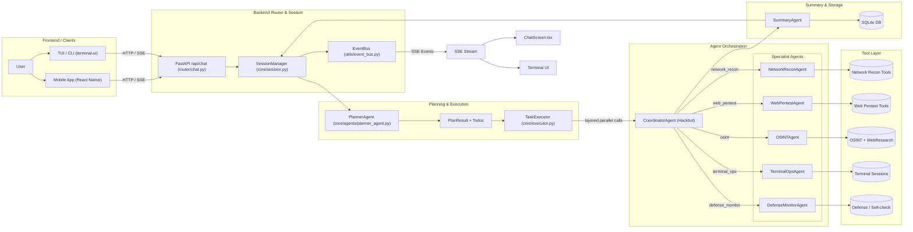

# secbot (formerly hackbot): Automated Penetration Testing Robot

<div align="center">

**An intelligent automated penetration testing robot with AI-powered security testing capabilities**

[English](#secbot-formerly-hackbot-automated-penetration-testing-robot) | [中文](README.md)

</div>

---

## Security Warning

**This tool is intended for authorized security testing only. Unauthorized use of this tool for network attacks is illegal.**

- Only use on systems you own or have explicit written authorization to test
- Ensure you comply with all applicable laws and regulations
- Use responsibly and ethically

## Features

### Core Capabilities

- **Multiple Agent Patterns**: ReAct, Plan-Execute, Multi-Agent, Tool-Using, Memory-Augmented
- **AI Web Research Agent**: Independent sub-agent with ReAct loop for internet research—smart search, page extraction, multi-page crawling, and API interaction
- **CLI Interface**: Simple, intuitive command-line tools for local control and configuration
- **Persistent Terminal Session**: Agent-controlled dedicated shell session for multi-step command execution and system inspection
- **Voice Interaction**: Complete speech-to-text and text-to-speech functionality
- **AI Web Crawler**: Real-time web information capture and monitoring
- **OS Control**: File operations, process management, system information

### Penetration Testing

- **Reconnaissance**: Automated information gathering (hostname, IP, ports, services)
- **Vulnerability Scanning**: Port scanning, service detection, vulnerability identification
- **Exploit Engine**: Automated exploitation of SQL injection, XSS, command injection, file upload, path traversal, SSRF
- **Automated Attack Chain**: Complete penetration testing workflow automation
  - Information Gathering → Vulnerability Scanning → Exploitation → Post-Exploitation
- **Payload Generator**: Automatic generation of attack payloads
- **Post-Exploitation**: Privilege escalation, persistence, lateral movement, data exfiltration
- **Network Attacks**: Brute force, DoS testing, buffer overflow (authorized testing only)

### Security & Defense

- **Active Defense**: Information collection, vulnerability scanning, network analysis, intrusion detection
- **Security Reports**: Automated detailed security analysis reports
- **Network Discovery**: Automatic discovery of all hosts in the network
- **Authorization Management**: Manage legal authorization for target hosts
- **Remote Control**: Remote command execution and file transfer on authorized hosts

### Web Research (Internet Capabilities)

- **Smart Search**: DuckDuckGo search → fetch result pages → AI summarization and synthesis
- **Page Extract**: Extract page content by mode—plain text, structured (tables/lists), or custom AI schema
- **Deep Crawl**: BFS multi-page crawling from a start URL with depth/URL filter and optional AI extraction
- **API Client**: Generic REST client with presets (weather, IP info, GitHub, exchange rates, DNS, etc.)
- **Web Research Tool**: Delegate to the Web Research sub-agent for autonomous research or call tools directly

### Additional Features

- **Prompt Chain Management**: Flexible agent prompt configuration
- **SQLite Database**: Persistent storage for conversation history, prompt chains, configurations
- **Task Scheduling**: Support for scheduled penetration testing tasks
- **Terminal Output**: Colorized and structured terminal output for better readability and debugging

## Architecture & Multi-Agent Collaboration

This section gives a detailed, code-oriented view of how components and agents collaborate inside secbot.

> **Tip**: The static architecture diagram below (`assets/secbot_architecture.png`) is convenient for quick preview on GitHub / code hosting platforms. The following mermaid diagram and text then map each block to concrete source files.


### High-Level Architecture (mapped to source modules)



### Key Design Ideas (by layer)

- **Router & session orchestration (router/chat.py + core/session.py)**
  - `/api/chat` (SSE endpoint) wraps the incoming request as `ChatRequest`, wires up an `EventBus`, subscribes to key event types (`PLAN_START/THINK_*/EXEC_*/CONTENT/REPORT_END/ERROR`, etc.), and then calls `SessionManager.handle_message()`.
  - `_event_to_sse()` maps EventBus events to SSE frames consumed by the frontend and includes the `agent` field so the UI can distinguish which agent produced which output.
  - `SessionManager` orchestrates each interaction in three phases:
    1. **Routing**: decides whether to go through QA / small-talk vs. full technical flow (Planner + Hackbot).
    2. **Planning**: calls `PlannerAgent.plan()` to obtain a `PlanResult`, then emits `PLAN_START` with the plan summary and Todos via `EventBus`.
    3. **Execution**: depending on whether Todos exist and the agent capabilities:
       - Layered execution mode: `TaskExecutor + CoordinatorAgent` (multi-agent, parallel-friendly).
       - Compatibility mode: directly call `agent.process()` (classic ReAct loop).
  - All agent callbacks go through `_bridge_agent_event()`, which:
    - Normalizes events into `EventBus` types (`THINK_*`, `EXEC_*`, `CONTENT`, `REPORT_END`, `ERROR`).
    - Ensures the `agent` field is present.
    - Auto-updates `PlannerAgent` Todo status and emits `PLAN_TODO` events accordingly.

- **PlannerAgent: structured, resource-aware planning**
  - Breaks the user request into a list of `TodoItem`s, each with `depends_on`, `resource` (e.g. `host:192.168.1.10`, `web:https://example.com`), `risk_level`, and `agent_hint`.
  - `get_execution_order()` uses dependency DAG + resource/risk to build a **safe parallel plan**: high-risk steps on the same resource are forced to run sequentially, independent resources are run in parallel where possible.

- **TaskExecutor: layered parallel executor**
  - Consumes `PlannerAgent.get_execution_order()` and executes Todos layer by layer: within a layer, tasks can be run in parallel; between layers, dependencies are honored strictly.
  - Builds the `context` passed to agents with both per-todo results and a resource-centric view (`context["_by_resource_"]`), so later steps and sub-agents can easily reuse prior findings on the same asset.

- **CoordinatorAgent (Hackbot core): multi-agent routing**
  - Exposed externally as `"hackbot"`, but internally does **not** run tools directly; instead, it routes each Todo to a **specialist agent** based on `agent_hint` / `resource` / `tool_hint`:
    - `network_recon` → `NetworkReconAgent`
    - `web_pentest` → `WebPentestAgent`
    - `osint` → `OSINTAgent`
    - `terminal_ops` → `TerminalOpsAgent`
    - `defense_monitor` → `DefenseMonitorAgent`
  - Coordinator is responsible for routing and result aggregation only; concrete security tools live in the specialist agents.

- **Specialist Agents: narrow but deep ReAct loops**
  - All specialist agents inherit from `SecurityReActAgent`, with dedicated system prompts and tool-sets limited to their domain.
  - Each maintains its own short-term session summary; at the end of an interaction, the Coordinator updates all agents’ summaries so the next task can leverage past intelligence.

- **SummaryAgent: multi-agent report aggregation**
  - Consumes agent-scoped tool results aggregated by the Coordinator and produces a structured report, e.g. sections for network attack surface, web security posture, OSINT findings, terminal/host state, and defense/alerts.

- **EventBus + SSE: agent-tagged event stream**
  - All THINK/EXEC/REPORT events carry an `agent` field. The frontend (`ChatScreen.tsx`) renders `ThinkingBlock` and `ExecutionBlock` components with labels such as `[network_recon]`, `[web_pentest]`, `[osint]`, making it clear which agent performed each step.

### Repository Naming

- The GitHub repository has been renamed to **`secbot`** (formerly **hackbot**). CLI entry points keep both names for compatibility, but new docs and examples prefer `secbot`.

---

## Requirements

- Python 3.10+
- [uv](https://github.com/astral-sh/uv) - Fast Python package manager
- Ollama (for LLM inference)
- Dependencies are managed in `pyproject.toml`

## Installation

### 1. Clone the Repository

```bash
git clone https://github.com/iammm0/secbot.git
cd secbot
```

### 2. Install Dependencies

[uv](https://github.com/astral-sh/uv) is a fast Python package installer and resolver.

```bash
# Install uv if not already installed
curl -LsSf https://astral.sh/uv/install.sh | sh

# Install dependencies using uv
uv sync
```

### 3. Install and Start Ollama

```bash
# Install Ollama from https://ollama.ai

# Pull required models
ollama pull gemma3:1b
ollama pull nomic-embed-text

# Ollama service runs on http://localhost:11434 by default
```

### 4. Configure Environment

```bash
cp .env.example .env
```

Edit `.env` file:
- `OLLAMA_MODEL`: Inference model (default: `gemma3:1b`). If not present locally, the app will pull it automatically when you open the model list.
- `OLLAMA_EMBEDDING_MODEL`: Embedding model (default: `nomic-embed-text`)

### 5. Build and Install (Optional)

```bash
# Build package (using uv)
uv run python -m build

# Install package
uv pip install dist/secbot-cli-1.0.0-py3-none-any.whl

# Now you can use 'secbot-cli' or 'secbot' (no args = interactive mode)
secbot-cli
```

## Quick Start

### Basic Usage (no arguments = interactive mode)

```bash
# Run with no arguments to enter interactive mode (takes over the terminal; exit restores it)
python main.py
# or
uv run secbot
# or (if installed) secbot-cli / secbot
```

All interaction (chat, agent switch, tools, slash commands) happens inside the interactive session. Type `/` then Enter to list commands; `exit` or `quit` to leave.

### In interactive mode (examples)

After starting, you can: use natural language (e.g. "Scan ports on 192.168.1.1") or slash commands like `/list-targets`, `/list-authorizations`, `/defense-scan`, `/system-info`, `/db-stats`, `/prompt-list`. Type `/` then Enter to see the full list.

### Terminal UI (TypeScript stack, recommended)

The terminal interface uses the **TypeScript stack** ([Ink](https://github.com/vadimdemedes/ink) + React), connecting to the Python backend via HTTP/SSE:

1. Start the backend first: `python -m router.main` or `uv run hackbot-server`
2. In another terminal, go to `terminal-ui` and run: `npm install && npm run tui`

Backend URL: set `SECBOT_API_URL` or `BASE_URL` (default `http://localhost:8000`). One-shot: Windows `.\scripts\start-ts-tui.ps1`, Linux/macOS `./scripts/start-ts-tui.sh`. See [terminal-ui/README.md](terminal-ui/README.md).

You can also use the Python interactive mode (run `python main.py` or `uv run secbot` with no args) as a Node-free alternative.

## Development

### Running Tests

```bash
pytest tests/
```

### Building Package

```bash
# Using uv (recommended)
uv run python -m build

# Or using the build script
./build.sh
```

## Documentation

- [Quick Start Guide](docs/QUICKSTART.md)
- [UI Design & Interaction](docs/UI-DESIGN-AND-INTERACTION.md) — terminal UI (TypeScript/Ink) architecture
- [API Documentation](docs/API.md)
- [Mobile App Guide](docs/APP.md)
- [Database Guide](docs/DATABASE_GUIDE.md)
- [Docker Setup](docs/DOCKER_SETUP.md)
- [Ollama Setup](docs/OLLAMA_SETUP.md)
- [Security Warning](docs/SECURITY_WARNING.md)
- [Prompt Guide](docs/PROMPT_GUIDE.md)
- [Speech Guide](docs/SPEECH_GUIDE.md)
- [SQLite Setup](docs/SQLITE_SETUP.md)
- [Deployment Guide](docs/DEPLOYMENT.md)
- **API Key configuration**: API keys (e.g. DeepSeek / Groq / OpenRouter) are now configured primarily via the TUI/frontend settings or in-app commands (such as `/model`) rather than a separate Typer+Rich CLI tool. Under the hood, secbot still follows the conventions in [config-and-env](docs/design-paradigms/config-and-env.md), using `.env` plus keyring/database for secure storage of sensitive values.

## Contributing

Contributions are welcome! Please feel free to submit a Pull Request.

1. Fork the repository
2. Create your feature branch (`git checkout -b feature/AmazingFeature`)
3. Commit your changes (`git commit -m 'Add some AmazingFeature'`)
4. Push to the branch (`git push origin feature/AmazingFeature`)
5. Open a Pull Request

## License

This project is under a custom open-source license. See the [LICENSE](LICENSE) file for the full text.

- **Permitted**: You may use, modify, and distribute the software for **personal learning** and **academic research and exchange** (e.g. teaching, papers, non-profit sharing), provided that you keep the copyright and license notices.
- **Commercial use**: Any commercial use requires **prior written permission** from the copyright holder. Unauthorized commercial use is not permitted.  
  For commercial licensing: wisewater5419@gmail.com or [GitHub @iammm0](https://github.com/iammm0).

## Author

**赵明俊 (Zhao Mingjun)**

- GitHub: [@iammm0](https://github.com/iammm0)
- Email: wisewater5419@gmail.com

## Acknowledgments

secbot is built on top of a rich open-source ecosystem. We would like to express our sincere gratitude to all projects and communities that made this possible (**including but not limited to**, in no particular order):

- Languages & runtimes: **Python**, **TypeScript/JavaScript**, **Node.js**
- Backend & infrastructure: **FastAPI**, **Starlette / sse-starlette**, **uvicorn**, **uv**, **SQLite**
- LLM & AI ecosystem: **LangChain**, `langchain-openai`, `langchain-anthropic`, `langchain-google-genai`, `langchain-community`, various **DeepSeek / OpenAI / Anthropic / Google Gemini** compatible APIs, and **Ollama** for local inference
- Terminal & logging: terminal / logging related tooling (e.g. **loguru** and others)
- Security & networking: the numerous security, networking and OSINT tools (e.g. nmap, scapy, etc.) that are wrapped or integrated by this project, and their maintainers
- Frontend & mobile: **React**, **React Native**, **Expo**, **Ink**, **React Navigation** and the surrounding UI / state-management ecosystem
- Other dependencies: `requests/httpx`, `pydantic`, `sqlalchemy` and many other third-party libraries directly or transitively used in this repository

> If we are using your open-source project but failed to list it explicitly above, please accept our apologies — we are equally grateful for your work.

## Disclaimer

This tool is provided for educational and authorized security testing purposes only. The authors and contributors are not responsible for any misuse or damage caused by this tool. Users must ensure they have proper authorization before using this tool on any system.

---

<div align="center">

**If you find this project useful, please consider giving it a star!**

</div>
