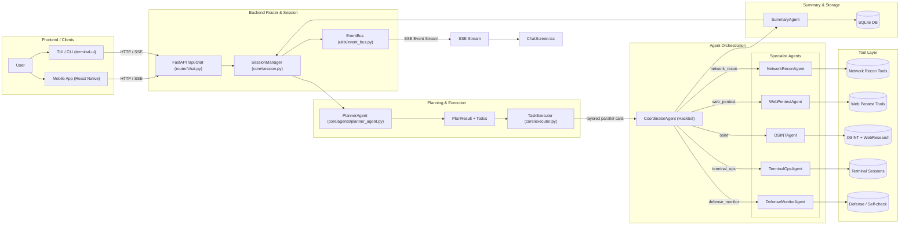

<div align="center">

# Secbot

**AI-Powered Automated Penetration Testing Agent**

[](https://www.python.org/downloads/)
[](pyproject.toml)
[](LICENSE)
[](https://github.com/iammm0/secbot/releases)
[](https://github.com/langchain-ai/langchain)

English | [中文](README.md)

</div>

---

> **⚠️ Security Warning**: This tool is **for authorized security testing only**. Unauthorized use for network attacks is illegal. See [Security Warning](docs/SECURITY_WARNING.md).

---

## 📋 Table of Contents

- [✨ Features](#features)
- [🏗️ Architecture](#architecture)
- [📦 Requirements](#requirements)
- [⚙️ Installation](#installation)
- [🚀 Quick Start](#quick-start)
- [🔧 Development](#development)
- [📚 Documentation](#documentation)
- [🤝 Contributing](#contributing)
- [📄 License](#license)
- [👤 Author](#author)
- [🙏 Acknowledgments](#acknowledgments)
- [⚖️ Disclaimer](#disclaimer)

---

## ✨ Features

### Core Capabilities

- **Multiple Agent Patterns**: ReAct, Plan-Execute, Multi-Agent, Tool-Using, Memory-Augmented
- **AI Web Research Agent**: Independent `WebResearchAgent` with ReAct loop for smart search, page extraction, multi-page crawling, and API interaction
- **CLI Interface**: Simple, intuitive command-line tools for local control and configuration
- **Persistent Terminal Session**: Agent-controlled dedicated shell for multi-step command execution and system inspection
- **AI Web Crawler**: Real-time web information capture and monitoring
- **OS Control**: File operations, process management, system information

### Penetration Testing

- **Reconnaissance**: Automated information gathering (hostname, IP, ports, service fingerprinting)
- **Vulnerability Scanning**: Port scanning, service detection, vulnerability identification
- **Exploit Engine**: Automated exploitation of SQL injection, XSS, command injection, file upload, path traversal, SSRF
- **Automated Attack Chain**: Full pentest workflow — Recon → Scan → Exploit → Post-Exploitation
- **Payload Generator**: On-demand generation of various attack payloads
- **Post-Exploitation**: Privilege escalation, persistence, lateral movement, data exfiltration
- **Network Attacks**: Brute force, DoS testing (authorized testing only)

### Security & Defense

- **Active Defense**: Information collection, vulnerability scanning, network analysis, intrusion detection
- **Security Reports**: Automated structured security analysis reports
- **Network Discovery**: Automatic host discovery across the network
- **Authorization Management**: Manage legal authorization for target hosts
- **Remote Control**: Remote command execution and file transfer on authorized hosts

### Web Research (Internet Capabilities)

- **Smart Search**: DuckDuckGo search → fetch result pages → LLM summarization
- **Page Extract**: Plain text, structured (tables/lists), or custom AI Schema extraction modes
- **Deep Crawl**: BFS multi-page crawl with depth/URL filtering and optional AI extraction
- **API Client**: Generic REST client with presets for weather, IP info, GitHub, exchange rates, DNS, etc.
- **Web Research Tool**: Delegate to `WebResearchAgent` for autonomous research or call tools directly

### Additional Features

- **Prompt Chain Management**: Flexible agent prompt configuration
- **SQLite Persistence**: Store conversation history, prompt chains, and configuration
- **Task Scheduling**: Support for scheduled penetration testing tasks
- **Colorized Structured Output**: Enhanced terminal output for readability and debugging

---

## 🏗️ Architecture


### Architecture Layers



### Layer Responsibilities

| Layer | Module | Responsibility |
|-------|--------|----------------|
| **Session Orchestration** | `core/session.py` | Route decisions, invoke PlannerAgent, drive TaskExecutor |
| **Structured Planning** | `core/agents/planner_agent.py` | Decompose requests into TodoItem DAG (dependencies, resources, risk levels) |
| **Layered Execution** | `core/executor.py` | Topological sort + intra-layer concurrency, strict inter-layer ordering |
| **Multi-Agent Coordination** | `core/agents/coordinator_agent.py` | Route by `agent_hint` to specialist agents |
| **Specialist Agents** | `core/agents/specialist_agents.py` | ReAct reasoning for recon/web-pentest/OSINT/terminal/defense |
| **Summary Reports** | `core/agents/summary_agent.py` | Aggregate multi-agent results into structured security report |
| **Event Stream** | `utils/event_bus.py` + `router/chat.py` | Agent-tagged SSE event stream for frontend differentiation |

> Full architecture details: [docs/UI-DESIGN-AND-INTERACTION.md](docs/UI-DESIGN-AND-INTERACTION.md)

---

## 📦 Requirements

- **Python** 3.10+
- **[uv](https://github.com/astral-sh/uv)** — Fast Python package manager (recommended)
- **Ollama** — Local LLM inference (optional; defaults to DeepSeek cloud API)
- **Node.js** 18+ — Required only for the TUI frontend

---

## ⚙️ Installation

### Option A: Download Pre-built Binary (no Python required)

Download the archive for your platform from [Releases](https://github.com/iammm0/secbot/releases), extract, and run:

```bash
# Windows
secbot.exe

# Linux / macOS
./secbot
```

Set up your API key before launching — create a `.env` file:

```bash
DEEPSEEK_API_KEY=sk-your-api-key-here
```

See [Release Guide](docs/RELEASE.md) for details.

---

### Option B: Build from Source

#### 1. Clone the repository

```bash
git clone https://github.com/iammm0/secbot.git
cd secbot
```

#### 2. Install uv and sync dependencies

```bash
# Install uv (if not already installed)
curl -LsSf https://astral.sh/uv/install.sh | sh   # Linux/macOS
# Windows PowerShell:
powershell -c "irm https://astral.sh/uv/install.ps1 | iex"

# Sync all dependencies
uv sync
```

#### 3. Configure environment variables

```bash
cp .env.example .env
```

Edit `.env` with your configuration:

| Variable | Description | Default |
|----------|-------------|---------|
| `DEEPSEEK_API_KEY` | DeepSeek API Key (recommended) | — |
| `OLLAMA_MODEL` | Local inference model | `gemma3:1b` |
| `OLLAMA_EMBEDDING_MODEL` | Embedding model | `nomic-embed-text` |

#### 4. (Optional) Set up local Ollama models

```bash
# After installing Ollama from https://ollama.ai
ollama pull gemma3:3b
ollama pull nomic-embed-text
```

#### 5. (Optional) Build installable package

```bash
uv run python -m build
uv pip install dist/secbot-*.whl
```

---

## 🚀 Quick Start

### Launch Interactive Mode

```bash
# Any of the following
python main.py
uv run secbot
secbot          # after package installation
hackbot         # legacy entry point
```

### Launch TUI Frontend (Recommended)

```bash
# Terminal 1: Start backend API
uv run hackbot-server
# or
python -m router.main

# Terminal 2: Start TUI
cd terminal-ui
npm install && npm run tui
```

One-click launch scripts:

```bash
# Windows
.\scripts\start-ts-tui.ps1

# Linux / macOS
./scripts/start-ts-tui.sh
```

### Common Slash Commands

Type `/` and press Enter in interactive mode to see all commands:

| Command | Description |
|---------|-------------|
| `/list-targets` | List all test targets |
| `/list-authorizations` | List authorized targets |
| `/defense-scan` | Start defense scan |
| `/system-info` | View system information |
| `/db-stats` | View database statistics |
| `/prompt-list` | List prompt chains |

### Penetration Testing Examples

```
# Scan target ports (authorization required first)
Scan open ports and services on 192.168.1.1

# Switch to SuperHackbot mode (high-risk actions require confirmation)
/mode superhackbot
Run a full pentest on 192.168.1.7 including port scan, vulnerability scan, and web vulnerability detection
```

---

## 🔧 Development

### Run Tests

```bash
pytest tests/
# Or a specific test file
pytest tests/test_agents.py -v
```

### Code Quality

```bash
# Format
uv run black .

# Type checking
uv run mypy .

# Lint
uv run flake8 .
```

### Build

```bash
# Using uv (recommended)
uv run python -m build

# Using scripts
./build.sh           # Linux/macOS
.\build.bat          # Windows
```

### Project Structure

```
secbot/
├── core/                   # Core agent framework
│   ├── agents/             # All agent implementations
│   ├── attack_chain/       # LangGraph attack chain graph
│   ├── memory/             # Memory management
│   └── patterns/           # ReAct reasoning patterns
├── tools/                  # Tool collections
│   ├── offense/            # Offensive tools (exploits, payloads)
│   ├── defense/            # Defensive tools
│   ├── web/                # Web penetration tools
│   ├── osint/              # Intelligence gathering tools
│   ├── pentest/            # Penetration testing tools
│   └── web_research/       # Internet research tools
├── scanner/                # Scanning engine
├── router/                 # FastAPI routing layer
├── terminal-ui/            # TypeScript TUI frontend
├── app/                    # React Native mobile app
├── docs/                   # Project documentation
├── scripts/                # Launch and build scripts
└── tests/                  # Test suite
```

---

## 📚 Documentation

| Document | Description |
|----------|-------------|
| [Quick Start](docs/QUICKSTART.md) | Detailed installation and getting started guide |
| [API Reference](docs/API.md) | REST API endpoint documentation |
| [UI Design & Interaction](docs/UI-DESIGN-AND-INTERACTION.md) | TUI architecture and components |
| [Prompt Guide](docs/PROMPT_GUIDE.md) | Prompt chain configuration and best practices |
| [Skills & Memory](docs/SKILLS_AND_MEMORY.md) | Skill injection and memory management |
| [Tool Extension](docs/TOOL_EXTENSION.md) | How to develop and register custom tools |
| [Database Guide](docs/DATABASE_GUIDE.md) | SQLite database structure and operations |
| [Deployment Guide](docs/DEPLOYMENT.md) | Production deployment options |
| [Docker Setup](docs/DOCKER_SETUP.md) | Containerized deployment |
| [Ollama Setup](docs/OLLAMA_SETUP.md) | Local model configuration |
| [Speech Guide](docs/SPEECH_GUIDE.md) | Voice interaction setup |
| [Virtual Test Environment](docs/VIRTUAL_TEST_ENVIRONMENT.md) | VMware + Ubuntu test environment setup |
| [Release Guide](docs/RELEASE.md) | Pre-built binary usage |
| [Security Warning](docs/SECURITY_WARNING.md) | Legal use declaration |
| [Changelog](docs/CHANGELOG.md) | Version history |

---

## 🤝 Contributing

Contributions are welcome! Please feel free to submit Issues and Pull Requests.

1. Fork the repository
2. Create a feature branch: `git checkout -b feature/amazing-feature`
3. Commit your changes: `git commit -m 'feat: add amazing feature'`
4. Push to the branch: `git push origin feature/amazing-feature`
5. Open a Pull Request

Please follow [Conventional Commits](https://www.conventionalcommits.org/) for commit messages:
- `feat:` New feature
- `fix:` Bug fix
- `docs:` Documentation update
- `refactor:` Code refactoring
- `test:` Test-related changes

---

## 📄 License

This project is licensed under a custom open-source license. See the [LICENSE](LICENSE) file for details.

- **Permitted**: Personal learning, academic research, and non-commercial sharing (with copyright notice retained)
- **Commercial use**: Requires prior written authorization from the copyright holder

Commercial licensing: [wisewater5419@gmail.com](mailto:wisewater5419@gmail.com)

---

## 👤 Author

**Zhao Mingjun (赵明俊)**

- GitHub: [@iammm0](https://github.com/iammm0)
- Email: [wisewater5419@gmail.com](mailto:wisewater5419@gmail.com)

---

## 🙏 Acknowledgments

This project is built upon many excellent open-source projects (in no particular order):

| Category | Projects |
|----------|----------|
| **AI / LLM** | LangChain, LangGraph, DeepSeek, Ollama, OpenAI |
| **Backend** | FastAPI, Starlette, sse-starlette, uvicorn |
| **Frontend** | React, React Native, Expo, Ink, React Navigation |
| **Database** | SQLite, SQLAlchemy |
| **Network / Security** | httpx, requests, nmap, scapy, paramiko |
| **Toolchain** | uv, pydantic, loguru, pytest |

If any open-source project used in this project is not listed above, it is an oversight, and we express our sincere gratitude here as well.

---

## ⚖️ Disclaimer

This tool is intended solely for educational purposes and authorized security testing. The authors and contributors are not responsible for any misuse or damage caused by this tool. **Ensure you have explicit authorization for all target systems before use.**

---

<div align="center">

If this project is useful to you, please give it a ⭐ Star!

</div>
