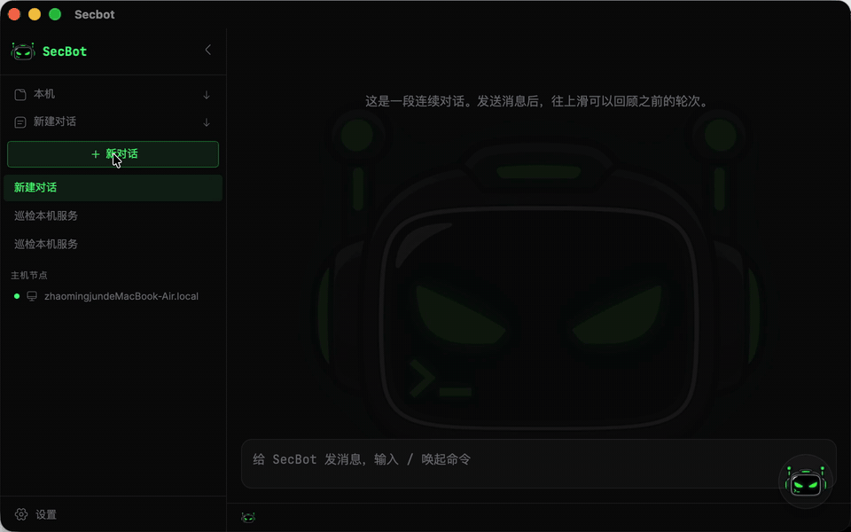
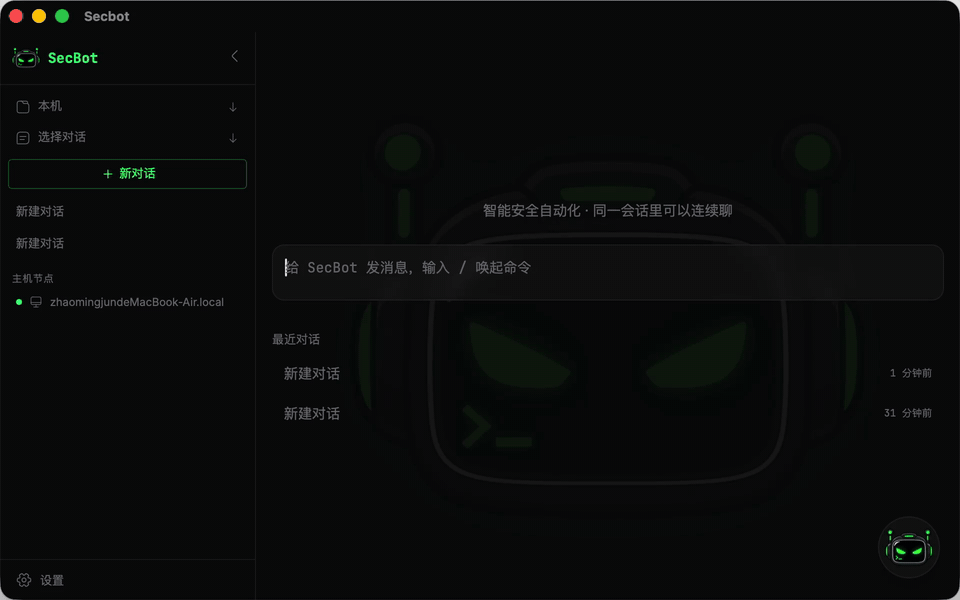
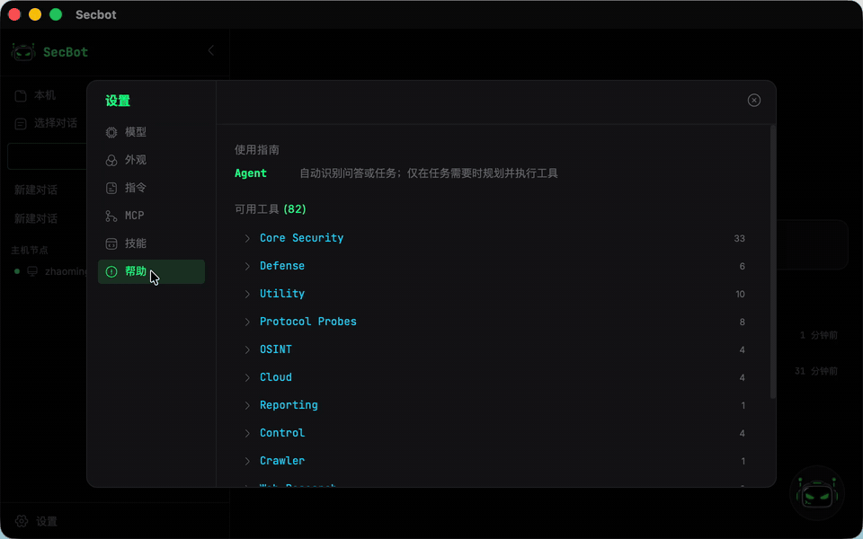
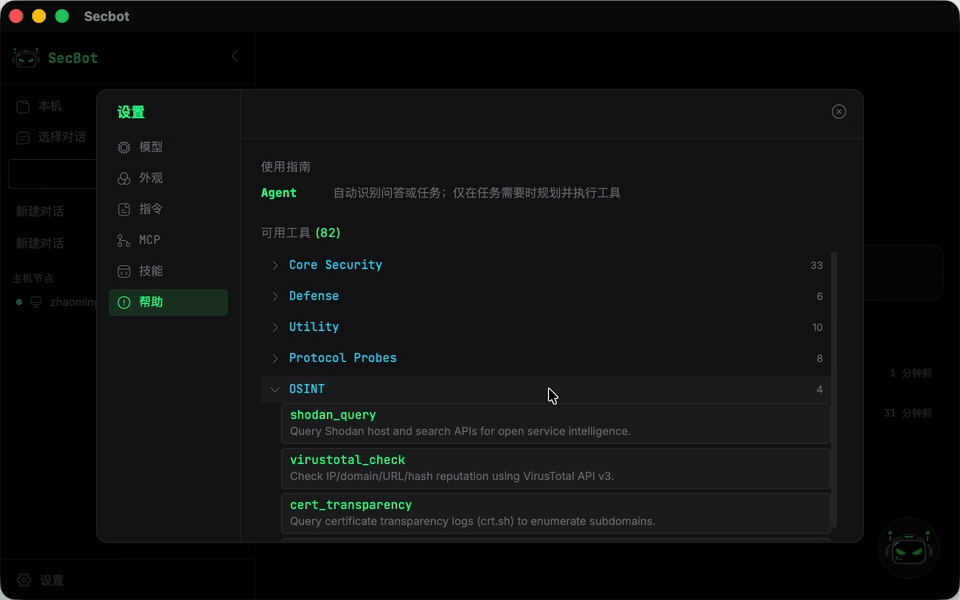
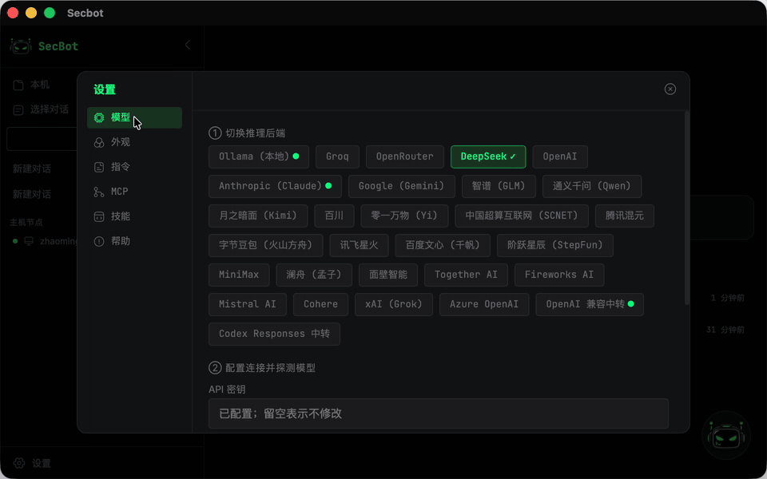
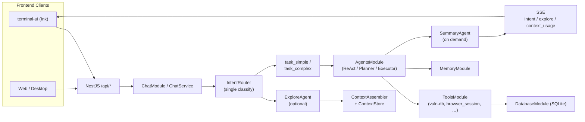

<div align="center">

# Secbot

**AI-Powered Automated Security Testing Platform**

[](https://nodejs.org/)
[](https://www.typescriptlang.org/)
[](package.json)
[](LICENSE)
[](https://github.com/iammm0/secbot/releases)
[](https://nestjs.com/)

English | [中文](README_CN.md)

</div>

---

> **Security Warning**: This tool is **for authorized security testing only**. Unauthorized use for network attacks is illegal. See [Security Warning](SECURITY_WARNING.md).

## Product demos

Two user-facing clients share the same NestJS backend and SSE API:

| Client | Paths | Notes |
| --- | --- | --- |
| **Desktop** | `desktop/` + `web/` | Tauri shell; UI is `web/` (served as `web/dist` by the backend) |
| **TUI** | `terminal-ui/` | Ink terminal UI; default entry via `secbot` / `npm run start:stack` |

Keep product capabilities and chat UX aligned: when you change SSE events, conversation blocks, model/settings, HITL, etc., **update Desktop (`web/`) and TUI (`terminal-ui/`) together** (or explicitly scope the change to one client and document that).

Desktop demos on the maintained `release` branch (Chinese UI):



| Home | Tools |
| --- | --- |
|  |  |
| Settings | Model & theme |
|  |  |

## Branch policy

**Only [`release`](https://github.com/iammm0/secbot/tree/release) is maintained.** Features, docs, CI, and GitHub Releases all land on this branch (NestJS + Ink TUI + Web / Desktop). Python (`pypi-release`) and Go (`pure-go`) are **frozen** read-only archives.

---

## Features

### Core Capabilities

- **Desktop (Tauri)**: Versioned installers (`desktop-app-v*`); Settings → About shows version and checks for updates; UI source is `web/`
- **Terminal TUI**: Self-contained archives (`secbot-tui-*`) on the same GitHub Release as Desktop
- **Release platforms**: macOS Apple Silicon, Windows x64, Ubuntu x64 (macOS Intel is not supported)
- **Terminal TUI (Ink)**: `secbot` / `npm run start:stack`; shares backend + SSE with Desktop — keep capabilities aligned
- **Multiple Agent Patterns**: ReAct, Plan-Execute, Multi-Agent Coordination, Tool-Using, Memory-Augmented
- **ExecGo runtime**: Optional default execution backend; Settings enable/disable starts/stops local `execgo` / `execgo-runtime` processes
- **Action audit trail**: Stage / LLM / tool calls persisted per conversation; Settings → Audit for traceability
- **Host probe + attack-chain preview**: Workspace nodes show IP, username, open ports, and a simulated entry-surface path (preview only)
- **HITL**: Hackbot requires approval for sensitive tools; mid-task `ask_user` pauses over SSE
- **AI Web Research Agent**: Independent WebResearchAgent with ReAct loop for smart search, page extraction, multi-page crawling, and API interaction
- **Persistent Terminal Sessions**: Agent-controlled dedicated shell for multi-step command execution
- **Memory Subsystem**: Short-term / episodic / long-term memory with vector storage and semantic retrieval
- **Vulnerability Database**: Unified vulnerability schema with CVE / NVD / Exploit-DB / MITRE ATT&CK adapters
- **Intent routing & explore**: One-shot **`IntentRouter`** classifies each turn; optional **`ExploreAgent`** enriches context via **`vuln_db_query`** and **`browser_session`** (robots-aware browsing + readability) before planning or single-agent ReAct.
- **Context budget & UI telemetry**: **`ContextAssemblerService`** packs history, memory, and pinned facts under a model-specific window; SSE **`context_usage`** drives the bottom status-bar usage widget.

### Penetration Testing

- **Reconnaissance**: Automated information gathering (hostname, IP, ports, service fingerprinting)
- **Vulnerability Scanning**: Port scanning, service detection, vulnerability identification
- **Exploit Engine**: Automated exploitation of SQL injection, XSS, command injection, file upload, path traversal, SSRF
- **Automated Attack Chain**: Full pentest workflow — Recon, Scan, Exploit, Post-Exploitation
- **Payload Generator**: On-demand generation of various attack payloads

### Security & Defense

- **Active Defense**: Vulnerability scanning, network analysis, intrusion detection
- **Security Reports**: Automated structured security analysis reports
- **Network Discovery**: Automatic host discovery across the network
- **Authorization Management**: Manage legal authorization for target hosts
- **Remote Control**: Remote command execution and file transfer on authorized hosts

### Web Research

- **Smart Search**: DuckDuckGo search + LLM summarization
- **Page Extract**: Plain text, structured, or custom AI Schema extraction modes
- **Deep Crawl**: BFS multi-page crawl with depth/URL filtering
- **API Client**: Generic REST client with presets for weather, IP info, GitHub, DNS, etc.

---

## Architecture


```mermaid
flowchart LR
  subgraph Clients["Frontend Clients"]
    tui["terminal-ui (Ink)"]
    web["Web / Desktop"]
  end

  tui --> api["NestJS /api/*"]
  web --> api

  api --> chat["ChatModule / ChatService"]
  chat --> intent["IntentRouter\n(single classify)"]
  intent --> explore["ExploreAgent\n(optional)"]
  explore --> ctx["ContextAssembler\n+ ContextStore"]
  intent --> task["task_simple /\ntask_complex"]
  task --> agents["AgentsModule\n(ReAct / Planner / Executor)"]
  agents --> tools["ToolsModule\n(vuln-db, browser_session, …)"]
  tools --> db["DatabaseModule (SQLite)"]
  agents --> memory["MemoryModule"]
  agents --> summary["SummaryAgent\n(on demand)"]
  summary --> sse["SSE\nintent / explore / context_usage"]
  sse --> tui
```

### Backend Modules

| NestJS Module | Responsibility |
|---------------|----------------|
| `ChatModule` | SSE chat; `ChatService` orchestrates IntentRouter → optional Explore → context assembly → simple/complex task paths and on-demand summary |
| `AgentsModule` | Multi-agent framework (IntentRouter, ExploreAgent, Planner, Coordinator, Summary, QA, ReAct) |
| `ToolsModule` | Built-in security tools including **vuln-db** queries and **browser_session** human-like browsing, plus web-research, scanners, etc. |
| `DatabaseModule` | SQLite persistence (conversations, config, prompt chains) |
| `MemoryModule` | Short-term / episodic / long-term memory with vector storage |
| `VulnDbModule` | Vulnerability database with CVE / NVD / Exploit-DB / MITRE adapters |
| `NetworkModule` | Network discovery, authorization, remote control |
| `DefenseModule` | Defense scanning and security status |
| `SessionsModule` | Terminal session management |
| `SystemModule` | System info and LLM configuration |
| `CrawlerModule` | Web crawler task queue and scheduling |
| `HealthModule` | Health check endpoint |

---

## Requirements

- **Node.js** 24+
- **npm** (bundled with Node.js)
- **Ollama** (optional, for local model inference)

---

## Installation

### Option A: Install from GitHub Releases

Prefer the **Desktop installer** or **self-contained TUI archive** on tags like `desktop-app-v*` (macOS Apple Silicon, Windows x64, Ubuntu x64).

Alternatively, download the latest npm `.tgz` from [Releases](https://github.com/iammm0/secbot/releases) (currently **v2.0.0-b2**), then:

```bash
npm install -g ./opensec-secbot-2.0.0-b2.tgz
secbot
```

One-off run:

```bash
npx ./opensec-secbot-2.0.0-b2.tgz
```

> **Note:** This project is **not published to npmjs**. The tarball uses `@opensec/secbot` as internal package metadata only.

### Option B: Build from Source

```bash
git clone https://github.com/iammm0/secbot.git
# default branch is `release` — the only maintained line
cd secbot
npm install
```

Configure environment variables — create a `.env` file:

```env
LLM_PROVIDER=deepseek
DEEPSEEK_API_KEY=sk-your-api-key
DEEPSEEK_MODEL=deepseek-chat

# Or use local Ollama
# LLM_PROVIDER=ollama
# OLLAMA_BASE_URL=http://localhost:11434
# OLLAMA_MODEL=llama3.2

# Optional: ReAct/explore caps, context debug SSE, adaptive replan, NVD rate limits
# SECBOT_REACT_MAX_ITERS=20
# SECBOT_EXPLORE_MAX_ITERS=6
# SECBOT_CONTEXT_DEBUG=1
# SECBOT_ADAPTIVE_REPLAN=1
# NVD_API_KEY=your-nvd-key

# Optional: Jev System One gates (all off by default; high-confidence accept, fail-open)
# SECBOT_JEV_ENABLED=1
# SECBOT_JEV_INTENT=1
# SECBOT_JEV_QA_LIVE=1
# SECBOT_JEV_ADAPTIVE=1
# SECBOT_JEV_REACT_STOP=1
# SECBOT_JEV_CONTEXT=1
# TYPESAFE_API_KEY=your-typesafe-key
# TYPESAFE_BASE_URL=https://api.typesafe.ai
# SECBOT_JEV_MODEL=jev-latest
# SECBOT_JEV_CONFIDENCE_MIN=0.85
# SECBOT_JEV_REACT_STOP_MIN=0.92
```

---

## Quick Start

### Launch

```bash
# One-click: start TUI (default: spawn local backend child process)
npm run start:stack

# Or step by step
npm run dev           # Start backend (dev mode with hot-reload)
npm run start:tui     # Start TUI in another terminal (default: spawn local backend)
cd desktop && npm run dev   # Desktop hot-dev (Vite + Nest + Tauri)

# Optional service mode: connect existing backend only
SECBOT_TUI_BACKEND=service SECBOT_API_URL=http://127.0.0.1:8000 npm run start:tui

# Backward-compatible alias (same as service)
SECBOT_TUI_BACKEND=remote SECBOT_API_URL=http://127.0.0.1:8000 npm run start:tui
```

Desktop installers and self-contained TUI archives are published on the same [GitHub Releases](https://github.com/iammm0/secbot/releases) (tags like `desktop-app-v0.0.4-beta`). Platforms: **macOS Apple Silicon / Windows x64 / Ubuntu x64** (no macOS Intel). Extract the TUI archive and run `./secbot` or `secbot.cmd`. See [`desktop/README.md`](desktop/README.md) and [`terminal-ui/README.md`](terminal-ui/README.md).

### Common Development Commands

```bash
npm run dev           # Backend dev mode
npm run build         # Production build
npm start             # Start production server
npm run start:tui     # Terminal TUI (default: spawn local backend)
cd desktop && npm run dev   # Desktop hot-dev
```

### Environment Variables

| Variable | Description | Default |
|----------|-------------|---------|
| `LLM_PROVIDER` | Inference backend | `deepseek` |
| `DEEPSEEK_API_KEY` | DeepSeek API Key | — |
| `DEEPSEEK_MODEL` | DeepSeek model | `deepseek-chat` |
| `OLLAMA_BASE_URL` | Ollama service URL | `http://localhost:11434` |
| `OLLAMA_MODEL` | Ollama model | `llama3.2` |
| `PORT` | Backend listen port | `8000` |
| `SECBOT_TUI_BACKEND` | TUI backend mode: `spawn` / `service` / `remote` / `auto` | prefer `spawn`; use `service`/`remote` explicitly for existing backends |
| `SECBOT_JEV_ENABLED` | Jev decision-layer master switch (off by default) | off |
| `TYPESAFE_API_KEY` | TypeSafe Jev API key | none |

### Slash Commands (inside TUI)

| Command | Description |
|---------|-------------|
| `/model` | Select inference backend, model, API key |
| `/jev` | Configure the optional Jev decision layer |
| `/agent` | Switch between `secbot-cli` / `superhackbot` |
| `/list-agents` | List available agents |
| `/system-info` | View system information |
| `/db-stats` | View database statistics |

---

## Project Structure

```
secbot/
├── server/                 # NestJS backend (TypeScript)
│   ├── skills/             # Agent skill definitions (base/ + custom/)
│   └── src/
│       ├── main.ts         # Application entry point
│       ├── app.module.ts   # Root module (imports 12 business modules)
│       ├── common/         # Shared infrastructure (LLM abstraction, filters)
│       └── modules/        # Business modules
│           ├── agents/     # Multi-agent framework
│           ├── chat/       # SSE chat endpoint
│           ├── tools/      # 54 security tools (10 categories)
│           ├── database/   # SQLite persistence
│           ├── memory/     # Memory subsystem
│           ├── vuln-db/    # Vulnerability database
│           ├── network/    # Network discovery & remote control
│           ├── defense/    # Defense scanning
│           ├── sessions/   # Session management
│           ├── system/     # System info & config
│           ├── crawler/    # Crawler scheduling
│           └── health/     # Health checks
├── bin/                    # npm CLI entry wrappers
├── terminal-ui/            # Ink terminal frontend (TUI)
├── web/                    # Web UI (desktop app’s real UI)
├── desktop/                # Tauri desktop shell (spawns backend, loads web)
├── scripts/                # Launch and build scripts
├── CLAUDE.md / AGENTS.md   # Contributor / AI agent conventions
└── SECURITY_WARNING.md     # Legal notice (shipped with the package)
```

---

## Development

```bash
# Type checking
npm run typecheck

# Linting
npm run lint
npm run lint:fix

# Formatting
npm run format

# Testing
npm test

# Build
npm run build

# Release packaging
npm run release:pack
```

---

## Documentation

| Document | Description |
|----------|-------------|
| [https://secbot.site](https://secbot.site) | **User documentation site** (install, API, LLM setup, …) |
| [CLAUDE.md](CLAUDE.md) / [AGENTS.md](AGENTS.md) | Contributor / AI agent guide (orchestration, SSE, env vars) |
| [SECURITY_WARNING.md](SECURITY_WARNING.md) | Legal use declaration (shipped with the npm package) |
| [desktop/README.md](desktop/README.md) | Desktop develop / package (keep TUI ↔ Desktop/Web aligned) |

Long-form user manuals are not kept in this repository; the website is the source of truth.

---

## Contributing

Contributions are welcome! Please feel free to submit Issues and Pull Requests.

1. Fork the repository
2. Create a feature branch: `git checkout -b feat/amazing-feature`
3. Commit your changes: `git commit -m 'feat: add amazing feature'`
4. Push to the branch: `git push origin feat/amazing-feature`
5. Open a Pull Request

Please follow [Conventional Commits](https://www.conventionalcommits.org/) for commit messages.

---

## License

This project is licensed under a custom open-source license. See the [LICENSE](LICENSE) file for details.

- **Permitted**: Personal learning, academic research, and non-commercial sharing (with copyright notice retained)
- **Commercial use**: Requires prior written authorization from the copyright holder

Commercial licensing: [wisewater5419@gmail.com](mailto:wisewater5419@gmail.com)

---

## Author

**Zhao Mingjun (赵明俊)**

- GitHub: [@iammm0](https://github.com/iammm0)
- Email: [wisewater5419@gmail.com](mailto:wisewater5419@gmail.com)

---

## Acknowledgments

This project is built upon many excellent open-source projects (in no particular order):

| Category | Projects |
|----------|----------|
| **Runtime & Language** | Node.js, TypeScript |
| **Backend** | NestJS, Express |
| **Database** | SQLite, better-sqlite3 |
| **Frontend** | React, Ink |
| **AI / LLM** | DeepSeek, Ollama, OpenAI |
| **Security Tools** | nmap, sqlmap, Nuclei, and other external tools |

---

## Disclaimer

This tool is intended solely for educational purposes and authorized security testing. The authors and contributors are not responsible for any misuse or damage caused by this tool. **Ensure you have explicit authorization for all target systems before use.**

---

<div align="center">

If this project is useful to you, please give it a Star!

</div>
