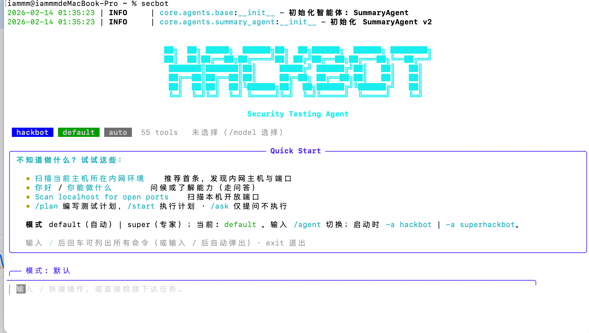

# 快速启动指南

## 1. 安装依赖

### 使用 uv (推荐)

```bash
# 安装uv（如果尚未安装）
curl -LsSf https://astral.sh/uv/install.sh | sh

# 使用uv安装依赖
uv sync
```

### 使用 pip (备选方案)

```bash
pip install -r requirements.txt
```

## 2. 安装并启动Ollama

确保已安装Ollama并下载了所需模型：

```bash
# 安装Ollama（如果未安装）
# 访问 https://ollama.ai 下载安装

# 下载推理模型（默认 gemma3:1b，若本地没有会在打开模型列表时自动拉取）
ollama pull gemma3:1b

# 下载向量嵌入模型（用于文本向量化）
ollama pull nomic-embed-text

# 启动Ollama服务（默认运行在 http://localhost:11434）
# Ollama通常会自动启动，如果没有，运行：
ollama serve
```

## 3. 配置环境变量

复制 `env.example` 为 `.env`：

```bash
# Windows
copy env.example .env

# Linux/Mac
cp env.example .env
```

编辑 `.env` 文件，根据需要调整Ollama配置：
- `OLLAMA_BASE_URL`: Ollama服务地址（默认: http://localhost:11434）
- `OLLAMA_MODEL`: 使用的模型名称（默认: gemma3:1b，本地没有时会自动拉取）

### 可选：使用免费云端 API（类似 OpenCode）

无需本地 Ollama 时，可使用免费/免费档云端推理：

| 厂商 | 说明 | 配置 |
|------|------|------|
| **Groq** | 极速推理，免费额度，Llama/Gemma 等 | 在 [Groq Console](https://console.groq.com/keys) 申请 Key，`.env` 中设置 `LLM_PROVIDER=groq`、`GROQ_API_KEY=你的Key` |
| **OpenRouter** | 一站式多模型，部分模型带 `:free` 免费使用 | 在 [OpenRouter](https://openrouter.ai/keys) 申请 Key，`.env` 中设置 `LLM_PROVIDER=openrouter`、`OPENROUTER_API_KEY=你的Key` |

也可在 TUI 中通过 `/model` →「配置 API Key」为 Groq / OpenRouter 配置 Key，再在 `.env` 中设置 `LLM_PROVIDER=groq` 或 `LLM_PROVIDER=openrouter`。
- `OLLAMA_EMBEDDING_MODEL`: 向量嵌入模型（默认: nomic-embed-text）

## 4. 使用 CLI 应用（无参数即交互模式）

本程序**无子命令**：直接运行即进入交互模式，并**占据整个终端**（使用 alternate screen）；退出后自动恢复终端原内容。

### 启动交互模式

```bash
# 方式一：从项目根目录运行
python main.py

# 方式二：使用 secbot / hackbot 命令（需先 uv sync 或安装包）
uv run secbot
# 或
uv run hackbot
```

启动后界面示意：



- 交互模式会占用整屏终端，输入 `exit` 或 `quit` 退出后，终端恢复为进入前的状态。
- 在交互界面内可使用斜杠命令（如 `/help`、`/list-agents`、`/model`、`/agent` 等），输入 `/` 后回车可查看全部命令。
- 语音等能力在交互模式内通过对应命令或对话使用；详见项目内文档。

## 5. 项目结构说明

```
m-bot/
├── main.py              # CLI应用入口
├── config.py            # 配置管理
├── agents/              # 智能体实现
│   ├── base.py          # 基础智能体类
│   └── simple.py        # 简单智能体
├── patterns/            # 设计模式
│   └── react.py         # ReAct模式
├── tools/               # 工具和插件
│   ├── base.py          # 基础工具类
│   └── web_search.py    # 网络搜索工具
├── memory/              # 记忆管理
├── utils/               # 工具函数
│   ├── logger.py        # 日志配置
│   ├── embeddings.py    # 向量嵌入
│   └── speech.py        # 语音处理
├── tests/               # 测试文件
├── requirements.txt     # 依赖项
├── env.example          # 环境变量示例
└── README.md           # 项目说明
```

## 6. 开发新智能体

1. 继承 `BaseAgent` 类
2. 实现 `process` 方法
3. 在 `main.py` 中注册新智能体

示例：

```python
from agents.base import BaseAgent

class MyAgent(BaseAgent):
    async def process(self, user_input: str, **kwargs) -> str:
        # 你的处理逻辑
        return "响应"
```

然后在 `main.py` 的 `agents` 字典中添加：
```python
agents["myagent"] = MyAgent(name="MyAgent")
```

## 7. 添加新工具

1. 继承 `BaseTool` 类
2. 实现 `execute` 方法
3. 在智能体中使用工具

## 注意事项

- 确保已配置Ollama并下载了所需模型
- 首次使用Whisper会自动下载模型（约500MB-3GB）
- 建议使用虚拟环境：`python -m venv venv`
- 语音功能需要安装额外的依赖（见SPEECH_GUIDE.md）

## 虚拟环境测试

在 VMware 中使用 Ubuntu 作为目标机进行功能测试时，可参考 [虚拟测试环境使用指南](VIRTUAL_TEST_ENVIRONMENT.md)，其中包含环境搭建步骤及各功能对应的 prompt 示例。
